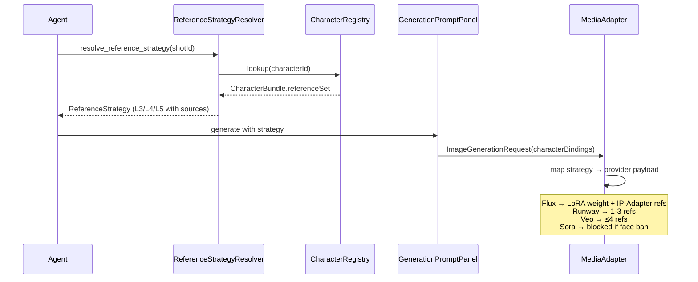

# AI Video Reference System

> **Lang:** English | [中文](./ai-video-reference-system_CN.md)
>
> **Status:** Proposed (2026-04-17)
> **Phase:** 2/3 (P2 priority)
> **Scope:** Cross-extension (neko-agent / neko-canvas / neko-model / neko-types)
> **Related ADRs:** [controlnet-pipeline.md](./controlnet-pipeline.md) · [ai-technology-landscape.md](./ai-technology-landscape.md) · [canvas-agent-integration.md](./canvas-agent-integration.md) · [adr-character-unified-index.md](./adr-character-unified-index.md) · [media-quality-assessment.md](./media-quality-assessment.md)

---

## 1. Problem Statement

AI video generation requires **reference material at multiple levels of fidelity** to control three concerns that pure text prompts cannot reliably achieve:

1. **Camera / shot / angle** — which composition, lens, and movement the model should produce
2. **2D / 3D visual reference** — style, lighting, composition anchoring
3. **Character consistency** — identity preservation across shots, scenes, and episodes

Today neko-suite has fragmented reference handling distributed across three existing ADRs:

| Concern | Current location | Gap |
|---------|------------------|-----|
| Camera metadata on shots | `ShotCanvasNode.cameraMovement/cameraAngle` ([canvas.ts:233-240](../../packages/neko-types/src/types/canvas.ts#L233-L240)) | Vocabulary not unified across providers; no camera-preset library |
| IP-Adapter reference injection | `IPAdapterReference` ([types.ts:59-66](../../packages/neko-agent/packages/platform/src/media/types.ts#L59-L66)) | Per-shot only; no cross-shot / cross-scene binding |
| Multi-view reference sheets | `GalleryCanvasNode` presets: `character-3view` / `turnaround-8` ([canvas.ts:328-339](../../packages/neko-types/src/types/canvas.ts#L328-L339)) | Cells are generated on-demand; no 3D→2D automation |
| LoRA / checkpoint as assets | `ModelCanvasNode.modelType` + `AssetType: 'lora' \| 'embedding'` | No binding from character → LoRA |
| Character bundle (future) | `CharacterBundle` / `.nkchar` in roadmap | Not yet implemented; no `referenceSet` field |
| ControlNet preprocessing | [controlnet-pipeline.md](./controlnet-pipeline.md) | Depth / normal / pose extraction is P1; integration pending |

This ADR introduces a **unified Reference Strategy framework** that:
- Classifies references into 6 tiers (L0-L5) by fidelity and cost
- Maps tiers to provider capabilities (commercial closed-source vs open-source ecosystem)
- Automates 3D→2D turnaround generation (`turnaround-8` auto-fill)
- Binds character references at the `CharacterBundle` level so per-shot injection is automatic

## 2. Provider Capability Matrix (2026-04 snapshot)

Commercial video models as of 2026-04 already cover most L1-L2 reference scenarios natively. The design below is a **thin adaptation layer**, not a reimplementation.

| Model | Single ref | Multi-ref | Character consistency | Camera control | LoRA | Constraints |
|-------|:---------:|:---------:|:---------------------:|:--------------:|:----:|-------------|
| **Seedance 2.0 / 1.5 Pro** (ByteDance, 2026-04-09) | ✅ | ✅ | ✅✅ cross-shot | ✅ push/pull/pan/tilt/track/rotate + multi-axis | ❌ | Closed commercial |
| **Veo 3.1** (Google, 2026-01 update) | ✅ | ✅ up to 4 refs | ✅ face / object / style lock | ✅ zoom / pan / angle | ❌ | Closed commercial |
| **Sora 2** (OpenAI) | ⚠️ rejects uploaded human faces (2026-02+) | max 2 chars | ✅✅ 95%+ via Cameo recording | ⚠️ prompt-only | ❌ | **Third-party face upload blocked** — must record own Cameo |
| **Runway Gen-4** | ✅ | ✅ 1-3 refs | ✅✅ from single reference | ✅ spatial consistency | ❌ | 720×720 / 1280×720 max |
| **Kling 2.5 / O3** (Kuaishou) | ✅ | ✅ | ✅ 3-10s stable | ✅ Start & End Frame + camera moves | ❌ | O3 accepts reference video for motion transfer |
| **Hailuo 02 / 2.3** (MiniMax) | ✅ | ⚠️ | ⚠️ medium | ⚠️ | ❌ | Strong physics, no native audio |
| **Wan 2.7** (Alibaba, via DashScope) | ✅ | ⚠️ | ⚠️ | ✅ | ❌ | Cheapest per-second |
| **Flux + LoRA / HunyuanVideo** (OSS via fal.ai / ComfyUI) | ✅ | ✅ multi | ✅ LoRA-locked | ⚠️ | ✅✅ | **LoRA only in OSS path** |

### 2.1 Key implications for the design

1. **L3 (LoRA) only exists in the open-source ecosystem.** Commercial providers uniformly reject user LoRA. The resolver must route L3/L5 strategies to `fal-ai/flux` / ComfyUI-style providers.
2. **L4 (3D + render sequence) collapses to L2 at the provider.** No model has a native 3D input; our 3D→2D renderer produces PNG sequences that are fed into the provider's multi-image reference channel (Runway 1-3 / Veo 4 refs).
3. **Sora 2 face-upload ban** is a compliance red line — the Resolver must consult a provider-capability declaration and filter strategies that would be rejected.
4. **Camera control is already commoditized.** `VideoGenerationRequest.cameraMovement` already exists and is mapped in DashScope / Kling / OpenAICompat adapters. Seedance and Veo adapters are missing and must be added.

### 2.2 L0-L5 → Provider mapping

| Level | Seedance | Veo 3.1 | Sora 2 | Runway Gen-4 | Kling O3 | Flux+LoRA |
|-------|:--------:|:-------:|:------:|:------------:|:--------:|:---------:|
| **L0** text-only | ✅ | ✅ | ✅ | ✅ | ✅ | ✅ |
| **L1** single ref | ✅ | ✅ | ⚠️ face ban | ✅ | ✅ | ✅ |
| **L2** multi-view | ✅ | ✅ ≤4 | ⚠️ face ban | ✅ ≤3 | ✅ | ✅ |
| **L3** LoRA | ❌ | ❌ | ❌ | ❌ | ❌ | ✅ |
| **L4** 3D→2D render → L2 | ✅ (downgrades) | ✅ (downgrades) | ⚠️ | ✅ (downgrades) | ✅ (downgrades) | ✅ |
| **L5** L3+L4 combo | ❌ | ❌ | ❌ | ❌ | ❌ | ✅ |

### 2.3 Camera-specific capability matrix

Camera control has its own axis of provider differences. The resolver must track **four camera input channels** separately from reference tiers:

| Provider | Text prompt (§12 A) | Start+End frame (§12 B) | Video motion ref (§12 C) | Depth / pose control (§12 C+) |
|----------|:-------------------:|:-----------------------:|:------------------------:|:-----------------------------:|
| **Seedance 2.0** | ✅✅ multi-axis | ✅ | ❌ | ❌ |
| **Veo 3.1** | ✅✅ | ✅ (last-frame 2026-01) | ❌ | ❌ |
| **Sora 2** | ✅ prompt-only | ❌ | ❌ (Cameo ≠ motion-ref) | ❌ |
| **Runway Gen-4** | ✅ | ✅ | ❌ | ❌ |
| **Kling 2.5 / O3** | ✅ | ✅✅ (canonical) | ✅ O3 only | ❌ |
| **Hailuo 02 / 2.3** | ⚠️ | ⚠️ | ❌ | ❌ |
| **Wan 2.7** (DashScope) | ✅ | ❌ | ❌ | ❌ |
| **Flux + LoRA** (OSS) | ✅ | ❌ (image-only) | ❌ | ✅✅ ControlNet (depth/pose/canny) |

**Implication**: the camera translation pipeline (§12) emits three artifact types (prompt / keyframes / depth sequence), and the resolver picks the richest combination each provider accepts.

## 3. Reference Strategy Framework (L0-L5)

### 3.1 Tier definitions

| Level | Use case | Cost | Consistency | neko-suite capability |
|-------|---------|:----:|:-----------:|-----------------------|
| **L0** Text-only | Concept exploration, single concept shot | Low | ❌ drifts | `prompt` only |
| **L1** Single reference | Short shot, close-up | Low | ⚠️ same-angle OK | `IPAdapterReference` (single) |
| **L2** Multi-view reference | Dialogue, medium shot, turn-around | Medium | ✅ static-angle stable | `GalleryCanvasNode` with `character-3view` / `turnaround-8` preset |
| **L3** LoRA / Embedding | Main protagonist, series content | Medium-high | ✅✅ | Reference existing `AssetType: 'lora'` asset |
| **L4** 3D + rendered sequence | Long-form, complex camera moves | High | ✅✅✅ any angle / lighting | neko-model `render_views` → auto-populate Gallery |
| **L5** L3 + L4 combined | Industrial-grade production | High | 🔒 locked | `CharacterBundle` with both LoRA + turnaround |

### 3.2 Type definitions (`@neko/shared`)

```typescript
// packages/neko-types/src/types/reference-strategy.ts

export type ReferenceLevel = 'L0' | 'L1' | 'L2' | 'L3' | 'L4' | 'L5';

export interface ReferenceSource {
  type: 'text' | 'image' | 'gallery' | 'lora' | 'render3d';
  /** Asset registry ID (for gallery / lora / render3d) */
  assetId?: string;
  /** Inline base64 image (for single image refs) */
  imageBase64?: string;
  /** Gallery cell selector (e.g. 'front', '3/4-left') */
  cellId?: string;
  /** IP-Adapter style: style vs subject */
  mode?: 'style' | 'subject' | 'both';
  /** Influence weight 0.0-1.0 */
  weight?: number;
}

export interface ReferenceStrategy {
  level: ReferenceLevel;
  sources: ReferenceSource[];
  /** Provider preference (empty = any) */
  preferredProviders?: string[];
  /** Provider exclusions (compliance red lines, e.g. Sora 2 face ban) */
  excludedProviders?: string[];
  /** Rationale from resolver for UI display */
  rationale?: string;
}

export interface ProviderReferenceCapability {
  providerId: string;
  supportedLevels: ReferenceLevel[];
  /** Max multi-ref count (for L2) */
  maxReferences?: number;
  /** Compliance flags */
  blocksThirdPartyFaces?: boolean;
  /** LoRA support flag */
  supportsLora?: boolean;
}
```

### 3.3 `ReferenceStrategyResolver` service

Lives in `@neko/agent/platform`. Inputs:
- `ShotCanvasNode.data` (shot complexity, character list)
- Character registry (`.neko/characters.json` when Phase 3 lands; ephemeral lookup before then)
- Provider capability declarations
- Project-level default strategy

Decision rules (ordered):

1. If `ShotCharacter.characterId` resolves to a `CharacterBundle` with `referenceSet.lora` → minimum **L3**
2. If `cameraMovement ∈ { dolly, tracking, crane, handheld }` and `characterId` has 3D asset → prefer **L4**
3. If shot is static single character close-up and has a GalleryNode ref → **L1** is sufficient
4. If multiple characters with conflicting constraints (e.g. one needs LoRA, another has only gallery) → split per-character strategies in `sources[]`
5. Filter out providers that violate compliance (Sora 2 face-ban check)

Output: `ReferenceStrategy` with `rationale` explaining the choice.

### 3.4 Agent MCP tool

```typescript
// neko-agent tool definition
tool: 'resolve_reference_strategy'
args: { shotId: string; providerHint?: string }
returns: ReferenceStrategy
```

The tool lets the Agent planner query the resolver before emitting `canvas_generate_image` calls, so the strategy is transparent in the conversation history.

## 4. 3D → 2D Automatic Turnaround Rendering

### 4.1 Motivation

[`GalleryPreset.turnaround-8`](../../packages/neko-types/src/types/canvas.ts#L328-L339) already defines the data shape for 8-angle character sheets, but cells must be generated manually today. To unlock L4, we need a one-click pipeline from a 3D character asset (.glb / .vrm / .nkm) to 8 rendered views.

### 4.2 Engine-side API (runtime-scene)

New action in `host-api` controllers:

```rust
// packages/neko-engine/packages/host-api/src/controllers/scenes.rs
"scene:render_views" => {
    // params:
    //   modelPath: String (absolute or relative)
    //   angles: Vec<f32>       // degrees around Y axis [0, 45, 90, ...]
    //   resolution: [u32; 2]   // [1024, 1024]
    //   lighting: Option<LightingPreset>  // 3-point, studio, neutral
    //   background: Option<String>        // "transparent" | "#hex"
    // returns:
    //   views: Vec<{ angle: f32, pngBase64: String }>
}
```

Implementation reuses the existing wgpu pipeline in `engine-kernel` via an offscreen `RenderProfile::Preview` render target — no new renderer required. Writes to `.neko/.cache/turnarounds/<modelHash>/<angle>.png` and returns data URLs for webview consumption.

### 4.3 TypeScript integration

```typescript
// packages/neko-model/packages/extension/src/api.ts
interface NekoModelAPI {
  renderTurnaround(
    modelPath: string,
    preset: GalleryPreset
  ): Promise<{ cellId: string; image: string }[]>;
}
```

Canvas webview adds a right-click menu item on `GalleryCanvasNode`: **"Fill from 3D model…"** — opens a picker for `.glb` / `.vrm` / `.nkm`, calls `renderTurnaround`, populates `cells[]`.

### 4.4 Caching and invalidation

- Cache key: SHA-256 of model file + preset name + lighting preset
- Storage: `.neko/.cache/turnarounds/<hash>/` (falls into existing `L2 cache` layout per [local-storage-strategy.md](./local-storage-strategy.md))
- Invalidation: model file mtime change → cache entry dropped
- Size budget: ~1.5 MB per 8-angle turnaround at 1024² PNG

### 4.5 Downgrade to L2 at provider boundary

Commercial providers accept at most 1-4 reference images. The adapter layer takes the rendered sequence and selects the most-relevant subset:

```typescript
function downgradeL4toL2(
  strategy: ReferenceStrategy,
  provider: ProviderReferenceCapability
): ReferenceSource[] {
  const renderSource = strategy.sources.find(s => s.type === 'render3d');
  const maxRefs = provider.maxReferences ?? 3;
  // pick angles closest to shot's cameraAngle
  // then padded to maxRefs
}
```

## 5. Cross-Shot Character Consistency Binding

### 5.1 Current gap

[`ShotCharacter.referenceNodeId`](../../packages/neko-types/src/types/canvas.ts#L233-L240) points to a single `GalleryCanvasNode` at the shot level. A project with 50 shots of the same character duplicates that link 50 times and has no way to enforce "all shots of Alice use her LoRA + her turnaround sheet."

### 5.2 `CharacterBundle.referenceSet` extension

When `CharacterBundle` / `.nkchar` lands (per [ai-technology-landscape.md](./ai-technology-landscape.md) narrative AI section), extend its schema:

```typescript
interface CharacterBundle {
  // ... existing fields (model, motions, expressions, voice, agent)
  referenceSet?: {
    /** Gallery node containing turnaround / expression sheet */
    gallery?: { nodeId: string; preset: GalleryPreset };
    /** LoRA asset for OSS providers */
    lora?: { assetId: string; weight?: number };
    /** 3D render configuration (for automatic turnaround regen) */
    turnaround?: {
      modelPath: string;
      preset: GalleryPreset;
      lightingPreset?: string;
    };
  };
}
```

Persisted in `.neko/characters.json` per [adr-character-unified-index.md](./adr-character-unified-index.md) P1 contract.

### 5.3 Automatic injection pipeline



### 5.4 `ImageGenerationRequest` extension

```typescript
// packages/neko-agent/packages/platform/src/media/types.ts
export interface ImageGenerationRequest extends MediaGenerationRequestBase {
  // ... existing fields
  /** Per-character binding from CharacterBundle (auto-injected by Resolver) */
  characterBindings?: Array<{
    characterId: string;
    strategy: ReferenceStrategy;
  }>;
}
```

Each media adapter (fal-ai / DashScope / Kling / Seedance / Veo) implements a `bindingsToPayload(strategy, capability): ProviderPayload` function that picks the right API path.

### 5.5 UI affordance

`GenerationPromptPanel` gains a badge above the prompt input:

> 🔗 Auto-referenced from Bundle **Alice** (L4: turnaround + pose lock) · [Override]

Clicking **Override** switches to manual reference selection; acceptance writes the manual strategy into the shot's `data.referenceOverrides` (not into the Bundle itself, preserving Bundle integrity).

## 6. Quality Validation

Integrates with [media-quality-assessment.md](./media-quality-assessment.md):

| Metric | Threshold | Tool |
|--------|-----------|------|
| Character identity | CLIP face similarity ≥ 0.85 across shots | `ConsistencyEvaluator` |
| Camera angle match | LLM scores prompt vs generated ≥ 0.8 | Vision LLM |
| Lighting continuity | HSV histogram delta < threshold per scene | `ContinuityEvaluator` (new) |
| Reference fidelity | CLIP similarity generated ↔ reference ≥ 0.7 | Asset-level check |

Failures feed into the existing `RemediationPlanner` — auto-retry with stronger IP-Adapter weight or more refs.

## 7. Phased Rollout

| Phase | Deliverable | Dependencies |
|-------|-------------|--------------|
| **P1** | Types (`ReferenceStrategy` / `ReferenceSource` + `CameraKeyframe` / `CameraMotionAnalysis`) + `ReferenceStrategyResolver` + Provider Capability Matrix (reference axis + camera axis §2.3) + `resolve_reference_strategy` MCP tool + Seedance / Veo adapters + **Path A `CameraMotionAnalyzer`** (Tier L1 perception) | None (pure TS additions) |
| **P2** | `scene:render_views` engine action + `NekoModelAPI.renderTurnaround` + GalleryNode "Fill from 3D" + turnaround cache + L4 → L2 downgrade in adapters + **Path B `KeyframeRenderer`** (Tier L2 perception) + `CameraPayloadBuilder` + **`ControlNetAssetProducer` interface + `Image2DControlProducer` (absorbs controlnet-pipeline.md E5 scope)** | P1 + runtime-scene offscreen render target |
| **P3** | `CharacterBundle.referenceSet` schema + `.neko/characters.json` persistence + auto-injection into `ImageGenerationRequest.characterBindings[]` + GenerationPromptPanel auto-reference badge + **Path C `MotionSequenceRenderer`** (Tier L3 perception, depth/normal/RGB-low seq for Kling O3 / ControlNet-video) + **`Scene3DControlProducer` + `PuppetControlProducer` (optional)** | P2 + [adr-character-unified-index.md](./adr-character-unified-index.md) P1 |
| **P4** | Quality gate integration (CLIP face similarity + camera angle LLM + HSV continuity + **trajectory fidelity vs 3D ground truth**) + auto-remediation | P3 + [media-quality-assessment.md](./media-quality-assessment.md) infrastructure |

## 8. Risks & Mitigations

| Risk | Mitigation |
|------|-----------|
| Provider capability drifts as models ship weekly updates | Capability Matrix lives in code (`providers/capability-declarations.ts`), refreshed per adapter update; version pinned in adapter |
| Sora 2-style compliance changes break existing shots | Resolver returns `rationale` + alternative strategy; UI surfaces block reason |
| `characters.json` contract slips → P3 blocked indefinitely | P1/P2 work is fully independent; P3 can use ephemeral in-memory registry as interim |
| 3D render GPU cost at scale (100 shots × 8 views) | Cache keyed by modelHash; batched rendering in a single engine session; opt-in per project |
| LoRA discovery UX | Lean on existing `neko-market` installation flow; no new UI needed |
| Path A heuristics mislabel complex moves (e.g. orbit → "pan" + "dolly") | Composite detection table (multi-axis thresholds) + fallback to LLM classifier when heuristic confidence < 0.7 |
| Path C bandwidth (depth seq for 10s shot at 24fps = 240 frames) | Spatial+temporal downsampling (8fps low-res) for providers that accept sparse input; skip unless Tier L3 is explicitly chosen |

## 9. Non-Goals

- **LoRA training workflows** — inference only; training is deferred.
- **Automatic LoRA selection** — users explicitly bind LoRAs to bundles; we do not infer.
- **Model-side retraining or fine-tuning.**
- **Replacing ControlNet pipeline** — this ADR complements [controlnet-pipeline.md](./controlnet-pipeline.md), not replaces it. ControlNet preprocessing is a peer capability used when `cameraAngle` or `pose` conditioning is explicit.

## 10. Open Questions

- **Multi-character scenes with conflicting capability needs** (one character has LoRA, another only gallery): should Resolver split per-character sources, or fall back to a single strategy? *Current proposal: split per-character sources in `sources[]`, each with scoped `characterId` tag.*
- **Animation reference** (not just pose): should Gallery presets be extended with `expression-motion-cycle`? *Deferred to Phase 3 + HMR2 landing.*
- **Path A lexicon localization**: Chinese prompts ("推镜", "俯拍") — should Analyzer emit CN or always EN? *Current proposal: always EN output (providers trained mostly on EN cinematographic vocab); Webview surface keeps bilingual labels.*
- **Camera Keyframe Track ownership**: the cut timeline roadmap includes a "Camera Keyframe Track" (TODO.md line 136). Should it live in neko-cut or be a cross-extension type in @neko/shared? *Proposal: type in @neko/shared, UI in neko-cut, analyzer in @neko/agent platform — keeps concerns separated.*
- **Reference inheritance in SceneGroupNode**: should scene-level defaults auto-apply to member shots? *Proposal: yes, but overridable per shot — implement in P3.*

## 11. Camera Motion Translation Pipeline

A separate sub-problem: **how to get 3D camera trajectories from `neko-model` / timeline Camera Keyframe Track into a form that video providers accept.** No provider has a native 3D input, so 3D camera data must be **downsampled** into one or more 2D artifacts.

### 11.1 Three translation paths

```
        ┌──────────────────────────────────────────────┐
        │   3D Camera Path                             │
        │   (from neko-model / Camera Keyframe Track)  │
        │   { t, position, rotation, fov }[]           │
        └────────────────────┬─────────────────────────┘
                             │
            ┌────────────────┼─────────────────┐
            ▼                ▼                 ▼
      Path A           Path B            Path C
  Motion Analyzer   Keyframe Render  Depth/Motion Render
      │                │                 │
      ▼                ▼                 ▼
  CinematicPrompt   StartFrame +     DepthSeq /
  ("dolly in,      EndFrame PNGs    OpticalFlow /
   low angle,                       low-res RGB clip
   35mm")
            └────────────────┬─────────────────┘
                             ▼
                 Provider Payload Builder
                 (picks richest subset per capability)
```

#### Path A — Motion Analyzer: 3D camera → cinematic vocabulary

```typescript
// packages/neko-agent/packages/platform/src/camera/motion-analyzer.ts
interface CameraMotionAnalyzer {
  analyze(path: CameraKeyframe[]): CinematicPromptFragments;
}

interface CinematicPromptFragments {
  movement?: 'dolly-in' | 'dolly-out' | 'pan-left' | 'pan-right'
           | 'tilt-up' | 'tilt-down' | 'zoom-in' | 'zoom-out'
           | 'crane-up' | 'crane-down' | 'tracking' | 'orbit' | 'static';
  angle?: 'eye-level' | 'low-angle' | 'high-angle' | 'bird-eye' | 'worm-eye' | 'dutch';
  shotScale?: 'ecu' | 'cu' | 'mcu' | 'medium' | 'ms' | 'wide' | 'ews';
  lens?: '24mm' | '35mm' | '50mm' | '85mm' | '135mm';  // inferred from FOV
  speed?: 'slow' | 'normal' | 'fast';
  rationale: string;  // human-readable explanation for UI
}
```

**Heuristics** (per segment between keyframes):
- `||ΔPosition|| / duration > 0.5 m/s` + forward direction → `dolly-in`
- `ΔRotation.y > 15°` → `pan-left` / `pan-right`
- `ΔRotation.x > 10°` → `tilt-up` / `tilt-down`
- `ΔFov > 5°` → `zoom-in` / `zoom-out`
- `ΔPosition.y > 0.3 m` → `crane-up` / `crane-down`
- `|cameraPos.y − subjectPos.y| < 0.2 m` → `eye-level`; > subject → `high-angle`; < subject → `low-angle`
- FOV → lens name (60° ≈ 35mm, 40° ≈ 50mm, 28° ≈ 85mm)
- `||ΔSubject_in_frame||` → shot scale (close-up / medium / wide)

**Universal**: all providers accept this output as prompt text. **Lossy**: precise trajectory, exact distance, acceleration curves are lost.

#### Path B — Keyframe Render: 3D camera → start + end frame

```typescript
interface KeyframeRenderer {
  renderEndpoints(path: CameraKeyframe[], scene: SceneRef): Promise<{
    startFrame: string;  // base64 PNG
    endFrame: string;
    intermediates?: string[];  // optional sparse samples for providers that accept more
  }>;
}
```

Reuses the engine offscreen render pipeline (same entry as `scene:render_views` in §4). Outputs feed into provider start/end-frame channels:
- Kling 2.5+ `start_image` / `end_image`
- Veo 3.1 last-frame (2026-01 feature)
- Runway Gen-4 image-to-video with spatial-consistency hint
- Seedance start-frame conditioning

**Precise**: locks composition + lighting at endpoints. **Limited**: middle trajectory is provider-interpreted.

#### Path C — Depth / Motion Render: 3D camera → ControlNet-grade sequence

```typescript
interface MotionSequenceRenderer {
  renderMotion(path: CameraKeyframe[], scene: SceneRef, opts: {
    fps: number;
    channels: ('depth' | 'normal' | 'pose' | 'rgb-low')[];
    resolution: [number, number];
  }): Promise<MotionSequenceAssets>;
}
```

Per-frame rendering of depth / normal / low-res RGB across the full camera path. Targets:
- **Kling O3 video reference**: low-res RGB clip → motion transfer
- **Flux / ComfyUI ControlNet-video**: depth sequence → frame-level conditioning
- **Runtime-ml preprocessor** (controlnet-pipeline.md §E5): reuses existing ONNX extractors where possible

**Complete trajectory preservation**. **Cost**: high bandwidth; limited provider support.

### 11.2 Provider payload builder

```typescript
interface CameraPayloadBuilder {
  build(
    translated: {
      a: CinematicPromptFragments;
      b?: { startFrame: string; endFrame: string };
      c?: MotionSequenceAssets;
    },
    capability: ProviderReferenceCapability
  ): ProviderCameraPayload;
}
```

Selection rules (ordered):

1. If `capability.supportsVideoRef` && `c` present → use C + merge A into prompt
2. Else if `capability.supportsKeyframes` && `b` present → use B + merge A into prompt
3. Else → use A only (prompt injection)
4. Always: merge A's `rationale` into Agent explanation for debugging

Example output:

```json
// Kling O3 (full stack)
{ "prompt": "...dolly-in low-angle 35mm...", "start_image": "...", "end_image": "...", "video_ref": "..." }

// Seedance (no video ref)
{ "prompt": "...dolly-in low-angle 35mm...", "start_image": "...", "end_image": "..." }

// Sora 2 (prompt only)
{ "prompt": "...dolly-in low-angle 35mm slow push-in toward subject..." }
```

### 11.3 Perception tier integration

The analyzer/renderers are invoked at different **perception tiers** depending on project needs:

| Tier | Trigger | Artifacts generated | Cost |
|------|---------|---------------------|------|
| **L1 syntax** | Every generation — normalize user prompt into cinematic vocab | Path A from existing `shotNode.cameraMovement/cameraAngle` | Negligible (LLM or rules) |
| **L2 composition** | When shot has `sceneGroupId` or references a prior shot — maintain cross-shot composition | Path A + Path B if 2D reference exists | Low (1-2 VLM calls) |
| **L3 spatial** | When shot is bound to a 3D scene (CanvasEmbedNode with neko-model asset / SceneSpec) | Path A + Path B + Path C | High (GPU render) |

Tier is chosen by `ReferenceStrategyResolver` based on shot context. Users can force a tier via the strategy override UI.

### 11.4 Type additions (`@neko/shared`)

```typescript
// packages/neko-types/src/types/camera.ts

export interface CameraKeyframe {
  t: number;                           // timeline seconds
  position: [number, number, number];  // meters, scene coordinates
  rotation: [number, number, number, number];  // quaternion
  fov: number;                         // degrees
  subjectAnchor?: string;              // optional node id for relative framing
}

export interface CameraMotionAnalysis {
  segments: Array<{
    from: number; to: number;
    fragments: CinematicPromptFragments;
  }>;
  overall: CinematicPromptFragments;   // dominant movement across whole path
  providerHints: Record<string, ProviderCameraPayload>;  // precomputed per provider
}

export interface ProviderCameraPayload {
  prompt?: string;
  startFrame?: string;
  endFrame?: string;
  intermediateFrames?: string[];
  videoRef?: string;         // URL or inline
  depthSeq?: string[];       // frame paths
  extraParams?: Record<string, unknown>;  // provider-specific overrides
}
```

### 11.5 Integration with ReferenceStrategy (§3)

`ReferenceSource` gets a new type `'camera-path'`:

```typescript
interface ReferenceSource {
  type: 'text' | 'image' | 'gallery' | 'lora' | 'render3d' | 'camera-path';
  // for 'camera-path':
  cameraPath?: CameraKeyframe[];
  perceptionTier?: 'L1' | 'L2' | 'L3';
}
```

Resolver rule update: if `shotNode` references a 3D scene and `capability.supportsKeyframes`, append a `camera-path` source with `perceptionTier: 'L3'` to the strategy.

### 11.6 Decision: do we build perception or rely on prompts?

**Both, tiered**:
- **L1 is non-negotiable** — prompt normalization removes ambiguity, cheap, benefits every provider. Ship with P1.
- **L2 is recommended** — unlocks multi-shot consistency, which is the main pain point. Ship with P2 alongside turnaround.
- **L3 is opt-in** — only when the project has a 3D scene; otherwise over-engineering. Ship with P3 alongside CharacterBundle binding.

**Explicitly rejected alternative**: "just let the model figure it out from prompts." Current provider behavior (2026-04) shows prompt-only camera control has < 50% success rate on complex moves (orbit, crane + pan combo) based on community benchmarks; deterministic keyframe rendering is the minimum viable quality bar for long-form production.

## 12. ControlNet Asset Integration

§11 Path C renders depth / normal / low-res RGB sequences; [controlnet-pipeline.md §E5](./controlnet-pipeline.md) extracts depth / normal / pose / canny from 2D images via ONNX. Both produce the same artifact class — **ControlNet conditioning assets** — but from different sources. This section defines the unified producer interface so upper layers (Resolver / Agent / adapters) stay source-agnostic.

### 12.1 Source selection

ControlNet assets come from two mutually exclusive sources **per shot**:

| Source | Trigger | Pros | Cons |
|--------|---------|------|------|
| **2D ONNX** (`Image2DControlProducer`) | No 3D scene bound to shot; user uploaded photo / reference | Works on any image; no 3D prerequisite | Inferred (lossy); 100-500ms/frame; 50-500MB ONNX per channel |
| **3D render** (`Scene3DControlProducer`) | Shot bound to 3D scene (`scene3d` element, `CanvasEmbedNode` → neko-model asset) | Ground-truth accuracy; 5-50ms/frame; reuses existing wgpu pipeline; absolute-metric depth; geometrically perfect normals | Requires 3D scene; limited to what 3D engine can render |

**Selection rule in Resolver**: if the shot has a 3D-scene binding → prefer 3D render; else fall back to 2D ONNX. User can force either side via strategy override.

### 12.2 Unified producer interface

```typescript
// packages/neko-types/src/types/controlnet.ts

export type ControlChannel = 'depth' | 'normal' | 'pose' | 'canny' | 'seg' | 'lineart';

export interface ControlAsset {
  channel: ControlChannel;
  /** Primary artifact — base64 PNG, universally accepted by providers */
  png: string;
  /** Optional raw float buffer for engine-internal use (quality gates, L3 perception); never sent to providers */
  rawBuffer?: Float32Array;
  metadata?: {
    source: '2d-onnx' | '3d-render';
    /** Depth in metric units [nearMeters, farMeters] — only from 3D render */
    depthRange?: [number, number];
    /** Camera intrinsics for reprojection — only from 3D render */
    cameraIntrinsics?: [number, number, number, number];  // fx, fy, cx, cy
    /** Confidence 0-1 — only from 2D ONNX */
    confidence?: number;
    /** Hash for cache invalidation */
    sourceHash: string;
  };
}

export interface ControlNetAssetProducer {
  supportedChannels(): ControlChannel[];
  produce(
    channel: ControlChannel,
    context: ControlProduceContext
  ): Promise<ControlAsset>;
}

export interface ControlProduceContext {
  // One of these is always present
  image?: { base64: string; mimeType: string };
  scene?: { sceneRef: string; cameraKeyframe: CameraKeyframe };
  // Shared
  resolution: [number, number];
  cacheKey?: string;  // optional override
}
```

### 12.3 Implementations

**`Image2DControlProducer`** (lives in `runtime-ml`, absorbs controlnet-pipeline.md §E5 scope):
- Backends: Depth Anything v2 (depth) / OpenPose (pose) / fixed Canny algorithm / DIS (lineart) / SAM (seg) / ONNX normal estimators
- Input: `context.image` (required)
- Cache key: `sha256(imageBase64) + channel`

**`Scene3DControlProducer`** (lives in `runtime-scene`, shares path with §11 Path C):
- Backends: wgpu depth buffer / geometric normal render pass / skeleton forward projection / depth-edge detection for canny-equivalent
- Input: `context.scene` (required) — resolves to the existing offscreen render target used by `scene:render_views`
- Cache key: `sha256(sceneHash + cameraKeyframe) + channel`
- **Pose subtlety**: for VRM / glTF humanoid rigs, produces OpenPose-compatible skeleton by projecting 3D joints through the camera matrix into 2D pose keypoints → rasterized to the standard OpenPose color scheme

**`PuppetControlProducer`** (runtime-puppet, optional extension):
- Only supports `'pose'` + `'seg'`
- For 2D skeletal characters (Live2D MOC3 / INP): projects 2D bone transforms + mesh silhouette directly — no 3D required
- Useful when a shot uses a puppet character in a 2D background

### 12.4 Output format decisions

| Decision | Chosen | Rejected | Reason |
|----------|--------|----------|--------|
| Primary wire format | **PNG base64** | EXR, packed multi-channel, raw buffers | Only PNG is universally accepted by commercial providers (fal.ai / DashScope / Kling / Runway / ComfyUI) |
| Metadata transport | **Sidecar JSON** inside `ControlAsset.metadata` | Embedded in PNG EXIF | Explicit, typed, serializable; EXIF is lossy and not all providers preserve it |
| Raw buffer | **Engine-internal only**, opt-in | Default-on, or ship with every request | Expensive (1024²×4 bytes = 4MB per channel per frame); only needed for quality gates and L3 perception |
| Multi-channel packed | **Not used** | RGB-packed depth+normal+pose | Non-standard; no provider accepts this; custom ComfyUI workflows can compose from separate PNGs |
| Pose schema | **OpenPose color scheme** (rasterized) | SMPL JSON / raw joint list | Rasterized OpenPose is the de-facto ControlNet pose input; JSON is only useful for Kling O3 motion-ref as a *sidecar* |

### 12.5 Caching strategy

Unified cache root: `.neko/.cache/controlnet/<source>/<hash>/<channel>.png`

- `source` ∈ `2d` | `3d` | `puppet` — keeps producers separable, invalidation scoped
- Sidecar `<channel>.json` next to each PNG for metadata
- Opt-in raw buffer sidecar `<channel>.bin` only when quality-gate config `keepRawControlBuffers: true`
- Invalidation:
  - `2d`: image mtime + preprocessor model version
  - `3d`: scene hash + camera keyframe + render profile version
  - `puppet`: puppet project mtime + parameter snapshot

### 12.6 Integration with Provider adapters

Provider `CameraPayloadBuilder` (from §11.2) extends to consume ControlAssets:

```typescript
interface ControlPayloadHint {
  provider: string;
  acceptedChannels: ControlChannel[];
  maxAssetsPerRequest: number;
}
```

Matrix:

| Provider | Accepts ControlNet | Channels | Notes |
|----------|:------------------:|----------|-------|
| Flux + ControlNet (fal.ai) | ✅✅ | depth / normal / pose / canny / lineart | OSS path, first-class support |
| ComfyUI workflows | ✅✅ | all six | Custom workflow per channel |
| Seedance 2.0 | ⚠️ implicit via ref images | — | Feed depth PNG as a ref image (provider interprets) |
| Veo 3.1 | ⚠️ implicit | — | Same as above, up to 4 refs |
| Runway Gen-4 | ⚠️ implicit | — | Up to 3 refs |
| Kling O3 | ✅ via video-ref | depth-seq | Path C output feeds `video_ref` |
| Sora 2 | ❌ | — | No ControlNet channel; prompt-only |

### 12.7 Resolution of open questions raised in analysis

| Question | Decision |
|----------|----------|
| Producer ownership | Interface in `@neko/shared`; `Image2DControlProducer` in `runtime-ml`; `Scene3DControlProducer` in `runtime-scene`; `PuppetControlProducer` in `runtime-puppet` (optional) — respects existing crate boundaries |
| Cache keying | Unified `.neko/.cache/controlnet/` root with per-source sub-namespaces; each has source-appropriate hash; no cross-source dedup (intentional — small duplication acceptable for scope clarity) |
| Raw buffer retention | Opt-in only via `qualityGate.keepRawControlBuffers`; ephemeral during generation for L3 shots, discarded post-validation unless flag set |
| Pose channel breadth | All three producers emit `pose`: ONNX via OpenPose, 3D via skeleton projection, Puppet via 2D bone projection — unified rasterized OpenPose output regardless of source |

### 12.8 Integration with existing controlnet-pipeline.md

[controlnet-pipeline.md](./controlnet-pipeline.md) remains authoritative for:
- The command-bridge gaps (G1-G4) at the canvas → agent boundary
- The E5 preprocessor task list (depth / normal / pose / canny ONNX)
- Auto-preprocessing workflow (canvas controlMode selection)

This ADR adds on top:
- The producer interface abstraction
- The `Scene3DControlProducer` counterpart (not in controlnet-pipeline.md scope)
- The provider-aware payload routing
- The `ControlAsset` data shape standardization

Consumers should import types from `@neko/shared` (`ControlAsset` / `ControlChannel` / `ControlNetAssetProducer`), not from either ADR's inline TypeScript.

## 13. References

- [canvas.ts:233-240](../../packages/neko-types/src/types/canvas.ts#L233-L240) — `ShotCharacter` / `ShotCanvasNode`
- [canvas.ts:328-339](../../packages/neko-types/src/types/canvas.ts#L328-L339) — `GalleryCanvasNode` / `GalleryPreset`
- [types.ts:59-66](../../packages/neko-agent/packages/platform/src/media/types.ts#L59-L66) — `IPAdapterReference`
- [controlnet-pipeline.md](./controlnet-pipeline.md) — preprocessing infrastructure
- [ai-technology-landscape.md](./ai-technology-landscape.md) — HMR2 / Depth Anything ONNX roadmap
- [canvas-agent-integration.md](./canvas-agent-integration.md) — GenerationPromptPanel / generateForNode
- [adr-character-unified-index.md](./adr-character-unified-index.md) — characters.json contract
- [media-quality-assessment.md](./media-quality-assessment.md) — quality validation integration

---

*Last updated: 2026-04-17*
