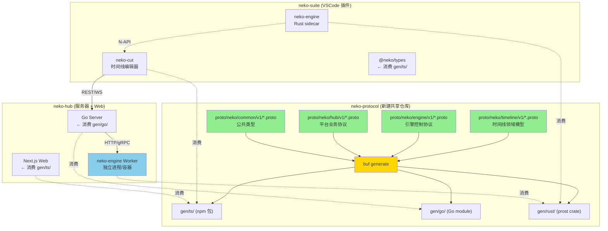
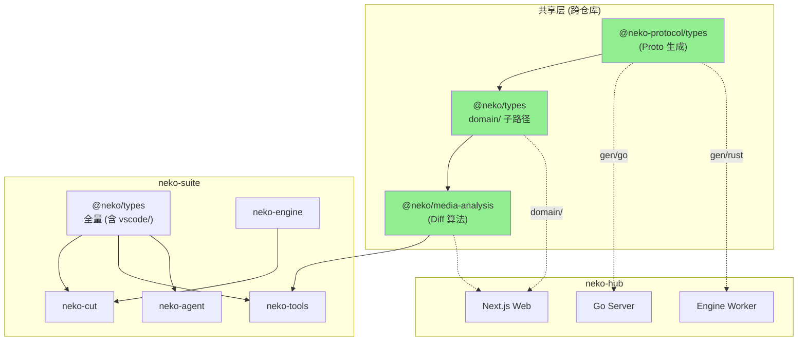

# neko-suite × neko-hub 跨仓库共享架构设计

> 日期：2026-02-09
> 范围：共享协议、共享工具包、neko-engine 多态部署

---

## 一、现状诊断

```
┌─────────────────────────────────┐     ┌─────────────────────────────────┐
│         neko-suite              │     │          neko-hub               │
│  (VSCode Extension Monorepo)   │     │   (Server + Web Monorepo)      │
├─────────────────────────────────┤     ├─────────────────────────────────┤
│ packages/neko-proto/timeline.proto            │     │ libs/shared-types/proto/        │
│   package: neko.timeline        │     │   package: nekohub.v1           │
│   手动维护, 无 codegen          │     │   Buf 工具链, 自动生成 Go+TS    │
├─────────────────────────────────┤     ├─────────────────────────────────┤
│ @neko/shared (TS 手写类型)      │     │ @nekohub/shared-types (Proto生成)│
│   timeline, engine, extension   │     │   user, project, billing, ai   │
├─────────────────────────────────┤     ├─────────────────────────────────┤
│ neko-engine (Rust)              │     │ 无渲染/Worker 代码              │
│   N-API → VSCode sidecar       │     │ Go 后端 + Next.js 前端          │
│   HTTP/WS → native-http        │     │ REST API (JSON)                │
│   CLI → native-cli serve       │     │                                 │
└─────────────────────────────────┘     └─────────────────────────────────┘
         ❌ 无共享协议                           ❌ 无引擎集成
```

### 核心问题

| 问题 | 描述 |
|------|------|
| Proto 割裂 | 两个仓库各自定义 Proto，命名空间不同，无法互通 |
| 类型不一致 | neko-suite 手写 TS 类型，neko-hub Buf 生成，Timeline 模型无法共享 |
| 引擎无法复用 | neko-engine 仅通过 N-API 绑定到 VSCode，服务端无法使用 |
| 无通信契约 | 客户端与服务端之间没有约定的 RPC/消息协议 |
| 工具包耦合 | @neko/shared 和 neko-tools 混合了纯领域代码与 VSCode 特有代码，Web 端无法消费 |

---

## 二、总体架构



### 三层共享设计

```
┌─────────────────────────────────────────────────────────────────┐
│ Layer 1: 共享协议 (neko-protocol)                               │
│                                                                 │
│   职责：所有仓库间的 Single Source of Truth                      │
│   形式：独立 Git 仓库，Buf 管理，生成多语言类型                   │
│   消费：git submodule / npm publish / go module / crates.io     │
└─────────────────────────────────────────────────────────────────┘
                              │
┌─────────────────────────────┼───────────────────────────────────┐
│ Layer 2: 引擎抽象 (neko-engine 多态部署)                        │
│                                                                 │
│   本地模式：N-API binding → VSCode Extension Host               │
│   服务模式：native-http serve → 独立进程/Docker 容器             │
│   统一接口：ActionRequest/ActionResponse (已有)                  │
│   通信协议：HTTP + WebSocket (已有)                              │
└─────────────────────────────────────────────────────────────────┘
                              │
┌─────────────────────────────┼───────────────────────────────────┐
│ Layer 3: 客户端-服务端通信 (Hub API Protocol)                    │
│                                                                 │
│   认证：OAuth2 Token (已有)                                     │
│   同步：REST API (项目、资产、用户)                               │
│   渲染：Engine Worker Proxy (服务端转发到 engine worker)         │
│   实时：WebSocket (渲染流、进度推送)                              │
└─────────────────────────────────────────────────────────────────┘
```

---

## 三、Layer 1：共享协议仓库 (neko-protocol)

### 3.1 仓库结构

```
neko-protocol/
├── buf.yaml                    # Buf 工作区配置
├── buf.gen.yaml                # 代码生成配置 (TS + Go + Rust)
├── proto/
│   └── neko/
│       ├── common/v1/
│       │   ├── pagination.proto    # 分页 (从 nekohub 迁移)
│       │   ├── enums.proto         # 通用枚举 (Visibility, Currency)
│       │   └── error.proto         # 统一错误码
│       │
│       ├── timeline/v1/
│       │   ├── timeline.proto      # Timeline, Track, Element (从 neko-suite 迁移)
│       │   ├── transform.proto     # Transform2D
│       │   ├── animation.proto     # Keyframe, Easing, Interpolation
│       │   ├── effects.proto       # EffectParams, BlendMode
│       │   └── transition.proto    # TransitionType
│       │
│       ├── engine/v1/
│       │   ├── action.proto        # ActionRequest/ActionResponse (从 Rust types 迁移)
│       │   ├── media.proto         # MediaInfo, StreamInfo, CodecInfo
│       │   ├── frame.proto         # FrameData, PixelFormat
│       │   ├── export.proto        # ExportConfig, ExportProgress
│       │   ├── stream.proto        # StreamConfig, StreamStatus
│       │   └── task.proto          # TaskStatus, TaskProgress
│       │
│       └── hub/v1/
│           ├── user.proto          # User, Project, Member (已有)
│           ├── repository.proto    # TreeNode, Commit, Branch (已有)
│           ├── storage.proto       # StorageObject, StorageUsage (已有)
│           ├── ai.proto            # AIModel, AIQuota (已有)
│           ├── billing.proto       # Subscription, Order (已有)
│           └── render_job.proto    # 新增：云端渲染任务协议
│
├── gen/
│   ├── ts/                     # TypeScript 生成 (@neko-protocol/types)
│   ├── go/                     # Go 生成 (go module)
│   └── rust/                   # Rust 生成 (prost)
│
├── package.json                # npm 发布配置
├── go.mod                      # Go module
└── Cargo.toml                  # Rust crate (可选)
```

### 3.2 Proto 命名空间统一

```
当前状态:
  neko-suite:  package neko.timeline;     ← 手动维护
  neko-hub:    package nekohub.v1;        ← Buf 生成

统一后:
  neko.common.v1     → 公共类型
  neko.timeline.v1   → 时间线领域 (引擎核心)
  neko.engine.v1     → 引擎控制协议
  neko.hub.v1        → 平台业务 (原 nekohub.v1)
```

### 3.3 关键协议：引擎控制 (engine/v1/action.proto)

将 neko-engine 现有的 Rust `ActionRequest` 提升为跨仓库共享协议：

```protobuf
syntax = "proto3";
package neko.engine.v1;

// 统一引擎控制请求 (对应 Rust types/request.rs)
message ActionRequest {
  string group = 1;              // "videos", "timelines", "audios"
  string id = 2;                 // 资源 ID
  string action = 3;             // "probe", "capture", "export"
  optional string source = 4;    // 源路径 (自愈用)
  optional string session_id = 5;
  optional string stream_id = 6;
  google.protobuf.Struct options = 7;
  optional google.protobuf.Struct body = 8;
}

message ActionResponse {
  bool success = 1;
  optional google.protobuf.Struct data = 2;
  optional EngineError error = 3;
}

message EngineError {
  string code = 1;
  string message = 2;
  bool recoverable = 3;
}
```

### 3.4 关键协议：云端渲染任务 (hub/v1/render_job.proto)

```protobuf
syntax = "proto3";
package neko.hub.v1;

import "neko/timeline/v1/timeline.proto";

message RenderJob {
  string id = 1;
  string user_id = 2;
  string project_id = 3;
  neko.timeline.v1.Timeline timeline = 4;
  RenderConfig config = 5;
  RenderJobStatus status = 6;
  optional RenderProgress progress = 7;
  google.protobuf.Timestamp created_at = 8;
  google.protobuf.Timestamp updated_at = 9;
}

enum RenderJobStatus {
  RENDER_JOB_STATUS_PENDING = 0;
  RENDER_JOB_STATUS_QUEUED = 1;
  RENDER_JOB_STATUS_RUNNING = 2;
  RENDER_JOB_STATUS_COMPLETED = 3;
  RENDER_JOB_STATUS_FAILED = 4;
  RENDER_JOB_STATUS_CANCELED = 5;
}

message RenderConfig {
  uint32 width = 1;
  uint32 height = 2;
  double fps = 3;
  string codec = 4;           // "h264", "h265", "av1"
  uint32 bitrate = 5;
  string container = 6;       // "mp4", "webm", "mov"
  string preset = 7;          // "ultrafast" .. "veryslow"
  bool hw_accel = 8;
}

message RenderProgress {
  uint64 current_frame = 1;
  uint64 total_frames = 2;
  double percentage = 3;
  double estimated_remaining_seconds = 4;
}
```

### 3.5 消费方式

| 消费方 | 方式 | 说明 |
|--------|------|------|
| neko-suite (TS) | `npm install @neko-protocol/types` 或 git submodule | 替换手写的 `@neko/shared` 中的 timeline 类型 |
| neko-suite (Rust) | `prost` 编译或直接引用生成的 `.rs` | 替换 `packages/types/` 中手写的 Rust 结构体 |
| neko-hub (Go) | `go get github.com/xxx/neko-protocol/gen/go` | 替换 `libs/shared-types/gen/go/` |
| neko-hub (TS/Web) | `npm install @neko-protocol/types` | 替换 `libs/shared-types/gen/ts/` |

---

## 四、Layer 2：neko-engine 多态部署

### 4.1 当前架构 vs 目标架构

```
当前 (仅本地):
┌──────────────┐    N-API     ┌──────────────┐
│ VSCode Ext   │ ──────────► │ neko-engine   │
│ (Node.js)    │             │ (Rust binary) │
└──────────────┘             └──────────────┘

目标 (本地 + 服务端):
┌──────────────┐    N-API     ┌──────────────┐
│ VSCode Ext   │ ──────────► │ neko-engine   │  ← 本地 sidecar
│ (Node.js)    │             │ (native-napi) │
└──────────────┘             └──────────────┘

┌──────────────┐  HTTP/gRPC   ┌──────────────┐
│ neko-hub     │ ──────────► │ neko-engine   │  ← 服务端 worker
│ (Go Server)  │             │ (native-http) │
└──────────────┘             └──────────────┘
```

### 4.2 引擎已具备的能力

neko-engine 的分层设计已经为多态部署做好了准备：

```
native-napi  ─┐
native-http  ─┼─► native-api (EngineApi) ─► native-core (Services)
native-cli   ─┘
```

- `native-cli serve` 已经可以启动独立 HTTP 服务器
- `native-http` 已经暴露了 `POST /v1/dispatch` 统一入口
- `ActionRequest/ActionResponse` 已经是与传输层无关的协议

**结论：neko-engine 不需要大改，只需要补充服务端部署相关的配置和编排。**

### 4.3 服务端 Worker 部署方案

```
┌─────────────────────────────────────────────────────────────┐
│                    neko-hub Server (Go)                      │
│                                                             │
│  ┌─────────────┐    ┌──────────────┐    ┌───────────────┐  │
│  │ REST API    │    │ RenderJob    │    │ Engine Pool   │  │
│  │ Handler     │───►│ Service      │───►│ Manager       │  │
│  └─────────────┘    └──────────────┘    └───────┬───────┘  │
│                                                  │          │
└──────────────────────────────────────────────────┼──────────┘
                                                   │
                              HTTP (ActionRequest)  │
                                                   │
                    ┌──────────────────────────────┼──────────┐
                    │          Engine Worker Pool              │
                    │                                         │
                    │  ┌─────────┐ ┌─────────┐ ┌─────────┐  │
                    │  │ Worker1 │ │ Worker2 │ │ Worker3 │  │
                    │  │ :9001   │ │ :9002   │ │ :9003   │  │
                    │  └─────────┘ └─────────┘ └─────────┘  │
                    │  (neko-engine native-cli serve)         │
                    └─────────────────────────────────────────┘
```

**Go 侧新增模块**：

```go
// internal/adapter/engine/client.go
type EngineClient struct {
    baseURL    string
    httpClient *http.Client
}

func (c *EngineClient) Dispatch(ctx context.Context, req *enginev1.ActionRequest) (*enginev1.ActionResponse, error) {
    // POST http://worker:9001/v1/dispatch
}

// internal/domain/service/render_service.go
type RenderService interface {
    SubmitJob(ctx context.Context, job *hubv1.RenderJob) error
    GetJobStatus(ctx context.Context, jobID string) (*hubv1.RenderJob, error)
    CancelJob(ctx context.Context, jobID string) error
}
```

**部署方式选择**：

| 方式 | 适用场景 | 说明 |
|------|---------|------|
| 进程池 | 单机部署 | Go 服务启动 N 个 `neko-engine serve` 子进程 |
| Docker Sidecar | K8s 部署 | Engine 作为 Pod 中的 sidecar 容器 |
| 独立服务 | 大规模 | Engine Worker 独立部署，通过服务发现连接 |

### 4.4 neko-engine 需要补充的内容

```
packages/native-http/
├── src/
│   ├── routes/
│   │   ├── dispatch.rs      ✅ 已有
│   │   ├── streaming.rs     ✅ 已有
│   │   ├── health.rs        ✅ 已有
│   │   └── render.rs        🆕 渲染任务端点 (接收 Timeline JSON, 返回进度流)
│   └── auth.rs              🆕 可选: Worker 间认证 (共享密钥/mTLS)

packages/native-cli/
├── src/
│   ├── args.rs              需扩展: 添加 worker 模式参数
│   └── runner.rs            需扩展: worker 注册/心跳逻辑
```

---

## 五、Layer 3：客户端-服务端通信

### 5.1 通信场景矩阵

| 场景 | 方向 | 协议 | 数据 |
|------|------|------|------|
| 项目同步 | suite → hub | REST | Project, Asset metadata |
| 用户认证 | suite → hub | REST + OAuth2 | Token |
| 资产上传 | suite → hub (MinIO) | 预签名 URL + PUT | 媒体文件 |
| 云端渲染 | suite → hub → engine worker | REST + WS | Timeline + RenderConfig |
| 渲染进度 | hub → suite | WebSocket | RenderProgress |
| AI 辅助 | suite → hub | REST (SSE) | Completions |
| 模板市场 | suite ↔ hub | REST | Template metadata + files |

### 5.2 VSCode 插件侧 Hub Client

```typescript
// neko-suite 中新增 packages/neko-hub-client/

interface IHubClient {
  auth: {
    login(): Promise<AuthToken>;
    refresh(token: string): Promise<AuthToken>;
  };
  projects: {
    list(params?: PaginationRequest): Promise<PaginatedResponse<Project>>;
    sync(projectId: string, timeline: Timeline): Promise<void>;
  };
  render: {
    submit(job: RenderJobRequest): Promise<RenderJob>;
    getStatus(jobId: string): Promise<RenderJob>;
    cancel(jobId: string): Promise<void>;
    onProgress(jobId: string): AsyncIterable<RenderProgress>;
  };
  storage: {
    getUploadUrl(req: UploadURLRequest): Promise<StorageObject>;
    getDownloadUrl(objectKey: string): Promise<string>;
  };
}
```

---

## 六、共享工具包拆分 (@neko/types + @neko/media-analysis)

> 详细设计见 [shared-packages-design.md](./shared-packages-design.md)

### 6.1 @neko/types 包内分层

纯领域代码与 VSCode 特有代码混合在同一个包中，Web 端无法安全消费。
方案：**包内分层 + `package.json exports` 子路径隔离**，不拆仓库。

```
@neko/types
├── src/
│   ├── domain/              ← 纯领域类型 (可跨仓库共享)
│   │   ├── timeline/        element, track, project, transform, geometry
│   │   ├── animation/       keyframe, easing, interpolation
│   │   ├── effects/         effects, transition, blendMode, mask
│   │   ├── media/           audio, subtitle, speed, shape
│   │   ├── engine/          mediaEngine/* 接口
│   │   ├── asset/           entity, query, classifier
│   │   ├── agent/           agent, memory, context, prompt
│   │   ├── tool/            tool, skill, mcp, hook
│   │   ├── task/            task, subagent
│   │   ├── canvas/          canvas
│   │   └── config/          config, platform
│   │
│   ├── vscode/              ← VSCode 特有 (不共享)
│   └── utils/               ← 纯工具函数 (可共享)
│
└── package.json exports:
      "."              → 全量 (向后兼容，neko-suite 内部零改动)
      "./domain"       → 纯领域 (neko-hub Web 安全消费)
      "./domain/*"     → 子路径
      "./utils"        → 工具函数
      "./vscode"       → VSCode 特有
```

### 6.2 @neko/media-analysis 提取

从 neko-tools 提取纯算法代码为独立包，通过接口注入解耦 FFmpeg 依赖：

```
@neko/media-analysis (新包)
├── analyzers/
│   ├── interface.ts     IMediaDiffAnalyzer, AnalyzerRegistry
│   ├── image.ts         SSIM, 像素比较, 直方图
│   ├── video.ts         关键帧采样 (依赖注入 IFrameExtractor)
│   └── audio.ts         波形相关, 频谱分析 (依赖注入 IAudioDecoder)
│
├── 依赖: sharp, @neko/types/domain
└── 不依赖: vscode, neko-cut
```

```typescript
// 抽象接口 — 各端自行实现
export interface IFrameExtractor {
  extractFrames(source: Buffer, count: number): Promise<Buffer[]>;
  getMetadata(source: Buffer): Promise<VideoMetadata>;
}

// neko-suite: FFmpegFrameExtractor (neko-cut FFmpegService)
// neko-hub Web: EngineFrameExtractor (neko-engine HTTP API)
```

### 6.3 与 neko-protocol 的关系

```
neko-protocol (Proto IDL)     ← 权威数据模型 (跨语言序列化)
        ▲
        │ 对齐
        ▼
@neko/types/domain (TS 类型)  ← 运行时扩展 (工厂函数、类型守卫、计算属性)
```

Proto 生成基础结构体，`@neko/types/domain` 在其上扩展运行时行为：

```typescript
import type { Element as ProtoElement } from '@neko-protocol/types/neko/timeline/v1';

export interface TimelineElement extends ProtoElement { }

// Proto 没有的运行时工具
export function getEffectiveDuration(el: TimelineElement): number { ... }
export function isMediaElement(el: TimelineElement): el is MediaElement { ... }
```

---

## 七、整体依赖关系图



---

## 八、实施路径

```
Phase 1: @neko/types 目录重组
  ├── 创建 src/domain/ 目录结构
  ├── 移动纯领域类型文件到 domain/
  ├── 移动 VSCode 特有文件到 vscode/
  ├── 添加 domain/ 各层 index.ts 汇总导出
  ├── 更新 package.json exports 字段
  ├── 保持 "." 入口全量导出 (向后兼容)
  └── 验证 neko-suite 内所有包编译通过

Phase 2: @neko/media-analysis 提取
  ├── 创建 packages/neko-media-analysis/
  ├── 提取 Analyzer 接口 + 注册表 + 基类
  ├── 提取 ImageDiffAnalyzer (纯算法)
  ├── 定义 IFrameExtractor / IAudioDecoder 接口 (解耦 FFmpeg)
  ├── 提取 AudioDiffAnalyzer + VideoDiffAnalyzer
  ├── neko-tools 改为依赖 @neko/media-analysis
  └── 编写单元测试

Phase 3: 建立 neko-protocol 仓库
  ├── 将 neko-suite/packages/neko-proto/timeline.proto 迁入 proto/neko/timeline/v1/
  ├── 将 neko-hub/libs/shared-types/proto/ 迁入 proto/neko/hub/v1/
  ├── 新增 proto/neko/engine/v1/ (从 Rust types 提取)
  ├── 新增 proto/neko/common/v1/ (合并公共类型)
  ├── 配置 Buf 生成 TS + Go + Rust
  └── 两个仓库切换到消费生成的类型

Phase 4: neko-engine 服务端适配
  ├── native-cli 添加 worker 模式 (注册、心跳)
  ├── native-http 添加渲染任务端点
  ├── 构建 Docker 镜像 (多架构: amd64 + arm64)
  └── Rust types 切换到 prost 从 proto 生成

Phase 5: neko-hub 集成
  ├── Go 侧新增 EngineClient + RenderService
  ├── 新增 render_jobs 数据库表
  ├── RabbitMQ 任务队列集成
  ├── Web 前端导入 @neko/types/domain + @neko/media-analysis
  └── Web 前端渲染任务管理页面

Phase 6: neko-suite Hub 集成
  ├── 新增 @neko/hub-client 包
  ├── neko-cut 添加"云端渲染"功能
  ├── 资产同步 (本地 ↔ MinIO)
  └── 项目协作功能
```

---

## 九、决策总结

| 决策点 | 方案 | 理由 |
|--------|------|------|
| 类型包拆分粒度 | 包内分层，不拆仓库 | 维护成本低，monorepo 内移动文件即可 |
| 隔离机制 | package.json `exports` 子路径 | 标准 Node.js 机制，构建工具原生支持 |
| 向后兼容 | `"."` 入口保持全量导出 | neko-suite 内部零改动 |
| 算法提取 | 新建 `@neko/media-analysis` 包 | 算法与 VSCode Editor 职责完全不同，应独立 |
| FFmpeg 解耦 | `IFrameExtractor` 接口注入 | Web 端和 Extension 端实现不同，必须抽象 |
| 共享协议 | 独立 neko-protocol Git 仓库 | 两个消费方技术栈差异大，独立仓库 + 版本化发布最灵活 |
| Proto 工具链 | Buf | neko-hub 已在用，生态成熟，支持 TS/Go/Rust 生成 |
| Rust Proto 生成 | prost + buf | 替代手写 Rust 结构体，保证与 Proto 一致 |
| Engine Worker 通信 | HTTP (现有) | neko-engine 已有完整的 HTTP API，无需引入 gRPC |
| 任务队列 | RabbitMQ | neko-hub 已连接但未使用，适合渲染任务调度 |
| Worker 部署 | Docker 容器 | neko-engine 是 Rust 静态编译，适合容器化 |
| 发布方式 | 初期 git submodule，稳定后 npm publish | 渐进式，降低初始成本 |

### 架构评级

```
共享协议设计:    🟢 可行性高 — Proto 已有基础，统一命名空间即可
类型包拆分:      🟢 可行性高 — 纯文件移动 + exports 配置，零破坏性
算法包提取:      🟢 可行性高 — 算法已独立，只需解耦 FFmpeg 依赖
引擎多态部署:    🟢 可行性高 — native-http/native-cli 已具备，补充 worker 模式即可
Hub 集成:       🟡 工作量中等 — Go 侧需新增 EngineClient + RenderService + 任务队列
客户端集成:     🟡 工作量中等 — 需新增 hub-client 包 + UI 交互
```