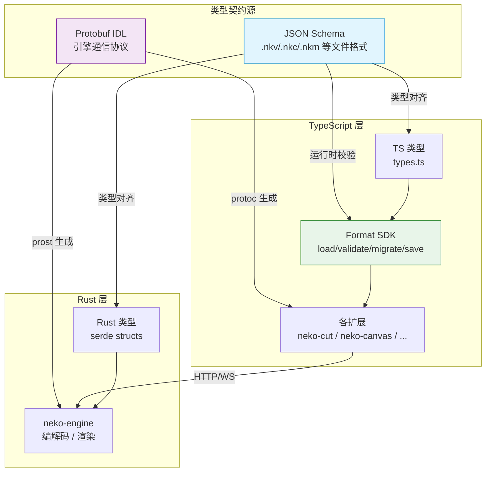

# 文件格式策略

> 关联：[ARCHITECTURE.md](../../ARCHITECTURE.md) · [media-lsp.md](./media-lsp.md)

---

## 一、背景

neko-suite 包含多个创意工具扩展，每个扩展都有自己的项目文件格式。历史上存在两个问题：

1. **命名不一致** — 早期混用 `jvi`/`jvc` 前缀与 `nk*` 前缀，导致用户认知混乱
2. **零运行时校验** — 文件加载时无 schema 验证，损坏或版本不匹配的文件直接导致运行时崩溃

本 ADR 统一了命名体系、明确了格式策略、建立了 Format SDK 标准管线。

---

## 二、统一命名（nk* 体系）

所有 neko-suite 自定义格式统一使用 `nk` 前缀：

| 扩展名 | 全称 | 所属扩展 | 说明 |
|--------|------|----------|------|
| `.nkv` | Neko Video | neko-cut | 视频编辑项目 |
| `.nkc` | Neko Canvas | neko-canvas | 画布编辑项目 |
| `.nkm` | Neko Model | neko-model | 3D 模型编辑项目 |
| `.nks` | Neko Sketch | neko-sketch | 2D 绘画项目 |
| `.nkp` | Neko Puppet | neko-sketch | 骨骼动画/Live2D 项目 |
| `.nka` | Neko Audio | neko-audio | 音频编辑项目 |
| `.nkplan` | Neko Plan | neko-agent | Workflow Orchestration Plan Mode 工件 |
| `.nkproj` | Neko Project | neko-agent | 顶层项目容器（引用 .nks/.nkc/.nkv/.nkplan，支持 Lossless Upgrade）— 最小表面积，见 §六 |
| `.fountain` | Fountain | neko-story | 行业标准剧本格式（不自定义，支持资产引用扩展） |

**命名规则**：`nk` + 英文名首字母小写。`.fountain` 是行业标准，保持原样不改名。

**Fountain `[[KEY: value]]` 指令扩展**：neko-story 通过 Fountain 标准的 Notes 语法 `[[...]]` 支持结构化指令，保持与其他 Fountain 工具的兼容性（标准渲染器将 `[[...]]` 视为不可见注释）。

| 类别 | 指令键 | 示例 |
|------|--------|------|
| 资产 | `IMAGE`, `VIDEO`, `AUDIO`, `ASSET` | `[[IMAGE: hero.png]]` `[[ASSET: image://path]]` |
| 元数据 | `MOOD`, `MUSIC`, `VFX`, `SFX`, `DURATION` | `[[MOOD: tense]]` `[[DURATION: 30s]]` |
| 镜头 | `SHOT`, `ANGLE`, `MOVEMENT` | `[[SHOT: close-up]]` `[[ANGLE: low]]` |
| AI | `PROMPT`, `STYLE`, `REF` | `[[PROMPT: 赛博朋克咖啡厅]]` `[[STYLE: noir]]` |

资产引用转换为 neko-cut 时自动生成 MediaElement。元数据/镜头/AI 指令由 storyScenePlanner 转换为 `StoryShotPlan` schema，经 storyboardPlanner 传入 canvas ShotNode.data，最终影响 AI 生图 prompt。

---

## 三、格式策略

### 核心决策：JSON-based，人类可读，AI 友好

所有 nk* 自定义格式均为 **纯 JSON 文本文件**，不使用二进制格式。

**理由**：

| 维度 | JSON 文本 | 二进制 |
|------|-----------|--------|
| 可读性 | 直接用文本编辑器查看/修改 | 需要专用工具 |
| Git 友好 | diff/merge 自然支持 | 无法 diff |
| AI 友好 | LLM 可直接读写 | 需要编解码层 |
| 调试 | 肉眼可排查问题 | 需要 hex editor |
| 性能 | 大文件（>50MB）可能较慢 | 加载更快 |

**大文件策略**：项目文件仅存储元数据和引用关系，实际媒体资产（视频/音频/图片）以外部文件引用形式存在，项目文件本身不会太大。

---

## 四、Schema 策略

### 文件格式 → JSON Schema（SSOT）

```
JSON Schema (.json)
├─→ TypeScript 类型（类型生成 / 手写对齐）
├─→ Rust 类型（serde 对齐）
└─→ 运行时校验（Format SDK 手写验证器）
```

### 引擎通信 → Protobuf（不变）

```
Protobuf IDL (.proto)
├─→ timeline.proto — 时间线操作协议
├─→ diff.proto — 媒体对比协议
└─→ 其他 RPC 协议
```

### 为什么不用 Protobuf 做文件格式？

| 维度 | JSON Schema | Protobuf |
|------|-------------|----------|
| 设计目标 | 数据描述与校验 | RPC 序列化 |
| 可读性 | 人类可读 | 二进制编码 |
| 平台无关 | 浏览器/Node/Rust 均可用 | 需要生成代码 |
| 校验能力 | 丰富（pattern/enum/range/required） | 仅类型级别 |
| 版本演进 | 显式 `version` 字段 + 迁移管线 | 字段编号兼容 |
| 文件持久化 | 天然适合 | 为 RPC 设计，非持久化场景 |

**结论**：Protobuf 继续用于 TS ↔ Rust 的引擎通信；文件持久化用 JSON Schema 作为类型契约源。

---

## 五、Format SDK（@neko/shared/nkv）

### 位置

```
packages/neko-types/src/
├─ nkv/             — .nkv 视频项目 SDK（完整：schema + validator + migrator + codec + history）
├─ nkc/             — .nkc 画布项目 SDK（validator + codec）
├─ nka/             — .nka 音频项目 SDK（validator + codec）
├─ types/sketch.ts  — .nks 格式类型定义（从 neko-sketch 提升）
├─ types/puppet.ts  — .nkp 格式类型定义（从 neko-sketch 提升）
└─ types/audioProject.ts — .nka 格式类型定义（从 operations 提升）
```

### 加载管线

```
文件内容 (string)
  │
  ▼
parse (JSON.parse)
  │
  ▼
detect version (读取 meta.version)
  │
  ▼
validate (JSON Schema 校验)
  │  ├─ 失败 → ValidationResult { ok: false, errors: ValidationError[] }
  │  └─ 成功 ↓
  ▼
migrate (版本迁移链，若需要)
  │
  ▼
typed data (完全类型化的项目数据)
```

### 保存管线

```
typed data (内存中的项目数据)
  │
  ▼
validate (保存前校验)
  │  ├─ 失败 → ValidationResult { ok: false, errors: ValidationError[] }
  │  └─ 成功 ↓
  ▼
serialize (JSON.stringify + formatting)
  │
  ▼
文件内容 (string)
```

### 设计约束

- **零外部依赖** — 验证器手写实现，不依赖 ajv 等第三方库
- **复用 ValidationResult/ValidationError** — 来自 config-adapter 已有类型
- **纯函数管线** — 每个步骤是纯函数，易于测试和组合
- **Layer 0** — 属于零依赖层，可在 Extension / Webview / Rust (via wasm) 中使用

---

## 六、版本迁移策略

### Pipeline 模式

```typescript
// each migrator is an immutable transform: V(n) → V(n+1)
type Migrator<TFrom, TTo> = (data: TFrom) => TTo;

// migration chain: detect version → apply sequential transforms
// v1 → v2 → v3 (current)
```

### 迁移原则

1. **不可变变换** — 每个迁移函数接收旧版本数据，返回新版本数据，不修改输入
2. **版本检测** — 通过 `meta.version` 字段判断当前版本
3. **链式执行** — v1 → v2 → v3 顺序执行，不跳版本
4. **向前兼容** — 高版本 SDK 可以加载所有历史版本文件
5. **不向后兼容** — 低版本 SDK 遇到高版本文件返回明确错误

### 文件元信息

```json
{
  "meta": {
    "format": "nkv",
    "version": 3,
    "createdAt": "2026-03-23T00:00:00Z",
    "lastModifiedAt": "2026-03-23T00:00:00Z",
    "generator": "neko-cut/1.2.0"
  },
  "data": { ... }
}
```

---

## 七、标准格式处理

### 核心原则：标准媒体格式只读，绝不直接修改

neko-suite 处理大量标准媒体格式（.mp4, .mov, .gltf, .glb, .png, .wav 等），对这些格式采用 **两层模式**：

| 层级 | 行为 | 说明 |
|------|------|------|
| **只读预览（默认）** | 打开文件 → 预览/播放 | 不创建项目文件，不修改原始文件 |
| **编辑器模式** | 打开文件 → 创建 nk* 项目文件 | 编辑操作记录在项目文件中，原始媒体不变 |

**示例**：

```
用户打开 video.mp4
├─ 默认：neko-preview 只读预览播放
└─ 编辑：neko-cut 创建 video.nkv 项目文件
         └─ .nkv 中引用 video.mp4 路径
         └─ 所有编辑操作存储在 .nkv 中
         └─ 导出时生成新的 output.mp4
```

**绝对禁止**：直接修改用户的 .mp4/.gltf/.png 等标准格式文件。

---

## 八、架构关系图



**说明**：
- **蓝色（JSON Schema）**：文件格式的类型契约源，生成 TS 类型和 Rust 类型，驱动 Format SDK 的运行时校验
- **紫色（Protobuf）**：引擎通信的类型契约源，通过代码生成分别服务 TS 和 Rust
- **绿色（Format SDK）**：基于 JSON Schema 构建的加载/校验/迁移/保存管线

---

## 九、增量操作架构

### 概述

neko-suite 采用 **增量操作优先 + 全量快照 fallback** 的双轨模式。编辑操作以 `EditOperation` 形式在 TS 侧生成和应用，同时转发给 Rust 引擎进行实时预览更新。

### 完整数据流

```
Webview (React + Zustand)
  │ 用户操作 → 生成 EditOperation
  │ pushOperation() → undo stack（内存）
  │ syncOperationToExtension() → postMessage
  ▼
Extension Host (Node.js)
  │ handleOperationApplied() → applyOperation(project, op) → model.applyIncrementalUpdate()
  │
  ├─ 增量路径（RUST_FAST_PATH_OPS, 20 种）
  │   └─ MediaService → streams:applyOperation → Engine 就地修改 Timeline
  │       └─ 失败时自动 fallback 到全量路径
  │
  └─ 全量路径（shape.*/keyframe.*/canvas.*/sketch.*/audio.* 等）
      └─ MediaService → streams:update → Engine 全量替换 Timeline（不重启流）
  ▼
Rust Engine (neko-engine)
  │ try_apply_operation(&mut self, op) → Applied / Unsupported
  │ PlaybackState watch channel → timeline_seq 递增
  ▼
Video/Audio Loops
  │ 检测 timeline_seq 变化 → pipeline.update_timeline()
  │ 每帧渲染：pipeline.render_frame() → 读取最新 Timeline 数据
  ▼
H.264 + PCM 流输出
```

### Engine 支持的增量操作（20 种）

| 阶段 | 操作类型 | 说明 |
|------|----------|------|
| **P0** | `element.update` | 拖拽/缩放/变换/透明度/混合模式/特效 |
| **P0** | `track.toggle` | 静音/锁定/隐藏 |
| **P0** | `element.toggle` | 静音/隐藏/锁定 |
| **P1** | `track.update` | 轨道重命名/属性修改 |
| **P1** | `element.splitKeepLeft` | 分割保留左半 |
| **P1** | `element.splitKeepRight` | 分割保留右半 |
| **P1** | `project.update` | fps/分辨率修改 |
| **P2** | `element.add` | 添加元素 |
| **P2** | `element.remove` | 删除元素 |
| **P2** | `element.move` | 跨轨道移动 |
| **P2** | `element.splitAt` | 分割为两段 |
| **P2** | `element.linkAudio` | 关联音频 |
| **P2** | `element.unlinkAudio` | 取消关联音频 |
| **P2** | `track.add` | 添加轨道 |
| **P2** | `track.remove` | 删除轨道 |
| **P2** | `track.reorder` | 轨道排序 |
| **P2** | `batch` | 原子批量操作 |

### Engine 不处理的操作（TS 专属）

| 操作族 | 原因 |
|--------|------|
| `shape.*` (9 种) | 形状是元素内部数据，引擎通过 `element.update(effects)` 感知结果 |
| `keyframe.*` (3 种) | 关键帧是动画数据，引擎渲染时直接插值 |
| `clipboard.*` (1 种) | 展开为 `element.add` + `track.add` 的 batch |
| `canvas.*` (8 种) | 画布编辑器独立，不涉及 Timeline 流 |
| `sketch.*` (9 种) | 2D 绘画编辑器独立 |
| `audio.effect/marker.*` (8 种) | 音频项目专属 |

### Fallback 机制

```typescript
// videoEditorProvider.ts:683-736
const RUST_FAST_PATH_OPS = new Set([...20 种操作类型...]);

if (RUST_FAST_PATH_OPS.has(operation.type)) {
  // 增量路径：发送操作 JSON（~100 bytes）
  mediaService.handleMessage({
    type: 'media:frameServer:projectPlayback:applyOperation',
    payload: { operation },
  }).catch(() => {
    // 失败自动 fallback：发送完整 ProjectData
    mediaService.handleMessage({
      type: 'media:frameServer:projectPlayback:update',
      payload: { projectData: content },
    });
  });
} else {
  // 全量路径：发送完整 ProjectData
  mediaService.handleMessage({
    type: 'media:frameServer:projectPlayback:update',
    payload: { projectData: content },
  });
}
```

### 操作类型对齐

| 层 | 定义位置 | 数量 | 说明 |
|----|----------|------|------|
| TS 操作类型 | `neko-types/src/operations/types.ts` | 60+ | 完整操作体系（含 meta/before） |
| Rust 操作类型 | `engine-kernel/src/domain/operations.rs` | 20 | Timeline 子集（仅 type+payload） |
| Proto | 无 | — | 不定义操作类型，JSON 即线格式 |

**设计决策**：Rust 端使用 `EditOperationEnvelope { type: String, payload: serde_json::Value }` 作为信封，忽略 `meta` 和 `before` 字段（这些仅 TS 侧 undo/invert 使用）。Payload 通过 serde 按需反序列化为具体类型。

### 操作历史持久化

操作历史保存为独立 JSON 文件（不嵌入 .nkv），通过 `@neko/shared/nkv` 的 `history.ts` SDK 提供序列化/反序列化能力：

```
project.nkv       ← 项目快照（现有格式不变）
project.nkv-ops   ← 操作历史（可选，独立文件）
```

**设计约束**：
- 大型二进制数据（如 sketch `RegionSnapshot.data`）不序列化
- 关闭编辑器时可选保存历史，重新打开时恢复 undo/redo stack
- 历史文件与快照文件版本必须匹配（通过 projectVersion 字段校验）

---

## 六、项目状态分层（`.nkproj` vs `.neko/` vs git）

Workflow Orchestration 引入 `.nkproj` 顶层容器时曾纠结"为什么不复用 `.neko/` 目录或 git"——经 2026-04-19 评审，结论：**`.nkproj` 保持最小表面积，`.neko/` 是真正的 SSOT**。

### 三者正交职责

| 关注 | 载体 | 示例 |
|------|------|------|
| "创作产出了什么（工件 DAG + 路由溯源）" | `.nkproj` | `artifacts[].derivedFromArtifactId` / `upgradeHistory` |
| "这个工作区怎么行为（配置 / 记忆 / 缓存 / 计划）" | `.neko/` | `settings.json` / `memory.md` / `.cache/` / `plans/*.nkplan` |
| "文件何时变成今天这样（时间旅行）" | git | commit history / branches |

### `.nkproj` 的最小化原则

经字段级拆解，`.nkproj` 绝大多数字段**在 `.neko/` 都有自然家**：

| `.nkproj` 字段 | `.neko/` 自然替代 |
|--------------|---------------|
| `workflow` prefs | `neko/settings.json` |
| `notes[]` | `.neko/memory.md` |
| `parentProjectId` / `id` / `name` | `.neko/metadata.json`（未建） |
| `artifacts[]` | glob `**/*.nk?` + `.neko/artifact-graph.json`（未建） |

`.nkproj` 真正**独占**的价值仅有**单文件原子写**：`recordLosslessUpgrade` 一次 save 同时落 artifact + upgradeEvent。其他字段是为对称性和"一眼看到项目"的 UX 冗余。

### 落地策略

1. **Phase 6.1/6.2 保留**：32 测试绿、API 已稳定，沉没成本合理。
2. **Phase 6.3 不再扩充 `.nkproj`**：Clip.lineage 写入 proto（timeline.engine.ts），ShotNode.workflowPlanId 写入 canvas.ts，两者都不需要进 `.nkproj`。
3. **`.neko/` 优先**：新增项目级元数据（activity log / preference / 缓存）都先问"能不能进 `.neko/`"。只有需要与 `upgradeHistory` 原子协同时才进 `.nkproj`。
4. **观察期（6 个月）**：若实际消费端（PlanBuilder / AssetLibrary / LLM context）从未读过 `.nkproj` 的新字段，标记为 deprecated 并迁移到 `.neko/`。

### 为什么不是 git

git 是**补充**不是替代：

- **自动追加 vs 手动 commit**：Lossless Upgrade 机器触发，不能等用户 `git commit`。
- **语义 DAG 不在 tree 里**：`derivedFromArtifactId` / `producedByRouteLevel` 是工件之间的关系，git 只记文件快照。
- **跨扩展 API 查询**：webview 沙箱不能 shell out；`.nkproj.artifacts` 是 O(1) JSON 字段访问。
- **不强制 git**：速写项目 / 素材 dump 不是每个都入库。
- **二进制工件 git-hostile**：生成的视频/图片要 LFS 或 gitignore，`.nkproj` 追踪引用与二进制是否入库正交。

核心判定：**git 管"文件时间线"，`.nkproj` 管"创作工件 DAG + 路由溯源"，`.neko/` 管"工作区行为"**——三层正交，混一层都出问题。
