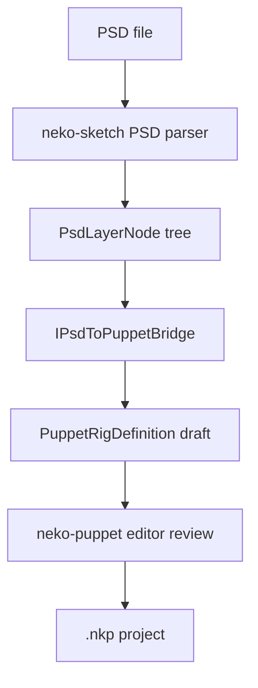

# PSD To Puppet Bridge 设计

> 状态：Design Follow-up（P2）  
> 关联：`adr-puppet-model-format-integration.md`、`format-strategy.md`、`sketch-2d-lighting.md`

## 背景

`neko-sketch` 已具备 PSD 解析基础，但 PSD 图层树到 puppet rig 的转换涉及命名约定、遮罩、网格、变形器、参数模板和美术质量判断。本设计只定义桥接 contract，不承诺自动生成可生产使用的 rig。

## 目标

- 复用 PSD layer tree，把 group/layer/visibility/order 映射为 puppet rig draft。
- 输出可人工继续编辑的 puppet rig definition。
- 明确 auto-rig 的非目标，避免把启发式转换误认为完整 Live2D 绑定能力。

## 非目标

- 不实现自动高质量权重绘制。
- 不实现自动面部语义识别的生产承诺。
- 不修改 PSD 原文件。
- 不把 PSD 解析库放进 `@neko/shared`。

## Bridge Contract

```ts
export interface IPsdToPuppetBridge {
  readonly id: string;
  convertLayerTree(
    input: PsdToPuppetInput,
  ): Promise<PsdToPuppetResult>;
}

export interface PsdToPuppetInput {
  readonly sourcePsdPath: string;
  readonly layers: readonly PsdLayerNode[];
  readonly options: PsdToPuppetOptions;
}

export interface PsdToPuppetOptions {
  readonly autoRig: boolean;
  readonly meshDensity: 'low' | 'medium' | 'high';
  readonly namingPreset?: 'live2d-ja' | 'live2d-en' | 'custom';
}

export interface PsdToPuppetResult {
  readonly rig: PuppetRigDefinition;
  readonly diagnostics: readonly PsdToPuppetDiagnostic[];
}
```

## Layer Mapping

| PSD 输入 | Puppet 输出 | 规则 |
| --- | --- | --- |
| Group | Bone/deformer group | 保留嵌套层级和显示顺序。 |
| Pixel layer | Drawable/art mesh | 图层 bounds 生成 mesh 初始包围盒。 |
| Clipping mask | Drawable mask relation | 保留 mask dependency；不做烘焙。 |
| Hidden layer | Disabled drawable | `visible: false`，保留以便后续编辑。 |
| Blend mode | Material blend hint | 映射到 neko blend mode，不能映射则诊断 warning。 |

命名启发式只作为 draft hint，例如 `eye_l`、`mouth_open`、`hair_front` 可以建议参数组，但必须允许用户确认。

## Rig Draft

```ts
export interface PuppetRigDefinition {
  readonly format: 'puppet-rig-draft';
  readonly version: 1;
  readonly source: {
    readonly psdPath: string;
    readonly parser: string;
  };
  readonly nodes: readonly PuppetRigNode[];
  readonly parameters: readonly PuppetRigParameter[];
}

export interface PuppetRigNode {
  readonly id: string;
  readonly parentId?: string;
  readonly name: string;
  readonly kind: 'bone' | 'deformer' | 'drawable';
  readonly visible: boolean;
  readonly bounds?: { x: number; y: number; width: number; height: number };
  readonly sourceLayerId?: string;
}
```

## Diagnostics

| Code | Severity | 说明 |
| --- | --- | --- |
| `unsupported-blend-mode` | warning | 已保留图层但降级为 normal。 |
| `empty-layer-bounds` | warning | 图层无法生成 drawable bounds。 |
| `ambiguous-semantic-name` | info | 命名可推断多个 puppet 参数。 |
| `auto-rig-disabled` | info | 仅输出层级和 drawable draft。 |
| `mask-cycle` | error | PSD mask relation 无法安全转换。 |

## Pipeline



## Extension Boundaries

- `neko-sketch` owns PSD parsing and layer tree normalization.
- `neko-puppet` owns rig editing, preview, and `.nkp` persistence.
- Shared code owns only small contracts if/when implementation starts.
- Agent 可调用 bridge，但必须把输出标记为 draft，并要求用户确认关键绑定。

## Roadmap

1. Layer tree draft：保留层级、bounds、visibility、blend hints。
2. Naming preset：提供 Live2D 常见命名表和参数建议。
3. Manual review UI：在 puppet editor 中确认 drawable、bone、deformer。
4. Optional auto mesh：根据 bounds 和 alpha mask 生成粗 mesh。
5. Advanced rigging：独立研究，不阻塞 Live2D import、asset export 或 Market flow。
