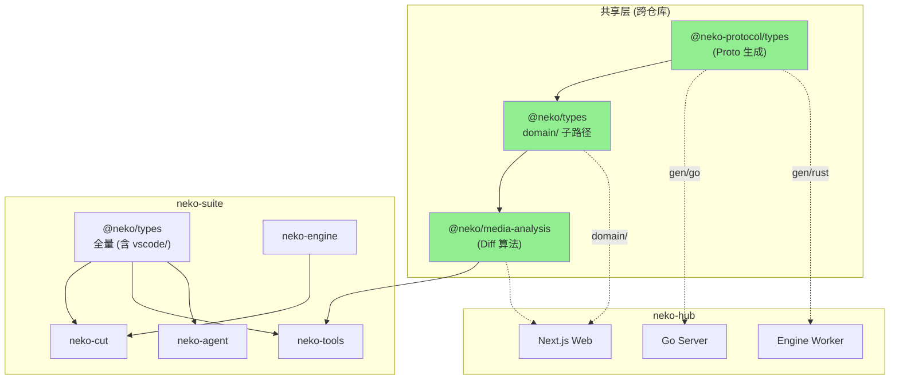

# @neko/types 与 @neko/media-analysis 共享包设计

> 日期：2026-02-09
> 目标：使 neko-suite 中的 neko-types 和 neko-tools 能被 neko-hub Web 端安全消费

---

## 一、问题分析

### 1.1 @neko/shared (neko-types) 现状

```
81 个 TS 文件 · 零外部依赖 · 被 neko-suite 所有包依赖

┌─────────────────────┐  ┌──────────────────────┐
│ 纯领域类型 (45+ 文件)│  │ VSCode 特有 (10+ 文件)│
│                     │  │                      │
│ element, track,     │  │ vscode/api.ts        │
│ project, transform, │  │ vscode/types.ts      │
│ animation, effects, │  │ message.ts           │  混在一起
│ mediaEngine/*,      │  │ mediaProtocol.ts     │  ────────►
│ asset/*, agent/*,   │  │ exportProtocol.ts    │  Web 端无法
│ tool/*, config.ts   │  │ mediaDiffProtocol.ts │  直接消费
│ ...                 │  │ ui-state.ts          │
└─────────────────────┘  │ extension-api.ts     │
                         │ task-view.ts         │
                         └──────────────────────┘
```

### 1.2 neko-tools 现状

```
┌─────────────────────┐  ┌──────────────────────┐
│ 纯算法 (~1500 行)    │  │ VSCode 特有 (~1560行) │
│                     │  │                      │
│ ImageDiffAnalyzer   │  │ MediaDiffEditor      │
│  · SSIM 计算        │  │ AssetVariantEditor   │
│  · 像素比较         │  │ GitMediaService      │
│  · 直方图分析       │  │ MessageHandler       │  同样混在一起
│ AudioDiffAnalyzer   │  │ extension.ts         │
│  · 波形相关性       │  │                      │
│  · 频谱分析         │  │                      │
│ VideoDiffAnalyzer   │  │                      │
│ AnalyzerRegistry    │  │                      │
└─────────────────────┘  └──────────────────────┘
```

---

## 二、拆分策略：包内分层 + 条件导出

不物理拆分成多个仓库，而是在 monorepo 内通过目录重组和 `package.json exports` 实现隔离。

### 2.1 目标结构

```
neko-suite/packages/
│
├── neko-types/                    ← @neko/types (原 @neko/shared)
│   ├── src/
│   │   ├── domain/                ← 纯领域类型 (可跨仓库共享)
│   │   │   ├── timeline/
│   │   │   ├── animation/
│   │   │   ├── effects/
│   │   │   ├── media/
│   │   │   ├── engine/
│   │   │   ├── asset/
│   │   │   ├── agent/
│   │   │   ├── tool/
│   │   │   ├── task/
│   │   │   ├── canvas/
│   │   │   └── config/
│   │   │
│   │   ├── vscode/                ← VSCode 特有 (不共享)
│   │   │   ├── api.ts
│   │   │   ├── types.ts
│   │   │   ├── message.ts
│   │   │   ├── protocols/
│   │   │   ├── ui-state.ts
│   │   │   └── extension-api.ts
│   │   │
│   │   ├── utils/                 ← 纯工具函数 (可共享)
│   │   │   ├── animation.ts
│   │   │   ├── color.ts
│   │   │   └── concurrency-pool.ts
│   │   │
│   │   └── index.ts               ← 全量导出 (向后兼容)
│   │
│   └── package.json
│
├── neko-media-analysis/           ← @neko/media-analysis (从 neko-tools 提取)
│   ├── src/
│   │   ├── analyzers/
│   │   │   ├── interface.ts
│   │   │   ├── image.ts
│   │   │   ├── video.ts
│   │   │   └── audio.ts
│   │   ├── types.ts
│   │   └── index.ts
│   └── package.json
│
└── neko-tools/                    ← 瘦身后，仅保留 VSCode 壳
    ├── src/
    │   ├── editors/
    │   ├── services/
    │   └── extension.ts
    └── package.json
```

---

## 三、@neko/types 重构细节

### 3.1 文件移动映射

```
当前路径                              → 新路径
─────────────────────────────────────────────────────────────────
── 时间线领域 ──
src/types/element.ts                  → src/domain/timeline/element.ts
src/types/track.ts                    → src/domain/timeline/track.ts
src/types/timelineTrack.ts            → src/domain/timeline/timelineTrack.ts
src/types/project.ts                  → src/domain/timeline/project.ts
src/types/transform.ts                → src/domain/timeline/transform.ts
src/types/geometry.ts                 → src/domain/timeline/geometry.ts

── 动画 ──
src/types/animation.ts                → src/domain/animation/animation.ts
src/types/keyframe.ts                 → src/domain/animation/keyframe.ts
src/types/easing.ts                   → src/domain/animation/easing.ts

── 效果 ──
src/types/effects.ts                  → src/domain/effects/effects.ts
src/types/transition.ts               → src/domain/effects/transition.ts
src/types/blendMode.ts                → src/domain/effects/blendMode.ts
src/types/mask.ts                     → src/domain/effects/mask.ts
src/types/colorCorrection.ts          → src/domain/effects/colorCorrection.ts

── 媒体 ──
src/types/audio.ts                    → src/domain/media/audio.ts
src/types/subtitle.ts                 → src/domain/media/subtitle.ts
src/types/speed.ts                    → src/domain/media/speed.ts
src/types/shape.ts                    → src/domain/media/shape.ts

── 引擎 ──
src/types/mediaEngine/*               → src/domain/engine/* (不变)

── 资产 ──
src/types/asset/*                     → src/domain/asset/* (不变)

── Agent ──
src/types/agent.ts                    → src/domain/agent/agent.ts
src/types/agent-message.ts            → src/domain/agent/message.ts
src/types/memory.ts                   → src/domain/agent/memory.ts
src/types/context-manager.ts          → src/domain/agent/context-manager.ts
src/types/conversation-compressor.ts  → src/domain/agent/compressor.ts
src/types/context-persistence.ts      → src/domain/agent/persistence.ts
src/types/prompt.ts                   → src/domain/agent/prompt.ts
src/types/aiAction.ts                 → src/domain/agent/aiAction.ts

── 工具 ──
src/types/tool.ts                     → src/domain/tool/tool.ts
src/types/tool-group.ts               → src/domain/tool/group.ts
src/types/tool-category.ts            → src/domain/tool/category.ts
src/types/tool-injection.ts           → src/domain/tool/injection.ts
src/types/skill.ts                    → src/domain/tool/skill.ts
src/types/skill-conflict.ts           → src/domain/tool/skill-conflict.ts
src/types/mcp.ts                      → src/domain/tool/mcp.ts
src/types/hook.ts                     → src/domain/tool/hook.ts

── 任务 ──
src/types/task.ts                     → src/domain/task/task.ts
src/types/subagent.ts                 → src/domain/task/subagent.ts

── 配置 ──
src/types/config.ts                   → src/domain/config/config.ts
src/types/platform.ts                 → src/domain/config/platform.ts

── 画布 ──
src/types/canvas.ts                   → src/domain/canvas/canvas.ts

── VSCode 特有 (移入 vscode/) ──
src/types/message.ts                  → src/vscode/message.ts
src/types/mediaProtocol.ts            → src/vscode/protocols/media.ts
src/types/exportProtocol.ts           → src/vscode/protocols/export.ts
src/types/mediaDiffProtocol.ts        → src/vscode/protocols/mediaDiff.ts
src/types/ui-state.ts                 → src/vscode/ui-state.ts
src/types/extension-api.ts            → src/vscode/extension-api.ts
src/types/task-view.ts                → src/vscode/task-view.ts
src/vscode/*                          → src/vscode/* (不变)
```

### 3.2 package.json exports 设计

```jsonc
{
  "name": "@neko/types",
  "exports": {
    // 全量导出 (neko-suite 内部使用，向后兼容)
    ".": "./src/index.ts",

    // 纯领域层 (跨仓库共享安全入口)
    "./domain":            "./src/domain/index.ts",
    "./domain/timeline":   "./src/domain/timeline/index.ts",
    "./domain/animation":  "./src/domain/animation/index.ts",
    "./domain/effects":    "./src/domain/effects/index.ts",
    "./domain/media":      "./src/domain/media/index.ts",
    "./domain/engine":     "./src/domain/engine/index.ts",
    "./domain/asset":      "./src/domain/asset/index.ts",
    "./domain/agent":      "./src/domain/agent/index.ts",
    "./domain/tool":       "./src/domain/tool/index.ts",
    "./domain/task":       "./src/domain/task/index.ts",
    "./domain/config":     "./src/domain/config/index.ts",
    "./domain/canvas":     "./src/domain/canvas/index.ts",

    // 工具函数 (跨仓库共享)
    "./utils":             "./src/utils/index.ts",

    // VSCode 特有 (仅 neko-suite 内部)
    "./vscode":            "./src/vscode/index.ts"
  }
}
```

### 3.3 向后兼容保证

- `"."` 入口保持全量导出，neko-suite 内部现有的 `import { xxx } from '@neko/shared'` **零改动**
- 只有 neko-hub 消费时使用 `./domain` 子路径
- 可以在 `src/index.ts` 中 re-export 所有 domain + vscode + utils

---

## 四、@neko/media-analysis 提取细节

### 4.1 核心接口

```typescript
// @neko/media-analysis/src/analyzers/interface.ts

export interface IMediaDiffAnalyzer {
  readonly mediaType: MediaType;
  analyze(current: Buffer, previous: Buffer, options?: DiffOptions): Promise<DiffResult>;
  cancel(): void;
  supports(filePath: string): boolean;
}

export class AnalyzerRegistry {
  register(analyzer: IMediaDiffAnalyzer): void;
  getAnalyzer(filePath: string): IMediaDiffAnalyzer | undefined;
}

export abstract class BaseMediaDiffAnalyzer implements IMediaDiffAnalyzer {
  // 公共逻辑：AbortController、扩展名匹配等
}
```

### 4.2 图片分析器 (纯算法)

```typescript
// @neko/media-analysis/src/analyzers/image.ts

export class ImageDiffAnalyzer extends BaseMediaDiffAnalyzer {
  // SSIM 计算
  // 像素级比较 (阈值 10)
  // 颜色直方图 (32 bin, RGB)
  // 热力图生成
  // 综合相似度: SSIM×0.6 + pixel×0.3 + histogram×0.1
}
```

### 4.3 FFmpeg 依赖解耦

当前 `VideoDiffAnalyzer` 和 `AudioDiffAnalyzer` 直接依赖 neko-cut 的 `FFmpegService`。提取时通过依赖注入解耦：

```typescript
// @neko/media-analysis/src/analyzers/video.ts

// 抽象接口 — 不依赖任何具体实现
export interface IFrameExtractor {
  extractFrames(source: Buffer, count: number): Promise<Buffer[]>;
  getMetadata(source: Buffer): Promise<VideoMetadata>;
}

export interface IAudioDecoder {
  decodeToWaveform(source: Buffer, sampleRate: number): Promise<Float32Array>;
  getMetadata(source: Buffer): Promise<AudioMetadata>;
}

export class VideoDiffAnalyzer extends BaseMediaDiffAnalyzer {
  constructor(
    private frameExtractor: IFrameExtractor,   // 注入
    private imageAnalyzer: ImageDiffAnalyzer
  ) { ... }
}

export class AudioDiffAnalyzer extends BaseMediaDiffAnalyzer {
  constructor(
    private audioDecoder: IAudioDecoder         // 注入
  ) { ... }
}
```

### 4.4 各端实现注入

```typescript
// neko-suite (VSCode Extension) 中:
import { FFmpegService } from 'neko-cut';
const extractor: IFrameExtractor = new FFmpegFrameExtractor(ffmpegService);
const decoder: IAudioDecoder = new FFmpegAudioDecoder(ffmpegService);

// neko-hub (Web 前端) 中:
const extractor: IFrameExtractor = new EngineFrameExtractor(engineHttpClient);
const decoder: IAudioDecoder = new EngineAudioDecoder(engineHttpClient);

// neko-hub (Server 端) 中:
const extractor: IFrameExtractor = new WorkerFrameExtractor(engineWorkerClient);
```

### 4.5 依赖关系变化

```
变化前:
  neko-tools
    ├── sharp
    ├── vscode
    ├── @neko/shared
    └── neko-cut (FFmpegService)  ← 跨包硬依赖

变化后:
  @neko/media-analysis (新包，可共享)
    ├── sharp
    └── @neko/types/domain
    注意: FFmpeg 操作通过接口注入，不硬依赖 neko-cut

  neko-tools (瘦身后)
    ├── @neko/media-analysis
    ├── @neko/types
    ├── vscode
    └── neko-cut (仅 Editor 层需要)
```

---

## 五、与 neko-protocol 的关系

```
┌─────────────────────────────────────────────────────────────┐
│ neko-protocol (Proto IDL + 生成代码)                         │
│                                                             │
│  定义：跨语言的序列化协议 (Proto → Go/Rust/TS)               │
│  用途：网络传输、持久化、跨进程通信                           │
│  生成：结构体 + 序列化/反序列化方法                          │
└─────────────────────────────────────────────────────────────┘
                         ▲
                         │ 对齐
                         ▼
┌─────────────────────────────────────────────────────────────┐
│ @neko/types/domain (TypeScript 领域类型)                     │
│                                                             │
│  定义：运行时类型 + 工厂函数 + 类型守卫 + 业务逻辑           │
│  用途：TS 应用内部的类型安全                                 │
│  特点：比 Proto 生成的类型更丰富（有方法、有默认值、有守卫）  │
└─────────────────────────────────────────────────────────────┘
```

**关键原则**：`neko-protocol` 的 Proto 定义是**权威数据模型**，`@neko/types/domain` 的 TS 类型必须与之对齐，但可以在其基础上添加运行时行为。

```typescript
// @neko/types/domain/timeline/element.ts

// Proto 生成的基础结构 (来自 neko-protocol)
import type { Element as ProtoElement } from '@neko-protocol/types/neko/timeline/v1';

// 在 Proto 基础上扩展运行时行为
export interface TimelineElement extends ProtoElement {
  // Proto 已有的字段自动继承
}

// Proto 没有的运行时工具
export function getEffectiveDuration(el: TimelineElement): number { ... }
export function getElementEndTime(el: TimelineElement): number { ... }
export function isMediaElement(el: TimelineElement): el is MediaElement { ... }
```

---

## 六、neko-hub Web 端消费示例

### 6.1 安装

```bash
# neko-hub 项目中
pnpm add @neko/types @neko/media-analysis
```

### 6.2 导入领域类型

```typescript
// neko-hub/apps/web/src/features/editor/types.ts

// ✅ 安全导入 — 只从 domain 子路径，不会引入 VSCode 代码
import type {
  ProjectData,
  TimelineElement,
  TimelineTrack,
  Transform,
} from '@neko/types/domain/timeline';

import type {
  EasingType,
  Keyframe,
} from '@neko/types/domain/animation';

import type {
  EffectInstance,
  BlendModeType,
  TransitionType,
} from '@neko/types/domain/effects';

import type {
  IMediaEngine,
  MediaEngineCapabilities,
} from '@neko/types/domain/engine';

// ❌ 这个导入在 Web 端会报错（依赖 VSCode API）
// import { vscodeApi } from '@neko/types/vscode';
```

### 6.3 使用媒体分析

```typescript
// neko-hub/apps/web/src/features/diff/MediaDiffView.tsx

import {
  ImageDiffAnalyzer,
  AnalyzerRegistry,
  type DiffResult,
  type IFrameExtractor,
} from '@neko/media-analysis';

// Web 端通过 Engine HTTP API 实现帧提取
class EngineFrameExtractor implements IFrameExtractor {
  constructor(private engineBaseUrl: string) {}

  async extractFrames(source: Buffer, count: number): Promise<Buffer[]> {
    const resp = await fetch(`${this.engineBaseUrl}/v1/dispatch`, {
      method: 'POST',
      body: JSON.stringify({
        group: 'videos',
        action: 'extract-frames',
        options: { count },
        body: { source: source.toString('base64') },
      }),
    });
    return resp.json();
  }
}
```

---

## 七、整体依赖关系图



---

## 八、发布方式

| 方式 | 优点 | 缺点 | 推荐阶段 |
|------|------|------|---------|
| git submodule | 无需 registry，联调方便 | submodule 管理复杂 | 初期开发 |
| npm 私有包 | 版本管理清晰，CI/CD 友好 | 需要 npm registry | 稳定后 |
| pnpm workspace protocol | 本地开发零配置 | 仅限同一 monorepo | 不适用 |

**推荐路径**：初期用 git submodule，稳定后迁移到 npm 私有包 (GitHub Packages 或 Verdaccio)。

---

## 九、实施步骤

```
Phase 1: @neko/types 目录重组
  ├── 创建 src/domain/ 目录结构
  ├── 移动纯领域类型文件到 domain/
  ├── 移动 VSCode 特有文件到 vscode/
  ├── 添加 domain/ 各层 index.ts 汇总导出
  ├── 更新 package.json exports 字段
  ├── 保持 "." 入口全量导出 (向后兼容)
  └── 验证 neko-suite 内所有包编译通过

Phase 2: @neko/media-analysis 提取
  ├── 创建 packages/neko-media-analysis/
  ├── 提取 Analyzer 接口 + 注册表 + 基类
  ├── 提取 ImageDiffAnalyzer (纯算法)
  ├── 定义 IFrameExtractor / IAudioDecoder 接口 (解耦 FFmpeg)
  ├── 提取 AudioDiffAnalyzer + VideoDiffAnalyzer
  ├── neko-tools 改为依赖 @neko/media-analysis
  └── 编写单元测试

Phase 3: neko-hub 集成
  ├── git submodule 引入共享包 (或 npm publish 后 pnpm add)
  ├── Web 前端导入 @neko/types/domain
  ├── Web 前端导入 @neko/media-analysis
  ├── 实现 EngineFrameExtractor (基于 Engine HTTP API)
  └── 验证 Web 端编译和运行
```

---

## 十、决策总结

| 决策点 | 方案 | 理由 |
|--------|------|------|
| 拆分粒度 | 包内分层，不拆仓库 | 维护成本低，monorepo 内移动文件即可 |
| 隔离机制 | package.json `exports` 子路径 | 标准 Node.js 机制，构建工具原生支持 |
| 向后兼容 | `"."` 入口保持全量导出 | neko-suite 内部零改动 |
| 算法提取 | 新建 `@neko/media-analysis` 包 | 算法与 VSCode Editor 职责完全不同，应独立 |
| FFmpeg 解耦 | `IFrameExtractor` / `IAudioDecoder` 接口注入 | Web 端和 Extension 端实现不同，必须抽象 |
| 发布方式 | 初期 git submodule，后期 npm | 渐进式，降低初始成本 |
| 与 Proto 关系 | `@neko/types/domain` 继承 Proto 生成类型 | Proto 是权威模型，TS 类型在其上扩展运行时行为 |
