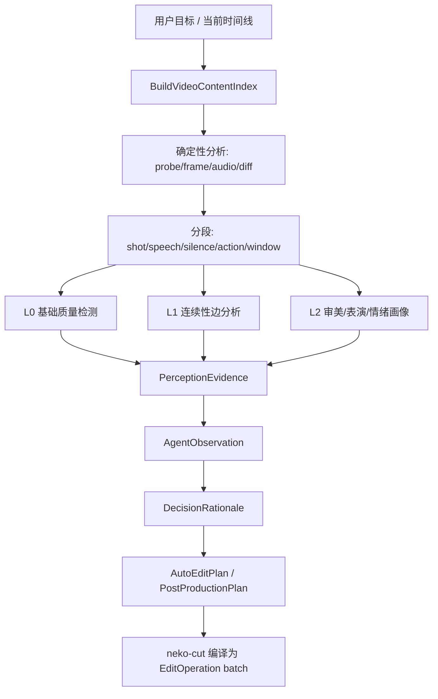

# Agent 视频内容理解与自动后期分析分层

**状态**: Proposed / Architecture Guidance  
**日期**: 2026-04-26  
**关联范围**: neko-agent · neko-cut · neko-engine · neko-client · neko-types  
**关联文档**:

- [Media Quality Assessment System](./media-quality-assessment.md)
- [Agent-First 多模态感知闭环路线图](./perception-first-roadmap.md)
- [Agent-First 多模态上下文解析与感知输入分层](./agent-first-multimodal-context-resolution.md)
- [创作一致性约束](./creative-consistency.md)
- [Agent 媒体架构](./agent-media-architecture.md)

---

## 1. 核心结论

Agent 自动剪辑与后期不能只依赖「单帧视觉描述」或「LLM 主观评价」。正确模型是把视频转换为可缓存、可引用、可审计的时间序列证据：

```text
素材 / 时间线
→ 确定性媒体分析
→ 时间分段与采样
→ 基础质量检测
→ 连续性与一致性分析
→ 审美 / 表演 / 情绪画像
→ AgentObservation + PerceptionEvidence
→ AutoEditPlan / PostProductionPlan
→ EditOperation batch
```

职责边界：

- **neko-engine**：负责可重复、确定性的底层媒体分析，例如 probe、帧抽取、关键帧、波形、响度、静音、diff、字幕/转写入口。
- **neko-cut**：负责把分析结果绑定到时间线 clip、track、range，并将后期计划编译为 `EditOperation batch`。
- **neko-agent**：负责理解用户目标、综合证据、解释变化、生成可审查计划；不直接修改 Webview Store，不直接信任单一模型判断。
- **neko-types / neko-proto**：承载跨层契约，所有时间码以 seconds 为主，与 timeline/proto 保持一致。

### 1.1 与 Quality Assessment / PerceptionEvidence 的关系

本文件描述的是**时间线级内容理解与自动后期决策**；[Media Quality Assessment System](./media-quality-assessment.md) 描述的是**素材级质量评估与一致性检测**。两者应串联，而不是互相替代：

```text
QualityCheck / QualityCheckConsistency
→ QualityReviewEvidence / PerceptionEvidence
→ AgentObservation
→ VideoContentIndex
→ DecisionRationale
→ AutoEditPlan / PostProductionPlan
```

约束：

- `QualityIssue` / `MediaEvaluation` 是素材级 QA 输出，不是 `VideoContentIndex` 的长期存储模型。
- `VideoContentIndex` 只消费归一化后的时间码证据，例如 `BasicQualityIssue`、`ContinuityEdge`、`TemporalProfile` 与 `AestheticEmotionProfile`。
- `QualityCheck` 分数与 `minScore` 不能单独作为自动剪辑阈值；它们只能作为 `PerceptionEvidence`，由 Agent 在目标语境下形成 `AgentObservation` 与 `DecisionRationale`。
- `QualityIssueCategory` 与本文件的编辑问题分类必须通过显式映射层转换，避免 `stuttering` / `stutter`、`jitter` / `flicker`、`color-distortion` / `color-shift` 等词表漂移直接进入编辑决策。
- 2026-05-04 P0 实现位置：归一化契约与 `VideoContentIndex` foundation 暂放在 `packages/neko-agent/packages/agent/src/validation/quality-evidence-normalizer.ts` 与 `video-content-index.ts`。当前消费者仍是 Agent feedback / validation；当 `neko-cut` 或其他包直接消费这些类型时，再提升到 `@neko/shared` 或 `neko-proto`。

---

## 2. 问题分层

视频自动后期需要从低到高分成三层。低层问题优先由确定性指标处理，高层问题必须结合目标意图与上下文解释。

### 2.1 L0 基础质量问题

这类问题通常可以用 Engine 或传统视觉/音频算法检测，适合作为自动修复或质量门禁的输入。

| 类别 | 典型问题 | 推荐证据 | 常见处理 |
| --- | --- | --- | --- |
| 编码与规格 | 分辨率过低、fps 异常、码率过低、时长不匹配 | probe、fps、bitrate、duration | 转码、替换素材、导出参数调整 |
| 清晰度 | 模糊、失焦、压缩块、过度锐化 | Laplacian/edge 指标、SSIM/PSNR、Vision evidence | 锐化、去噪、重新生成 |
| 曝光与色彩 | 过曝、欠曝、白平衡漂移、饱和度异常 | 亮度直方图、色温、肤色区域、clip ratio | 调色、曝光修正、LUT |
| 撕裂 | 画面水平错位、rolling tear、拼接断层 | 相邻扫描线位移、边缘不连续、帧内结构异常 | 重新导出、重新生成、降级处理 |
| 闪烁 | 亮度/色彩周期性跳变、AI 生成纹理闪烁 | 相邻帧亮度 delta、色彩 delta、区域 SSIM | deflicker、时间平滑、重新生成 |
| 卡顿 | 冻帧、掉帧、运动不均匀 | 重复帧检测、光流/运动量、pts gap | 补帧、重采样、重新渲染 |
| 音频技术 | 削波、响度不稳、静音过长、噪声 | LUFS、True Peak、LRA、silence regions、waveform | 归一化、ducking、降噪、剪静音 |
| 字幕/文本 | 字幕错位、缺失、遮挡、可读性差 | ASR segment、OCR/字幕轨、屏幕安全区 | 对齐、重排、样式调整 |

L0 的输出不应是「好/不好」，而应是带时间码的问题。若输入来自 `QualityCheck` 或 `QualityCheckConsistency`，必须先归一化为此类时间码问题，再进入 `VideoContentIndex`：

```ts
type BasicQualityIssueCategory =
  | 'tearing'
  | 'flicker'
  | 'stutter'
  | 'blur'
  | 'compression'
  | 'exposure'
  | 'color-shift'
  | 'audio-clipping'
  | 'loudness-off'
  | 'subtitle-misaligned';

interface BasicQualityIssue {
  id: string;
  start: number;
  end: number;
  category: BasicQualityIssueCategory;
  severity: 'critical' | 'major' | 'minor' | 'info';
  metrics: Record<string, number>;
  source: {
    toolName: 'QualityCheck' | 'QualityCheckConsistency' | string;
    sourceCategory?: string;
    sceneIndex?: number;
    sourceIssueId?: string;
    sourceTimeRange?: { start: number; end: number };
    toolCallId?: string;
    runId?: string;
  };
  location?: {
    sceneIndex?: number;
    timeRange?: { start: number; end: number };
    frameRange?: { start: number; end: number };
    region?: { x: number; y: number; width: number; height: number };
  };
  evidenceIds: string[];
  suggestedFixes: string[];
}
```

归一化建议：

| QA category | 编辑理解 category | 条件 |
| --- | --- | --- |
| `tearing` | `tearing` | 带有帧内结构错位、扫描线不连续或局部 diff 证据 |
| `jitter` | `flicker` | 主要表现为亮度、色彩或纹理高频跳变 |
| `stuttering` | `stutter` | 主要表现为重复帧、PTS gap、冻结区间或运动曲线异常 |
| `artifact` | `blur` / `compression` | 需要 Laplacian、edge、blockiness、SSIM/PSNR 等指标拆分 |
| `color-distortion` | `exposure` / `color-shift` | 需要亮度直方图、clip ratio、色温或色彩时间线指标拆分 |
| `audio-clipping` | `audio-clipping` | 需要 True Peak / waveform 证据 |
| `loudness-off` | `loudness-off` | 需要 LUFS / LRA / silence region 证据 |

`prompt-mismatch`、`script-mismatch`、`style-drift`、`character-inconsistency`、`composition-poor`、`motion-unnatural` 默认不是 L0 基础质量问题。它们应进入 L1 / L2 的连续性、审美、表演或叙事解释，除非已有明确时间码和可验证指标。

当前 P0 helper 名称：

- `normalizeQualityReviewPayload()`：将 `QualityCheck` / `QualityRepairCheck` evaluation summaries 归一化为 `BasicQualityIssue[]`、`sourceIssues` 与 `normalizationDiagnostics`；生产路径由 session feedback bridge 传入 tool call scene ranges，视频评估可用整段 duration fallback。
- `normalizeQualityConsistencyPayload()`：`QualityCheckConsistency` 的 `ConsistencyReport` 先由 session feedback bridge 适配为 consistency-mode evidence；仅在相邻 scene 且两侧时间范围存在时，将 style drift 归一化为 `continuityEdgeCandidates`；否则只保留 diagnostics，不凭空创建 edge。
- `createNormalizedQualityIssueId()` / `createContinuityEdgeId()` / `createVideoContentIndexId()`：基于 tool metadata、scene/time range、category 与 evidence ids 生成确定性 id。

### 2.2 L1 连续性与一致性问题

这类问题不是看单个片段，而是看相邻片段或前后版本之间的变化是否合理。

| 类别 | 典型问题 | 分析方式 |
| --- | --- | --- |
| 动作连续性 | 手势、走位、视线、身体方向突然跳变 | 相邻 segment 的主体姿态/位置/动作状态 diff |
| 角色一致性 | 脸、服装、发型、道具漂移 | identity embedding、CLIP/vision pair compare、Reference Chain |
| 场景一致性 | 地点、时间、光线方向、布景突然变化 | scene label、color profile、object set diff |
| 色彩连续性 | 同一场景内色温/黑位/饱和度突变 | per-segment color profile edge diff |
| 音频连续性 | 音量跳变、底噪断裂、BGM 突停、音频爆点 | loudness curve、waveform edge、music energy |
| 台词连续性 | 台词被截断、反应镜头过早切走 | ASR segment + cut point overlap |
| 节奏连续性 | 镜头长度突然过密或过慢，且无叙事理由 | shot length curve、beat alignment、motion energy |

连续性应建模为边，而不是点：

```ts
interface ContinuityEdge {
  fromSegmentId: string;
  toSegmentId: string;
  fromTime: number;
  toTime: number;
  visualDelta: number;
  semanticDelta: number;
  emotionDelta: number;
  audioDelta: number;
  rhythmDelta: number;
  issue?:
    | 'jump-cut'
    | 'action-discontinuity'
    | 'identity-drift'
    | 'color-pop'
    | 'audio-pop'
    | 'emotion-break'
    | 'rhythm-break';
  interpretation: string;
  intentionality: 'likely-intended' | 'likely-accidental' | 'unknown';
  evidenceIds: string[];
}
```

Agent 判断连续性时必须输入 `targetIntent`。同一个突变在「惊吓短片」中可能是意图，在「温暖广告片」中可能是问题。

### 2.3 L2 审美、表演、情绪问题

这类问题不能只靠阈值，需要由 Agent 综合视觉、音频、台词、叙事目标与用户偏好解释。

| 类别 | 关注点 | 推荐指标 |
| --- | --- | --- |
| 审美 | 构图、光线、色调、质感、空间层次、镜头语言 | composition、lighting、colorTone、texture、shotScale |
| 表演 | 表情、视线、头部姿态、身体动作、反应节奏 | face/action track、gaze、pose、reaction timing |
| 情绪 | 正负情绪、激烈程度、紧张感、亲密感、释放感 | valence、arousal、tension、intimacy、release |
| 叙事 | 重点是否突出、信息是否丢失、情绪弧线是否成立 | narrativeBeat、keyMoment、semanticCoverage |
| 品牌/风格 | 是否符合目标风格、是否高级、是否统一 | styleFit、paletteConsistency、transitionTaste |

推荐画像：

```ts
interface AestheticEmotionProfile {
  segmentId: string;
  start: number;
  end: number;
  aesthetics: {
    composition: string;
    lighting: string;
    colorTone: string;
    motion: string;
    rhythm: string;
    visualQuality: string;
  };
  performance?: {
    faceVisible: boolean;
    identityConsistency?: number;
    expressionIntensity?: number;
    gazeDirection?: string;
    headPose?: { yaw: number; pitch: number; roll: number };
    actionContinuity?: number;
  };
  emotion: {
    mood: string[];
    valence: number;
    arousal: number;
    tension: number;
    intimacy: number;
  };
  confidence: 'high' | 'medium' | 'low';
  evidenceIds: string[];
}
```

人脸情绪分析可以作为 evidence，但不能作为最终判断器。它适合补充「表演连续性」和「反应镜头选择」，不适合单独决定某段是否悲伤、紧张或高级。

---

## 3. 时间序列理解模型

自动剪辑需要建立 `VideoContentIndex`，而不是一次性总结整个视频。

```ts
interface VideoContentIndex {
  id: string;
  source: string;
  sourceKind: 'asset' | 'timeline-render' | 'clip-range';
  range?: { start: number; end: number };
  duration: number;
  segments: VideoSegment[];
  temporalProfiles: TemporalProfile[];
  continuityEdges: ContinuityEdge[];
  qualityIssues: BasicQualityIssue[];
  aestheticEmotionProfiles: AestheticEmotionProfile[];
  evidenceIds: string[];
  createdAt: number;
}

interface VideoSegment {
  id: string;
  start: number;
  end: number;
  basis: 'shot' | 'scene' | 'speech' | 'silence' | 'music' | 'action' | 'uniform-window';
  summary: string;
  entities: string[];
  actions: string[];
  transcriptRefs?: string[];
  confidence: 'high' | 'medium' | 'low';
  evidenceIds: string[];
}

interface TemporalProfile {
  time: number;
  segmentId?: string;
  color: {
    brightness: number;
    saturation: number;
    warmth: number;
    contrast: number;
  };
  motion: {
    intensity: number;
    stability: number;
  };
  audio: {
    loudness: number;
    silence: boolean;
    musicEnergy?: number;
  };
  semantic: {
    subjects: string[];
    action?: string;
    location?: string;
  };
  emotion?: {
    valence: number;
    arousal: number;
    tension: number;
  };
  evidenceIds: string[];
}
```

分析粒度：

- **短尺度**：0.5-2s，检测闪烁、撕裂、卡顿、音频爆点、动作断裂。
- **中尺度**：一个镜头、一句台词、一个动作，判断衔接、反应、节奏。
- **长尺度**：一个场景或整条片，判断情绪弧线、风格统一、叙事重点。

---

## 4. Agent 分析流程



推荐高层能力：

```ts
interface VideoUnderstandingTools {
  buildVideoContentIndex(input: {
    source: string;
    range?: { start: number; end: number };
    targetIntent?: string;
    depth: 'fast' | 'balanced' | 'deep';
  }): Promise<VideoContentIndex>;

  analyzeContinuity(input: {
    indexId: string;
    targetIntent?: string;
  }): Promise<{ edges: ContinuityEdge[] }>;

  compareVideoUnderstanding(input: {
    beforeIndexId: string;
    afterIndexId: string;
    targetIntent?: string;
  }): Promise<AestheticEmotionDeltaReport>;

  validateEditAgainstContent(input: {
    plan: AutoEditPlan | PostProductionPlan;
    indexId: string;
  }): Promise<EditContentValidationReport>;
}
```

Agent 使用规则：

1. 先理解目标，再分析视频；没有目标时只报告事实，不做创作倾向判断。
2. 所有问题必须带时间码、证据、置信度。
3. L0 可建议自动修复，但仍需通过 `DecisionRationale` 记录依据；L1 需要判断是否符合目标；L2 通常需要用户确认或可撤销计划。
4. 输出计划前先说明「为什么这里要剪/调/保留」。
5. 落地时由 `neko-cut` 生成 `EditOperation batch`，Agent 不直接写 `ProjectData`。
6. `QualityCheck` / `QualityCheckConsistency` 只能补充 evidence，不能替代 `AgentObservation`。

---

## 5. 低级问题检测策略

### 5.1 撕裂

检测信号：

- 单帧内水平边缘在上下区域出现不合理位移。
- 相邻扫描线/块之间结构不连续。
- 局部区域 SSIM 异常，但相邻帧全局运动不支持该变化。

输出：

```text
12.4s-12.9s: bottom third horizontal displacement, likely tearing.
```

处理建议：

- 若来自导出，优先重新导出或调整编码/硬件加速参数。
- 若来自生成素材，标记为 regenerate 或 frame interpolation candidate。
- 不建议用 LLM 单独判断撕裂，应以图像结构指标为主。

### 5.2 闪烁

检测信号：

- 相邻帧平均亮度、色温、饱和度出现高频波动。
- 背景或皮肤区域的局部颜色周期性跳变。
- 语义内容稳定但纹理/光照快速变化。

处理建议：

- 对真实素材：deflicker、曝光平滑。
- 对 AI 生成素材：重新生成、加强 temporal consistency prompt、降低过强风格化。
- 对调色后时间线：检查 LUT/keyframe 是否跨 clip 不一致。

### 5.3 卡顿 / 冻帧

检测信号：

- 连续帧 SSIM 过高但音频/时间戳继续推进。
- PTS gap 或重复帧数量异常。
- 运动曲线出现不合理停顿。

处理建议：

- 补帧、重采样 fps、重新渲染。
- 如果停顿发生在情绪反应点，Agent 应结合目标判断是否保留。

---

## 6. 高级变化解释

审美与情绪变化应生成 delta，而不是单点评分。

```ts
interface AestheticEmotionDeltaReport {
  beforeIndexId: string;
  afterIndexId: string;
  targetIntent?: string;
  changes: Array<{
    start: number;
    end: number;
    dimension:
      | 'composition'
      | 'lighting'
      | 'colorTone'
      | 'rhythm'
      | 'performance'
      | 'valence'
      | 'arousal'
      | 'tension'
      | 'intimacy';
    before: string | number;
    after: string | number;
    interpretation: string;
    impact: 'improves-target' | 'hurts-target' | 'neutral' | 'unknown';
    confidence: 'high' | 'medium' | 'low';
    evidenceIds: string[];
  }>;
}
```

示例解释：

```text
12.0s-16.8s: 调色后亮度提升、色温转暖、阴影减少。
情绪曲线 valence 上升，tension 下降。
若目标是“温暖广告片”，变化符合目标；若目标是“悬疑压迫”，变化削弱目标。
```

```text
23.2s-25.8s: 主角 closeup 中 expressionIntensity 上升，语音停顿 1.1s，
BGM energy 下降。判断为情绪低点，建议保留完整反应，不要在 24.0s 切走。
```

---

## 7. FFmpeg-backed 媒体操作矩阵

`neko-engine` 需要支持 FFmpeg / ffprobe 能力，但公开层应是结构化领域 API。Agent、Cut、VLM 不应直接拼接或执行原生命令。

### 7.1 基础原则

不暴露：

```text
runFfmpegRaw("ffmpeg -i input.mp4 -vf ... output.mp4")
```

暴露：

```text
probeDetailed(source)
detectSceneChanges(source, { threshold })
extractFrameBatch(source, { times })
detectFreeze(source, { duration })
analyzeLoudness(source, { targetLufs })
```

原因：

- 避免 shell 注入、任意路径读写与 filtergraph 滥用。
- 保持跨平台输出稳定。
- 方便缓存、取消、进度、超时、错误分类和测试。
- 让 Agent 只理解业务语义，不理解 FFmpeg 参数细节。

### 7.2 操作映射表

| 需求 | FFmpeg / ffprobe 典型操作 | Engine API | 优先级 |
| --- | --- | --- | --- |
| 媒体信息 | `ffprobe -show_format -show_streams` | `probeDetailed()` | P0 |
| 简版媒体信息 | `ffprobe -show_entries format=duration,size,bit_rate` | `probe()` | 已有 / P0 |
| 帧时间码 | `ffprobe -show_frames` / `showinfo` | `inspectFrames()` | P0 |
| 关键帧 | `ffprobe -skip_frame nokey` | `getKeyframes()` | 已有 / P0 |
| 场景切分 | `select='gt(scene,0.25)',showinfo` | `detectSceneChanges()` / `detectShots()` | P0 |
| 抽帧 | `-ss ... -frames:v 1` | `extractFrame()` / `extractFrameBatch()` | 已有 / P0 |
| 缩略图 | `thumbnail`, `fps`, `scale` | `generateThumbnails()` | P1 |
| 黑场 | `blackdetect` / `blackframe` | `detectBlackFrames()` | P1 |
| 冻帧 / 卡顿 | `freezedetect` | `detectFreeze()` | P1 |
| 闪烁 | 帧亮度统计、`signalstats` | `analyzeFlicker()` | P1 |
| 色彩 / 亮度 | `signalstats`, `histogram`, `vectorscope` | `analyzeColorTimeline()` | P1 |
| 音频响度 | `ebur128`, `loudnorm` | `analyzeLoudness()` | 已有 / P0 |
| 静音 | `silencedetect` | `detectSilence()` | 已有 / P0 |
| 波形 | PCM decode / `astats` | `waveform()` / `analyzeAudioStats()` | 已有 / P0 |
| 音频频谱 | `showspectrumpic`, FFT | `analyzeSpectrum()` | P2 |
| 转写前处理 | `-vn -ac 1 -ar 16000` | `extractSpeechAudio()` | P1 |
| 字幕提取 | `-map 0:s` / subtitle decoder | `extractSubtitles()` | P1 |
| OCR 前处理 | 抽帧 + crop / scale | `prepareOcrFrames()` | P2 |
| 画质对比 | `ssim`, `psnr`, `blend=difference` | `diffVideo()` | 已有 / P0 |
| 裁切检测 | `cropdetect` | `detectCrop()` | P2 |
| 黑边检测 | `cropdetect` / 图像边缘统计 | `detectLetterbox()` | P1 |
| 稳定性 | 帧间运动 / 光流 / vidstab | `analyzeStability()` | P2 |
| 转码 | `-c:v ... -c:a ...` | `transcode()` | P2 |
| 片段裁切 | `-ss -to -c copy` 或重编码 | `trimMedia()` | P2 |
| 合并 / 拼接 | concat demuxer / filter | `concatMedia()` | P2 |
| 音画分离 | `-map 0:v` / `-map 0:a` | `demuxStreams()` | P2 |
| 重新封装 | `-c copy` | `remux()` | P2 |
| 代理文件 | scale + low bitrate | `createProxy()` | P2 |

### 7.3 结构化结果示例

```ts
interface SceneChange {
  frame: number;
  time: number;
  score: number;
}

interface DetectSceneChangesResult {
  source: string;
  threshold: number;
  changes: SceneChange[];
}

interface FreezeDetectionResult {
  regions: Array<{
    start: number;
    end: number;
    duration: number;
    confidence: number;
  }>;
}

interface FlickerAnalysis {
  regions: Array<{
    start: number;
    end: number;
    severity: 'minor' | 'major' | 'critical';
    brightnessDelta: number;
    colorDelta: number;
  }>;
}
```

### 7.4 受限 Escape Hatch

如需支持高级 FFmpeg filter，应提供白名单 job，而不是任意命令字符串：

```ts
interface MediaAnalysisJob {
  operation:
    | 'scene-detect'
    | 'black-detect'
    | 'freeze-detect'
    | 'loudness'
    | 'silence'
    | 'ssim'
    | 'psnr';
  source: string;
  params: Record<string, unknown>;
  timeoutMs?: number;
}
```

约束：

- `operation` 必须是白名单。
- 输入输出路径必须走 `PathResolver`。
- 必须支持 timeout、cancel、progress。
- 输出必须被解析为结构化 JSON。
- 默认不向 Agent ReAct 暴露。

---

## 8. 2D / 3D / XR Runtime 是否也需要类似操作

需要。只是它们不叫 FFmpeg 操作，而应是 runtime 原生的 **probe / inspect / sample / render / diff / validate / bake** 操作。

媒体文件的核心对象是「帧、音频、字幕」。2D / 3D / XR 的核心对象则是「场景图、层级、骨骼、参数曲线、材质、相机、光照、空间锚点、行为图」。Agent 自动编辑这些对象时，同样需要结构化证据，而不是让 VLM 只看一张截图。

### 8.1 共性能力

| 能力 | 目的 | 典型输出 |
| --- | --- | --- |
| `probeRuntimeAsset()` | 读取资产规格、依赖、版本、能力 | format、nodes、animations、materials、constraints |
| `inspectSceneGraph()` | 暴露层级、可见性、transform、绑定关系 | node tree、world transforms |
| `sampleAnimation()` | 按时间采样姿态、参数、事件 | sampled pose / params / events |
| `renderDiagnosticFrames()` | 给 VLM 和审查工具提供带时间码截图 | frame refs + camera metadata |
| `diffRuntimeState()` | 比较修改前后状态变化 | transform/material/pose/behavior diff |
| `validateRuntimeContinuity()` | 检查动作、表情、相机、空间连续性 | continuity issues |
| `validatePerformanceBudget()` | 检查多边形、材质、骨骼、特效、帧预算 | budget report |
| `bakeRuntimeArtifact()` | 把设计期结果烘焙为运行时可加载产物 | baked animation / behavior / cache |

### 8.2 2D Puppet / Sketch

2D 运行时需要类似操作，重点不是帧级视频质量，而是图层、参数、形变和表情连续性。

| 需求 | Runtime API | 说明 |
| --- | --- | --- |
| 资产探测 | `probePuppet()` / `probeSketch()` | 参数数量、节点层级、贴图、动画片段 |
| 参数快照 | `inspectPuppetParams()` | 当前 Live2D/Inochi2D 参数、范围、默认值 |
| 表情采样 | `samplePuppetExpression(time)` | mouth/eye/brow/head 参数曲线 |
| 动画曲线 | `inspectParameterCurves(clip)` | keyframes、easing、循环、突变 |
| 形变异常 | `detectPuppetDeformationIssues()` | mesh 拉伸、穿帮、遮挡、变形过度 |
| 口型同步 | `validateLipSync(audio, clip)` | phoneme/viseme 与 mouth 参数对齐 |
| 表演连续性 | `validateExpressionContinuity()` | 表情跳变、眨眼异常、视线断裂 |
| 图层一致性 | `diffSketchLayers()` | 图层增删、mask、blend、颜色变化 |

推荐证据：

- 参数曲线 delta。
- 渲染快照。
- 口型 / 语音时间码。
- face / gaze / pose ONNX 结果作为可选 evidence。

### 8.3 3D Scene / Model

3D 运行时需要几何、材质、骨骼、相机和性能层面的结构化分析。

| 需求 | Runtime API | 说明 |
| --- | --- | --- |
| 资产探测 | `probeSceneAsset()` | glTF/VRM、mesh、material、texture、animation |
| 场景图 | `inspectSceneGraph()` | node hierarchy、world transform、visibility |
| 几何质量 | `analyzeMeshQuality()` | triangle count、non-manifold、degenerate、UV、normal |
| 材质质量 | `analyzeMaterialQuality()` | PBR 参数、贴图缺失、色彩空间、分辨率 |
| 骨骼绑定 | `inspectSkeleton()` / `validateSkinning()` | bone hierarchy、weights、retarget readiness |
| 动画采样 | `sampleAnimationClip()` | joints、root motion、events、curve discontinuity |
| 碰撞/穿模 | `detectIntersections()` | mesh/character/prop penetration |
| 相机连续性 | `validateCameraPath()` | 速度、加速度、FOV、cut、遮挡 |
| 光照连续性 | `analyzeLightingContinuity()` | key light、exposure、shadow、environment |
| 性能预算 | `validateRenderBudget()` | draw calls、texture memory、skin bones、shader cost |

VLM 在 3D 中主要分析 render snapshot 的构图、审美和叙事；几何、材质、骨骼、性能必须由 runtime/engine 提供确定性证据。

### 8.4 XR Runtime

XR 更需要类似操作，但必须遵守 Authoring Plane / Runtime Plane 分离：AI 只能设计期或事后分析，不能进入 headset frame loop。

| 需求 | Runtime API | 说明 |
| --- | --- | --- |
| 空间探测 | `inspectSpatialAnchors()` | anchor pose、persistence、tracking quality |
| 世界理解 | `inspectWorldMesh()` / `inspectPlanes()` | floor/wall/table、mesh density、semantic label |
| 输入采样 | `sampleHandJoints()` / `sampleGazeRay()` | hand pose、gesture、gaze confidence |
| 舒适性检查 | `validateComfortPolicy()` | vection、FOV clip、acceleration、height changes |
| 帧预算 | `analyzeFrameBudget()` | render/physics/audio overshoot |
| 遮挡一致性 | `validateOcclusion()` | virtual-real occlusion、depth conflicts |
| 行为图检查 | `lintBehaviorGraph()` | cycles、unsafe action、unbounded trigger |
| 运行时回放 | `replayRuntimeTrace()` | 将 tracking / comfort / frame events 回放给 Agent 审查 |

XR 的关键规则：

- Runtime plane 自己处理硬实时 fallback，例如降 LOD、重置 anchor、fade-out。
- Authoring plane 只接收异步 trace / evidence。
- Agent 可以修改 BehaviorGraph 或场景预算，但不能在每帧决定角色行为。

### 8.5 工具 / VLM / ONNX 分工

| 对象 | 工具 / Runtime | ONNX / 本地模型 | VLM |
| --- | --- | --- | --- |
| 2D Puppet | 参数、曲线、形变、渲染快照 | face、gaze、pose、viseme | 表情语义、表演评价、镜头审美 |
| 3D Scene | mesh、material、skeleton、camera、light、budget | pose、depth、segmentation、tracking | 构图、空间叙事、风格与情绪 |
| XR | anchors、hands、gaze、world mesh、comfort、frame budget | hand gesture、scene segmentation、depth | 场景可读性、交互意图、舒适性解释 |

结论：2D/3D/XR 都需要类似 FFmpeg-backed 媒体操作的结构化 runtime 操作。不同点是：媒体操作围绕时间码和帧，2D/3D/XR 操作围绕状态图、参数曲线、空间关系和运行时预算。

---

## 9. 测试与验收

### 9.1 单元测试

- L0 指标阈值：闪烁、撕裂、卡顿、响度、静音。
- 分段合并：speech/silence/shot/window 的边界合并。
- `VideoContentIndex` schema 验证。
- `ContinuityEdge` intentionality 推断规则。

### 9.2 黄金样例

建立小型 fixture 集：

- 正常素材 vs 闪烁素材。
- 正常运动 vs 冻帧/卡顿。
- 同场景连续调色 vs 色彩突变。
- 正常台词剪辑 vs 台词被截断。
- 情绪逐渐升高 vs 情绪断裂。

### 9.3 集成测试

- `BuildVideoContentIndex` 对同一输入幂等。
- `CompareVideoUnderstanding` 能定位修改前后变化时间段。
- `ValidateEditAgainstContent` 能阻止高风险 cut point。
- `ApplyContentAwareEditPlan` 输出 `EditOperation batch` 并可 `invertOperation`。

---

## 10. 分阶段落地

### P0: 基础质量与时间码证据

- 已建立 Agent-local `VideoContentIndex` P0 schema / builder / validator；Engine-backed analyzer 仍以后续 facade 填充。
- 已通过 `QualityReviewEvidence` 产出 `BasicQualityIssue[]` 归一化数据与 `PerceptionEvidence`。
- 支持撕裂、闪烁、卡顿、响度、静音、模糊的最小检测。
- 将 `QualityIssue` / `ConsistencyReport` 显式归一化为带时间码的 `BasicQualityIssue` 或 `ContinuityEdge`。
- 当前 `QualityCheck` 只读且不再默认 retry；显式再生成修复走 `QualityRepairCheck`。

### P1: 连续性分析

- 建立 `TemporalProfile` 与 `ContinuityEdge`。
- 支持色彩连续性、音频连续性、台词切断、动作切断、节奏突变。
- 引入 `targetIntent` 判断突变是否可能是创作意图。

### P2: 审美 / 表演 / 情绪画像

- 建立 `AestheticEmotionProfile`。
- 引入 face/performance track 作为可选 evidence。
- 生成 valence/arousal/tension/intimacy 曲线。

### P3: 自动后期闭环

- Agent 从 `VideoContentIndex` 生成 `AutoEditPlan` / `PostProductionPlan`。
- `neko-cut` 编译为 `EditOperation batch`。
- 渲染前后对比，生成 `AestheticEmotionDeltaReport` 与质量回归报告。

---

## 11. 非目标

- 不让 Agent 直接调用底层媒体 API 作为主路径。
- 不把 LLM 的单次视觉描述当作质量结论。
- 不把 `QualityCheck` 分数或 `minScore` 当作自动剪辑的唯一质量门槛。
- 不用人脸情绪分类替代整体情绪判断。
- 不通过 Webview postMessage 承担核心分析或计划应用。
- 不在 `neko-agent` 内重复实现 Rust/Engine 已有的媒体计算能力。
