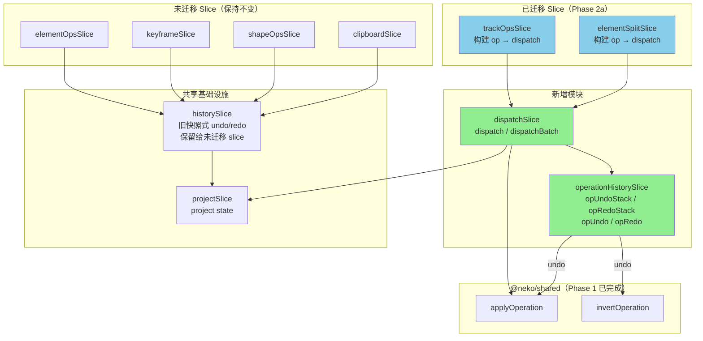

# EditOperation 阶段 2：neko-cut 双轨运行 — 实施计划

## 现状分析

### 当前架构

```
UI action → slice method → pushHistory(structuredClone(project)) → 直接 set({ project: ... })
```

- 12 个 slice 通过 Zustand Slices Pattern 组合为扁平 store
- 所有 mutation slice 依赖 `HistoryDependency.pushHistory` 保存全量快照
- slice 之间通过 `get()` 直接访问彼此的 state 和 action
- `ElementSplitSlice` 调用 `ElementOps.updateElement/addElement`（间接依赖链）

### 目标架构

```
UI action → 构建 EditOperation（含 before 快照）→ dispatch(op) → applyOperation → set() + 操作历史
```

### 关键约束

1. **EditorElement ≠ TimelineElement**：webview 的 `TimelineElement` 实际是 `EditorElement`，扩展了 `animTransform`, `masks`, `shapes` 等 UI-only 字段。`applyOperation` 操作的是 `@neko/shared` 的 `TimelineElement`，但 store 中存储的是 `EditorElement`。由于 `EditorElement extends TimelineElement`，`applyOperation` 的不可变更新（spread）会保留 UI 扩展字段，无需特殊处理。
2. **渐进式迁移**：未迁移的 slice 仍使用旧的 `pushHistory` + 直接 `set()`，两套机制需共存。
3. **防抖语义变化**：旧模式防抖的是快照保存，新模式需要防抖操作合并（同属性连续 update 合并为一个操作，保留首个 before + 最新 updates）。

## 架构图



## 实施步骤

### 步骤 1：新增 dispatchSlice — 操作分发中心

**新增文件**: `neko-cut/packages/webview/src/stores/slices/dispatchSlice.ts`

核心职责：
- 提供 `dispatch(op: EditOperation)` 方法
- 调用 `applyOperation(project, op)` 计算新 project
- 将 op 推入 `operationHistory` 的 undoStack
- 调用 `set({ project: newProject })`
- 提供 `dispatchBatch(ops: EditOperation[])` 将多个操作包装为 `BatchOperation`

```typescript
// 接口设计
export interface DispatchSlice {
  /** 分发单个操作 */
  dispatch: (op: EditOperation) => void;
  /** 分发批量操作（原子） */
  dispatchBatch: (ops: EditOperation[]) => void;
}
```

依赖：`ProjectDependency` + `OperationHistoryDependency`

### 步骤 2：新增 operationHistorySlice — 操作式 undo/redo

**新增文件**: `neko-cut/packages/webview/src/stores/slices/operationHistorySlice.ts`

核心职责：
- 维护 `opUndoStack: EditOperation[]` 和 `opRedoStack: EditOperation[]`
- `pushOperation(op)` — 推入 undoStack，清空 redoStack
- `opUndo()` — 从 undoStack 弹出 op，调用 `invertOperation(op)` + `applyOperation`，推入 redoStack
- `opRedo()` — 从 redoStack 弹出 op，调用 `applyOperation`，推入 undoStack
- 最大容量 200 个操作

```typescript
export interface OperationHistorySlice {
  opUndoStack: EditOperation[];
  opRedoStack: EditOperation[];
  pushOperation: (op: EditOperation) => void;
  opUndo: () => void;
  opRedo: () => void;
  clearOpHistory: () => void;
}
```

依赖：`ProjectDependency`

**双轨 undo/redo 策略**：
- 旧 `historySlice` 的 `undo()/redo()` 保留，供未迁移 slice 使用
- 新 `operationHistorySlice` 的 `opUndo()/opRedo()` 供已迁移 slice 使用
- UI 层的 Ctrl+Z/Ctrl+Y 需要判断：如果 `opUndoStack` 非空则优先 `opUndo()`，否则 fallback 到旧 `undo()`
- 当一个 slice 迁移后，它产生的操作进入 `opUndoStack`；旧 slice 的操作仍进入旧 `history[]`

### 步骤 3：迁移 trackOpsSlice（9 个 action）

**修改文件**: `neko-cut/packages/webview/src/stores/slices/trackOpsSlice.ts`

迁移模式（以 `addTrack` 为例）：

```typescript
// 迁移前
addTrack: (type, name) => {
  const { project, pushHistory } = get();
  if (!project) return '';
  pushHistory(project);
  const newTrack = { id: generateId(), ... };
  set({ project: { ...project, tracks: [...project.tracks, newTrack] } });
  return newTrack.id;
}

// 迁移后
addTrack: (type, name) => {
  const { project, dispatch } = get();
  if (!project) return '';
  const newTrack = { id: generateId(), ... };
  dispatch({
    type: 'track.add',
    meta: createMeta('user'),
    payload: { track: newTrack },
  });
  return newTrack.id;
}
```

9 个 action 的映射：

| 旧 Action | EditOperation | before 捕获 |
|-----------|---------------|-------------|
| `addTrack(type, name)` | `track.add` | 无需 before |
| `removeTrack(trackId)` | `track.remove` | `{ track, index }` |
| `updateTrack(trackId, updates)` | `track.update` | `pickKeys(track, updates)` |
| `reorderTracks(src, dst)` | `track.reorder` | 无需 before（from/to 互换即逆操作） |
| `reorderTrack(trackId, newIndex)` | `track.reorder` | 同上 |
| `moveTrackUp(trackId)` | `track.reorder` | 同上 |
| `moveTrackDown(trackId)` | `track.reorder` | 同上 |
| `toggleTrackLocked(trackId)` | `track.toggle` | `{ value: track.locked }` |
| `toggleTrackHidden(trackId)` | `track.toggle` | `{ value: track.hidden }` |

依赖变化：`HistoryDependency` → `DispatchDependency`

### 步骤 4：迁移 elementSplitSlice（3 个 action）

**修改文件**: `neko-cut/packages/webview/src/stores/slices/elementSplitSlice.ts`

关键变化：
- 不再调用 `ElementOps.updateElement/addElement`，直接构建 `ElementSplitOperation` 交给 `dispatch`
- `splitAtPlayhead` 需要预先生成右半部分元素的完整数据（含新 ID）

| 旧 Action | EditOperation | before 捕获 |
|-----------|---------------|-------------|
| `splitAtPlayhead` | `element.splitAt` | `{ trimEnd: element.trimEnd }` |
| `splitAndKeepLeft` | `element.splitKeepLeft` | `{ trimEnd, name }` |
| `splitAndKeepRight` | `element.splitKeepRight` | `{ startTime, trimStart, name }` |

依赖变化：移除 `ElementOpsDependency`，改为 `DispatchDependency`

### 步骤 5：新增 createMeta 工具函数

**新增文件**: `neko-cut/packages/webview/src/stores/utils/operation-helpers.ts`

```typescript
import { generateId } from '../../utils';
import type { OperationMeta, OperationSource } from '@neko/shared';

export function createMeta(source: OperationSource = 'user', description?: string): OperationMeta {
  return {
    id: generateId(),
    timestamp: Date.now(),
    source,
    description,
  };
}
```

### 步骤 6：修改 editor-store.ts 注册新 slice

**修改文件**: `neko-cut/packages/webview/src/stores/editor-store.ts`

```typescript
// 新增 import
import { OperationHistorySlice, createOperationHistorySlice } from './slices/operationHistorySlice';
import { DispatchSlice, createDispatchSlice } from './slices/dispatchSlice';

// EditorStore 类型追加
export type EditorStore =
  & ProjectSlice
  & ...
  & OperationHistorySlice
  & DispatchSlice;

// create 中追加（在 historySlice 之后、trackOpsSlice 之前）
...createOperationHistorySlice(set, get, store),
...createDispatchSlice(set, get, store),
```

### 步骤 7：UI 层 undo/redo 适配

**修改文件**: `neko-cut/packages/webview/src/hooks/useKeyboardShortcuts.ts`

当前 Ctrl+Z/Shift+Ctrl+Z 处理（第 98-107 行）：
```typescript
case 'z':
  if (isMeta) {
    e.preventDefault();
    if (e.shiftKey) { redo(); } else { undo(); }
  }
  break;
```

迁移后：
```typescript
case 'z':
  if (isMeta) {
    e.preventDefault();
    if (e.shiftKey) {
      // 优先检查操作式 redo，fallback 到快照式
      opRedoStack.length > 0 ? opRedo() : redo();
    } else {
      opUndoStack.length > 0 ? opUndo() : undo();
    }
  }
  break;
```

注意：该文件第 182-213 行的 `S` 键分割逻辑也直接调用了 `pushHistory` + `updateElement` + `addElement`，这是 `splitAtPlayhead` 的内联重复实现。迁移后应改为调用 `splitAtPlayhead`，由 elementSplitSlice 内部构建 EditOperation。
```

## 新增/修改文件清单

```
新增:
  webview/src/stores/slices/dispatchSlice.ts
  webview/src/stores/slices/operationHistorySlice.ts
  webview/src/stores/utils/operation-helpers.ts

修改:
  webview/src/stores/editor-store.ts          — 注册新 slice
  webview/src/stores/slices/trackOpsSlice.ts  — 迁移到 dispatch
  webview/src/stores/slices/elementSplitSlice.ts — 迁移到 dispatch
  webview/src/hooks/useKeyboardShortcuts.ts    — 双轨 undo/redo + S 键分割重构
```

## 双轨运行期间的约束

1. **已迁移 slice** 的操作通过 `dispatch()` → `opUndoStack`，用 `opUndo()/opRedo()` 撤销
2. **未迁移 slice** 的操作通过 `pushHistory()` → 旧 `history[]`，用旧 `undo()/redo()` 撤销
3. 两套历史栈独立，不会交叉
4. 如果用户先做了一个 track 操作（进入 opUndoStack），再做了一个 keyframe 操作（进入旧 history），Ctrl+Z 会先检查 opUndoStack（按时间戳判断哪个更新），确保 undo 顺序正确

## 验证方式

1. 迁移后的 `trackOpsSlice` 所有 action 功能不变
2. `elementSplitSlice` 所有 action 功能不变
3. `opUndo()/opRedo()` 正确恢复 track 和 split 操作
4. 未迁移 slice 的旧 `undo()/redo()` 不受影响
5. 使用 Chrome DevTools MCP 进行功能验证和截图

## 关键设计决策

| 决策 | 选择 | 理由 |
|------|------|------|
| 双轨 undo/redo | 两套独立历史栈 | 渐进式迁移，不破坏未迁移 slice |
| dispatch 位置 | 独立 slice | 符合现有 Zustand Slices Pattern |
| undo 优先级 | 按时间戳判断 | 确保跨系统操作的 undo 顺序正确 |
| ElementSplitSlice 解耦 | 移除 ElementOpsDependency | 直接构建 op，不再间接调用 ElementOps |
| createMeta 工具函数 | 独立文件 | 所有迁移后的 slice 共用 |
