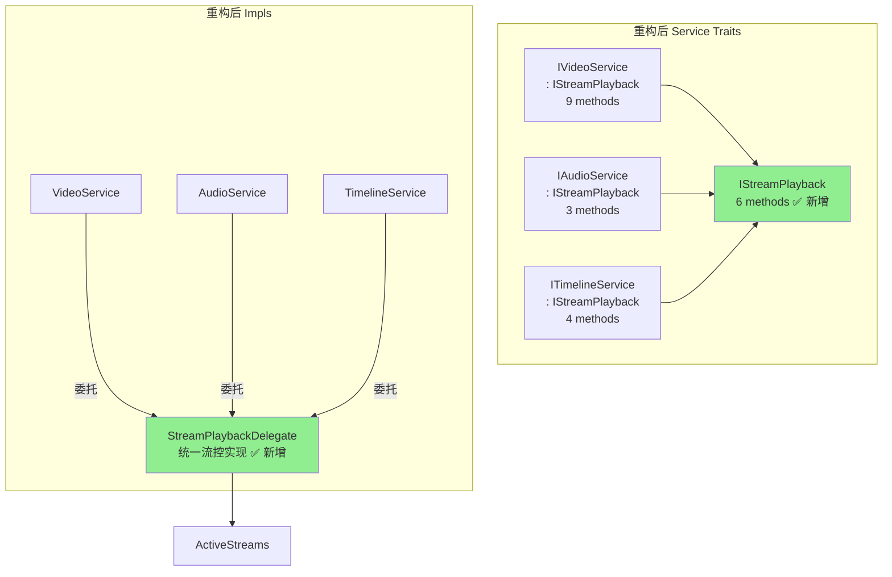

# 重构计划：提取 IStreamPlayback + 修复 seek bug + 统一 Controller 流控制

## 问题概述

1. **Bug**: `VideoService::seek` 缺少 `seek_seq += 1`，导致重复 seek 被忽略
2. **ISP 违反**: 6 个流控方法在 3 个 trait 中完全重复（18 个方法定义 + 18 个 copy-paste 实现）
3. **Controller 重复**: 3 个 Controller 各自定义相同的 `StreamControlOptions` 和相同的流控 handler 逻辑

## 重构方案

### 阶段 1：修复 Bug（VideoService.seek）

**文件**: `native-core/src/services/impls/video.rs`

```rust
// 修复前
async fn seek(&self, stream_id: &StreamId, time_seconds: f64) -> Result<()> {
    self.active_streams
        .update_state(stream_id, |s| s.seek_to = Some(time_seconds))
        .await
}

// 修复后
async fn seek(&self, stream_id: &StreamId, time_seconds: f64) -> Result<()> {
    self.active_streams
        .update_state(stream_id, |s| {
            s.seek_to = Some(time_seconds);
            s.seek_seq += 1;
        })
        .await
}
```

### 阶段 2：提取 IStreamPlayback trait + StreamPlaybackDelegate

#### 2.1 新建 `services/playback.rs` — IStreamPlayback trait

```rust
pub trait IStreamPlayback: Send + Sync {
    async fn stop_stream(&self, stream_id: &StreamId) -> Result<()>;
    async fn pause(&self, stream_id: &StreamId) -> Result<()>;
    async fn resume(&self, stream_id: &StreamId) -> Result<()>;
    async fn set_speed(&self, stream_id: &StreamId, speed: f64) -> Result<()>;
    async fn seek(&self, stream_id: &StreamId, time_seconds: f64) -> Result<()>;
    async fn set_loop(&self, stream_id: &StreamId, region: Option<LoopRegion>) -> Result<()>;
}
```

#### 2.2 在 `stream_loop.rs` 中添加 `StreamPlaybackDelegate`

```rust
pub struct StreamPlaybackDelegate {
    active_streams: Arc<ActiveStreams>,
}

impl StreamPlaybackDelegate {
    pub fn new(active_streams: Arc<ActiveStreams>) -> Self { ... }
    pub async fn stop_stream(&self, stream_id: &StreamId) -> Result<()> { ... }
    pub async fn pause(&self, stream_id: &StreamId) -> Result<()> { ... }
    pub async fn resume(&self, stream_id: &StreamId) -> Result<()> { ... }
    pub async fn set_speed(&self, stream_id: &StreamId, speed: f64) -> Result<()> { ... }
    pub async fn seek(&self, stream_id: &StreamId, time_seconds: f64) -> Result<()> { ... }
    pub async fn set_loop(&self, stream_id: &StreamId, region: Option<LoopRegion>) -> Result<()> { ... }
}
```

#### 2.3 修改三个 Service trait

- `IVideoService`: 移除 6 个流控方法，改为继承 `IStreamPlayback`
- `IAudioService`: 移除 6 个流控方法，改为继承 `IStreamPlayback`
- `ITimelineService`: 移除 6 个流控方法，改为继承 `IStreamPlayback`

#### 2.4 修改三个 Service impl

- 三个 impl 中的流控方法统一委托给 `StreamPlaybackDelegate`
- `TimelineService::stop_stream` 保留额外的 stats_receivers 清理逻辑

### 阶段 3：统一 Controller 层流控制

#### 3.1 在 `controllers/utils.rs` 中添加公共类型和函数

```rust
pub struct StreamControlOptions { ... }  // 统一的流控选项

pub async fn handle_stream_control(
    playback: &dyn IStreamPlayback,
    action: &str,
    options: Value,
    group_name: &str,
) -> ApiResult<ActionResponse> { ... }
```

#### 3.2 修改三个 Controller

- 删除各自的 `VideoStreamControlOptions` / `AudioStreamControlOptions` / `StreamControlOptions`
- `stop|pause|resume|speed|seek|loop` 分支统一调用 `handle_stream_control`

## 变更文件清单

| 文件 | 变更类型 |
|------|---------|
| `native-core/src/services/playback.rs` | 新建 |
| `native-core/src/services/mod.rs` | 修改（添加 playback 模块导出） |
| `native-core/src/services/video.rs` | 修改（继承 IStreamPlayback） |
| `native-core/src/services/audio.rs` | 修改（继承 IStreamPlayback） |
| `native-core/src/services/timeline.rs` | 修改（继承 IStreamPlayback） |
| `native-core/src/services/impls/stream_loop.rs` | 修改（添加 StreamPlaybackDelegate） |
| `native-core/src/services/impls/video.rs` | 修改（修复 bug + 委托流控） |
| `native-core/src/services/impls/audio.rs` | 修改（委托流控） |
| `native-core/src/services/impls/timeline.rs` | 修改（委托流控） |
| `native-core/src/lib.rs` | 修改（prelude 添加 IStreamPlayback） |
| `native-api/src/controllers/utils.rs` | 修改（添加公共流控处理） |
| `native-api/src/controllers/video.rs` | 修改（使用公共流控） |
| `native-api/src/controllers/audio.rs` | 修改（使用公共流控） |
| `native-api/src/controllers/timeline.rs` | 修改（使用公共流控） |

## 架构变化图


