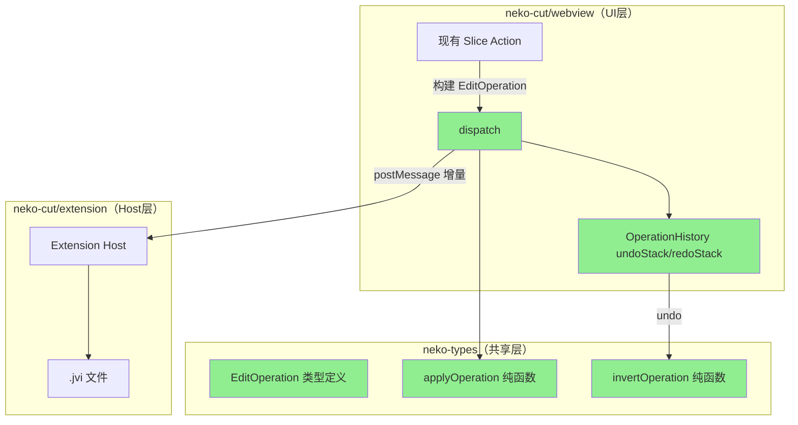

# EditOperation 指令序列系统 — 实施计划

> 最后更新：2026-02-24

## Context

当前 neko-cut 编辑器采用全量快照模式管理 undo/redo：每次操作前 `structuredClone(ProjectData)` 保存到 history 栈（最多 50 个），保存时全量 JSON 序列化写入 `.jvi` 文件。这导致：
- 内存开销 O(n × ProjectSize)，大项目下 50 个全量克隆占用显著
- 无法描述"发生了什么"，只知道状态变成了什么
- Extension ↔ Webview 只能全量同步 ProjectData
- AI Action 无法生成结构化的编辑指令

**目标**：引入 EditOperation 指令序列系统，用轻量操作对象替代全量快照，支持精确 undo/redo、增量同步、AI 操作审计。

---

## 总体进度

| 阶段 | 描述 | 状态 | 进度 |
|------|------|------|------|
| 阶段 1 | neko-types 基础设施 | ✅ 已完成 | 100% |
| 阶段 2 | neko-cut 双轨运行 | ✅ 已完成 | 100% (6/6 slice) |
| 阶段 3 | 全面切换 | ✅ 已完成 | 100% |
| 阶段 4 | 增量同步 (Extension ↔ Webview) | ✅ 已完成 | 100% |
| 阶段 4B | Rust 引擎增量同步 | ✅ 已完成 | 100% |

---

## 架构图



---

## 阶段 1：neko-types 基础设施 ✅ 已完成

在 `neko-types/src/operations/` 下创建纯函数层，不改动任何 neko-cut 代码。

### 文件清单

```
packages/neko-types/src/
├── operations/
│   ├── index.ts              # 统一导出                           ✅
│   ├── types.ts              # EditOperation 所有类型定义（29 种） ✅
│   ├── apply.ts              # applyOperation 入口 + 辅助函数     ✅
│   ├── apply-track.ts        # 轨道操作 apply（5 种）              ✅
│   ├── apply-element.ts      # 元素操作 apply（10 种）             ✅
│   ├── apply-shape.ts        # 形状操作 apply（9 种）              ✅
│   ├── apply-keyframe.ts     # 关键帧操作 apply（3 种 × 4 target） ✅
│   ├── invert.ts             # invertOperation 所有逆操作          ✅
│   ├── helpers.ts            # updateTrackInProject 等辅助         ✅
│   ├── errors.ts             # OperationError                     ✅
│   └── __tests__/
│       ├── apply-track.test.ts     ✅
│       ├── apply-element.test.ts   ✅
│       ├── apply-shape.test.ts     ✅
│       ├── apply-keyframe.test.ts  ✅
│       ├── invert.test.ts          ✅
│       ├── roundtrip.test.ts       ✅
│       └── test-helpers.ts         ✅
├── index.ts                  # 已追加 export * from './operations' ✅
```

### EditOperation 类型设计（29 种操作，覆盖 47 个 action）

```typescript
// types.ts 核心结构

interface OperationMeta {
  id: string;
  timestamp: number;
  source: 'user' | 'ai' | 'system' | 'undo' | 'redo';
  description?: string;
}

type EditOperation =
  | TrackOperation        // track.add/remove/update/reorder/toggle（5 种 → 覆盖 8 个 action）
  | ElementOperation      // element.add/remove/update/move/toggle/linkAudio/unlinkAudio（7 种 → 覆盖 8 个 action）
  | ElementSplitOperation // element.splitAt/splitKeepLeft/splitKeepRight（3 种 → 覆盖 3 个 action）
  | ShapeOperation        // shape.addElement/add/remove/duplicate/updateGeometry/updateStyle/toggle/reorder（8 种 → 覆盖 15 个 action）
  | KeyframeOperation     // keyframe.add/remove/update × 4 种 target（3 种 → 覆盖 12 个 action）
  | ClipboardOperation    // clipboard.paste（1 种 → 覆盖 1 个 action）
  | ProjectOperation      // project.update（1 种）
  | BatchOperation;       // batch（原子批量）
```

### 设计原则

- 每条操作携带 `before` 字段用于生成逆操作，不需要访问 ProjectData
- `namespace.verb` 命名，可直接映射 Rust serde tagged enum
- 关键帧通过 `KeyframeTarget` 判别联合收敛 12 个 action 为 3 种操作
- `moveTrackUp/Down` 等便捷方法映射为 `track.reorder`，不单独定义操作类型

### applyOperation 设计

- 纯函数，switch-case 分发到各领域 apply 文件
- 通用辅助：`updateTrackInProject(project, trackId, updater)` / `updateElementInProject(project, trackId, elementId, updater)`
- batch 通过 reduce 顺序应用
- 抛出 `OperationError` 当目标不存在

### invertOperation 设计

- 纯函数，利用操作中的 `before` 数据生成逆操作
- 对称规则：add ↔ remove，update 用 before 覆盖，reorder 交换 from/to
- batch 逆序 + 逐项 invert
- 复杂场景：涟纹删除恢复受影响元素位置，splitAt 逆操作为 batch(remove右 + update左)

### 验证方式

1. `cd packages/neko-types && npm run build` — 编译通过 ✅
2. `npm run test` — 单元测试 ⚠️ 测试文件已编写，需配置测试脚本
3. roundtrip 测试：对每种操作验证 `apply(apply(project, op), invert(op)) === project` ✅ 测试已编写
4. 序列化测试：`JSON.parse(JSON.stringify(op))` 保持一致 ✅

---

## 阶段 2：neko-cut 双轨运行 ✅ 已完成

所有 6 个 slice 已完成迁移，新旧历史系统并存。

### 基础设施

| 文件 | 描述 | 状态 |
|------|------|------|
| `dispatchSlice.ts` | 操作分发中心，调用 applyOperation | ✅ 已完成 |
| `operationHistorySlice.ts` | 基于操作的 undo/redo 栈 | ✅ 已完成 |
| `operation-helpers.ts` | createMeta / pickBefore 工具函数 | ✅ 已完成 |
| `migration-adapter.ts` | before 快照辅助 | ❌ 未实现 |

### Slice 迁移进度

| 序号 | Slice | Action 数 | 状态 | pushHistory 残留 |
|------|-------|-----------|------|-----------------|
| 1 | trackOpsSlice | 8 | ✅ 已迁移 | 0 |
| 2 | elementSplitSlice | 3 | ✅ 已迁移 | 0 |
| 3 | elementOpsSlice | 8（含异步） | ✅ 已迁移 | 0 |
| 4 | clipboardSlice | 1 | ✅ 已迁移 | 0 |
| 5 | keyframeSlice | 12 | ✅ 已迁移 | 0 |
| 6 | shapeOpsSlice | 15 | ✅ 已迁移 | 0 |

**pushHistory 总残留**：0 处（所有 slice 已完成迁移）

### 迁移模式示例

```typescript
// 迁移前（旧模式）
addTrack: (type, name) => {
  pushHistory(project);
  set({ project: { ...project, tracks: [...project.tracks, newTrack] } });
}

// 迁移后（新模式）
addTrack: (type, name) => {
  dispatch({
    type: 'track.add',
    meta: createMeta('user'),
    payload: { track: newTrack },
  });
}
```

### 迁移要点

**elementOpsSlice**（8 个 action）：
- `updateElement` 保持 raw `set()` 不走历史（用于实时拖拽等高频操作）
- `addMediaElement` / `addMediaElementWithAudio` 使用 `dispatchBatch` 原子提交
- 异步操作（音频检测）分离为同步 dispatch + 异步 dispatch

**clipboardSlice**（1 个 action）：
- `pasteAtTime` 预计算所有粘贴元素（含碰撞检测），一次 dispatch `clipboard.paste`
- 移除了对 `ElementOpsDependency` / `TrackOpsDependency` 的依赖

**keyframeSlice**（12 → 3 个操作类型）：
- 12 个 action 收敛为 `keyframe.add/remove/update` × 4 种 `KeyframeTarget`
- 代码量从 1125 行减至 ~547 行（>50% 削减）
- 音频属性通过 `kind: 'transform'` + 完整路径处理（`audio.volume`）

**shapeOpsSlice**（15 个 action）：
- 所有操作 dispatch `shape.*` 操作
- 便捷方法（moveUp/Down/ToTop/ToBottom）委托到 `moveShapeToIndex`
- `updateShapeById` / `removeShapeById` 通过 `findShapeLocation` 跨轨道定位

### 下一步：阶段 3

阶段 2 所有 slice 迁移已完成，可以开始阶段 3：
1. 移除 `historySlice`、`pushHistory`、`structuredClone` 快照逻辑
2. 统一使用 `operationHistorySlice` 管理 undo/redo
3. 清理双轨运行的兼容代码

---

## 阶段 3：全面切换 ✅ 已完成

**前置条件**：阶段 2 所有 slice 迁移完成 ✅

- [x] 移除 `historySlice`、`pushHistory`、`structuredClone` 快照逻辑
- [x] 统一使用 `operationHistorySlice` 管理 undo/redo
- [x] 将 `undo/redo` 快捷键绑定切换到 `operationHistorySlice`
- [x] 清理双轨运行的兼容代码
- [ ] 验证所有操作的 undo/redo 正确性（需手工测试）

### 变更清单

| 文件 | 变更 |
|------|------|
| `historySlice.ts` | 删除（整个文件） |
| `editor-store.ts` | 移除 HistorySlice 集成 |
| `Toolbar.tsx` | `undo/redo/history` → `opUndo/opRedo/opUndoStack` |
| `useKeyboardShortcuts.ts` | 移除 fallback 逻辑，删除 `pushHistory` 调用 |
| `TimelineTrack.tsx` | 拖拽结束时通过 `pushOperation` 记录操作（替代 `pushHistory`） |
| `tools/types.ts` | 移除 `pushHistoryBeforeChange` |
| `useShallowStore.ts` | history selector 切换到新系统 |
| `operationHistorySlice.ts` | 更新注释 |
| `stores/README.md` | 更新文档 |

### 拖拽 undo/redo 设计

拖拽操作使用 raw `set()` 进行高频更新（无历史记录），在拖拽**结束时**通过 `pushOperation` 直接记录操作：

```
drag start → 记录 originalElement（startTime/trimStart/trimEnd/duration）
drag move  → updateElement (raw set, no history)
drag end   → pushOperation({ type: 'element.update', before: originalElement, payload: currentElement })
```

这样 `opUndo` 可以正确恢复拖拽前的状态。

---

## 阶段 4：增量同步 ✅ 已完成

**前置条件**：阶段 3 完成 ✅

Webview 每次状态变更时发送 `EditOperation` 到 Extension，Extension 增量更新内存模型。手动保存流程不变，作为全量同步兜底。

### 变更清单

| 文件 | 变更 |
|------|------|
| `neko-types/src/types/message.ts` | `MessageFromWebview` 新增 `operationApplied` 消息类型 |
| `webview/stores/utils/extension-sync.ts` | 新增 `syncOperationToExtension(op)` 工具函数 |
| `webview/stores/slices/operationHistorySlice.ts` | `pushOperation/opUndo/opRedo` 三个同步点调用 `syncOperationToExtension` |
| `extension/editor/video/videoEditorModel.ts` | 新增 `applyIncrementalUpdate(content)` 仅更新内存 |
| `extension/editor/video/messageHandler.ts` | 新增 `operationApplied` handler，调用 `applyOperation` 增量更新模型 |
| `extension/editor/video/videoEditorProvider.ts` | 增量操作后更新 FrameServer stream + Outline |

### 数据流

```
Webview dispatch(op)
  → applyOperation(project, op) + pushOperation(op)
    → syncOperationToExtension(op) → postMessage to Extension
                                       ↓
Extension handleMessage('operationApplied')
  → applyOperation(model._content, op)
  → model.applyIncrementalUpdate(newData)  ← 内存更新，不写磁盘
  → MediaService: streams/update           ← 热更新 FrameServer timeline
  → outlineProvider?.updateProject(...)    ← 实时更新 Outline

Cmd+S (手动保存，全量兜底):
  Webview → {type:'save', content: fullProjectData} → Extension → 写入 .jvi
```

### 设计决策

| 决策 | 选择 | 理由 |
|------|------|------|
| 同步插入点 | `pushOperation` + `opUndo` + `opRedo` | pushOperation 统一覆盖 dispatch/batch/drag 三种场景 |
| Extension 更新方式 | 仅内存更新，不写 TextDocument | 避免频繁磁盘 I/O 和事件循环 |
| 保存流程 | 保持不变（全量 ProjectData） | 作为同步兜底，确保路径规范化正确 |
| 失败处理 | `console.error` + 静默继续 | 增量同步失败不影响编辑，Cmd+S 全量同步可恢复 |

---

## 阶段 4B：Rust 引擎增量同步 ✅ 已完成

**前置条件**：阶段 4 完成 ✅

对高频操作实现 Rust 侧增量 patch，避免全量 JSON 传输和 JVI 转换。

### 变更清单

| 文件 | 变更 |
|------|------|
| `native-core/src/domain/operations.rs` | **新增** EditOperationEnvelope + ElementUpdatePayload/TrackTogglePayload/ElementTogglePayload |
| `native-core/src/domain/mod.rs` | 新增 `pub mod operations;` |
| `native-core/src/domain/timeline.rs` | 新增 `try_apply_operation()` + 3 个增量 apply 方法 |
| `native-core/src/services/timeline.rs` | trait 新增 `apply_operation_to_stream()` |
| `native-core/src/services/impls/timeline.rs` | `current_timelines` 存储 + `apply_operation_to_stream()` 实现 + 生命周期管理 |
| `native-api/src/controllers/stream.rs` | 新增 `applyOperation` action handler |
| `neko-types(Rust)/src/registry.rs` | 注册 `"applyOperation"` 到 STREAMS actions |
| `extension/services/MediaService.ts` | 新增 `media:frameServer:projectPlayback:applyOperation` handler |
| `extension/editor/video/videoEditorProvider.ts` | 按 op.type 路由：快速路径 vs 兜底全量更新 |

### 数据流

```
快速路径 (element.update / track.toggle / element.toggle, ~100 bytes):
  Extension → streams:applyOperation(op) → Rust: patch stored Timeline → broadcast

兜底路径 (其他 27 种操作, ~10-50 KB):
  Extension → streams:update(fullProjectData) → Rust: JSON parse → JVI convert → replace Timeline

失败回退: 快速路径失败 → 自动 fallback 兜底路径
```

### 设计决策

| 决策 | 选择 | 理由 |
|------|------|------|
| 增量操作范围 | 仅 3 种（element.update, track/element.toggle） | 覆盖 ~80% 高频操作，复杂度可控 |
| 路由策略 | Extension 按 op.type 同步决策 | 无需 async 回调判断，延迟最低 |
| Timeline 存储 | TimelineService 中 `current_timelines` HashMap | 不侵入 PlaybackState，清晰生命周期 |
| 失败处理 | 快速路径失败 → 自动 fallback 全量更新 | 保证正确性不受增量实现影响 |

---

## 关键设计决策

| 决策 | 选择 | 理由 |
|------|------|------|
| 逆操作数据存储位置 | 操作自身携带 before | 不需要访问 ProjectData，纯函数可测试 |
| 关键帧操作收敛 | 3 种操作 × KeyframeTarget | 避免 12 个独立类型，统一处理逻辑 |
| 高频操作处理 | 操作合并（保留首个 before + 最新 updates） | 替代当前的 300ms 防抖 |
| 历史栈容量 | 200 个操作（当前 50 个快照） | 操作远小于全量快照 |
| 异步操作 before 时机 | 异步开始前立即捕获 | 避免异步完成时状态已变 |

---

## 已知问题

| 问题 | 严重程度 | 说明 |
|------|---------|------|
| 测试脚本未配置 | ⚠️ 中 | neko-types 的 `package.json` 缺少 test 脚本，测试文件无法运行 |
| 手工测试未完成 | ⚠️ 中 | 所有操作的 undo/redo 正确性需手工验证 |
| migration-adapter 缺失 | 🔵 低 | 计划中的 before 快照适配器未实现，各 slice 手动构建 before（已验证模式可行） |
| 拖拽 undo 粒度 | 🔵 低 | 拖拽结束时 pushOperation 记录单次操作；多元素批量拖拽的 undo 可能需要 batch |
