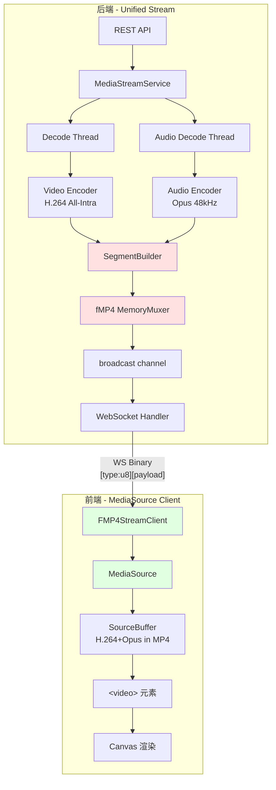

# fMP4 流媒体实现方案

## 一、背景与动机

### 当前架构
```
Video: Decoder → H.264 Encoder → pack_h264_frame(25B头+NAL) → broadcast → WS → WebCodecs VideoDecoder → Canvas
Audio: Decoder → Opus Encoder  → pack_opus_frame(22B头+Opus) → broadcast → WS → WebCodecs AudioDecoder → Web Audio
```

**问题**：视频和音频是两条独立的 WebSocket 流，没有容器级别的 A/V 同步机制。

### fMP4 目标架构
```
Video+Audio: Decoder → Encoder → fMP4 MemoryMuxer(moof+mdat) → broadcast → WS → MediaSource API → <video> 元素
```

**优势**：
- 浏览器原生 A/V 同步（MediaSource 内部 demux + 同步播放）
- 单 WebSocket 连接（减少连接数和同步复杂度）
- 标准 fMP4 格式（可直接保存为文件、兼容 HLS/DASH）

### 可行性验证（已完成）

VSCode 1.108.2 (Electron 39 / Chrome 142) 检测结果：
- ✅ MediaSource API
- ✅ MSE: `video/mp4; codecs="avc1.640028, mp4a.40.2"` (H.264+AAC)
- ✅ MSE: `audio/mp4; codecs="opus"`
- ✅ WebCodecs（作为 fallback）

## 二、fMP4 格式结构

```
┌─────────────────────────────────────────┐
│ Init Segment (一次性发送)                │
│ ┌─────────┐ ┌─────────────────────────┐ │
│ │  ftyp    │ │  moov                   │ │
│ │  (8B)    │ │  ├─ mvhd (timescale)    │ │
│ │          │ │  ├─ trak[0] (video)     │ │
│ │          │ │  │  ├─ tkhd             │ │
│ │          │ │  │  └─ mdia             │ │
│ │          │ │  │     ├─ mdhd          │ │
│ │          │ │  │     ├─ hdlr          │ │
│ │          │ │  │     └─ minf/stbl     │ │
│ │          │ │  ├─ trak[1] (audio)     │ │
│ │          │ │  └─ mvex (trex×2)       │ │
│ └─────────┘ └─────────────────────────┘ │
└─────────────────────────────────────────┘

┌─────────────────────────────────────────┐
│ Media Segment (每 ~500ms 发送一次)       │
│ ┌─────────────────────────────────────┐ │
│ │  moof                               │ │
│ │  ├─ mfhd (sequence_number)          │ │
│ │  ├─ traf[0] (video)                 │ │
│ │  │  ├─ tfhd                         │ │
│ │  │  ├─ tfdt (baseMediaDecodeTime)   │ │
│ │  │  └─ trun (sample entries)        │ │
│ │  └─ traf[1] (audio)                 │ │
│ │     ├─ tfhd                         │ │
│ │     ├─ tfdt                         │ │
│ │     └─ trun                         │ │
│ ├─────────────────────────────────────┤ │
│ │  mdat                               │ │
│ │  [video NAL data][audio data]       │ │
│ └─────────────────────────────────────┘ │
└─────────────────────────────────────────┘
```

## 三、架构设计

### 3.1 整体架构图



### 3.2 模块职责

| 模块 | 层级 | 职责 |
|------|------|------|
| `FMP4Muxer` | encoder/ | FFmpeg avio 内存输出，生成 init segment + media segment |
| `SegmentBuilder` | services/ | 收集 A/V 编码包，按时间窗口切片，调用 FMP4Muxer |
| `MediaStreamService` | services/ | 统一的 A/V 流服务，管理解码+编码+分段+广播 |
| `MediaStreamController` | controllers/ | REST API：`media:stream`, `media:seek` 等 |
| `FMP4StreamClient` | webview/shared/ | 前端 MediaSource 客户端 |

### 3.3 与现有架构的关系

```
现有模块（保留）：
├── HwAccelDecoder / HwAccelEncoder  → 复用
├── FfmpegAudioDecoder / FfmpegAudioEncoder → 复用
├── WallClockPacer → 复用
├── ActiveStreams / StreamLoopHandle → 复用
├── StreamRegistry / StreamEntry → 复用
├── WebSocket streaming.rs → 复用（FrameData 透传）
└── PlaybackState / create_stream_channels → 复用

新增模块：
├── encoder/fmp4_muxer.rs      → FMP4Muxer（核心新增）
├── services/impls/media.rs    → MediaStreamService
├── controllers/media.rs       → MediaStreamController
└── webview/shared/FMP4StreamClient.ts → 前端客户端

现有模块（保留不动）：
├── video.rs start_stream      → WebCodecs 方案继续可用
├── audio.rs start_stream      → WebCodecs 方案继续可用
├── H264StreamClient.ts        → WebCodecs fallback
└── AudioStreamClient.ts       → WebCodecs fallback
```

## 四、后端实现

### 4.1 FMP4Muxer（核心）

**文件**：`packages/native-core/src/encoder/fmp4_muxer.rs`

**设计思路**：使用 FFmpeg 的 `avio_alloc_context` 创建内存 I/O 上下文，将 fMP4 输出写入内存缓冲区而非文件。

```rust
/// fMP4 内存封装器
///
/// 使用 FFmpeg avio 自定义 I/O 将 fMP4 数据写入内存缓冲区。
/// 支持两阶段输出：
/// 1. init segment (ftyp + moov) — 调用 write_header() 后捕获
/// 2. media segment (moof + mdat) — 每次 flush_segment() 后捕获
pub struct FMP4Muxer {
    output_ctx: Option<ffmpeg::format::context::Output>,
    avio_buffer: *mut u8,           // avio 内部缓冲区
    write_buffer: Arc<Mutex<Vec<u8>>>,  // 累积写入的数据
    video_stream_index: Option<usize>,
    audio_stream_index: Option<usize>,
    video_time_base: Rational,
    audio_time_base: Rational,
    header_written: bool,
    segment_sequence: u32,
}

impl FMP4Muxer {
    /// 创建 fMP4 内存封装器
    pub fn new() -> Self { ... }

    /// 打开封装器（创建 avio 内存上下文）
    ///
    /// 关键 FFmpeg 参数：
    /// - format: "mp4"
    /// - movflags: "frag_custom+empty_moov+default_base_moof+omit_tfhd_offset"
    ///   - frag_custom: 手动控制分片时机
    ///   - empty_moov: moov 不含 sample 数据（全在 moof 中）
    ///   - default_base_moof: moof 作为偏移基准（MSE 要求）
    ///   - omit_tfhd_offset: 省略冗余偏移（减小体积）
    pub fn open(&mut self, video_config: &EncoderConfig, audio_config: &AudioEncoderConfig) -> Result<()> {
        // 1. 分配 avio 缓冲区
        let avio_buf_size = 64 * 1024; // 64KB
        let avio_buffer = unsafe { ffmpeg::ffi::av_malloc(avio_buf_size) as *mut u8 };

        // 2. 创建自定义 avio context（write callback → write_buffer）
        let write_buffer = Arc::new(Mutex::new(Vec::new()));
        let opaque = Arc::into_raw(write_buffer.clone()) as *mut c_void;

        let avio_ctx = unsafe {
            ffmpeg::ffi::avio_alloc_context(
                avio_buffer,
                avio_buf_size as i32,
                1,  // write_flag
                opaque,
                None,           // read_packet
                Some(write_cb), // write_packet
                None,           // seek
            )
        };

        // 3. 创建输出上下文
        let mut output_ctx = ffmpeg::format::output_as_with_io("", "mp4", avio_ctx)?;

        // 4. 设置 movflags
        output_ctx.set_metadata("movflags",
            "frag_custom+empty_moov+default_base_moof+omit_tfhd_offset");

        // 5. 添加视频流 + 音频流
        self.add_video_stream(&mut output_ctx, video_config)?;
        self.add_audio_stream(&mut output_ctx, audio_config)?;

        self.output_ctx = Some(output_ctx);
        self.write_buffer = write_buffer;
        Ok(())
    }

    /// 写入头部并返回 init segment (ftyp + moov)
    pub fn write_header(&mut self) -> Result<Vec<u8>> {
        let ctx = self.output_ctx.as_mut().unwrap();
        ctx.write_header()?;
        self.header_written = true;

        // 捕获 write_buffer 中的数据 = init segment
        let mut buf = self.write_buffer.lock().unwrap();
        let init_segment = buf.clone();
        buf.clear();
        Ok(init_segment)
    }

    /// 写入视频包（累积到当前 segment）
    pub fn write_video_packet(&mut self, packet: &EncodedPacket) -> Result<()> { ... }

    /// 写入音频包（累积到当前 segment）
    pub fn write_audio_packet(&mut self, packet: &EncodedPacket) -> Result<()> { ... }

    /// 刷新当前 segment，返回 media segment (moof + mdat)
    pub fn flush_segment(&mut self) -> Result<Vec<u8>> {
        let ctx = self.output_ctx.as_mut().unwrap();

        // 调用 av_write_frame(NULL) 触发 fragment flush
        unsafe {
            ffmpeg::ffi::av_write_frame(ctx.as_mut_ptr(), std::ptr::null_mut());
        }

        // 捕获 write_buffer = media segment
        let mut buf = self.write_buffer.lock().unwrap();
        let segment = buf.clone();
        buf.clear();
        self.segment_sequence += 1;
        Ok(segment)
    }
}

/// avio write callback — 将数据追加到 write_buffer
unsafe extern "C" fn write_cb(
    opaque: *mut c_void,
    buf: *const u8,
    buf_size: i32,
) -> i32 {
    let write_buffer = &*(opaque as *const Mutex<Vec<u8>>);
    let data = std::slice::from_raw_parts(buf, buf_size as usize);
    write_buffer.lock().unwrap().extend_from_slice(data);
    buf_size
}
```

**关键设计决策**：

1. **为什么用 FFmpeg avio 而不是纯 Rust mp4 库？**
   - 复用现有 FFmpeg 编码管线（HwAccelEncoder 输出的 packet 直接写入）
   - FFmpeg 的 fMP4 muxer 经过大量生产验证
   - 时间基转换、交错写入等复杂逻辑由 FFmpeg 处理

2. **视频 H.264 全 I 帧 + 音频 Opus**：
   - 视频保持 `gop_size=1`（All-Intra），消除前端 WebCodecs/MSE 解码卡顿
   - 音频使用 Opus（复用现有 Opus 编码管线，无需新增 AAC 路径）
   - MSE MIME: `video/mp4; codecs="avc1.640028, opus"`
   - 已验证 VSCode 1.108.2 (Electron 39 / Chrome 142) 完全支持 ✅
   - 全 I 帧对 fMP4 封装完全兼容，分片策略按固定帧数切片（每 15 帧 ≈ 0.5s）
   - 优势：seek 任意位置立即解码，无需等 keyframe
   - 注意：Opus in MP4 需要 FFmpeg muxer 支持（FFmpeg 4.3+ 支持 `opus` in `mp4`）

3. **分片策略**：
   - 全 I 帧模式下，每 15 帧（~0.5s @ 30fps）flush 一个 media segment
   - 0.5s 粒度在延迟和开销之间取得平衡
   - 未来如需降码率，可切换到 `gop_size=30` + keyframe 驱动切片

### 4.2 SegmentBuilder

**文件**：`packages/native-core/src/services/impls/segment_builder.rs`

负责收集编码后的 A/V 包，按时间窗口切片，调用 FMP4Muxer 生成 segment。
支持两种分片模式：固定帧数（All-Intra）和 keyframe 驱动（标准 GOP）。

```rust
/// 分片模式
pub enum SegmentMode {
    /// 固定帧数切片（适用于 gop_size=1 All-Intra）
    FixedFrames(u32),
    /// Keyframe 驱动切片（适用于 gop_size>1）
    KeyframeDriven,
}

/// 分片构建器
pub struct SegmentBuilder {
    muxer: FMP4Muxer,
    /// 当前 segment 中的视频帧数
    video_frame_count: u32,
    /// 分片模式
    mode: SegmentMode,
    /// 是否已发送 init segment
    init_sent: bool,
}

impl SegmentBuilder {
    pub fn new(
        video_config: &EncoderConfig,
        audio_config: &AudioEncoderConfig,
        mode: SegmentMode,
    ) -> Result<Self> {
        let mut muxer = FMP4Muxer::new();
        muxer.open(video_config, audio_config)?;
        Ok(Self { muxer, video_frame_count: 0, mode, init_sent: false })
    }

    /// 获取 init segment（首次调用时生成）
    pub fn get_init_segment(&mut self) -> Result<Vec<u8>> {
        if !self.init_sent {
            let init = self.muxer.write_header()?;
            self.init_sent = true;
            Ok(init)
        } else {
            Err(Error::Other("Init segment already sent".into()))
        }
    }

    /// 写入视频包，根据分片模式决定是否 flush
    pub fn write_video(&mut self, packet: &EncodedPacket) -> Result<Option<Vec<u8>>> {
        self.muxer.write_video_packet(packet)?;
        self.video_frame_count += 1;

        let should_flush = match self.mode {
            // All-Intra: 每 N 帧 flush 一次
            SegmentMode::FixedFrames(n) => self.video_frame_count >= n,
            // 标准 GOP: 下一个 keyframe 到来时 flush 上一个 segment
            SegmentMode::KeyframeDriven => packet.is_keyframe && self.video_frame_count > 1,
        };

        if should_flush {
            let segment = self.muxer.flush_segment()?;
            self.video_frame_count = match self.mode {
                SegmentMode::FixedFrames(_) => 0,
                SegmentMode::KeyframeDriven => 1, // 当前 keyframe 属于新 segment
            };
            return Ok(Some(segment));
        }
        Ok(None)
    }

    /// 写入音频包（不触发 flush，由视频帧驱动）
    pub fn write_audio(&mut self, packet: &EncodedPacket) -> Result<()> {
        self.muxer.write_audio_packet(packet)
    }

    /// 强制 flush 当前 segment（用于 seek/stop）
    pub fn force_flush(&mut self) -> Result<Vec<u8>> {
        let segment = self.muxer.flush_segment()?;
        self.video_frame_count = 0;
        Ok(segment)
    }
}
```

### 4.3 MediaStreamService

**文件**：`packages/native-core/src/services/impls/media.rs`

统一的 A/V 流服务，合并当前 video.rs 和 audio.rs 的 start_stream 逻辑。

```rust
pub struct MediaStreamService {
    gpu_ctx: Option<Arc<GpuContext>>,
    active_streams: ActiveStreams,
}

impl MediaStreamService {
    /// 启动 fMP4 统一流
    ///
    /// 架构：三线程
    /// - Video Encode Thread: decode → encode → push to SegmentBuilder
    /// - Audio Encode Thread: decode → encode → push to SegmentBuilder
    /// - Pacing Thread: SegmentBuilder flush → broadcast
    pub async fn start_stream(
        &self,
        source: &Path,
        session_id: &str,
    ) -> Result<(StreamId, broadcast::Receiver<FrameData>)> {
        let media_info = probe(source)?;
        let (stream_id, tx, rx, cancel, state_tx, state_rx) =
            create_stream_channels(session_id, 32);

        // 编码器配置
        let video_config = EncoderConfig::new(w, h, fps, VideoCodec::H264)
            .with_gop_size(1)       // All-Intra：消除前端解码卡顿
            .with_max_b_frames(0);

        let audio_config = AudioEncoderConfig::new(48000, 2, AudioCodec::Opus)
            .with_bitrate(128_000);

        // 共享的 SegmentBuilder（Mutex 保护）
        // 全 I 帧模式：每 15 帧（~0.5s）切片
        let builder = Arc::new(Mutex::new(
            SegmentBuilder::new(&video_config, &audio_config, SegmentMode::FixedFrames(15))?
        ));

        // 音视频编码包的汇聚通道
        let (av_tx, av_rx) = std::sync::mpsc::sync_channel::<AVPacket>(32);

        // --- Video Encode Thread ---
        let av_tx_v = av_tx.clone();
        std::thread::spawn(move || {
            let mut decoder = HwAccelDecoder::with_hw_accel(HwAccelType::Auto);
            decoder.open(&path)?;
            let mut encoder = HwAccelEncoder::new();
            encoder.open(&video_config)?;

            loop {
                // ... 解码 + 编码（同 video.rs）
                for p in packets {
                    av_tx_v.send(AVPacket::Video(p))?;
                }
            }
        });

        // --- Audio Encode Thread ---
        std::thread::spawn(move || {
            let mut decoder = FfmpegAudioDecoder::new()
                .with_output_format(SampleFormat::F32)
                .with_output_sample_rate(48000)
                .with_output_channels(2);
            decoder.open(&path)?;
            let mut encoder = FfmpegAudioEncoder::new();
            encoder.open(&audio_config)?;

            loop {
                // ... 解码 + 编码（同 audio.rs）
                for p in packets {
                    av_tx.send(AVPacket::Audio(p))?;
                }
            }
        });

        // --- Pacing + Muxing Thread ---
        tokio::task::spawn_blocking(move || {
            let mut builder = builder.lock().unwrap();

            // 1. 发送 init segment
            let init = builder.get_init_segment()?;
            let _ = tx.send(FrameData {
                data: pack_fmp4_message(FMP4MessageType::Init, &init),
                format: FrameFormat::Fmp4,
                ..
            });

            // 2. 接收 A/V 包，写入 builder，flush segment 时广播
            loop {
                match av_rx.recv_timeout(Duration::from_millis(100)) {
                    Ok(AVPacket::Video(p)) => {
                        if let Some(segment) = builder.write_video(&p)? {
                            let _ = tx.send(FrameData {
                                data: pack_fmp4_message(FMP4MessageType::Segment, &segment),
                                format: FrameFormat::Fmp4,
                                ..
                            });
                        }
                    }
                    Ok(AVPacket::Audio(p)) => {
                        builder.write_audio(&p)?;
                    }
                    Err(Timeout) => continue,
                    Err(Disconnected) => break,
                }
            }
        });

        Ok((stream_id, rx))
    }
}

/// A/V 包枚举（汇聚通道使用）
enum AVPacket {
    Video(EncodedPacket),
    Audio(EncodedAudioPacket),
}
```

### 4.4 WebSocket 线协议

fMP4 使用带类型前缀的二进制消息：

```
[type: u8][payload...]

type = 0x01: Init Segment (ftyp + moov)
type = 0x02: Media Segment (moof + mdat)
type = 0x03: Flush (seek 后重置信号)
```

```rust
/// 打包 fMP4 WebSocket 消息
pub fn pack_fmp4_message(msg_type: FMP4MessageType, payload: &[u8]) -> Vec<u8> {
    let mut data = Vec::with_capacity(1 + payload.len());
    data.push(msg_type as u8);
    data.extend_from_slice(payload);
    data
}

#[repr(u8)]
pub enum FMP4MessageType {
    Init = 0x01,
    Segment = 0x02,
    Flush = 0x03,
}
```

### 4.5 类型扩展

```rust
// neko_types/src/common.rs — 新增 FrameFormat
pub enum FrameFormat {
    Rgba, Nv12, Jpeg, Png, Webp, H264, PcmF32, Opus,
    Fmp4,  // 新增：fMP4 segment 数据
}

// domain/stream.rs — 新增 StreamCodec
pub enum StreamCodec {
    H264,
    Raw,
    Fmp4,  // 新增：fMP4 统一流
}
```

## 五、前端实现

### 5.1 FMP4StreamClient

**文件**：`packages/neko-preview/packages/webview/src/shared/FMP4StreamClient.ts`

```typescript
export interface FMP4StreamClientConfig {
    websocketUrl: string;
    onTimeUpdate?: (time: number) => void;
    onConnectionChange?: (connected: boolean) => void;
    onError?: (error: Error) => void;
}

export class FMP4StreamClient {
    private ws: WebSocket | null = null;
    private mediaSource: MediaSource | null = null;
    private sourceBuffer: SourceBuffer | null = null;
    private videoElement: HTMLVideoElement;
    private pendingSegments: ArrayBuffer[] = [];
    private disposed = false;

    constructor(
        videoElement: HTMLVideoElement,
        private config: FMP4StreamClientConfig,
    ) {
        this.videoElement = videoElement;
    }

    async connect(): Promise<void> {
        // 1. 创建 MediaSource
        this.mediaSource = new MediaSource();
        this.videoElement.src = URL.createObjectURL(this.mediaSource);

        await new Promise<void>((resolve) => {
            this.mediaSource!.addEventListener('sourceopen', () => resolve(), { once: true });
        });

        // 2. 连接 WebSocket
        this.setupWebSocket();
    }

    private setupWebSocket(): void {
        this.ws = new WebSocket(this.config.websocketUrl);
        this.ws.binaryType = 'arraybuffer';

        this.ws.onmessage = (event) => {
            if (!(event.data instanceof ArrayBuffer)) return;
            this.handleMessage(event.data);
        };
        // ... onopen/onclose/onerror
    }

    private handleMessage(data: ArrayBuffer): void {
        const view = new Uint8Array(data);
        const type = view[0];
        const payload = data.slice(1);

        switch (type) {
            case 0x01: // Init Segment
                this.handleInitSegment(payload);
                break;
            case 0x02: // Media Segment
                this.handleMediaSegment(payload);
                break;
            case 0x03: // Flush (seek reset)
                this.handleFlush();
                break;
        }
    }

    private handleInitSegment(data: ArrayBuffer): void {
        if (!this.mediaSource || this.mediaSource.readyState !== 'open') return;

        // 创建 SourceBuffer（H.264 + Opus in MP4）
        const mimeType = 'video/mp4; codecs="avc1.640028, opus"';
        this.sourceBuffer = this.mediaSource.addSourceBuffer(mimeType);
        this.sourceBuffer.mode = 'segments';

        // 处理 updateend 事件：追加排队的 segment
        this.sourceBuffer.addEventListener('updateend', () => {
            this.flushPendingSegments();
        });

        // 追加 init segment
        this.sourceBuffer.appendBuffer(data);
    }

    private handleMediaSegment(data: ArrayBuffer): void {
        if (!this.sourceBuffer) return;

        if (this.sourceBuffer.updating) {
            // SourceBuffer 正在更新，排队等待
            this.pendingSegments.push(data);
        } else {
            this.sourceBuffer.appendBuffer(data);
        }

        // 自动播放
        if (this.videoElement.paused && this.videoElement.readyState >= 2) {
            this.videoElement.play().catch(() => {});
        }
    }

    private handleFlush(): void {
        // Seek 后重置：清空 SourceBuffer，等待新的 init segment
        if (this.sourceBuffer && !this.sourceBuffer.updating) {
            try {
                this.sourceBuffer.abort();
                this.mediaSource?.removeSourceBuffer(this.sourceBuffer);
            } catch {}
        }
        this.sourceBuffer = null;
        this.pendingSegments = [];
    }

    private flushPendingSegments(): void {
        if (!this.sourceBuffer || this.sourceBuffer.updating) return;
        const next = this.pendingSegments.shift();
        if (next) {
            this.sourceBuffer.appendBuffer(next);
        }
    }

    // --- 播放控制 ---

    get currentTime(): number {
        return this.videoElement.currentTime;
    }

    get duration(): number {
        return this.videoElement.duration;
    }

    setVolume(volume: number): void {
        this.videoElement.volume = volume;
    }

    dispose(): void {
        this.disposed = true;
        this.ws?.close();
        if (this.mediaSource?.readyState === 'open') {
            this.mediaSource.endOfStream();
        }
        URL.revokeObjectURL(this.videoElement.src);
    }
}
```

### 5.2 运行时能力检测与降级

```typescript
// shared/detectCapabilities.ts 中已有检测逻辑

export function selectStreamMode(): 'fmp4' | 'webcodecs' {
    // 优先 fMP4（原生 A/V 同步）
    if (typeof MediaSource !== 'undefined') {
        const mimeType = 'video/mp4; codecs="avc1.640028, opus"';
        if (MediaSource.isTypeSupported(mimeType)) {
            return 'fmp4';
        }
    }
    // 降级到 WebCodecs（当前方案）
    return 'webcodecs';
}
```

## 六、Seek 处理

fMP4 的 seek 比当前 WebCodecs 方案更复杂，因为 MediaSource 有内部缓冲状态。

### 6.1 Seek 流程

```
前端                          后端
  │                             │
  │  POST /media/seek {time}    │
  │ ──────────────────────────> │
  │                             │ 1. 停止编码线程
  │                             │ 2. decoder.seek(time)
  │                             │ 3. 重置 encoder + SegmentBuilder
  │                             │ 4. 发送 Flush 消息 (type=0x03)
  │  <── WS: [0x03]            │
  │                             │ 5. 发送新的 init segment (type=0x01)
  │  <── WS: [0x01][init]      │
  │                             │ 6. 恢复编码，发送 media segments
  │  <── WS: [0x02][segment]   │
  │                             │
  │  handleFlush():             │
  │  - abort SourceBuffer       │
  │  - remove old SourceBuffer  │
  │  handleInitSegment():       │
  │  - addSourceBuffer(new)     │
  │  - appendBuffer(init)       │
  │  handleMediaSegment():      │
  │  - appendBuffer(segment)    │
  │  - video.play()             │
```

### 6.2 为什么 seek 需要重发 init segment？

seek 后编码器重置，可能产生不同的 SPS/PPS 参数。重发 init segment 确保 SourceBuffer 的解码器配置与新数据匹配。

## 七、实现优先级

### P0：核心管线（MVP）

| 步骤 | 文件 | 工作量 |
|------|------|--------|
| 1. FMP4Muxer | `encoder/fmp4_muxer.rs` | 2天 |
| 2. SegmentBuilder | `services/impls/segment_builder.rs` | 1天 |
| 3. MediaStreamService.start_stream | `services/impls/media.rs` | 2天 |
| 4. FMP4StreamClient | `webview/shared/FMP4StreamClient.ts` | 1天 |
| 5. 集成测试 | test_stream.html + TestPlayer | 1天 |

### P1：播放控制

| 步骤 | 内容 |
|------|------|
| 6. Seek | 后端 flush + 重发 init，前端 SourceBuffer 重置 |
| 7. Pause/Resume | 后端暂停编码，前端 video.pause()/play() |
| 8. Speed | 后端 pacer 调速，前端 video.playbackRate |

### P2：优化

| 步骤 | 内容 |
|------|------|
| 9. Buffer 管理 | 前端定期清理旧 buffer（避免内存增长） |
| 10. 自适应分片 | 根据网络状况调整 segment 大小 |
| 11. 运行时降级 | detectCapabilities → 自动选择 fMP4 或 WebCodecs |

### P3：扩展

| 步骤 | 内容 |
|------|------|
| 12. HLS 输出 | SegmentBuilder 输出 .m3u8 + .m4s 文件 |
| 13. 录制 | 同时写入文件 + 流式输出 |

## 八、风险与对策

| 风险 | 影响 | 对策 |
|------|------|------|
| FFmpeg avio 内存 I/O 复杂 | 实现难度高 | 先用 pipe (`/dev/stdout`) 验证 fMP4 输出正确性，再切换到 avio |
| Opus in MP4 的 FFmpeg muxer 支持 | FFmpeg < 4.3 不支持 opus in mp4 | 确认项目 FFmpeg 版本 ≥ 4.3；或使用 `-strict experimental` 标志 |
| MSE 延迟 | segment 粒度 ~0.5s，seek 响应比 WebCodecs 慢 | 全 I 帧模式下可减小到 8 帧（~0.27s）；WebCodecs 方案作为低延迟 fallback |
| 旧版 VSCode 不支持 MSE H.264+Opus | 兼容性 | 运行时检测 `isTypeSupported`，降级到 WebCodecs 方案 |
| 全 I 帧码率高 | 带宽占用大 | 本地 WS 传输不是瓶颈；未来网络场景可切换 GOP=30 |
| SourceBuffer 内存增长 | 长时间播放 OOM | 定期 `remove(0, currentTime - 30)` 清理旧数据 |

## 九、验证计划

### 9.1 单元测试
- FMP4Muxer: init segment 生成、media segment 生成、多次 flush
- SegmentBuilder: GOP 边界切片、force_flush

### 9.2 集成测试（test_stream.html）
- 新增 "▶ Start fMP4" 按钮
- 使用 `<video>` 元素 + MediaSource 播放
- 验证 A/V 同步（对比音频和视频时间戳）
- 验证 seek（跳转后继续播放）

### 9.3 VSCode Webview 测试
- TestPlayer 中添加 fMP4 模式切换
- 验证 detectCapabilities 自动选择正确模式
