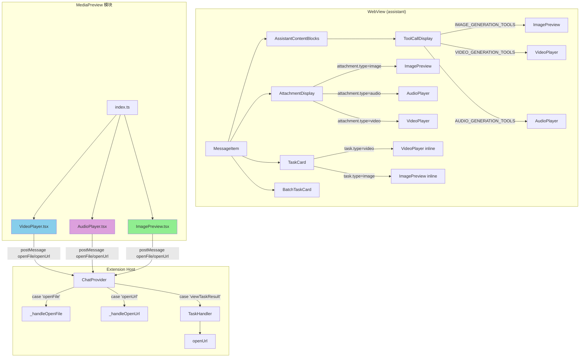
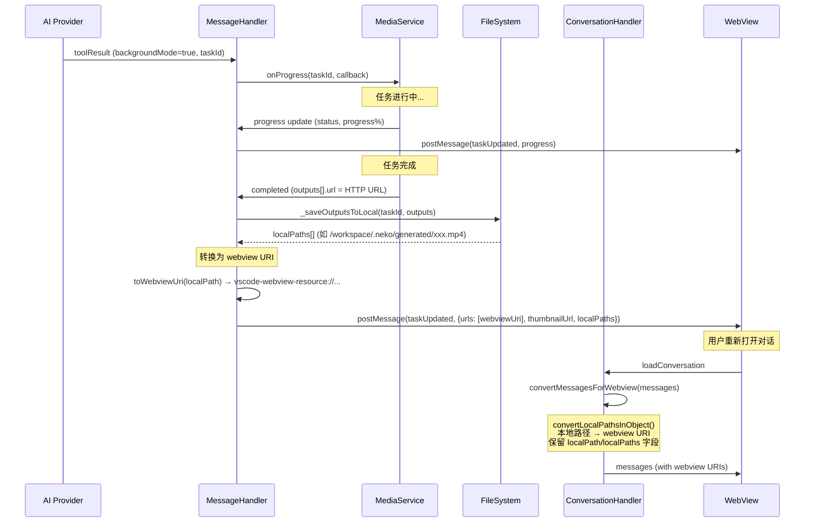
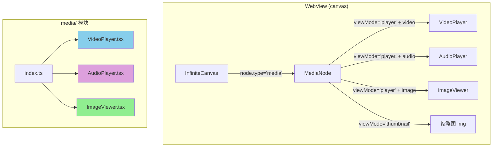
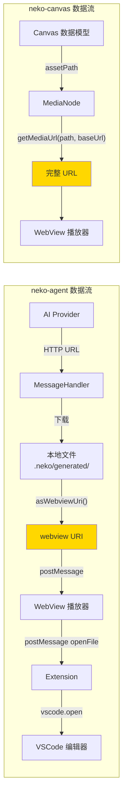

# 媒体播放器组件完整调用链分析

## 概述

本文档分析 `neko-agent` 和 `neko-canvas` 两个包中媒体播放器组件的完整调用链，包括组件层级、Props 传递、媒体数据获取方式、以及 Extension 端的消息处理逻辑。

---

## 一、neko-agent 媒体播放器调用链

### 1.1 组件层级结构



### 1.2 三个媒体组件的 Props 定义

#### ImagePreview

```typescript
// 文件: packages/assistant/src/components/ChatView/MediaPreview/ImagePreview.tsx
interface ImagePreviewProps {
  src: string;           // 图片 URL（webview URI 或 HTTP URL 或 data: URL）
  alt?: string;          // 替代文本
  name?: string;         // 文件名
  className?: string;
  localPath?: string;    // 本地文件路径（用于 "Open" 按钮）
  inline?: boolean;      // 内联模式（无 header，用于 TaskCard 内部）
}
```

#### VideoPlayer

```typescript
// 文件: packages/assistant/src/components/ChatView/MediaPreview/VideoPlayer.tsx
interface VideoPlayerProps {
  src: string;           // 视频 URL（webview URI 或 HTTP URL）
  poster?: string;       // 封面图 URL
  title?: string;        // 标题/文件名
  className?: string;
  localPath?: string;    // 本地文件路径（用于 "Open" 按钮）
  inline?: boolean;      // 内联模式（无 header，用于 TaskCard 内部）
}
```

#### AudioPlayer

```typescript
// 文件: packages/assistant/src/components/ChatView/MediaPreview/AudioPlayer.tsx
interface AudioPlayerProps {
  src: string;           // 音频 URL（webview URI 或 HTTP URL）
  title?: string;        // 标题/文件名
  className?: string;
  localPath?: string;    // 本地文件路径（用于 "Open" 按钮）
}
```

### 1.3 三条调用路径详解

#### 路径 A：用户消息附件 → AttachmentDisplay

```
MessageItem
  └─ AttachmentDisplay({ attachment })
       ├─ attachment.type === 'image' && attachment.preview
       │    → <ImagePreview src={attachment.preview} alt={attachment.name} />
       ├─ attachment.type === 'audio' && attachment.preview
       │    → <AudioPlayer src={attachment.preview} title={attachment.name} />
       └─ attachment.type === 'video' && attachment.preview
            → <VideoPlayer src={attachment.preview} title={attachment.name} />
```

**数据来源**：`MessageAttachment.preview` 字段
- 类型：`string` — Base64 data URL（如 `data:image/png;base64,...`）
- 来源：用户在输入框附加文件时，前端将文件转为 base64 preview
- **注意**：此路径没有传 `localPath`，因此 "Open" 按钮会尝试用 `src`（即 data URL）

#### 路径 B：AI 工具调用结果 → ToolCallDisplay

```
MessageItem
  └─ AssistantContentBlocks
       └─ ToolCallDisplay({ toolCall })
            ├─ isImageTool && imageUrls.length > 0
            │    → <ImagePreview src={url} localPath={localPaths[i]} />
            ├─ isVideoTool && videoUrls.length > 0
            │    → <VideoPlayer src={url} localPath={localPaths[i]} />
            └─ isAudioTool && audioUrls.length > 0
                 → <AudioPlayer src={url} localPath={localPaths[i]} />
```

**数据来源**：`toolCall.result.data` 中提取的 URL
- `extractImageUrls()` / `extractVideoUrls()` / `extractAudioUrls()` 从 result.data 中提取
- 检查字段：`url`, `imageUrl`, `videoUrl`, `audioUrl`, `urls[]`, `images[]`, `videos[]`, `audios[]`
- URL 验证：`isValidMediaUrl()` 检查 HTTP/HTTPS、vscode-webview-resource、data:、本地路径+扩展名
- `localPaths` 通过 `extractLocalPaths()` 提取，来自 `result.data.localPaths[]` 或 `result.data.localPath`

**背景任务过滤**：
```typescript
const isBackgroundMode = resultData?.backgroundMode === true;
const isBackgroundTaskCompleted = isBackgroundMode && backgroundTaskStatus === 'completed';
const shouldShowMediaPreview = !isBackgroundMode || isBackgroundTaskCompleted;
```
- 正在运行的后台任务：ToolCallDisplay **不显示**媒体预览（由 TaskCard 处理）
- 已完成的后台任务（会话重载）：ToolCallDisplay **显示**媒体预览

#### 路径 C：后台任务完成 → TaskCard

```
MessageItem
  └─ TaskCard({ task })
       ├─ task.type === 'video' && task.result.thumbnailUrl
       │    → <VideoPlayer
       │         src={task.result.urls?.[0] || task.result.thumbnailUrl}
       │         poster={task.result.thumbnailUrl}
       │         localPath={task.result.localPaths?.[0]}
       │         inline />
       └─ task.type === 'image' && task.result.thumbnailUrl
            → <ImagePreview
                 src={task.result.thumbnailUrl}
                 localPath={task.result.localPaths?.[0]}
                 inline />
```

**数据来源**：`BackgroundTask.result` 对象
- `result.urls[]`：webview URI 数组（已由 Extension 端转换）
- `result.thumbnailUrl`：缩略图 webview URI
- `result.localPaths[]`：原始本地路径（保留用于 "Open" 按钮）

### 1.4 媒体数据获取流程（完整链路）



### 1.5 "Open" 按钮的 postMessage 处理

三个播放器组件都有相同的 `handleOpenFile` 逻辑：

```typescript
// WebView 端（VideoPlayer / AudioPlayer / ImagePreview）
const handleOpenFile = useCallback(() => {
  const pathToOpen = localPath || src;
  if (pathToOpen.startsWith('/') || /^[A-Za-z]:[\\/]/.test(pathToOpen)) {
    // 本地路径 → openFile
    vscode?.postMessage({ type: 'openFile', filePath: pathToOpen });
  } else {
    // URL → openUrl
    vscode?.postMessage({ type: 'openUrl', url: pathToOpen });
  }
}, [localPath, src]);
```

Extension 端处理：

```typescript
// chatProvider.ts
case 'openFile':
  this._handleOpenFile(message.filePath);  // → vscode.commands.executeCommand('vscode.open', uri)
  break;
case 'openUrl':
  this._handleOpenUrl(message.url);        // → vscode.env.openExternal(uri)
  break;

// taskHandler.ts (viewTaskResult)
handleViewTaskResult(taskId) {
  // 1. 先尝试 Platform MediaService
  // 2. 回退到 TaskManager
  // → openUrl(url) → vscode.open 或 vscode.env.openExternal
}
```

### 1.6 URI 转换机制

#### Extension → WebView 方向

```typescript
// conversationHandler.ts - convertLocalPathsInObject()
// 递归遍历 toolCall.result.data 对象：
// 1. 字符串值：isLocalFilePath() → toWebviewUri() (webview.asWebviewUri)
// 2. 特殊 key (url, thumbnailUrl, imageUrl 等)：转换 + 自动添加 localPath
// 3. urls 数组：逐个转换 + 自动添加 localPaths 数组
// 4. localPath / localPaths key：跳过，保留原始路径
```

#### CSP 策略

```html
<!-- chatProvider.ts -->
<meta http-equiv="Content-Security-Policy"
  content="img-src ${webview.cspSource} https: data:;
           media-src ${webview.cspSource} https: data:;">
```
- `webview.cspSource`：允许 vscode-webview-resource:// URI
- `https:`：允许远程 HTTP URL
- `data:`：允许 base64 data URL

#### localResourceRoots 配置

```typescript
// chatProvider.ts
webviewView.webview.options = {
  enableScripts: true,
  localResourceRoots: [this._extensionUri, ...workspaceFolders],
};
```
- 允许访问扩展目录和工作区目录下的本地文件

---

## 二、neko-canvas 媒体播放器调用链

### 2.1 组件层级结构



### 2.2 MediaNode 组件分析

```typescript
// 文件: packages/webview/src/components/nodes/MediaNode.tsx
interface MediaNodeProps {
  node: MediaCanvasNode;
  viewport: CanvasViewport;
  isSelected: boolean;
  onSelect?: (nodeId: string, multi: boolean) => void;
  onDrag?: (nodeId: string, position: { x: number; y: number }) => void;
  onMove?: (nodeId: string, position: { x: number; y: number }) => void;
  onConnectionStart?: (nodeId: string, anchor: string, e: React.MouseEvent) => void;
  mediaBaseUrl?: string;  // ← 媒体文件基础 URL
}
```

#### MediaCanvasNode 数据模型

```typescript
// 文件: packages/neko-types/src/types/canvas.ts
interface MediaCanvasNode extends CanvasNodeBase {
  type: 'media';
  data: {
    assetPath: string;        // 相对路径（如 "assets/video1.mp4"）
    thumbnailPath?: string;   // 缩略图相对路径
    mediaType?: 'video' | 'image' | 'audio';
    duration?: number;        // 秒（视频/音频）
  };
}
```

### 2.3 媒体 URL 构建逻辑

```typescript
// MediaNode.tsx - getMediaUrl()
function getMediaUrl(assetPath: string, baseUrl?: string): string {
  // 1. 已经是完整 URL → 直接返回
  if (assetPath.startsWith('http://') || assetPath.startsWith('https://') || assetPath.startsWith('blob:')) {
    return assetPath;
  }
  // 2. 有 baseUrl → 拼接
  if (baseUrl) {
    return `${baseUrl}/${assetPath}`;
  }
  // 3. 无 baseUrl → 原样返回（VSCode webview 需特殊处理）
  return assetPath;
}
```

**使用方式**：
```typescript
const mediaUrl = getMediaUrl(assetPath, mediaBaseUrl);
const posterUrl = thumbnailPath ? getMediaUrl(thumbnailPath, mediaBaseUrl) : undefined;
```

### 2.4 缩略图 vs 播放器模式

```typescript
type ViewMode = 'thumbnail' | 'player';
```

| 模式 | 触发方式 | 显示内容 |
|------|---------|---------|
| `thumbnail` | 默认 / 点击 ✕ 按钮 | 缩略图 + 播放按钮覆盖层 + 时长标签 |
| `player` | 点击缩略图 | 完整播放器（VideoPlayer / AudioPlayer / ImageViewer） |

**缩略图模式渲染逻辑**：
```typescript
// 有缩略图或是图片类型 → 显示 
{thumbnailPath || mediaType === 'image' ? (
  
) : (
  // 无缩略图 → 显示图标
  <div>{getMediaIcon(mediaType)}</div>
)}
```

### 2.5 三个播放器组件的 Props

#### VideoPlayer (canvas)

```typescript
interface VideoPlayerProps {
  src: string;
  poster?: string;
  className?: string;
  autoPlay?: boolean;
  muted?: boolean;
  loop?: boolean;
  onDurationChange?: (duration: number) => void;
  onTimeUpdate?: (currentTime: number) => void;
  onEnded?: () => void;
}
```

#### AudioPlayer (canvas)

```typescript
interface AudioPlayerProps {
  src: string;
  className?: string;
  autoPlay?: boolean;
  loop?: boolean;
  showWaveform?: boolean;  // 波形显示（默认 true）
  onDurationChange?: (duration: number) => void;
  onTimeUpdate?: (currentTime: number) => void;
  onEnded?: () => void;
}
```

#### ImageViewer (canvas)

```typescript
interface ImageViewerProps {
  src: string;
  alt?: string;
  className?: string;
  objectFit?: 'contain' | 'cover' | 'fill';
  enableZoom?: boolean;  // 点击放大（默认 true）
  onLoad?: () => void;
  onError?: () => void;
}
```

### 2.6 InfiniteCanvas → MediaNode 调用链

```
InfiniteCanvas
  └─ visibleNodes.map(node => renderNode(node, ...))
       └─ renderNode()
            └─ case 'media':
                 → <MediaNode node={node as MediaCanvasNode} {...commonProps} />
                      └─ renderMediaContent()
                           ├─ viewMode === 'player':
                           │    ├─ video → <VideoPlayer src={mediaUrl} poster={posterUrl} />
                           │    ├─ audio → <AudioPlayer src={mediaUrl} showWaveform={true} />
                           │    └─ image → <ImageViewer src={mediaUrl} enableZoom={true} />
                           └─ viewMode === 'thumbnail':
                                →  + 播放覆盖层
```

**注意**：当前 `InfiniteCanvas.renderNode()` 没有传递 `mediaBaseUrl` 给 `MediaNode`，这意味着 `mediaBaseUrl` 始终为 `undefined`，除非外部显式传入。

---

## 三、两个包的对比分析

### 3.1 架构差异

| 特性 | neko-agent (assistant) | neko-canvas (webview) |
|------|----------------------|----------------------|
| **运行环境** | VSCode WebView Panel | VSCode WebView / 独立 Web |
| **媒体来源** | AI 生成 → 下载到本地 → webview URI | 项目资源文件（相对路径） |
| **URL 类型** | `vscode-webview-resource://` / `https://` / `data:` | `http://` / `blob:` / 相对路径 |
| **URI 转换** | Extension 端 `asWebviewUri()` 自动转换 | `getMediaUrl(assetPath, baseUrl)` 手动拼接 |
| **文件打开** | `postMessage → openFile/openUrl` | 无（纯画布内播放） |
| **localPath** | 保留原始路径用于 VSCode 打开 | 不需要（assetPath 即为路径） |
| **播放器功能** | 紧凑卡片式 + 可折叠 header | 全功能播放器 + 音量/全屏 |
| **图片查看** | 简单预览 + 点击打开 | 全屏查看 + 缩放/拖拽 |
| **音频特性** | 简单播放/暂停/进度 | 波形显示 + 音量控制 |

### 3.2 Props 对比

| Props | agent ImagePreview | canvas ImageViewer |
|-------|-------------------|-------------------|
| `src` | ✅ | ✅ |
| `alt` | ✅ | ✅ |
| `localPath` | ✅ | ❌ |
| `inline` | ✅ | ❌ |
| `objectFit` | ❌ | ✅ |
| `enableZoom` | ❌ | ✅ |

| Props | agent VideoPlayer | canvas VideoPlayer |
|-------|------------------|-------------------|
| `src` | ✅ | ✅ |
| `poster` | ✅ | ✅ |
| `localPath` | ✅ | ❌ |
| `inline` | ✅ | ❌ |
| `autoPlay` | ❌ | ✅ |
| `muted` | ❌ | ✅ |
| `loop` | ❌ | ✅ |
| `onDurationChange` | ❌ | ✅ |
| `onTimeUpdate` | ❌ | ✅ |
| `onEnded` | ❌ | ✅ |

| Props | agent AudioPlayer | canvas AudioPlayer |
|-------|------------------|-------------------|
| `src` | ✅ | ✅ |
| `localPath` | ✅ | ❌ |
| `showWaveform` | ❌ | ✅ |
| `autoPlay` | ❌ | ✅ |
| `loop` | ❌ | ✅ |
| `onDurationChange` | ❌ | ✅ |
| `onTimeUpdate` | ❌ | ✅ |
| `onEnded` | ❌ | ✅ |

### 3.3 完整数据流图



---

## 四、关键发现与注意事项

### 4.1 neko-agent

1. **URI 转换是双层的**：
   - **实时任务**：`messageHandler.ts` 中 `toWebviewUri()` 在任务完成时转换
   - **历史对话**：`conversationHandler.ts` 中 `convertMessagesForWebview()` 在加载对话时转换

2. **localPath 保留机制**：`convertLocalPathsInObject()` 会跳过 `localPath` 和 `localPaths` key，确保原始路径不被转换为 webview URI

3. **背景任务的媒体预览互斥**：
   - 运行中：TaskCard 显示进度，ToolCallDisplay 不显示预览
   - 已完成（实时）：TaskCard 显示内联预览
   - 已完成（重载）：ToolCallDisplay 显示预览（因为 `isBackgroundTaskCompleted = true`）

4. **CSP 策略**允许 `media-src` 来自 webview source、HTTPS 和 data URL

### 4.2 neko-canvas

1. **mediaBaseUrl 未传递**：`InfiniteCanvas.renderNode()` 没有将 `mediaBaseUrl` 传给 `MediaNode`，需要外部调用者显式提供

2. **纯前端播放**：canvas 播放器没有 `postMessage` 通信，不依赖 Extension Host

3. **双模式交互**：缩略图模式（性能优先）和播放器模式（功能优先）的切换设计适合画布场景

4. **波形显示**：AudioPlayer 使用模拟波形数据（随机生成），非真实音频分析
