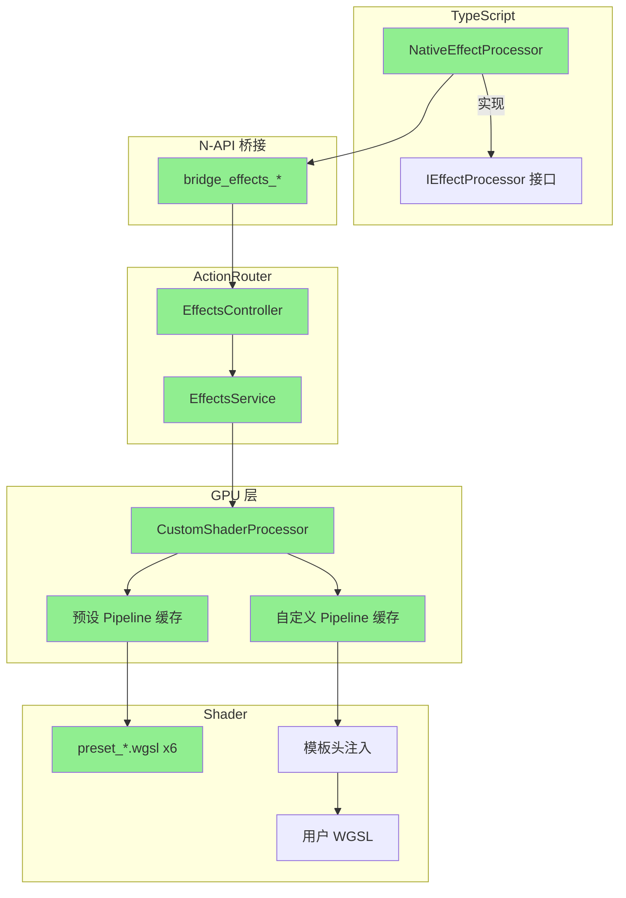

# neko-engine Shader 系统分析

> 最后更新：2026-02-25

## 概述

neko-engine 提供完整的 GPU Shader 系统，包括编译期静态嵌入的视频处理 Shader 和运行时自定义 Shader 支持。通过 `CustomShaderProcessor`，用户可使用 6 种内置预设效果，也可注册自定义 WGSL Shader 实现任意 GPU 计算效果。

---

## 1. 整体架构

```
TypeScript 接口层 (neko-types)
  ↓ 定义效果类型 + 参数契约
  ↓ IEffectProcessor → NativeEffectProcessor
N-API 桥接层 (neko-engine/native-napi)
  ↓ bridge_effects_* 函数
ActionRouter → EffectsController → EffectsService
  ↓ effects:list / effects:info / effects:apply / effects:register
CustomShaderProcessor (neko-engine/native-core/src/gpu/)
  ↓ 预设 pipeline 缓存 + 运行时 pipeline 注册
  ↓ DynamicUniforms (固定布局，16 个动态参数)
WGSL Shader 层 (shaders/*.wgsl)
  ↓ include_str!() 编译期嵌入（预设）
  ↓ create_shader_module() 运行时编译（自定义）
wgpu 硬件加速 (Metal / Vulkan / DirectX)
```

---

## 2. 自定义 Shader 系统（已实现）

### 2.1 核心组件

| 组件 | 文件 | 说明 |
|------|------|------|
| `CustomShaderProcessor` | `native-core/src/gpu/custom_shader_processor.rs` | GPU 处理器：预设/自定义 pipeline 管理、shader 编译、帧处理 |
| `EffectsService` | `native-core/src/services/impls/effects.rs` | 服务层：封装 `Mutex<CustomShaderProcessor>`，提供线程安全访问 |
| `EffectsController` | `native-api/src/controllers/effects.rs` | 控制器：处理 `effects:*` action 请求 |
| `NativeEffectProcessor` | `extension/src/mediaEngine/NativeMediaEngine.ts` | TypeScript 侧 `IEffectProcessor` 实现 |

### 2.2 DynamicUniforms — 固定布局动态参数

所有预设和自定义 Shader 共享统一的 Uniform 结构：

```rust
#[repr(C)]
#[derive(Pod, Zeroable)]
struct DynamicUniforms {
    width: u32,
    height: u32,
    param_count: u32,
    _padding: u32,
    params: [f32; 16],  // 最多 16 个自定义参数
}
```

`ParamDef` 定义每个参数的名称、默认值和范围，`from_json_params()` 负责 JSON → Uniform 映射（含范围钳制）。

### 2.3 Shader 契约

所有 WGSL（预设和自定义）必须遵循：

```wgsl
@group(0) @binding(0) var<storage, read> input: array<u32>;      // 输入帧（packed RGBA）
@group(0) @binding(1) var<storage, read_write> output: array<u32>; // 输出帧
@group(0) @binding(2) var<uniform> uniforms: Uniforms;             // DynamicUniforms

@compute @workgroup_size(16, 16)
fn main(@builtin(global_invocation_id) global_id: vec3<u32>) { ... }
```

引擎提供 `unpack_rgba()` / `pack_rgba()` / `sample_at()` 辅助函数。

### 2.4 预设效果

6 种内置预设 Shader，编译期通过 `include_str!()` 嵌入：

| ID | 效果 | 参数 | 文件 |
|----|------|------|------|
| `pixelate` | 像素化 | `pixel_size` (1-100, default 8) | `shaders/preset_pixelate.wgsl` |
| `edge_detect` | 边缘检测（Sobel） | `threshold` (0-1, default 0.1), `strength` (0-3, default 1) | `shaders/preset_edge_detect.wgsl` |
| `posterize` | 色调分离 | `levels` (2-32, default 4) | `shaders/preset_posterize.wgsl` |
| `noise` | 噪声叠加 | `amount` (0-1, default 0.1), `time` (0-10000, default 0) | `shaders/preset_noise.wgsl` |
| `rgb_split` | RGB 通道分离 | `offset` (0-50, default 5), `angle` (0-6.28, default 0) | `shaders/preset_rgb_split.wgsl` |
| `wave_distort` | 波浪扭曲 | `amplitude` (0-100, default 10), `frequency` (0.1-50, default 5), `speed` (0-10, default 1), `time` (0-10000, default 0) | `shaders/preset_wave_distort.wgsl` |

### 2.5 运行时自定义 WGSL

用户可通过 `effects:register` 注册自定义 WGSL Shader。引擎自动注入标准 binding 和辅助函数：

```wgsl
// === 引擎自动注入 ===
struct Uniforms { width: u32, height: u32, param_count: u32, _padding: u32, params: array<f32, 16> }
@group(0) @binding(0) var<storage, read> input: array<u32>;
@group(0) @binding(1) var<storage, read_write> output: array<u32>;
@group(0) @binding(2) var<uniform> uniforms: Uniforms;
fn unpack_rgba(...) -> vec4<f32> { ... }
fn pack_rgba(...) -> u32 { ... }
fn sample_at(x: i32, y: i32) -> vec4<f32> { ... }

// === 用户代码 ===
{user_provided_wgsl}
```

安全策略：
- wgpu 的 `create_shader_module()` 内部调用 naga 验证，拒绝语法错误的 WGSL
- 编译失败时返回友好错误信息
- 自定义 Shader 与预设分开存储在 `custom_pipelines: HashMap<String, CachedPipeline>`

### 2.6 Action 路由

| Action | 说明 | 参数 |
|--------|------|------|
| `effects:list` | 列出所有可用 Shader（预设 + 自定义） | — |
| `effects:info` | 获取 Shader 参数定义 | `shaderId` |
| `effects:apply` | 应用效果到帧数据 | `data`(base64), `width`, `height`, `shaderId`, `params` |
| `effects:register` | 注册自定义 WGSL Shader | `id`, `code`, `params[]` |

### 2.7 TypeScript 集成

`NativeEffectProcessor` 实现 `IEffectProcessor` 接口：

```typescript
class NativeEffectProcessor implements IEffectProcessor {
    initialize(): Promise<void>           // 获取 GPU 信息
    processFrame(frame, w, h, effects)    // 逐个应用 custom 效果
    processPipeline(frame, w, h, pipeline) // 过滤启用效果，按 order 排序
    registerCustomShader(id, code)         // 注册自定义 WGSL
    dispose(): void                        // 释放资源
}
```

---

## 3. 内置 Shader 系统

### 3.1 TypeScript 接口层

**文件**: `packages/neko-types/src/types/mediaEngine/effects.ts`

支持的效果类型联合：

```typescript
export type GpuEffectParams =
    | ColorCorrectionParams   // 13 个参数
    | BlurParams              // radius, quality
    | SharpenParams           // amount, radius
    | ChromaKeyParams         // keyColor, similarity, smoothness, spillSuppression
    | LutParams               // lutData, intensity
    | CustomEffectParams      // shaderId, uniforms → CustomShaderProcessor
    | VignetteEffectParams;   // intensity, radius, softness
```

### 3.2 Rust 类型层

**文件**: `packages/neko-engine/packages/types/src/effects.rs`

```rust
pub enum EffectType {
    Blur, Sharpen, ColorCorrection, Brightness, Contrast,
    Saturation, Hue, Exposure, Gamma, Vignette,
    ChromaticAberration, FilmGrain,
    Custom,  // → CustomShaderProcessor
}
```

### 3.3 GPU 处理器清单

| 处理器 | 文件 | 功能 |
|--------|------|------|
| `GpuProcessor` | `processor.rs` | 色彩校正（13 参数完整管线） |
| `BlurProcessor` | `blur_processor.rs` | 模糊（box / gaussian / directional / radial / zoom） |
| `StyleProcessor` | `style_processor.rs` | 风格效果（vignette / film grain / glow / chromatic aberration） |
| `TransitionProcessor` | `transition_processor.rs` | 18 种转场效果 |
| `TextureCompositor` | `texture_compositor.rs` | 纹理格式多层合成 |
| `Compositor` | `compositor.rs` | 多层合成（最多 32 层，27 种混合模式，Porter-Duff alpha） |
| `CustomShaderProcessor` | `custom_shader_processor.rs` | 自定义效果（6 预设 + 运行时注册） |
| `NV12Renderer` | `nv12_renderer.rs` | NV12 格式渲染 |
| `RgbaToNv12` | `rgba_to_nv12.rs` | RGBA → NV12 格式转换 |
| `TextRenderer` | `text_renderer.rs` | GPU 文本渲染 |

辅助模块：

| 模块 | 文件 | 功能 |
|------|------|------|
| `GpuContext` | `context.rs` | wgpu Device/Queue/Adapter 管理 |
| `BufferPool` | `buffer_pool.rs` | GPU Buffer 对象池 |
| `GpuLayer` | `gpu_layer.rs` | 图层数据结构 |
| `GpuPipeline` | `gpu_pipeline.rs` | 渲染管线编排 |
| `HalImport` | `hal_import.rs` | 硬件抽象层纹理导入 |
| 平台导入/导出 | `macos_*.rs` / `linux_*.rs` / `windows_*.rs` | 平台特定纹理共享 |

### 3.4 WGSL Shader 文件

**外部 Shader 文件**（`packages/neko-engine/packages/native-core/shaders/`）：

| 文件 | 内容 |
|------|------|
| `common.wgsl` | 通用工具函数（rgb_to_hsl, luminance, saturate3 等） |
| `blend_modes.wgsl` | 26 种 Photoshop 兼容混合模式函数 |
| `color_correction.wgsl` | 色彩校正函数（exposure, contrast, HSL, temperature 等） |
| `effects.wgsl` | 视频效果函数（blur, sharpen, vignette 等） |
| `transitions.wgsl` | 视频转场效果函数 |
| `easing.wgsl` | 30+ 种缓动函数（含 cubic-bezier） |
| `preset_pixelate.wgsl` | 像素化效果 |
| `preset_edge_detect.wgsl` | 边缘检测（Sobel） |
| `preset_posterize.wgsl` | 色调分离 |
| `preset_noise.wgsl` | 噪声叠加 |
| `preset_rgb_split.wgsl` | RGB 通道分离 |
| `preset_wave_distort.wgsl` | 波浪扭曲 |

**内联 Compute Shader**（定义在 `src/gpu/shaders/mod.rs`）：

| 常量 | 用途 |
|------|------|
| `COLOR_CORRECTION_COMPUTE_SHADER` | 纹理格式色彩校正 |
| `COLOR_CORRECTION_SHADER` | 存储缓冲区格式色彩校正（Legacy） |
| `BLEND_MODE_COMPUTE_SHADER` | 纹理格式混合模式 |
| `BLUR_COMPUTE_SHADER` | 5 种模糊算法 |
| `SHARPEN_COMPUTE_SHADER` | Unsharp Mask 锐化 |
| `VIGNETTE_COMPUTE_SHADER` | 暗角效果 |
| `FILM_GRAIN_COMPUTE_SHADER` | 胶片颗粒噪声 |
| `GLOW_COMPUTE_SHADER` | 辉光/泛光效果 |
| `CHROMATIC_ABERRATION_COMPUTE_SHADER` | 色差效果 |
| `TRANSITION_COMPUTE_SHADER` | 18 种转场（双帧输入） |
| `COMPOSITOR_SHADER` | 多层合成（RGBA + YUV420P） |

---

## 4. 关键文件索引

### 自定义 Shader 系统

| 类别 | 文件路径 | 说明 |
|------|---------|------|
| GPU 处理器 | `native-core/src/gpu/custom_shader_processor.rs` | `CustomShaderProcessor` + `DynamicUniforms` + `ParamDef` |
| 服务层 | `native-core/src/services/effects.rs` | `IEffectsService` trait |
| 服务实现 | `native-core/src/services/impls/effects.rs` | `EffectsService` |
| 控制器 | `native-api/src/controllers/effects.rs` | `EffectsController` |
| 路由 | `native-api/src/router.rs` | `effects` group 路由 |
| N-API 桥接 | `native-napi/src/bridge.rs` | `bridge_effects_*` 函数 |
| Action 注册 | `types/src/registry.rs` | `groups::EFFECTS` + `actions::EFFECTS` |
| TS 实现 | `extension/src/mediaEngine/NativeMediaEngine.ts` | `NativeEffectProcessor` |
| 预设 Shader | `native-core/shaders/preset_*.wgsl` | 6 个预设效果 |

### 内置 Shader 系统

| 类别 | 文件路径 | 说明 |
|------|---------|------|
| TS 接口 | `neko-types/src/types/mediaEngine/effects.ts` | `IEffectProcessor` + `GpuEffectParams` |
| Rust 类型 | `neko-engine/packages/types/src/effects.rs` | `EffectType` + `EffectParams` |
| Shader 模块 | `native-core/src/gpu/shaders/mod.rs` | 内联 Shader + `include_str!()` 加载 |
| WGSL 文件 | `native-core/shaders/` | 12 个 .wgsl 文件 |
| GPU 处理器 | `native-core/src/gpu/*.rs` | 10 个处理器 |
| GPU 基础 | `native-core/src/gpu/context.rs` | wgpu Device/Queue/Adapter |
| Buffer 池 | `native-core/src/gpu/buffer_pool.rs` | GPU Buffer 对象池 |

---

## 5. 架构图


