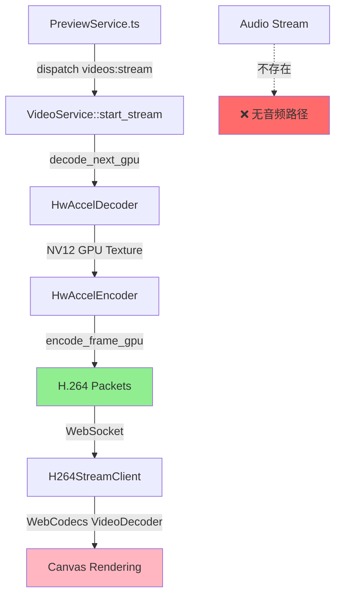
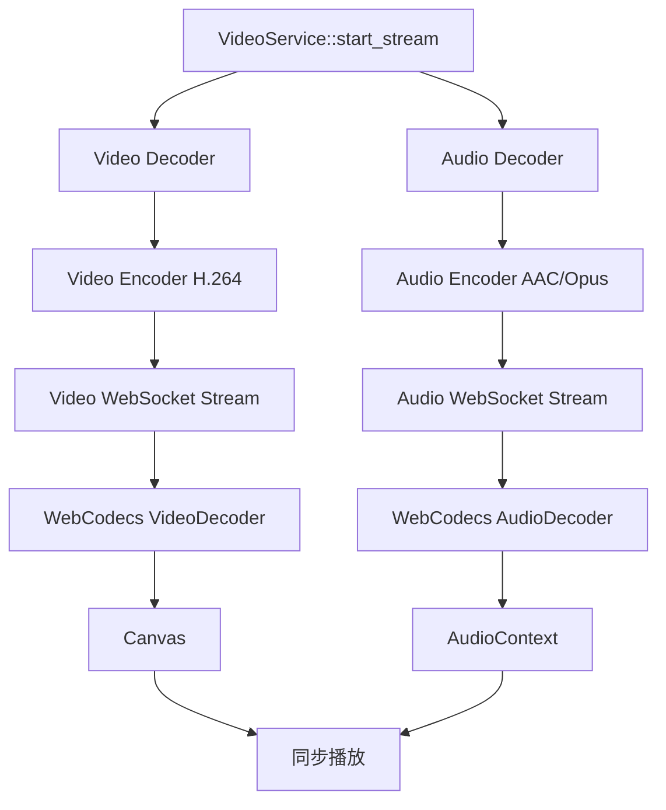

# 视频预览流问题分析报告

## 问题概述

1. **视频播放卡顿/延迟**
2. **输出流中没有音频**

## 架构分析

### 当前数据流



---

## 问题 A：视频卡顿分析

### FramePacer 实现机制

**位置**: `stream_loop.rs:129-169`

```rust
pub struct FramePacer {
    interval: tokio::time::Interval,
    fps: f64,
    speed: f64,
}

impl FramePacer {
    pub fn new(fps: f64, speed: f64) -> Self {
        let effective_speed = speed.max(0.1);
        let duration = Duration::from_secs_f64(1.0 / (fps * effective_speed));
        let mut interval = tokio::time::interval(duration);
        interval.set_missed_tick_behavior(MissedTickBehavior::Skip);
        // ...
    }
}
```

### 关键发现

#### 1. **MissedTickBehavior::Skip 导致帧丢失**

**问题**:
- 当解码/编码耗时超过帧间隔时，`MissedTickBehavior::Skip` 会跳过错过的 tick
- 这会导致帧被丢弃，造成视觉上的卡顿

**代码位置**: `stream_loop.rs:145`
```rust
interval.set_missed_tick_behavior(MissedTickBehavior::Skip);
```

**影响**:
- 30fps 视频，每帧间隔 ~33ms
- 如果 decode + encode 耗时 > 33ms，下一个 tick 会被跳过
- 结果：实际帧率 < 目标帧率

#### 2. **同步阻塞操作**

**问题**: 解码和编码在同一个 tick 周期内完成

**代码位置**: `video.rs:438-464`
```rust
_ = pacer.tick() => {
    // ... 状态处理 ...

    let frame_result = tokio::task::spawn_blocking(move || -> Result<Option<Vec<FrameData>>> {
        // 1. 解码 (阻塞)
        let gpu_texture = match d.decode_next_gpu()? {
            Some(t) => t,
            None => return Ok(None),
        };

        // 2. 编码 (阻塞)
        let packets = Encoder::encode_frame_gpu(&mut *e, gpu_handle, pts)?;

        // 3. 打包
        let frames: Vec<FrameData> = packets
            .iter()
            .map(|p| pack_h264_frame(p, tex_width, tex_height))
            .collect();

        Ok(Some(frames))
    }).await;
}
```

**时序问题**:
```
Tick 1: [等待] → [解码 20ms] → [编码 15ms] → [发送] = 35ms (超时!)
Tick 2: [跳过] (因为 Tick 1 超时)
Tick 3: [等待] → [解码 20ms] → [编码 15ms] → [发送] = 35ms (超时!)
```

#### 3. **编码器延迟 (EAGAIN)**

**代码位置**: `video.rs:472-476`
```rust
Ok(Ok(Some(frames))) if !frames.is_empty() => {
    for frame in frames {
        let _ = tx.send(frame);
    }
}
Ok(Ok(Some(_))) => {
    // Encoder returned no packets (EAGAIN / needs more input)
    // This is normal - continue decoding more frames
    continue;
}
```

**问题**:
- H.264 编码器可能需要多帧输入才输出一个编码帧（B 帧重排序）
- 虽然代码设置了 `max_b_frames(0)`，但仍可能有延迟
- 这会导致解码和编码不同步

---

## 问题 B：音频缺失分析

### 核心发现：**视频流完全不处理音频**

#### 1. **VideoService::start_stream 只处理视频**

**代码位置**: `video.rs:340-526`

```rust
async fn start_stream(
    &self,
    source: &Path,
    session_id: &str,
) -> Result<(StreamId, broadcast::Receiver<FrameData>)> {
    // ❌ 只打开视频解码器
    let mut decoder = HwAccelDecoder::with_hw_accel(HwAccelType::Auto);
    decoder.open(&path)?;

    // ❌ 只配置视频编码器
    let mut encoder = HwAccelEncoder::new();
    let encoder_config = EncoderConfig::new(width, height, fps, VideoCodec::H264);

    // ❌ 解码循环只处理视频帧
    loop {
        let gpu_texture = match d.decode_next_gpu()? {
            Some(t) => t,
            None => return Ok(None),
        };

        let packets = Encoder::encode_frame_gpu(&mut *e, gpu_handle, pts)?;
        // ...
    }
}
```

**缺失的组件**:
- ❌ 没有音频解码器
- ❌ 没有音频编码器
- ❌ 没有音频流同步机制
- ❌ 没有音频数据传输路径

#### 2. **HwAccelDecoder 只解码视频流**

**代码位置**: `hwaccel.rs:75-85`

```rust
pub struct HwAccelDecoder {
    input_ctx: Option<ffmpeg::format::context::Input>,
    decoder: Option<ffmpeg::decoder::Video>,  // ❌ 只有视频解码器
    stream_index: usize,                       // ❌ 只存储视频流索引
    // ... 没有音频相关字段
}
```

#### 3. **WebSocket 只传输视频帧**

**代码位置**: `stream_loop.rs:172-190`

```rust
pub fn pack_h264_frame(packet: &EncodedPacket, width: u32, height: u32) -> FrameData {
    // 只打包 H.264 视频数据
    let header_size = 8 + 8 + 1 + 8; // pts + dts + is_keyframe + duration
    let mut data = Vec::with_capacity(header_size + packet.data.len());
    data.extend_from_slice(&packet.pts.to_le_bytes());
    data.extend_from_slice(&packet.dts.to_le_bytes());
    data.push(if packet.is_keyframe { 1 } else { 0 });
    data.extend_from_slice(&packet.duration.to_le_bytes());
    data.extend_from_slice(&packet.data);  // ❌ 只有视频 NAL 数据

    FrameData {
        data,
        width,
        height,
        format: FrameFormat::H264,  // ❌ 只有 H264 格式
        timestamp: packet.pts as f64 / 1_000_000.0,
    }
}
```

#### 4. **前端只处理视频解码**

**代码位置**: `H264StreamClient.ts:163-182`

```typescript
this.decoder = new VideoDecoder({  // ❌ 只有 VideoDecoder
    output: (frame) => {
        this.stats.framesDecoded++;
        this.config.onFrame(frame);
    },
    error: (error) => {
        console.error('[H264StreamClient] Decoder error:', error);
        this.config.onError(error);
    },
});

this.decoder.configure({
    codec: 'avc1.42E01E',  // ❌ 只配置 H.264 视频
    hardwareAcceleration: 'prefer-hardware',
    optimizeForLatency: true,
});
```

**缺失的组件**:
- ❌ 没有 `AudioDecoder`
- ❌ 没有 `AudioContext` 播放音频
- ❌ 没有音视频同步逻辑

---

## 解决方案

### 方案 A：修复视频卡顿

#### A1. 改用 MissedTickBehavior::Burst

```rust
// stream_loop.rs:145
interval.set_missed_tick_behavior(MissedTickBehavior::Burst);
```

**优点**: 不会丢帧，保证所有帧都被处理
**缺点**: 可能导致突发流量，增加延迟

#### A2. 解耦解码和编码（推荐）

```rust
// 使用双缓冲队列
let (decode_tx, decode_rx) = tokio::sync::mpsc::channel(4);
let (encode_tx, encode_rx) = tokio::sync::mpsc::channel(4);

// 解码线程
tokio::spawn(async move {
    loop {
        let texture = decoder.decode_next_gpu()?;
        decode_tx.send(texture).await?;
    }
});

// 编码线程
tokio::spawn(async move {
    loop {
        let texture = decode_rx.recv().await?;
        let packets = encoder.encode_frame_gpu(texture)?;
        encode_tx.send(packets).await?;
    }
});

// 发送线程（带帧率控制）
loop {
    pacer.tick().await;
    if let Ok(packets) = encode_rx.try_recv() {
        for packet in packets {
            tx.send(pack_h264_frame(&packet, width, height))?;
        }
    }
}
```

#### A3. 动态调整帧率

```rust
// 监控实际处理时间
let start = Instant::now();
let frame = decode_and_encode().await?;
let elapsed = start.elapsed();

// 如果处理时间 > 帧间隔，降低目标帧率
if elapsed > frame_interval {
    let actual_fps = 1.0 / elapsed.as_secs_f64();
    pacer.update_speed(actual_fps / target_fps);
}
```

---

### 方案 B：添加音频支持

#### B1. 架构设计



#### B2. Rust 端修改

**1. 修改 VideoService::start_stream**

```rust
async fn start_stream(
    &self,
    source: &Path,
    session_id: &str,
) -> Result<(StreamId, broadcast::Receiver<FrameData>)> {
    // 探测媒体信息
    let media_info = probe_media_info(source)?;

    // 创建视频流
    let (video_stream_id, video_tx, video_rx, ...) =
        create_stream_channels(&format!("{}_video", session_id), 64);

    // 如果有音频，创建音频流
    let audio_stream = if media_info.has_audio {
        let (audio_stream_id, audio_tx, audio_rx, ...) =
            create_stream_channels(&format!("{}_audio", session_id), 64);

        // 启动音频解码循环
        spawn_audio_decode_loop(source, audio_tx, ...);

        Some((audio_stream_id, audio_rx))
    } else {
        None
    };

    // 启动视频解码循环（现有逻辑）
    spawn_video_decode_loop(source, video_tx, ...);

    // 返回复合流信息
    Ok((video_stream_id, video_rx, audio_stream))
}
```

**2. 添加音频解码循环**

```rust
fn spawn_audio_decode_loop(
    source: &Path,
    tx: broadcast::Sender<FrameData>,
    cancel: CancellationToken,
) {
    tokio::spawn(async move {
        let mut decoder = FfmpegAudioDecoder::new()
            .with_output_format(SampleFormat::F32);
        decoder.open(source)?;

        let mut encoder = FfmpegAudioEncoder::new();
        let config = AudioEncoderConfig::new(48000, 2, AudioCodec::Aac);
        encoder.open(&config)?;

        loop {
            tokio::select! {
                _ = cancel.cancelled() => break,
                _ = async {
                    // 解码音频帧
                    let audio_frame = decoder.decode_next()?;

                    // 编码为 AAC
                    let packets = encoder.encode_frame(&audio_frame.data, audio_frame.samples)?;

                    // 发送
                    for packet in packets {
                        let frame_data = FrameData {
                            data: packet.data,
                            width: audio_frame.sample_rate,
                            height: audio_frame.channels as u32,
                            format: FrameFormat::Aac,  // 新增格式
                            timestamp: audio_frame.timestamp,
                        };
                        tx.send(frame_data)?;
                    }
                } => {}
            }
        }
    });
}
```

**3. 扩展 FrameFormat**

```rust
// neko_types/src/lib.rs
pub enum FrameFormat {
    H264,
    Aac,      // 新增
    Opus,     // 新增
    Rgba,
    Jpeg,
}
```

#### B3. 前端修改

**1. 创建音频解码器**

```typescript
// AudioStreamClient.ts
export class AudioStreamClient {
    private decoder: AudioDecoder | null = null;
    private audioContext: AudioContext | null = null;
    private sourceNode: AudioBufferSourceNode | null = null;

    async connect(websocketUrl: string) {
        this.audioContext = new AudioContext();

        this.decoder = new AudioDecoder({
            output: (audioData) => {
                this.playAudioData(audioData);
            },
            error: (error) => {
                console.error('Audio decode error:', error);
            },
        });

        this.decoder.configure({
            codec: 'mp4a.40.2',  // AAC-LC
            sampleRate: 48000,
            numberOfChannels: 2,
        });

        this.ws = new WebSocket(websocketUrl);
        this.ws.binaryType = 'arraybuffer';
        this.ws.onmessage = (event) => {
            this.handleAudioPacket(event.data);
        };
    }

    private handleAudioPacket(data: ArrayBuffer) {
        const packet = parseAudioPacket(data);
        const chunk = new EncodedAudioChunk({
            type: 'key',  // AAC 每帧都是关键帧
            timestamp: packet.pts,
            data: packet.audioData,
        });
        this.decoder.decode(chunk);
    }

    private playAudioData(audioData: AudioData) {
        // 将 AudioData 转换为 AudioBuffer 并播放
        const buffer = this.audioContext.createBuffer(
            audioData.numberOfChannels,
            audioData.numberOfFrames,
            audioData.sampleRate
        );

        // 复制数据
        for (let ch = 0; ch < audioData.numberOfChannels; ch++) {
            const channelData = new Float32Array(audioData.numberOfFrames);
            audioData.copyTo(channelData, { planeIndex: ch });
            buffer.copyToChannel(channelData, ch);
        }

        // 播放
        const source = this.audioContext.createBufferSource();
        source.buffer = buffer;
        source.connect(this.audioContext.destination);
        source.start();

        audioData.close();
    }
}
```

**2. 修改 VideoPlayer 集成音频**

```typescript
// VideoPlayer.tsx
case 'preview:streamReady': {
    const { streamUrl, audioStreamUrl } = msg.payload;

    // 视频流
    const videoClient = new H264StreamClient({
        websocketUrl: streamUrl,
        width: info?.width || 1920,
        height: info?.height || 1080,
        onFrame,
        onConnectionChange: setIsConnected,
    });
    videoClientRef.current = videoClient;
    videoClient.connect();

    // 音频流（如果存在）
    if (audioStreamUrl) {
        const audioClient = new AudioStreamClient();
        audioClientRef.current = audioClient;
        audioClient.connect(audioStreamUrl);
    }
    break;
}
```

**3. 音视频同步**

```typescript
// 使用 PTS 同步
class AVSync {
    private videoPts: number = 0;
    private audioPts: number = 0;
    private audioContext: AudioContext;

    onVideoFrame(frame: VideoFrame) {
        this.videoPts = frame.timestamp;

        // 如果视频超前音频 > 阈值，暂停视频
        if (this.videoPts - this.audioPts > 100000) {  // 100ms
            this.pauseVideo();
        }
    }

    onAudioData(audioData: AudioData) {
        this.audioPts = audioData.timestamp;

        // 如果音频超前视频，延迟播放
        const delay = (this.audioPts - this.videoPts) / 1000000;
        if (delay > 0) {
            setTimeout(() => this.playAudio(audioData), delay * 1000);
        } else {
            this.playAudio(audioData);
        }
    }
}
```

---

## 实施优先级

### 高优先级（立即修复）

1. **修复视频卡顿** - 方案 A2（解耦解码编码）
   - 影响：用户体验差
   - 工作量：中等（2-3 天）
   - 风险：低

### 中优先级（下个迭代）

2. **添加音频支持** - 方案 B（完整音频管道）
   - 影响：功能缺失
   - 工作量：大（1-2 周）
   - 风险：中（需要音视频同步）

---

## 技术债务

1. **FramePacer 设计缺陷**
   - `MissedTickBehavior::Skip` 不适合实时流
   - 建议重构为自适应帧率控制

2. **缺少性能监控**
   - 无法追踪解码/编码耗时
   - 建议添加 tracing spans

3. **音频架构缺失**
   - 当前设计完全忽略音频
   - 需要重新设计流架构

---

## 测试建议

### 卡顿问题测试

```bash
# 1. 测试不同分辨率
- 1080p 30fps
- 4K 30fps
- 1080p 60fps

# 2. 测试不同编码器预设
- Fast
- Medium
- Slow

# 3. 监控指标
- 实际帧率 vs 目标帧率
- 解码耗时
- 编码耗时
- WebSocket 延迟
```

### 音频测试

```bash
# 1. 测试不同音频格式
- AAC
- MP3
- Opus

# 2. 测试音视频同步
- 测量 A/V 延迟
- 验证长时间播放不漂移

# 3. 测试边界情况
- 纯视频文件
- 纯音频文件
- 多音轨文件
```

---

## 总结

### 卡顿原因

1. ✅ **FramePacer 使用 Skip 模式** - 导致帧丢失
2. ✅ **解码编码同步阻塞** - 超过帧间隔时间
3. ✅ **编码器延迟 (EAGAIN)** - B 帧重排序

### 音频缺失原因

1. ✅ **VideoService 只处理视频流** - 完全没有音频解码
2. ✅ **HwAccelDecoder 只解码视频** - 没有音频解码器
3. ✅ **WebSocket 只传输视频** - 没有音频数据通道
4. ✅ **前端只有 VideoDecoder** - 没有 AudioDecoder 和 AudioContext

### 建议

**短期**:
- 修改 `MissedTickBehavior` 为 `Burst`
- 添加性能监控日志

**长期**:
- 重构为解耦的解码/编码管道
- 实现完整的音频支持
- 添加自适应帧率控制
