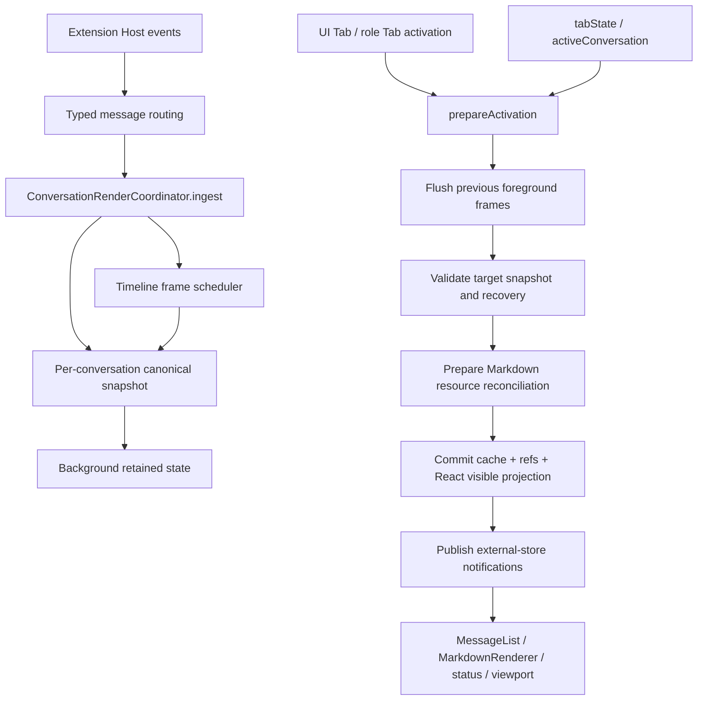

## Context

Neko Agent Webview already has a canonical active-turn model: `conversationStreaming.activeTurnTimeline`. The remaining lifecycle problem is not missing event identity or ordering; it is that one conversation is represented simultaneously by several independently mutated state surfaces:

1. visible React state (`messages`, thinking, streaming id, queue state, active Tab);
2. mutable refs used by message handlers;
3. `conversationMessagesRef` and `conversationStreamingRef` per-conversation caches;
4. Timeline frame scheduling and recovery ownership;
5. normalized Markdown parser sessions and external-store subscriptions;
6. ChatView-local scroll/focus state;
7. Extension-owned `tabState` and `activeConversation` snapshots.

The immediate failure occurred when a cached Timeline survived while its Markdown registry entry did not. React restored the Timeline and `MarkdownRenderer` correctly rejected the missing Timeline-owned session. Similar non-atomic transitions can also present as stale status/time, foreground input being disabled by another conversation, or auto-scroll remaining attached to the wrong conversation.

This is a local VS Code Webview and Extension Host problem. The design therefore introduces one small Webview-local coordinator and explicit ports; it does not introduce a distributed store, a cross-extension framework, or a new durable protocol.

### Five-Layer Analysis

#### Responsibility

- Extension Host owns durable conversation selection, open Tab snapshots, and delivery of typed conversation/Timeline events.
- The Webview render coordinator owns the current in-memory render snapshot for each conversation, background ingestion, foreground activation, and scoped cleanup.
- `activeTurnTimeline` remains the authority for live active-turn ordering.
- Persisted `Message.contentBlocks` remains the authority for completed-history reload when no active Timeline exists.
- Normalized Markdown sessions are renderer resources derived from Timeline items; they are not an independent conversation state authority.
- ChatView owns DOM measurement and user scroll intent, while per-conversation viewport intent is stored through a coordinator-owned port so it cannot leak across Tabs.

#### Dependency

- The coordinator stays in `@neko-agent/webview` and depends only on Webview-local presenters/types plus small injected ports.
- Webview continues to receive Extension state through `postMessage`; it does not import `vscode` or Node APIs.
- Extension does not import React or Webview implementations.
- No change is required in Rust, Proto, `@neko/ui`, or another feature package.
- A shared extraction is deferred until a second Webview demonstrates the same lifecycle contract.

#### Interface

- Internal contracts use discriminated, readonly snapshots and explicit mutation results.
- Host message DTOs remain unchanged.
- Activation returns a prepared transaction/publication rather than causing observers to run during partial mutation.
- Unknown conversation ids, unavailable snapshots, stale revisions, missing required renderer resources, and bypassed activation paths fail visibly.

#### Extension

- Additional Timeline-derived renderer resources can be added behind the resource reconciliation port without editing every Tab handler.
- New activation sources call the same coordinator method rather than duplicating cache/ref/React commit logic.
- Per-conversation UI metadata can grow through focused sub-snapshots without turning the coordinator into a generic application store.

#### Testing

- Pure coordinator tests cover state transitions, revisions, background isolation, activation ordering, cleanup, and invalid states.
- Handler tests poison direct setters or legacy activation helpers to prove every host/UI entry point uses the coordinator.
- Markdown registry tests cover snapshot reconciliation and scoped disposal.
- React tests cover Tab switching, queue/input availability, status freshness, and scroll intent.
- Extension Development Host validation covers real Webview hide/reveal, StrictMode/remount, background streaming, and foreground restoration.

## Goals / Non-Goals

**Goals:**

- Establish one canonical Webview-local render snapshot per conversation.
- Make all foreground activation paths atomic from the renderer's perspective.
- Allow hidden conversations to ingest Timeline, queue, status, and message changes without mutating foreground UI state.
- Derive and reconcile normalized Markdown resources from canonical Timeline snapshots.
- Prevent scroll, input, queue, elapsed-time, and status state from leaking between conversations.
- Give cleanup explicit conversation, Webview, and active-turn scopes.
- Remove direct activation paths that can still return success outside the canonical coordinator.
- Preserve fail-visible renderer and protocol behavior.

**Non-Goals:**

- Replacing all `ConversationController` state with Zustand.
- Persisting active Timeline/parser state across VS Code restart.
- Keeping hidden conversations mounted in the DOM.
- Changing Timeline DTOs, provider streaming protocols, or completed-history persistence.
- Redesigning Markdown syntax/style rendering, tool cards, task cards, queue UX, or message visuals.
- Creating a generic transaction framework or resource manager for unrelated Webviews.

## Decisions

### 1. Introduce one `ConversationRenderCoordinator` as the Webview lifecycle owner

The coordinator owns a map of canonical immutable snapshots:

```ts
interface ConversationRenderSnapshot {
  readonly conversationId: string;
  readonly revision: number;
  readonly messages: readonly Message[];
  readonly streaming: ConversationStreamingSnapshot;
  readonly viewport: ConversationViewportSnapshot;
  readonly lifecycle: 'retained' | 'disposed';
}

interface ConversationStreamingSnapshot {
  readonly streamingMessageId: string | null;
  readonly isThinking: boolean;
  readonly queuedMessageCount: number;
  readonly queuedMessages: readonly QueuedMessage[];
  readonly messageQueueVersion?: number;
  readonly activeTurnTimeline?: ActiveTurnTimelineState;
  readonly lastActivityAt?: number;
}
```

The exact existing message/queue types are reused. `revision` increases for every accepted mutation to that conversation, including background-only changes. The coordinator does not own settings, models, plugins, project files, or unrelated controller state.

Core operations:

```ts
interface ConversationRenderCoordinator {
  read(conversationId: string): ConversationRenderSnapshot | undefined;
  ingest(mutation: ConversationRenderMutation): ConversationRenderCommit;
  prepareActivation(input: ConversationActivationInput): ConversationActivationCommit;
  captureViewport(conversationId: string, viewport: ConversationViewportSnapshot): void;
  disposeConversation(conversationId: string): void;
  disposeAll(): void;
}
```

Rationale: the current duplicated cache/ref/state setters are the coupling point. A focused coordinator centralizes lifecycle without replacing React as the visible UI mechanism.

Rejected alternative: move all Webview state to one Zustand store. This broadens the change, mixes settings/feature state with conversation rendering, and does not by itself solve renderer-resource publication ordering.

Rejected alternative: retain independent helpers per handler. That leaves correctness dependent on every future activation source reproducing the same order.

### 2. Keep visibility and Timeline recovery as orthogonal state axes

Do not model every combination as one large enum. The coordinator tracks:

```ts
type ConversationVisibility = 'foreground' | 'background';
type TimelineSynchronization = 'synchronized' | 'suspended' | 'unavailable';
type ConversationRetention = 'retained' | 'disposed';
```

Rules:

- exactly zero or one retained conversation is foreground;
- background conversations may own synchronized or suspended Timelines;
- unavailable Timeline ownership is released before snapshot commit;
- disposed conversations cannot ingest or activate without an explicit fresh host snapshot;
- completed turn status belongs to Timeline items/turn completion and is not a conversation visibility state.

Rationale: orthogonal axes avoid a combinatorial state machine while preserving illegal-state checks.

### 3. Foreground activation is a prepared commit with ordered publication

Activation is executed in four phases:

```text
1. Flush pending Timeline frames for the previously visible conversation.
2. Project and validate the target canonical conversation snapshot.
3. Reconcile renderer resources from the target snapshot.
4. Commit coordinator/cache/refs/React visible state, then publish observers.
```

The prepared activation contains the full visible projection and publications:

```ts
interface ConversationActivationCommit {
  readonly snapshot: ConversationRenderSnapshot;
  commitVisibleState(target: ConversationVisibleStatePort): void;
  publish(): void;
}
```

`publish()` is single-use and throws on a second call. Renderer-resource notifications cannot run before `commitVisibleState()`.

Normal UI Tabs, character-role Tabs, Extension `tabState`, and Extension `activeConversation` call this same operation. Direct activation helpers are deleted or reduced to private adapters that construct `ConversationActivationInput`.

Rationale: React state updates are scheduled, while external-store notifications can be synchronous. Preparing and ordering publication prevents renderers from observing a half-committed owner state.

Rejected alternative: batch with React APIs alone. React batching does not include module registries, refs, frame schedulers, or external-store notifications.

### 4. Background ingestion updates only the owning conversation snapshot

Every incoming conversation-scoped mutation is reduced against the snapshot identified by the message `conversationId`.

For a background conversation, ingestion SHALL:

- flush/coalesce its Timeline frame through the existing scheduler;
- update its messages, streaming state, queue state, last activity, and revision;
- reconcile parser state only when needed for active streaming continuity;
- avoid writing foreground refs or React-visible conversation state;
- avoid scrolling or focusing the foreground DOM;
- optionally update lightweight Tab badge/status projection from the snapshot revision.

When the conversation becomes foreground, activation reads the latest snapshot rather than replaying UI handlers.

Rationale: background work must continue, but background DOM rendering is unnecessary and creates focus/scroll coupling.

### 5. Markdown sessions are a concrete derived resource, with a narrow reconciliation port

Keep the strict normalized Markdown registry. Introduce a narrow coordinator dependency rather than a generic plugin registry:

```ts
interface TimelineMarkdownResourceOwner {
  prepareSnapshot(timeline: ActiveTurnTimelineState): RenderResourcePublication;
  disposeConversation(conversationId: string): void;
  disposeAll(): void;
}
```

`prepareSnapshot()` performs the existing `commitTimelineSnapshot()` behavior. Missing Markdown resources are reconstructed from Timeline item content, source generation, item revision, and status. Identity mismatches throw. `MarkdownRenderer` continues to reject Timeline-owned rendering without a session.

The port is intentionally Markdown-specific. A generic renderer-resource registry will be introduced only if another independently disposable Timeline-derived resource appears.

Rationale: this removes lifecycle independence while avoiding speculative abstraction.

### 6. Visible React state becomes a projection port, not a second owner

`ConversationController` retains React state required by existing components, but mutations flow through one adapter:

```ts
interface ConversationVisibleStatePort {
  commit(snapshot: ConversationRenderSnapshot): void;
  clear(): void;
}
```

The port updates the existing setters and refs together. Handler code does not individually call `setMessages`, `setStreamingMessageId`, queue setters, active conversation setters, and cache setters during activation.

The per-conversation maps move behind the coordinator. Transitional read-only access may remain during migration, but production writes outside the coordinator are poisoned in tests and then removed.

Rationale: this permits incremental migration without a broad component rewrite.

### 7. Scroll and focus intent are isolated per conversation

Store only user intent and a stable anchor, not raw DOM nodes:

```ts
interface ConversationViewportSnapshot {
  readonly followMode: 'follow-tail' | 'detached';
  readonly anchorMessageId?: string;
  readonly anchorOffset?: number;
}
```

Rules:

- background mutations never invoke scroll APIs;
- switching away captures the current conversation viewport intent;
- switching back restores the anchor when possible;
- an active stream follows the tail only when that conversation was already in `follow-tail` mode;
- user upward scrolling changes only that conversation to `detached`;
- composer focus is preserved across background mutations and is changed only by explicit foreground interaction.

Rationale: a global “scroll to bottom while streaming” flag causes the foreground to inherit background activity.

### 8. Queue/input and status/time derive from the active snapshot revision

The composer availability decision reads the active conversation snapshot, not global “any Agent is running” state. If the active session allows queued input, running work does not disable the editor; submission appends to that conversation's queue contract.

Status and elapsed-time presenters subscribe to the active snapshot revision and a UI-local monotonic ticker. Background changes advance only their own snapshot revision. Switching Tabs immediately projects the target status and time baseline.

Rationale: status freeze and input coupling arise when global flags are shared across conversations or presenters update only for selected mutation types.

### 9. Cleanup has explicit scopes

- `disposeConversation(conversationId)`: invoked when a conversation is permanently removed/closed according to product semantics; clears snapshot, Timeline scheduler work, Markdown resources, subscriptions, and viewport intent for only that conversation.
- `releaseTurn(conversationId, messageId)`: releases obsolete active-turn resources after canonical completion/history handoff when no active renderer consumes them.
- `disposeAll()`: Webview realm teardown only. React StrictMode effect cleanup must not be treated as durable conversation deletion; remount activation reconstructs derived resources from retained host/coordinator snapshots.
- hiding/revealing a Webview is not conversation disposal.

Every disposal operation is idempotent only where host lifecycle can legitimately repeat it. Illegal mutation after conversation disposal fails visibly.

Rationale: the prior module-wide cleanup and per-conversation cache had different lifetimes.

### 10. Diagnostics identify ownership and bypass failures

Use stable diagnostic codes/messages for:

- activation requested for an unavailable Timeline;
- Markdown resource required but registry/owner missing;
- stale or decreasing conversation render revision;
- background mutation attempting to update visible state;
- activation publication before visible-state commit;
- direct production write outside the coordinator;
- mutation after conversation disposal;
- host snapshot identity mismatch.

Diagnostics include `conversationId`, `messageId`/`turnId` when available, activation source, current revision, and target revision. They must not silently clear messages, return empty state, or fall back to completed-history rendering for an active Timeline.

## State and Data Flow



## Risks / Trade-offs

- **[Risk] Coordinator becomes a second general-purpose store** → Keep its contract limited to conversation render snapshots, visibility, viewport intent, and renderer lifecycle; settings/plugins/models remain outside.
- **[Risk] Transitional dual writes hide missed migration paths** → Poison direct cache/setter writes in path-level tests, migrate one entry-point group at a time, then remove writable legacy access before acceptance.
- **[Risk] React scheduled updates still render after synchronous publication** → Publication occurs only after the visible-state port commits all setters/refs; tests use external-store subscribers that synchronously inspect owner state.
- **[Risk] Background Markdown parsing consumes unnecessary CPU** → Preserve current frame coalescing; background ingestion maintains streaming session continuity but does not render DOM. Measure long Markdown streams before adding throttling.
- **[Risk] Viewport anchor cannot be restored after virtualization/layout changes** → Prefer stable message/item identity; fall back to the nearest retained anchor only at this presentation boundary, never to unconditional bottom-scroll.
- **[Risk] StrictMode cleanup disposes module resources twice** → Separate component-effect detach from Webview realm disposal and test mount/unmount/remount explicitly.
- **[Risk] Host and Webview snapshots arrive out of order** → Require monotonic conversation render/Timeline revisions and reject stale ownership rather than guessing.
- **[Trade-off] Existing React setters remain temporarily** → This minimizes migration risk; they become private behind the visible-state port instead of being immediately replaced.

## Migration Plan

1. Add characterization tests for all four activation sources, background ingestion, input/status isolation, viewport behavior, StrictMode remount, and scoped cleanup.
2. Define coordinator, immutable snapshot, visible-state port, Markdown resource owner, and diagnostics without changing production routing.
3. Move existing per-conversation maps behind the coordinator and migrate Timeline/background ingestion first.
4. Migrate normal UI Tab and character-role Tab activation to `prepareActivation()`.
5. Migrate Extension `tabState` and `activeConversation` activation.
6. Migrate queue/status/time and viewport intent to read the active canonical snapshot revision.
7. Poison and remove direct production writes to the migrated cache/setter paths and delete redundant activation helpers.
8. Run focused tests, full Webview tests/build, Agent evaluation if message projection behavior changes, and Extension Development Host scripted switching validation.

Rollback is Webview-local: revert coordinator routing and restore the previous helpers while retaining Timeline DTOs. No user data rollback or migration is required.

## Open Questions

- Whether closing a UI Tab means permanent conversation disposal or only background retention must follow current product semantics; implementation tests should characterize the existing behavior before wiring `disposeConversation`.
- The existing virtualized `MessageList` anchor API should be audited before finalizing `anchorOffset`; if stable item anchoring is already available, reuse it rather than introducing another measurement cache.
- If status/time freshness can be fixed solely by subscribing to snapshot revision, no additional periodic state should enter the coordinator; elapsed display ticking should remain a UI-local concern.
