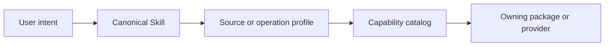
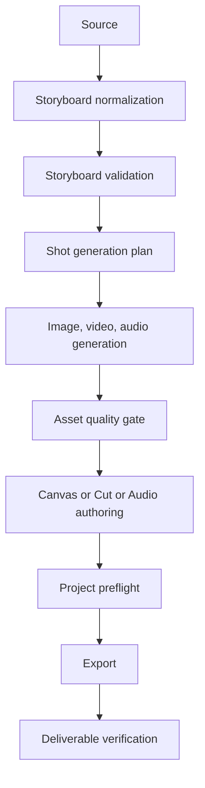
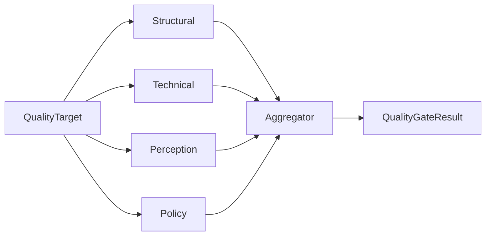

## Context

当前 builtin Skill 同时混合三种层次：用户意图（如 `video-editing`）、来源方法（如 `comic-to-storyboard`）和内部转换阶段（如 `storyboard-to-animation-plan`、`animation-plan-to-cut`、`generated-shot-assembly`、`export-video-package`）。图片和视频执行能力已经存在于 Agent Media Provider、Sketch、Canvas、Cut 与 Audio，但缺少统一用户语义；`ai-generate` 还在 Skill 内复制部分 tool schema，使 Skill content/metadata 与 runtime capability schema 存在漂移风险。

当前 Quality runtime 以 `mediaPath + prompt` 为主要输入，通过多模态 LLM、可选 FrameExtractor、AudioAnalyzer 和 CLIP scorer 评估图片、视频、音频及跨镜头一致性。它没有 canonical ResourceRef/revision contract，也不拥有 `.nks/.nkv/.nkp/.nkm/.nka` 的结构真值，因此不能证明质量证据对应当前项目版本，也不能单独承担 Export readiness 或最终交付文件验证。

本变更跨越 Skill catalog、Agent capability、Story/Content 归一化、Media Provider、Sketch/Canvas/Cut/Audio headless authoring、`.nk*` validator 与质量聚合。设计必须保持以下约束：

- Skill content 只拥有创作方法和任务判断，不复制工具协议、schema、命令教程或子包 authoring 细节。
- 功能包拥有自己的 durable project facts 和 validator；中央编排不能直接解析所有 `.nk*`。
- Protobuf 仍是 Engine 通信 SSOT；共享 TypeScript contract 只承担 Agent/Extension/领域 API 所需的稳定 DTO。
- 系统是本地 VSCode 客户端 + 本地 Rust Engine，API-first 表示 contract/port-first，不表示引入远程服务治理。
- 预发布迁移默认移除旧双轨成功路径；缺失 operation、provider、validator 或 adapter 必须 fail-visible。

利益相关方包括创作者、Agent/Skill runtime、各创作包 owner、媒体 Provider adapter、Engine/FFmpeg 分析层、项目文件持久化和发布质量门禁。

## Goals / Non-Goals

**Goals:**

- 将用户可见媒体创作入口收敛为少量稳定 Skill，并把来源差异和内部阶段降为 profile/stage。
- 允许 prompt、text、script、document、comic、image sequence 和 existing storyboard 生成或修订统一 Storyboard。
- 为图片和单视频 clip 定义稳定 operation vocabulary，同时保持执行能力由 owning package/provider 决定。
- 建立 Storyboard → generation → asset QC → timeline/audio post → pre-export QC → export → deliverable verification 的 canonical workflow。
- 建立 ResourceRef/revision-bound 的质量目标、证据和 Gate contract，支持本地 deterministic analyzer 与可替换 perception provider。
- 让 `.nk*` owning package 暴露统一形状但领域实现独立的 validation/preview/export-readiness API。
- 用路径级测试证明 canonical Skill、canonical authoring API 和当前 revision 被命中，旧阶段型入口未参与默认成功路径。

**Non-Goals:**

- 不在本变更中实现每一种图片/视频模型或承诺所有 Provider 支持全部 operation。
- 不把 Canvas、Cut、Sketch、Audio、Puppet 或 Model 的内部实现移动到 `neko-skills`。
- 不让中央 Quality 层复制 `.nk*` codec、timeline、scene graph、rig 或 audio project 业务规则。
- 不要求每次生成都调用昂贵外部感知模型；默认只强制 operation-local contract validation 和显式 Gate。
- 不建立云端多租户质量服务、分布式任务平台或远程数据库。
- 不在没有持久化需求时把全部 QualityEvidence 写回项目文件；优先使用稳定 sidecar/index，并单独评估格式版本升级。

## Decisions

### 1. 用“用户 Skill + profile/stage + capability”三层模型替代平级 Skill 链

用户可见 canonical Skill：

- `storyboard`
- `image`
- `video`
- `media-production`
- `video-editing`
- `media-quality-review`

`comic-to-storyboard`、`image-to-shot` 等来源差异成为 profile；AnimationPlan、Cut payload、generated shot assembly 和 export package 成为 typed workflow stage/artifact builder；实际 mutation 仍由 capability catalog 中的 owning operation 执行。

选择该模型是因为用户只需理解创作意图，而 profile 可以在不新增顶级 Skill 的情况下扩展来源。拒绝继续为每个转换步骤新增 Skill，因为它会扩大路由空间、重复 prompt 并暴露内部 artifact 形状。也拒绝创建一个全能 `create-media` Skill，因为 Storyboard、单素材操作、项目编排和质量审查具有不同生命周期、风险和确认边界。

普通 Skill 不再依赖 `command` 字段作为入口；显式调用使用现有 `$skill` namespace，自然语言由 Agent 根据 catalog metadata 激活。只有真正的 command artifact 才进入 Slash catalog。

### 2. Storyboard 使用统一 canonical contract，来源适配器保持独立

新增共享 Storyboard contract，至少包含：scene/shot 标识、顺序、叙事意图、画面描述、对白/声音提示、镜头语言、时长建议、角色/风格/资源引用、source trace、revision 和 validation state。最终具体落点根据既有公共能力审计决定放入 `@neko/shared` 或 Story owning contract；不得在 Canvas、Cut 和 Skill 中分别定义同义 DTO。

来源 adapter：

- prompt/text/script：Story planning
- document：Content 提取结构与资源后再路由文本或视觉 profile
- comic/image sequence：感知/OCR/panel mapping，保留漫画 reading order 规则
- existing storyboard：revision-aware refine

所有来源输出同一 Storyboard contract。Canvas 只投影视觉节点/ReviewNode，Cut 只消费经过 validation 的 handoff，不成为 Storyboard 真值。

Storyboard 中的生成有效意图必须保持两类独立语义：`imagePrompt` 属于 shot，用于单帧图片生成或编辑；`videoPrompt` 属于 scene，用于汇总该场有序 shot beats、主体动作、运镜衔接、环境变化、声音/对白、总时长与约束。为兼容当前表格投影，scene-level `videoPrompt` 存放在该 scene 第一条 shot，但其语义不得退化为逐镜头视频提示词。画面描述、动作摘要、运镜备注、状态和 diagnostic 都不能替代这两个 prompt，也不得折叠为单一“生成提示词”。Story planning → canonical Storyboard → Canvas/Cut/Webview 的 projection 必须无损保留这两类意图。

旧 `generationPrompt` 仅作为 `imagePrompt` 的受限迁移输入保留，由 canonical Storyboard contract owner 负责移除；新规划和新投影不得写入或显示它，执行时必须优先使用 `imagePrompt`，测试需 poison 旧值以证明 legacy 字段未覆盖 canonical 意图。移除条件是已存量 Storyboard/Canvas prompt migration 完成且 legacy-debt 检查不再发现生产读取方。资源 alias 只能在声明 scope 内唯一绑定；匹配多个资源时必须返回可见 binding diagnostic，并停止生成带虚假来源的 Storyboard 行。

拒绝直接把 `comic-to-storyboard` 改名并扩大 accepted modalities，因为漫画 OCR/panel 约束不适用于普通剧本，且会让一个 prompt 同时承担互斥方法。

### 3. Image/Video operation vocabulary 与 Provider schema 分离

建立 capability-neutral operation ids：

- Image：generate、edit、inpaint、outpaint、upscale、colorize、style-transfer、composite、split、background-remove/replace、prepare-shot-reference。
- Video：generate-from-prompt、generate-from-image、generate-from-keyframes、transform、restyle、extend、enhance、trim/retime、prepare-for-timeline。

Skill 只选择 operation 和创作约束。Capability catalog 返回每个 adapter 的支持级别：`supported | degraded | unsupported`，以及缺失 model/provider/input 的 diagnostic。Provider-specific 参数由 adapter schema 拥有；Skill 不复制 schema。首尾帧、reference video 和 edit instruction 复用现有 media request contract，但需要 capability negotiation，不能从字段存在推断 provider 一定支持。

Sketch 拥有 selection/inpaint/layer/colorize 等 `.nks` authoring；Canvas 拥有节点合成、ShotNode 和关键帧关系；Cut 拥有 timeline clip editing；Engine 拥有确定性 raster/media 操作时的重计算。两个以上包复用的 operation request/result/diagnostic 才提取到中立共享层。

### 4. `media-production` 是可恢复编排，不是跨包业务实现

`media-production` 维护 workflow run、stage 状态、artifact refs、approval 和 diagnostics，不直接修改 `.nk*`。每个 mutation 通过既有或扩展后的 headless authoring API 执行：

Stage artifact 使用 stable ResourceRef/project ref，不保存 cache path、Webview URI、engine session id 或 provider task handle 作为 durable identity。长任务沿用 Agent task/generated asset lifecycle；取消和恢复从已完成 stage artifact 继续，不能靠重放 Webview message 猜测状态。

Stage 失败时返回明确 diagnostic，并保留之前成功 artifact；默认不跳过失败 Gate。修复必须产生新的 asset/project revision，并使旧 evidence 失效。

### 5. Quality 采用四类 evaluator 和统一聚合器

Quality core 定义：

- `QualityTarget`：ResourceRef/project ref、kind、revision、time range、expected intent、lineage。
- `QualityEvidence`：evaluator id/version、target identity/revision、metrics、issues、locations、confidence、createdAt、source refs。
- `QualityGatePolicy`：required profiles、阈值、blocking severity、允许的人工批准。
- `QualityGateResult`：pass/fail/manual-review、evidence refs、stale 状态、repair plan。

Evaluator 分类：

1. Structural：schema、required fields、refs、graph、timeline、runtime/profile availability。
2. Technical：decode/probe、codec、resolution、fps、black/frozen frame、LUFS、peak、silence。
3. Perception：prompt/script adherence、aesthetics、composition、character/style/motion consistency。
4. Policy：项目/平台交付规则和阈值。

外部感知模型通过 `PerceptionEvaluator` port 接入，可以替换当前 multimodal LLM 或 CLIP scorer；本地 ONNX 也实现同一 port。外部 evaluator 不获得任意本地路径，必须通过授权后的 ResourceRef/materialization boundary 取得最小必要媒体。技术和结构检查不能因感知 Provider 不可用而伪装成功；policy 可将缺失感知证据判为 manual-review 或 fail。

### 6. `.nk*` 质量验证由 owning package 实现统一 facade

定义小型共享 facade 形状，而不是共享 parser：

- `validateProject`
- `getProjectSnapshot`
- `renderPreview`
- `probeRuntime`
- `checkExportReadiness`

`.nks`、`.nkv`、`.nkp`、`.nkm`、`.nka` 各自实现领域 validator。Quality orchestrator 只调用 facade 并聚合 evidence。未知 schema/version、缺失资源、非法 runtime/cache identity、timeline/graph 错误或 adapter unavailable 必须 fail-visible。

Preview 是派生资源，使用稳定 target/revision 作为证据身份；render URI 只用于当前会话展示。中央 Quality 不得把成功渲染当作结构验证成功，也不得只凭文件存在判断项目有效。

### 7. 三层 Gate 与 revision invalidation

- Operation-local validation：由 image/video/audio/storyboard operation 所有者执行，检查请求完成、资源可读、基础尺寸/时长/格式和 mutation 成功；它不是完整审美评分。
- Pre-export gate：验证当前 `.nk*` revision、资源完整性、final-cut/音频/字幕/画幅、所需感知证据和用户批准。
- Post-export gate：验证最终 deliverable 的 container/codec/decode、轨道、时长、分辨率/fps、黑帧/冻结/截断、响度/峰值及 source revision lineage；policy 可要求最终感知复审。

任何影响 target 的编辑都会生成新 revision 或内容摘要。Gate 查询发现 evidence revision 不匹配时必须标记 stale，不能沿用旧 pass。导出结果记录 source project revision；修复后必须重新 preflight、export 和 post-export verification。

### 8. 依赖方向与五层分析

**职责**

- Skills：创作语义、方法、profile 选择和输出风格。
- Agent runtime：Skill 激活、capability discovery、workflow task/approval/恢复。
- Shared contracts：最小跨包 DTO、ResourceRef、diagnostics、quality envelope。
- Owning packages：项目真值、authoring、validator、preview/export readiness。
- Engine：FFmpeg/codec、重计算、媒体探测和本地推理。
- Provider adapters：外部生成和感知模型映射。

**依赖**

`neko-skills` 只依赖 shared/agent types；不直接依赖 Canvas/Cut/Sketch 内部。功能包之间通过 shared contract、extension API、capability registry 或 authoring port 连接。Webview 不参与 headless workflow truth，也不直接调用 VSCode/Node。

**接口**

先定义 Storyboard、operation support、QualityTarget/Evidence/Gate、ProjectQuality facade 和 diagnostic；再修改 Skill metadata/content；最后接 provider/package 实现。所有 union/version 必须显式验证，未知值 fail-visible。

**扩展**

新增 Storyboard 来源只注册 source profile adapter；新增图片/视频模型只注册 operation support 和 provider adapter；新增项目格式只实现 ProjectQuality facade；新增感知模型只实现 PerceptionEvaluator。调用者无需按具体包名增加条件分支。

**测试**

- shared contract/schema 单测与 unknown-version/invalid-ref 测试；
- Skill content 防工具协议回流、catalog 和旧名称 poison 测试；
- Storyboard 各来源 fixture 与 canonical output contract test；
- Provider capability matrix 和 unsupported/degraded diagnostic 测试；
- owning package validator/headless authoring/save-reopen 测试；
- quality evaluator/aggregator、revision stale、pre/post export gate 测试；
- `pnpm test:agent:eval` 只作为 harness 自测；另按 `neko-agent-evaluation` 运行真实聚焦 case；
- 涉及 Webview 展示/交互时使用 Extension Development Host + vscode-extension-debugger smoke；
- Rust/FFmpeg 修改运行 cargo test 和对应 probe fixture。

**比例性**

只新增小型 contract、registry extension 和 facade，不新增远程服务、数据库或通用工作流平台。复用现有 Agent task、generated asset lifecycle、headless authoring、ProjectFileStore、EngineClient 和 provider registry。

**Fail-visible**

未知 Skill/profile/operation、Provider 不支持、缺失 authoring target、缺失 validator、未知 `.nk*` 版本、stale evidence、无法 materialize ResourceRef、export lineage 不匹配和旧入口命中均返回明确 diagnostic；不得 fallback 到旧 Skill、裸路径、active Webview 或默认成功。

### 9. 拒绝的替代方案

- **只改 Skill 名称**：不能解决 contract、能力发现、质量证据和阶段重复。
- **保留所有旧 Skill 作为永久 alias**：会继续扩大 catalog，并隐藏 canonical 路径未接通。
- **把 Quality 放进每个领域 Skill**：会复制评分标准、Provider 适配和报告逻辑；领域只保留局部 contract validation。
- **让中央 Quality 解析全部 `.nk*`**：破坏领域真值与包边界。
- **全部交给外部多模态模型**：无法可靠验证 codec、LUFS、schema、refs 和 timeline，且扩大隐私/成本边界。
- **只做 Export 后质检**：会把 Storyboard、角色一致性和时间线问题推迟到成本最高阶段。
- **QualityEvidence 全部写入 `.nk*`**：会迫使所有格式同步升级；先采用稳定 sidecar/index，只有领域确需携带证据时再版本化。

## Risks / Trade-offs

- [Risk] 变更范围跨多个 owning package，单次实现周期较长。 → 采用契约、Skill 收敛、Storyboard/Image/Video、Quality core、owning validators、production gates 的分阶段迁移，每阶段都有 canonical path poison test。
- [Risk] 统一 operation vocabulary 可能无法覆盖 Provider 特有能力。 → 通用 operation 只表达稳定用户意图，Provider-specific extension 留在 adapter schema，并通过 capability metadata 暴露而不是污染 Skill。
- [Risk] Storyboard canonical contract 与现有 CreativeTable/Canvas/Cut DTO 重叠。 → 先做 DTO 审计，明确一个真值和 projection adapter；禁止长期 dual-write。
- [Risk] revision 机制在不同 `.nk*` 包中不一致。 → 共享只规定 opaque revision/content digest 语义，各包用现有 revision 或持久化摘要实现；不强制统一内部状态模型。
- [Risk] 外部感知模型成本、隐私或不可用。 → Gate policy 明确 required/optional，默认本地技术检查继续运行；外发使用授权资源 materialization 和 provider trust 配置。
- [Risk] 移除旧 Skill 名称影响已有 prompt/fixture。 → 提供有期限、可观测迁移表；开发和新测试默认 poison 旧路径，迁移测试单独覆盖。
- [Risk] 自动修复形成无限循环或覆盖原素材。 → 评估默认只读；修复需要 approval、最大尝试次数、新 revision 和原始 evidence 保留。
- [Risk] post-export 全量感知复审耗时过高。 → 技术验证必需，感知复审由 policy/风险等级决定，可使用抽样但必须报告 coverage。

## Migration Plan

1. 盘点并冻结现有 builtin Skill、command metadata、toolDefinitions、workflow artifact 和 Quality 输入；建立旧到新 canonical 映射和 poison fixture。
2. 在共享层定义 Storyboard、operation support、QualityTarget/Evidence/Gate、ProjectQuality facade 和 diagnostics，补 contract tests。
3. 新增 canonical `storyboard`、`image`、`video`、`media-production`、`media-quality-review` Skill metadata/content；移除 Skill 正文中的 runtime tool schema 教程。
4. 接通 Story/Content/comic adapters，统一输出 Storyboard；Canvas/Cut 通过 projection/handoff 消费，不 dual-write。
5. 接通 Media/Sketch/Canvas/Cut 的 Image/Video operation registry，明确 supported/degraded/unsupported；未实现 operation fail-visible。
6. 将现有阶段型媒体 Skill 降为 internal profile/stage，更新 Agent catalog、evaluation scenarios 和文档；短期 alias 必须记录 telemetry/diagnostic、replacement 和移除条件。
7. 迁移 Quality runtime 到 ResourceRef/revision contract，拆分 structural/technical/perception/policy evaluator；为旧 `mediaPath` 增加拒绝或显式迁移入口，默认禁用 fallback。
8. 为 `.nks/.nkv/.nkp/.nkm/.nka` 分批实现 ProjectQuality facade，优先 `.nkv/.nks/.nka`，再 `.nkp/.nkm`；缺失实现时 Gate 返回 unavailable，不伪装通过。
9. 接通 media-production 的 asset Gate、pre-export gate、export lineage 与 post-export verifier；验证修复导致 evidence stale 并重新执行完整链路。
10. 删除到期 alias、旧 command 字段、重复 toolDefinitions、旧 Quality fixture 和旧阶段型成功路径，运行 legacy-debt/unused 检查并更新架构/领域文档。

Rollback 采用 fail-closed：若某 canonical operation 或 validator 未完成，返回 unavailable diagnostic，不恢复旧阶段型 Skill 或 active-Webview fallback。若需保护有价值本地数据，只回滚 catalog 可见性或启用明确 migration-only adapter，不回滚项目文件内容。

## Open Questions

- Canonical Storyboard contract 应放在 `@neko/shared` 还是由 `neko-story` 拥有并通过 extension API 暴露；实施前需完成 CreativeTable/Story/Canvas/Cut DTO 复用审计。
- QualityEvidence 默认 sidecar/index 的具体 owner 是 generated asset index、项目级 `.neko` metadata 还是新的共享 evidence store；需优先复用现有 asset/task storage，避免新增数据库。
- `.nkp/.nkm` 的 export readiness 是预览/运行态检查还是未来离线导出检查；首阶段可只实现结构和 runtime-probe profile，但必须明确 unavailable 范围。
- `image split` 首阶段是确定性裁切/网格切分、漫画 panel segmentation，还是包含通用语义分割；建议先拆成不同 operation profile，避免一个模糊 contract。
- `video enhance/extend/restyle` 哪些可列为 canonical supported operation，取决于当前 Provider adapter capability audit；无实现项只能进入 catalog 为 unsupported，不得用 prompt fallback 假装支持。
