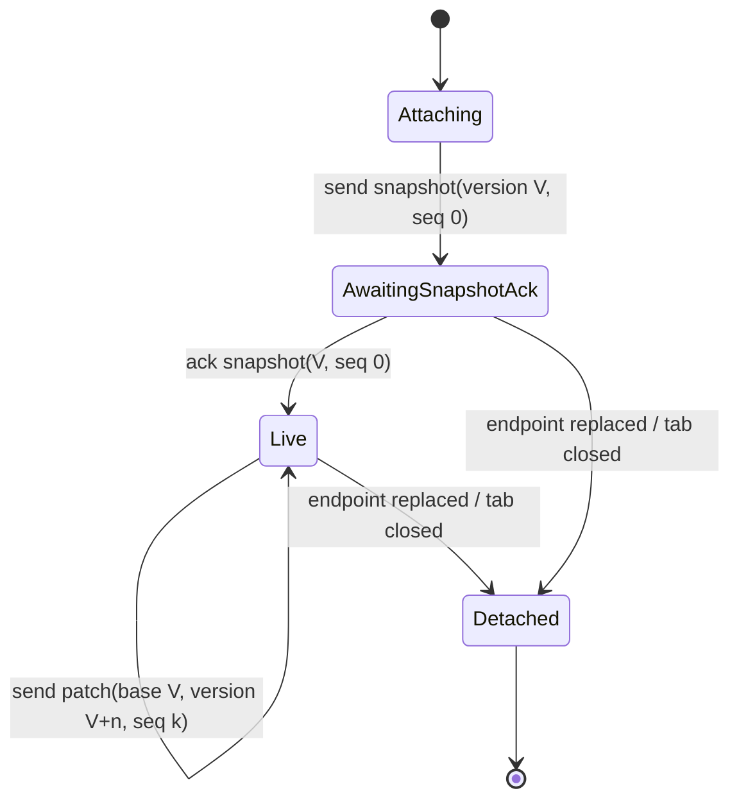

## Context

The Agent stack currently has several different notions of isolation:

- `AgentRuntimePool` partitions primary sessions by `conversationId`.
- `SubAgentRuntimeCoordinator` registers conversation runtimes but shares one `SubAgentManager` whose mutable instance map is keyed by bare `subAgentId`.
- `TaskManager` shares one mutable task map keyed by bare `taskId`; conversation/run ownership is optional lifecycle metadata on the value rather than part of the control contract.
- Webview state is partly stored in conversation maps, but one `ConversationController` renders one `ChatWorkspace`; input, attachment, model, generation, focus, scroll, composition, menu, Markdown, and Timeline state are saved/restored or projected through foreground state.
- model updates mutate Platform-wide runtime settings and are protected by global `hasRunningAgents()` and active-task locks, so unrelated Tabs affect each other.
- the Timeline protocol combines domain ordering, Extension coalescing, endpoint delivery revision, Webview validation, Markdown mutation, React commit scheduling, and reload recovery. Delivery revision is allocated before `postMessage` succeeds, and no Webview apply acknowledgement exists; a failed or reordered delivery therefore becomes a revision gap that snapshot recovery must mask.

The existing session-isolation and stream-delivery changes established explicit conversation routing and bounded streaming, but they did not create independent render runtimes or fully scoped child-run/config ownership. This change replaces the problematic boundary rather than adding another compatibility adapter.

Constraints:

- Neko Suite is a local VS Code client; the design must not introduce distributed-service machinery.
- Shared immutable catalogs, providers, tool definitions, host adapters, executors, and global resource concurrency limits remain shared.
- Webview remains sandboxed and communicates only through typed `postMessage` contracts.
- valuable conversation history, task recovery records, and user configuration must not be silently lost.
- rebuildable Webview caches and unreleased transport revisions can be discarded when the canonical replacement is active.

## Goals / Non-Goals

**Goals:**

- Make `conversationId` the only owner of mutable Agent session/config/projection state.
- Make Agent turns, SubAgents, and Tasks independently cancellable child scopes with complete owner identities.
- Allow concurrent conversations to run and change future-turn configuration without global locks or cross-session mutation.
- Give every open Webview Tab an independent render store and keyed component subtree; activation changes visibility only.
- Give every TUI root an independent application runtime and every hosted conversation an independent session/render controller.
- Replace revision-gap recovery during normal streaming with an explicit attachment handshake and one serialized projection queue.
- Remove superseded caches, foreground routing, global locks, and legacy Timeline recovery paths.
- Preserve bounded append delivery and avoid per-provider-chunk full snapshots or Markdown reparsing.

**Non-Goals:**

- one Extension Host, operating-system process, provider instance, tool catalog, or VS Code Webview per conversation;
- duplicated global resource pools or removal of global fairness/concurrency policies;
- changing durable conversation content formats, Rust Engine protocols, or Protobuf;
- retaining old unreleased message handlers as successful fallback paths.

## Decisions

### 1. Conversation runtime is the mutable execution owner

Introduce a small `ConversationRuntimeContext` owned by the existing runtime pool:

```ts
interface ConversationRuntimeContext {
  readonly conversationId: string;
  readonly config: ConversationConfigState;
  readonly session: AgentSessionRuntime;
  readonly runs: ConversationRunRegistry;
  readonly projection: ConversationProjectionStore;
  readonly lifecycle: 'restoring' | 'ready' | 'disposing' | 'disposed';
}
```

The context composes existing session/runner/turn implementations; it does not add provider/factory layers. Shared services are injected as immutable/service ports and cannot retain conversation-mutable state.

A closed Tab does not dispose this context while a run is active or recoverable. Runtime retention follows conversation/run lifecycle, not view lifecycle. Reopening history attaches a new view to the existing or restored conversation context.

**Rejected:** runtime owner = `tabId`. Tabs are disposable views and the same conversation may be reopened or represented by another view.

**Rejected:** separate Extension/Node process per conversation. It is disproportionate for a local client and does not remove incorrect in-process ownership contracts.

### 2. Configuration has three explicit levels

Configuration is split into:

```text
GlobalConfigDefaults            file/account/provider defaults for new/open contexts
ConversationConfigState         mutable future-turn selection for one conversation
TurnConfigSnapshot              immutable values captured when one turn starts
```

`updateConversationConfig(conversationId, patch)` updates only the named conversation. A running turn continues with its immutable snapshot. Changing the same conversation while a turn is active affects the next turn unless a field is explicitly session-structural and returns a scoped diagnostic.

Global `hasRunningAgents()` and global active-task model locks are removed. Global config writes remain user-owned and outside runtime selector updates.

### 3. Child execution uses complete scope keys

Define Layer-0 identities:

```ts
interface AgentRunKey {
  readonly conversationId: string;
  readonly runId: string;
}

interface ChildRunKey extends AgentRunKey {
  readonly parentRunId: string;
  readonly childRunId: string;
}
```

Task/SubAgent public control, event, persistence, cancellation, result-observation, and recovery paths require a complete scope. Internal globally unique physical IDs may remain implementation details, but no session-scoped caller can look up or cancel using only a bare ID.

`ConversationRunRegistry` owns run metadata and abort trees. Shared managers may retain executor registries and a global resource scheduler, but mutable entries are indexed by a composite serialized key and verify the expected owner before mutation.

```text
Conversation A / AgentRun A1
  ├─ SubAgent S1
  └─ Task T1
Conversation B / AgentRun B1
  ├─ SubAgent S1
  └─ Task T1
```

The same local child ID is valid in different conversations because the scope key is authoritative.

**Rejected:** rely on UUID uniqueness plus optional lifecycle metadata. It does not make cancellation or recovery ownership testable and allows malformed restored records to act globally.

### 4. Each Webview Tab owns a render runtime and keyed React subtree

Introduce a package-local `TabRenderRuntimeRegistry` because its lifecycle and DOM dependencies are Webview-specific. It stores one runtime per open `tabId`:

```ts
interface TabRenderRuntime {
  readonly tabId: string;
  readonly conversationId: string;
  readonly store: TabRenderStore;
  readonly attachment: ProjectionAttachmentClient;
  readonly lifecycle: 'attaching' | 'ready' | 'detached' | 'disposed';
}
```

The store owns conversation projection plus all Tab-local mutable UI state: input, attachments, references, model/config selection, generation parameters, prompt mode, composition, focus, scroll, menus, queued edits, Markdown sessions, and render diagnostics.

`ConversationController` becomes a Tab host and renders one keyed `ConversationTabRuntimeView` per retained Tab. Activation only changes `visibleTabId`; it does not copy state, change runtime ownership, flush/discard delivery, or overwrite one workspace's props with another conversation.

Host snapshots and Webview-originated message/streaming mutations enter one explicit conversation-scoped render-state mutation port. Foreground React state is an output projection for the active tabless surface only; effects MUST NOT write foreground values back into conversation maps, and hidden-conversation mutations MUST NOT invoke foreground setters.

Retention policy:

- running, attaching, composing, or dirty-input Tabs remain mounted;
- inactive clean historical Tabs may unmount their React subtree under a bounded policy, but their independent store and authoritative projection snapshot remain retained;
- remount restores only from that Tab runtime, never from the foreground workspace.

A single VS Code Webview endpoint remains shared. Isolation is at store, component tree, attachment, and owner-contract level, avoiding the memory cost of one Chromium Webview per Tab.

### 5. TUI roots and sessions use the same ownership rule without sharing Webview code

Each CLI/TUI application bootstrap creates an `AgentTuiApplicationRuntime`; module singletons cannot own mutable application/session state. A root hosting one conversation owns one session controller. If multi-conversation TUI is supported, it uses a map of independent `TuiConversationRuntime` instances and switches the visible tree without rebinding a singleton hook.

Only Layer-0 scope/config/projection contracts are shared with Webview. React DOM components, Ink components, focus semantics, and retention policy remain environment-owned.

### 6. Timeline becomes an internal authoritative projection

Keep ordered turn semantics, but stop exposing the current multi-purpose Timeline mutation protocol as the Webview authority.

```text
Agent domain/stream events
  -> ConversationProjectionStore (authoritative)
  -> ProjectionAttachmentQueue
  -> TabRenderRuntime store
  -> Markdown/render projection
```

`ConversationProjectionStore` owns immutable versioned turn projection. It coalesces adjacent text appends and latest-value progress updates before transport. It does not rebuild or send a full snapshot for every provider chunk.

The current terms may be migrated as follows:

- domain `Timeline item` -> ordered `TurnProjectionItem`;
- Extension delivery revision -> attachment-local `frameSequence`;
- item revision -> projection item version when mutation validation is required;
- Webview active Timeline -> Tab runtime projection replica.

The Conversation projection is authoritative; React commit order is not a transport authority.

### 7. Attach uses snapshot, ACK, then patch on one queue

Every render attachment is identified by:

```ts
interface ProjectionAttachmentKey {
  readonly endpointEpoch: string;
  readonly attachmentId: string;
  readonly tabId: string;
  readonly conversationId: string;
}
```

Lifecycle:



Rules:

1. Snapshot and later patches are selected and sent through one serialized attachment queue.
2. No patch is sent before the snapshot ACK.
3. Visibility changes do not alter attachment lifecycle.
4. Endpoint recreation invalidates all old attachment IDs and requires fresh attach snapshots.
5. ACK validates endpoint epoch, attachment, conversation, projection version, and frame sequence.
6. A gap or mismatched base version during `Live` is fail-visible and closes that attachment; it is not repaired by an unbounded snapshot request loop.
7. Reattachment is an explicit host lifecycle action and starts from a new authoritative snapshot.

This is intentionally not a reliable distributed log. The endpoint and Extension are local; one in-memory serialized queue plus explicit attach ACK is sufficient.

### 8. State restoration follows execution and view authorities

On Webview initialization:

1. Extension exposes open Tab bindings and endpoint epoch.
2. Webview creates one `TabRenderRuntime` per Tab.
3. Each runtime attaches to its conversation and receives an authoritative projection/config/session snapshot.
4. Webview ACKs and begins live frames.
5. The active Tab is made visible only after its own runtime reaches a renderable state; background Tabs continue independently.

Endpoint discovery includes an explicit Agent Webview protocol version and a Webview-realm identity generated once per mounted realm. The Extension echoes that realm identity with the endpoint epoch. A different realm identity on the same VS Code Webview means the browser realm was reloaded: the Extension abandons the old realm's attachment server without posting detach frames into the new realm, allocates a new endpoint epoch, and only then accepts new attachments. Repeated discovery from the same realm is idempotent. This distinguishes a retained stale Webview bundle after Extension Host restart, a same-Webview realm reload, and a malformed same-version message before attachments start.

On Extension restart, conversation/session persistence restores execution state where supported; Tab render caches are rebuilt. Old persisted `connectionEpoch`/delivery revision recovery descriptors are ignored and removed because they have no durable semantic value.

### 9. Fail-visible replaces compatibility fallback

The canonical path rejects:

- missing or mismatched conversation/run/attachment identity;
- bare-ID cancellation or lookup from session-scoped callers;
- patches before snapshot ACK;
- patch base-version mismatch or frame gap;
- updates targeting a disposed conversation or Tab runtime;
- unknown legacy Timeline messages once migration is complete.

Recovery remains only at real boundaries: external provider/task restart, valuable persisted task state, Webview endpoint recreation, and Extension restart. Diagnostics never report a failed mutation as successful.

## Five-Layer Analysis

### Responsibility

- Agent package: conversation runtime, run tree, turn projection authority.
- Shared Layer 0: identity/config/projection DTOs only.
- Extension: runtime registry composition, persistence adapters, endpoint attachment server.
- Webview: Tab render runtime registry, independent stores/component trees, attachment client.
- CLI TUI: application/session render runtime composition.
- Platform/provider/task executors: stateless/shared services and resource scheduling only.

### Dependency

Layer-0 contracts contain no VS Code, DOM, React, or Ink dependencies. Extension adapters depend on contracts and Agent runtime; Webview/TUI depend on contracts but not each other's implementations. No new feature-package cross-dependency is introduced.

### Interface

Interfaces are limited to stable ownership boundaries: scoped runtime keys, conversation config/turn snapshot, projection frames/ACK, and runtime lifecycle. No interface/factory/registry stack is added around single stable implementations; registries exist only where multiple concurrent conversation/Tab/run instances are real.

### Extension

Additional child-run types can reuse `ChildRunKey` and the run registry. Additional presentation environments can implement the projection attachment consumer without importing Webview code. New Tab-local UI state extends the Tab store rather than adding another global cache.

### Testing

- pure contract validators and scope-key mismatch tests;
- Agent runtime tests for concurrent conversations and scoped cancellation;
- Task/SubAgent tests that reuse local IDs across conversations;
- Extension attachment queue tests for snapshot/ACK/patch ordering and endpoint replacement;
- Webview tests for independent input/config/Markdown/scroll state and visibility-only switching;
- TUI bootstrap/session isolation tests;
- path assertions that poison removed global locks, foreground Timeline flush/discard, bare-ID controls, and legacy recovery handlers;
- focused Agent evaluation and Extension Development Host runtime smoke.

### Proportionality

The design adds only three real instance registries: conversation execution, child runs, and Tab rendering. It does not add processes, network consensus, durable event logs, retries, feature flags, dual protocols, or per-conversation copies of immutable infrastructure.

### Fail-Visible Behavior

All internal contract violations fail directly. Snapshot recovery is allowed only for explicit attach/reconnect; it cannot hide a gap produced by the canonical live queue. External provider and persisted user-data boundaries retain typed recovery diagnostics.

## Risks / Trade-offs

- **[Memory growth from mounted Tab trees]** -> use bounded retention; always retain independent store/projection, but allow clean inactive historical React trees to unmount.
- **[Large cross-package API migration]** -> land contract-first batches and migrate producers/consumers in one boundary before deleting each old path; do not keep successful dual routing.
- **[Background run lifetime outlives all Tabs]** -> conversation runtime retention is driven by run/recovery state, with explicit disposal after terminal persistence.
- **[Task records with missing ownership metadata]** -> valuable persisted records enter a migration/diagnostic path; ambiguous records are not attached to the active conversation.
- **[Projection frames grow too large]** -> preserve bounded append coalescing and maximum latency/byte policies; snapshots occur only on attach.
- **[Endpoint recreated during ACK]** -> epoch mismatch invalidates the old attachment and a new attach starts; no old frame is accepted.
- **[Existing parallel workspace changes]** -> stage and commit only explicitly owned files/hunks and avoid reset/clean operations.

## Migration Plan

1. Add scope/config/projection contracts and red regression tests. Poison legacy owner fallbacks in tests.
2. Introduce conversation config and immutable turn snapshots; migrate Webview/Extension selectors and remove global runtime locks.
3. Introduce scoped child-run registry; migrate SubAgent and Task control/events/recovery, then remove bare-ID session control paths.
4. Add Webview Tab render runtime registry/store and keyed component subtrees; migrate input/config/render state and remove save/restore caches.
5. Add TUI application/session runtime ownership and remove mutable module-singleton paths.
6. Add conversation projection store and attachment snapshot/ACK/patch protocol; migrate Extension/Webview producers and consumers.
7. Delete legacy Timeline delivery/recovery, foreground flush/discard, obsolete messages/tests, and rebuildable persisted recovery descriptors.
8. Run focused tests after every batch, then package builds/checks, Agent evaluation, legacy/unused checks, and VS Code Webview runtime smoke.

Rollback during development is commit-based by batch. There is no runtime dual-protocol rollback. Valuable durable history/config remains unchanged; ambiguous legacy task records fail closed with diagnostics until migrated.

## Open Questions

None blocking. Exact Tab retention limits and projection frame byte/latency budgets will reuse current measured defaults initially and can be tuned after runtime telemetry without changing ownership contracts.
