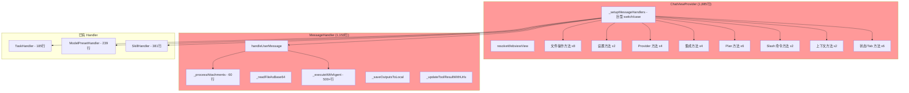
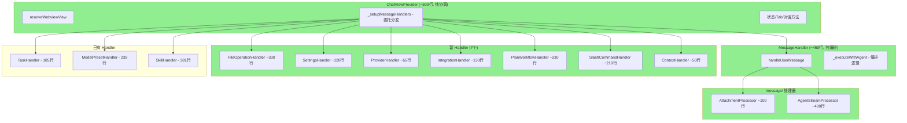

# ChatViewProvider/MessageHandler 拆分 + CLI 流式支持 重构文档

## 一、重构目标

ChatViewProvider (1,885行/45+方法/12+职责域) 和 MessageHandler (1,153行/500+行执行方法) 严重违反单一职责原则。本次重构将其拆分为独立 Handler，并为 CLI 添加真正的流式支持。

---

## 二、重构前架构



---

## 三、重构后架构



---

## 四、文件结构

```
packages/extension/src/chat/
├── chatProvider.ts              ← 精简到 ~500 行（纯协调）
├── messageHandler.ts            ← 精简到 ~460 行（纯消息编排）
├── handlers/
│   ├── index.ts                 ← 更新导出
│   ├── taskHandler.ts           （已有）
│   ├── modelPresetHandler.ts    （已有）
│   ├── skillHandler.ts          （已有）
│   ├── fileOperationHandler.ts  ← 新建：文件/URL 操作
│   ├── settingsHandler.ts       ← 新建：设置管理
│   ├── providerHandler.ts       ← 新建：Provider/Model 管理
│   ├── planWorkflowHandler.ts   ← 新建：Plan 模式工作流
│   ├── slashCommandHandler.ts   ← 新建：斜杠命令分发
│   ├── integrationHandler.ts    ← 新建：MCP/Workflow 集成
│   └── contextHandler.ts        ← 新建：上下文管理
├── message/
│   ├── index.ts                 ← 模块导出
│   ├── agentStreamProcessor.ts  ← 新建：Agent 事件流处理
│   └── attachmentProcessor.ts   ← 新建：附件/文件引用处理
└── ...（其他文件不变）
```

---

## 五、Handler 依赖接口设计

### 5.1 FileOperationHandler

```typescript
export interface FileOperationHandlerDeps {
  platform?: Platform;
}
```

**方法：** `openFile`, `openUrl`, `openPromptConfig`, `openAgentsFile`, `openSettingsFile`, `openSkillFile`, `openCommandFile`, `downloadSvg`

### 5.2 SettingsHandler

```typescript
export interface SettingsHandlerDeps {
  settings: SettingsManager;
  providers?: ProviderManager;
  platform?: Platform;
}
```

**方法：** `sendSettings(webview)`, `updateSettings(webview, settings)`

### 5.3 ProviderHandler

```typescript
export interface ProviderHandlerDeps {
  providers?: ProviderManager;
  settings: SettingsManager;
}
```

**方法：** `addModel`, `removeModel`, `toggleProvider`, `toggleModel`

### 5.4 PlanWorkflowHandler

```typescript
export interface PlanWorkflowHandlerDeps {
  conversations: ConversationHandler;
  agentManager?: IAgentManager;
  settings: SettingsManager;
  systemPrompt: SystemPromptManager;
  platform?: Platform;
  onSendMessage?: (webview, message) => void;
}
```

**方法：** `handleApprove`, `handleReject`, `handleStepAction`, `handleStepModify`, `updatePlanStatus`, `updatePlanStep`

### 5.5 SlashCommandHandler

```typescript
export interface SlashCommandHandlerDeps {
  conversations: ConversationHandler;
  agentManager?: IAgentManager;
  settings: SettingsManager;
  systemPrompt: SystemPromptManager;
  skillHandler: SkillHandler;
  taskHandler: TaskHandler;
  contextHandler: ContextHandler;
}
```

**方法：** `handleCommand(webview, command, args?)`, `sendStatusInfo(webview)`

### 5.6 IntegrationHandler

```typescript
export interface IntegrationHandlerDeps {
  context: vscode.ExtensionContext;
  onSettingsChanged?: () => void;
}
```

**方法：** `testMCPServer`, `testWorkflow`, `addMCPServer`, `addWorkflow`

### 5.7 ContextHandler

```typescript
export interface ContextHandlerDeps {
  conversations: ConversationHandler;
  agentManager?: IAgentManager;
}
```

**方法：** `getTokenCount(webview, conversationId?)`, `compressContext(webview, conversationId?)`

---

## 六、CLI 流式支持

### 当前状态

`PlatformLLMClient` 已删除。Extension 通过 `SharedServiceAdapter`（`toSharedService()`）将 Platform `Service` 适配为 `@neko/shared` 的 `IService`。CLI 使用 `BuiltinLLMClient` + `LLMServiceAdapter`。

### 目标

```
Extension 路径:
  Platform.Service → SharedServiceAdapter → @neko/shared IService → AgentSession

CLI 路径:
  BuiltinLLMClient → LLMServiceAdapter → @neko/shared IService → AgentSession
    ├── Anthropic: event: content_block_delta
    └── OpenAI/DeepSeek: data: {"choices":[{"delta":...}]}
```

### 新增类型

```typescript
export interface LLMStreamChunk {
  type: 'content' | 'tool_call' | 'thinking' | 'usage' | 'done';
  content?: string;
  thinking?: string;
  toolCall?: Partial<ToolCall>;
  usage?: { inputTokens: number; outputTokens: number };
}
```

---

## 七、实施进度

| Phase | 任务 | 状态 |
|-------|------|------|
| Phase 1 | 创建 `message/` 子目录 | ✅ 完成 |
| Phase 1 | AttachmentProcessor | ✅ 完成 |
| Phase 1 | AgentStreamProcessor | ✅ 完成 |
| Phase 1 | 精简 MessageHandler | ✅ 完成 (1,153→464行) |
| Phase 2 | FileOperationHandler | ⏳ 待开始 |
| Phase 2 | SettingsHandler | ⏳ 待开始 |
| Phase 2 | ProviderHandler | ⏳ 待开始 |
| Phase 2 | IntegrationHandler | ⏳ 待开始 |
| Phase 2 | ContextHandler | ⏳ 待开始 |
| Phase 2 | PlanWorkflowHandler | ⏳ 待开始 |
| Phase 2 | SlashCommandHandler | ⏳ 待开始 |
| Phase 2 | 更新 handlers/index.ts | ⏳ 待开始 |
| Phase 2b | 重构 ChatViewProvider 委托 | ⏳ 待开始 |
| Phase 3 | CLI LLMStreamChunk 类型 | ⏳ 待开始 |
| Phase 3 | BuiltinLLMClient.chatStream | ⏳ 待开始 |
| Phase 3 | LLMServiceAdapter.chatStream | ⏳ 待开始 |
| Phase 3 | ~~PlatformLLMClient.chatStream~~ | ✅ 已删除（由 SharedServiceAdapter 替代） |
| Phase 4 | Handler 单元测试 (7) | ⏳ 待开始 |
| Phase 4 | Message 处理器测试 (2) | ⏳ 待开始 |
| Phase 4 | CLI 流式测试 (2) | ⏳ 待开始 |
| Phase 5 | 编译验证 | ⏳ 待开始 |

---

## 八、风险控制

- **向后兼容**：ChatViewProvider 公开 API 不变（`resolveWebviewView`、`sendMessageToAssistant`、`setGenericConfigService`）
- **渐进式迁移**：每个 handler 独立提取，switch/case 保持不变，仅改委托目标
- **类型安全**：所有 handler 使用 Deps 接口，严格类型检查
- **deps 延迟更新**：保持现有 `(handler as any).deps = { ... }` 模式（与 TaskHandler 一致）
