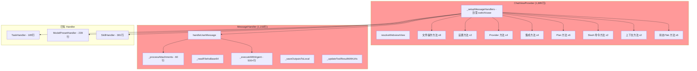
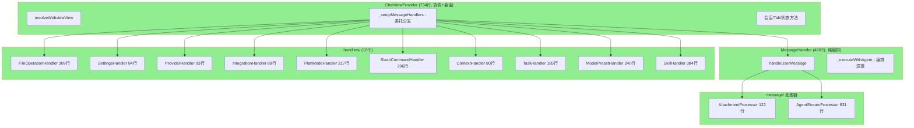

# ChatViewProvider/MessageHandler 拆分 + CLI 流式支持 重构文档

## 一、重构目标

ChatViewProvider (原 1,885行/45+方法/12+职责域) 和 MessageHandler (原 1,153行/500+行执行方法) 严重违反单一职责原则。本次重构将其拆分为独立 Handler，并为 CLI 添加真正的流式支持。

**Phase 1-2 已完成**：ChatViewProvider 1,885→734 行（-61%），MessageHandler 1,153→466 行（-60%），10 个独立 Handler + 2 个 Message 处理器。

---

## 二、重构前架构（Phase 0）



---

## 三、当前架构（Phase 2 完成）



---

## 四、文件结构（当前实际）

```
packages/extension/src/chat/
├── chatProvider.ts              734行（协调 + 会话 + Tab + HTML）
├── messageHandler.ts            466行（纯消息编排）
├── conversationHandler.ts       351行
├── conversationManager.ts       530行
├── systemPromptManager.ts       375行
├── providerManager.ts           194行
├── settingsManager.ts           127行
├── types.ts                     137行
├── handlers/
│   ├── index.ts                  17行（统一导出）
│   ├── taskHandler.ts           185行  任务管理
│   ├── modelPresetHandler.ts    240行  模型预设配置
│   ├── skillHandler.ts          384行  技能系统
│   ├── fileOperationHandler.ts  309行  文件/URL 操作
│   ├── settingsHandler.ts        84行  设置读写
│   ├── providerHandler.ts        93行  Provider/Model 管理
│   ├── planModeHandler.ts       317行  Plan 模式工作流
│   ├── slashCommandHandler.ts   296行  斜杠命令分发
│   ├── integrationHandler.ts     88行  MCP 集成
│   └── contextHandler.ts         80行  上下文管理
├── message/
│   ├── index.ts                  17行（模块导出）
│   ├── agentStreamProcessor.ts  631行  Agent 事件流处理
│   └── attachmentProcessor.ts   122行  附件/文件引用处理
└── ...（其他文件不变）

总计: ~4,063 行（chat/ 子目录）
```

---

## 五、Handler 依赖接口设计（实际实现）

### 5.1 FileOperationHandler (309行)

```typescript
export interface FileOperationHandlerDeps {
  platform?: Platform;
}
```

**方法：** `openFile`, `openUrl`, `openPromptConfig`, `openAgentsFile`, `openSettingsFile`, `openSkillFile`, `openCommandFile`, `downloadSvg`

### 5.2 SettingsHandler (84行)

```typescript
export interface SettingsHandlerDeps {
  settings: SettingsManager;
  providers?: ProviderManager;
  platform?: Platform;
}
```

**方法：** `sendSettings(webview)`, `handleUpdateSettings(webview, settings)`

### 5.3 ProviderHandler (93行)

```typescript
export interface ProviderHandlerDeps {
  settings: SettingsManager;
  providers?: ProviderManager;
  sendSettings: () => void;
  getWebview: () => vscode.Webview | undefined;
}
```

**方法：** `handleAddModel`, `handleRemoveModel`, `handleToggleProvider`, `handleToggleModel`

### 5.4 PlanModeHandler (317行)

```typescript
export interface PlanModeHandlerDeps {
  conversations: ConversationHandler;
  agentManager?: IAgentManager;
  settings: SettingsManager;
  systemPrompt: SystemPromptManager;
  platform?: Platform;
  messages?: MessageHandler;
}
```

**方法：** `handlePlanApprove`, `handlePlanReject`, `handlePlanStepAction`, `handlePlanStepModify`, `handleSetPromptMode`, `handleTogglePlanMode`, `sendPromptMode`

### 5.5 SlashCommandHandler (296行)

```typescript
export interface SlashCommandHandlerDeps {
  conversations: ConversationHandler;
  agentManager?: IAgentManager;
  settings: SettingsManager;
  systemPrompt: SystemPromptManager;
  skillHandler: SkillHandler;
  taskHandler: TaskHandler;
  contextHandler: ContextHandler;
  planModeHandler: PlanModeHandler;
  sendConversationList: () => void;
  sendActiveConversation: () => void;
}
```

**方法：** `handleCommand(webview, command, args?)`, `sendStatusInfo(webview)`

### 5.6 IntegrationHandler (88行)

```typescript
export interface IntegrationHandlerDeps {
  context: vscode.ExtensionContext;
  sendSettings: () => void;
}
```

**方法：** `handleTestMCPServer`, `addMCPServer`

### 5.7 ContextHandler (80行)

```typescript
export interface ContextHandlerDeps {
  conversations: ConversationHandler;
  agentManager?: IAgentManager;
}
```

**方法：** `getTokenCount(webview, conversationId?)`, `compressContext(webview, conversationId?)`

### 5.8 TaskHandler (185行)

```typescript
export interface TaskHandlerDeps {
  platform?: Platform;
  taskManager?: TaskManager;
}
```

**方法：** `sendTasks`, `handleCancelTask`, `handleRemoveTask`, `handleViewTaskResult`, `handleClearCompletedTasks`

### 5.9 ModelPresetHandler (240行)

```typescript
export interface ModelPresetHandlerDeps {}
```

**方法：** `setConfigService`, `sendModelPresets`, `handleConfigureModelPreset`, `handleToggleModelPreset`, `handleRemoveModelPresetConfig`, `handleExportModelConfig`, `handleImportModelConfig`, `handleAddCustomModel`

### 5.10 SkillHandler (384行)

```typescript
export interface SkillHandlerDeps {
  platform?: Platform;
  skillService?: SkillService;
}
```

**方法：** `sendSkillsList`, `handleExecuteSkill`, `handleCancelSkill`, `handleSlashCommand`, `getActiveSkill`, `clearActiveSkill`

---

## 六、CLI 流式支持

### 当前状态（代码分析结果）

流式基础设施已 **90%+ 就绪**，仅剩 `AgentExecutor.think()` 为阻塞瓶颈。

**已实现的流式链路：**

```
Extension 路径（✅ 完全流式）:
  Platform.Service → SharedServiceAdapter → IService.chatStream() → AgentSession

CLI 路径（✅ 适配层就绪，⚠️ AgentExecutor 阻塞）:
  BuiltinLLMClient.chatStream() → LLMServiceAdapter.chatStream() → IService.chatStream()
    ├── Anthropic: event: content_block_delta     ✅ SSE 解析已实现
    └── OpenAI/DeepSeek: data: {"choices":[...]}  ✅ SSE 解析已实现
```

**瓶颈位置：** `agent-executor.ts:487`

```typescript
// 当前：阻塞调用，等待完整响应后才返回
const response = await this.service.chat(messages, options);

// 目标：流式调用，逐 token 产生 AgentEvent
for await (const chunk of this.service.chatStream(messages, options)) {
  yield { type: 'content_delta', content: chunk.content };
}
```

**CLI runner.ts 已有流式输出**（`runner.ts:740`）：
```typescript
// handleAgentEvent 中已实现 process.stdout.write(text)
// for await (const event of session.execute(...)) 实时消费 AgentEvent
```

### 类型定义（已存在）

`StreamChunk` 已在 `@neko/shared` (`platform.ts:124-150`) 中定义：

```typescript
export interface StreamChunk {
  type: 'content' | 'thinking' | 'tool_call' | 'usage' | 'done';
  content?: string;
  thinking?: string;
  toolCall?: { id: string; type: 'function'; function?: { name: string; arguments: string } };
  usage?: { promptTokens: number; completionTokens: number; totalTokens: number };
}
```

`LLMStreamChunk`（CLI 内部）已在 `llm-client.ts` 中定义，`LLMServiceAdapter.chatStream()` 负责 `LLMStreamChunk → StreamChunk` 转换。

---

## 七、实施进度

### Phase 1-2: Handler 拆分 ✅ 已完成

| Phase | 任务 | 状态 |
|-------|------|------|
| Phase 1 | 创建 `message/` 子目录 | ✅ 完成 |
| Phase 1 | AttachmentProcessor | ✅ 完成 |
| Phase 1 | AgentStreamProcessor | ✅ 完成 |
| Phase 1 | 精简 MessageHandler | ✅ 完成 (1,153→466行) |
| Phase 2 | FileOperationHandler | ✅ 完成 |
| Phase 2 | SettingsHandler | ✅ 完成 |
| Phase 2 | ProviderHandler | ✅ 完成 |
| Phase 2 | IntegrationHandler | ✅ 完成 |
| Phase 2 | ContextHandler | ✅ 完成 |
| Phase 2 | PlanModeHandler | ✅ 完成 |
| Phase 2 | SlashCommandHandler | ✅ 完成 |
| Phase 2 | 更新 handlers/index.ts | ✅ 完成 |
| Phase 2b | 重构 ChatViewProvider 委托 | ✅ 完成 (1,885→734行, -61%) |

### Phase 3: AgentExecutor 流式化 ✅ 已完成

**实施摘要**：流式基础设施已全部打通，从 LLM API → AgentExecutor → AgentSession → CLI/Extension 全链路逐 token 输出。

| Phase | 任务 | 状态 | 说明 |
|-------|------|------|------|
| Phase 3 | ~~CLI LLMStreamChunk 类型~~ | ✅ 已实现 | `LLMStreamChunk` 在 `llm-client.ts`，`StreamChunk` 在 `@neko/shared` |
| Phase 3 | ~~BuiltinLLMClient.chatStream~~ | ✅ 已实现 | Anthropic/OpenAI SSE 解析 → AsyncGenerator |
| Phase 3 | ~~LLMServiceAdapter.chatStream~~ | ✅ 已实现 | LLMStreamChunk → StreamChunk 适配 |
| Phase 3 | ~~PlatformLLMClient.chatStream~~ | ✅ 已删除 | 由 SharedServiceAdapter 替代 |
| Phase 3 | `AgentExecutor.thinkStream()` | ✅ 完成 | 新方法，`service.chatStream()` → content_delta steps → final think step |
| Phase 3 | `executeStream()` 改用 `thinkStream` | ✅ 完成 | 循环中 yield content_delta 再 yield 最终 think step |
| Phase 3 | `AgentSession` delta 事件传播 | ✅ 完成 | `content_delta` → `text_delta` AgentEvent，CLI/Extension 均已处理 |

**改动文件**：
- `@neko/shared` agent.ts: `AgentStep.type` += `'content_delta'`
- `agent-executor.ts`: 新增 `thinkStream()` (~80 行)，`executeStream()` 改用流式
- `session/types.ts`: `AgentEventType` += `'text_delta'`
- `agent-session.ts`: `_convertStepToEvents()` 处理 `content_delta`，`_hasStreamedDeltas` 标志抑制重复
- `runner.ts`: `handleAgentEvent()` 处理 `text_delta`
- `agentStreamProcessor.ts`: `'text'|'text_delta'` 统一处理

### Phase 4: 单元测试 ⏳ 待开始

| Phase | 任务 | 状态 | 说明 |
|-------|------|------|------|
| Phase 4 | Handler 单元测试 (10) | ⏳ 待开始 | 每个 Handler 独立测试 + deps mock |
| Phase 4 | Message 处理器测试 (2) | ⏳ 待开始 | AttachmentProcessor + AgentStreamProcessor |
| Phase 4 | CLI 流式测试 (2) | ⏳ 待开始 | LLMStreamChunk 解析 + 端到端 |

### Phase 5: 可选优化 ⏳ 可选

| Phase | 任务 | 状态 | 说明 |
|-------|------|------|------|
| Phase 5 | 会话操作提取 | ⏳ 可选 | `_handleCancelMessage` / `_handleStopAgent` 等 ~90 行 |
| Phase 5 | Tab 状态提取 | ⏳ 可选 | `_loadTabState` / `_saveTabState` 等 ~30 行 |
| Phase 5 | deps 注入类型安全 | ⏳ 可选 | 消除 `(handler as any).deps` 强转 → `updateDeps()` 方法 |

---

## 八、当前遗留问题

### 8.1 ChatViewProvider 仍保留的职责（734行）

| 职责 | 行数 | 是否应提取 |
|------|------|-----------|
| Webview 视图管理 | ~50 | ❌ 核心职责 |
| 服务初始化 + ToolSkills | ~100 | ❌ 启动逻辑 |
| 消息委托分发（switch/case） | ~280 | ❌ 协调器职责 |
| 会话操作（cancel/stop/CRUD） | ~90 | ⚠️ Phase 5 可提取 |
| Tab 状态 | ~30 | ⚠️ Phase 5 可提取（量小） |
| HTML 生成 | ~30 | ❌ 模板 |
| 公开 API | ~30 | ❌ 必须保留 |

### 8.2 `(handler as any).deps` 类型安全问题

当前所有 Handler 的延迟依赖注入均使用 `(handler as any).deps = { ... }`，绕过了类型检查。Phase 5 可改为每个 Handler 提供 `updateDeps()` 方法。

优先级：低（当前模式与所有 Handler 一致，不影响功能）

---

## 九、风险控制

- **向后兼容**：ChatViewProvider 公开 API 不变（`resolveWebviewView`、`sendMessageToAssistant`、`setGenericConfigService`）
- **渐进式迁移**：每个 handler 独立提取，switch/case 保持不变，仅改委托目标
- **类型安全**：所有 handler 使用 Deps 接口，严格类型检查
- **deps 延迟更新**：保持现有 `(handler as any).deps = { ... }` 模式（与 TaskHandler 一致）
- **编译验证**：Phase 2b 完成后全量 `pnpm build` 通过（16/16 任务成功）
