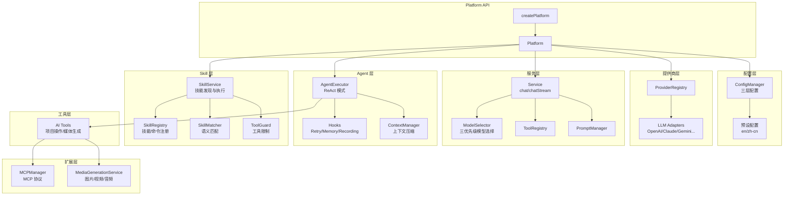

# @neko/platform

Neko Suite AI 服务平台，提供统一的 AI 服务层，支持多提供商、模型选择、Agent 执行、Skill 系统、MCP 集成等能力。

## 架构图



## 核心能力

| 能力 | 说明 |
|------|------|
| **多提供商支持** | OpenAI、Anthropic、Google、Azure、Ollama 等 |
| **三优先级模型选择** | 显式指定 → taskDefaults 配置 → 第一个可用模型 |
| **三层配置** | 内置预设 < 用户配置 < 工作区配置 |
| **ReAct Agent** | 推理+行动循环，支持工具调用 |
| **扩展思考** | Claude Extended Thinking 支持 |
| **Skill 系统** | 语义发现 + Slash 命令，Claude Code 兼容 |
| **MCP 集成** | Stdio/HTTP 传输，动态工具发现 |
| **媒体生成** | 图片/视频/音频生成，多平台适配 |

## 目录结构

```
src/
├── index.ts            # 入口导出和 createPlatform 工厂
│
├── core/               # 核心抽象层
│   ├── base-registry.ts    # 通用注册表
│   ├── router.ts           # 路由管理
│   ├── rate-limiter.ts     # 速率限制
│   └── circuit-breaker.ts  # 熔断器
│
├── config/             # 配置管理
│   ├── config-manager.ts   # 配置管理器（三层合并）
│   ├── user-config.ts      # 用户配置（VSCode globalState / ~/.neko/config.json）
│   ├── workspace-config.ts # 工作区配置（.neko/config.json）
│   └── presets/            # 预设配置 (en/zh-cn)
│
├── llm/                # LLM 抽象层
│   └── adapter/            # 提供商适配器
│
├── provider/           # 提供商管理
│   ├── provider-registry.ts
│   └── retry-executor.ts
│
├── service/            # 服务层
│   ├── service.ts          # 统一服务接口
│   ├── model-selector.ts   # 三优先级模型选择器
│   ├── tool-registry.ts    # 工具注册表
│   └── prompt-manager.ts   # 提示词管理
│
├── agent/              # Agent 框架
├── skill/              # Skill 系统（Claude Code 兼容）
├── tools/              # AI 工具（项目操作/媒体生成）
├── mcp/                # MCP 协议
├── media/              # 媒体生成
├── task/               # 任务调度
└── types/              # 类型定义
```

## 快速开始

```typescript
import { createPlatform } from '@neko/platform';

// 创建平台实例
const platform = createPlatform({
  workspacePath: '/path/to/workspace',
  locale: 'zh-cn',
});

// 1. 简单对话
const service = platform.createService();
const response = await service.chat([
  { role: 'user', content: 'Hello!' }
]);

// 2. 流式对话
const { stream } = service.chatStream(messages);
for await (const chunk of stream) {
  console.log(chunk.delta?.content);
}

// 3. Agent 执行（带工具调用）
const agent = platform.createAgent({
  name: 'video-editor',
  systemPrompt: 'You are a video editing assistant.',
  tools: platform.tools.toToolDefinitions(),
  maxIterations: 10,
  serviceOptions: {
    thinkingBudget: 10000, // 启用扩展思考
  },
});

for await (const step of agent.executeStream('Add fade effect')) {
  if (step.type === 'think') {
    console.log('Response:', step.content);
  } else if (step.type === 'act') {
    console.log('Tool calls:', step.toolCalls);
  }
}

// 4. 媒体生成
const task = await platform.media.generate({
  type: 'text-to-image',
  prompt: 'A beautiful sunset',
});

// 5. 清理资源
platform.dispose();
```

## 模型选择

`ModelSelector` 按三优先级解析模型，无需手动配置路由组：

```typescript
// Priority 1: 显式指定 modelId
await service.chat(messages, { modelId: 'anthropic-claude-sonnet-4-5' });

// Priority 2: taskDefaults 配置（~/.neko/config.json）
// {
//   "taskDefaults": {
//     "chat": { "modelId": "anthropic-claude-sonnet-4-5" },
//     "embedding": { "modelId": "openai-text-embedding-ada" }
//   }
// }

// Priority 3: 自动选择第一个有 apiKey 且能力匹配的模型
await service.chat(messages);
```

**自动 Fallback**：`rate_limit`、`timeout`、`server`、`network` 错误会自动切换到下一个可用模型。

## Skill 系统

Skill 系统与 Claude Code 兼容，提供两种技能类型：

### Skill vs SlashCommand

| 特性 | Skill（技能） | SlashCommand（斜杠命令） |
|------|--------------|------------------------|
| **触发方式** | 语义匹配自动发现 | 显式 `/command` 调用 |
| **参数支持** | 不支持 | 支持 `$ARGUMENTS`, `$1`, `$2` 等 |
| **目录位置** | `.skill/` | `.command/` |
| **文件结构** | 目录 + SKILL.md + 支持文件 | 单个 .md 文件 |
| **典型用途** | 上下文相关的自动建议 | 用户主动调用的操作 |

### 目录结构

```
项目根目录/
├── .skill/                    # 项目级技能
│   └── pdf-processing/
│       ├─��� SKILL.md           # 主文件（必需）
│       └── reference.md       # 支持文件（可选）
│
├── .command/                  # 项目级斜杠命令
│   ├── commit.md              # /commit 命令
│   └── review-pr.md           # /review-pr 命令
│
~/.neko/
├── skills/                    # 个人技能
└── commands/                  # 个人命令
```

### API 使用

```typescript
// 语义发现（自动匹配技能）
const discovery = platform.skillService.discover('help me with PDF files');
if (discovery.found) {
  const result = platform.skillService.apply(discovery.topMatch.skill);
}

// 应用斜杠命令（支持参数插值）
const command = platform.skillService.getCommand('commit');
const cmdResult = platform.skillService.applyCommand(command, 'fix bug in auth');
// $ARGUMENTS → "fix bug in auth"
```

## 主要 API

### Platform

```typescript
interface Platform {
  // 管理器
  config: ConfigManager;          // 配置管理
  providers: ProviderRegistry;    // 提供商注册表
  tools: ToolRegistry;            // 工具注册表
  prompts: PromptManager;         // 提示词管理
  mcp: MCPManager;                // MCP 管理
  media: MediaGenerationService;  // 媒体生成
  skillService: SkillService;     // 技能服务

  // 工厂方法
  createService(): Service;       // 模型由 ModelSelector 自动选择
  createAgent(config: AgentConfig, hooks?: ExecutorHooks[]): AgentExecutor;

  // 生命周期
  dispose(): void;
}
```

### AgentExecutor

```typescript
interface AgentExecutor {
  execute(input: string, context?: AgentContext): Promise<AgentResult>;
  executeStream(input: string, context?: AgentContext): AsyncIterable<AgentStep>;
  abort(): void;
  getState(): AgentState;
}

type AgentStep = {
  type: 'think' | 'act' | 'observe' | 'respond';
  content?: string;
  thinking?: string;  // Claude Extended Thinking
  toolCalls?: ToolCall[];
  toolResults?: ToolResult[];
};
```

## 错误处理

```typescript
import { PlatformError } from '@neko/platform';

try {
  await service.chat(messages);
} catch (error) {
  if (error instanceof PlatformError) {
    console.log('Category:', error.category);  // 'rate_limit', 'timeout', 'auth'...
    console.log('Retryable:', error.retryable);
    if (error.retryAfter) {
      await sleep(error.retryAfter);
    }
  }
}
```

## 依赖关系

```
@neko/platform
└── @neko/shared    # 共享类型定义

被依赖：
extension → platform   # VSCode 扩展依赖
```

## 注意事项

1. **资源清理**：使用完毕后调用 `platform.dispose()` 释放资源
2. **配置优先级**：工作区配置 > 用户配置 > 内置预设
3. **模型 apiKey**：自动选择时只考虑有 `apiKey` 的提供商
4. **扩展思考**：仅 Claude 模型支持，需设置 `thinkingBudget`
5. **流式优先**：Agent 执行推荐使用 `executeStream` 获得实时反馈
6. **Skill 目录**：技能放 `.skill/`，斜杠命令放 `.command/`
