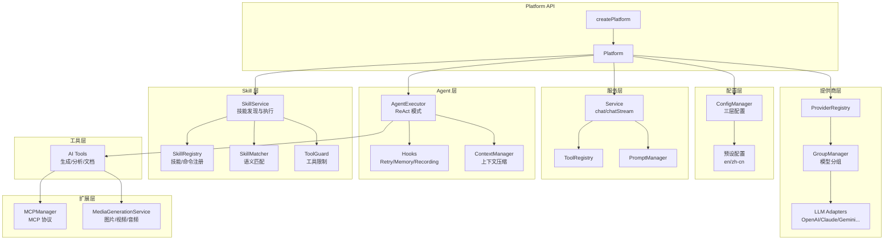

# @neko/platform

Neko Suite AI 服务平台，提供统一的 AI 服务层，支持多提供商、智能路由、Agent 执行、Skill 系统、MCP 集成等能力。

## 架构图



## 核心能力

| 能力 | 说明 |
|------|------|
| **多提供商支持** | OpenAI、Anthropic、Google、Azure、Ollama 等 |
| **智能路由** | 优先级、轮询、权重、成本优化、延迟优化 |
| **三层配置** | 内置预设 < 用户配置 < 工作区配置 |
| **ReAct Agent** | 推理+行动循环，支持工具调用 |
| **扩展思考** | Claude Extended Thinking 支持 |
| **Skill 系统** | 语义发现 + Slash 命令，Claude Code 兼容 |
| **MCP 集成** | Stdio/HTTP 传输，动态工具发现 |
| **媒体生成** | 图片/视频/音频生成，多平台适配 |

## 目录结构

```
src/
├── index.ts            # 入口导出和 createPlatform 工厂
│
├── core/               # 核心抽象层
│   ├── base-registry.ts    # 通用注册表
│   ├── selection-strategy.ts # 选择策略
│   ├── router.ts           # 路由管理
│   ├── health-monitor.ts   # 健康监控
│   ├── rate-limiter.ts     # 速率限制
│   └── circuit-breaker.ts  # 熔断器
│
├── config/             # 配置管理
│   ├── config-manager.ts   # 配置管理器
│   ├── user-config.ts      # 用户配置
│   ├── workspace-config.ts # 工作区配置
│   └── presets/            # 预设配置 (en/zh-cn)
│
├── llm/                # LLM 抽象层
│   ├── adapter/            # 提供商适配器
│   └── routing/            # LLM 路由策略
│
├── provider/           # 提供商管理
│   ├── provider-registry.ts
│   ├── group-manager.ts
│   └── retry-executor.ts
│
├── service/            # 服务层
│   ├── service.ts          # 统一服务接口
│   ├── tool-registry.ts    # 工具注册表
│   └── prompt-manager.ts   # 提示词管理
│
├── agent/              # Agent 框架
│   ├── agent-executor.ts   # ReAct Agent
│   ├── hooks.ts            # 钩子系统
│   └── memory/             # 上下文管理
│
├── skill/              # Skill 系统（Claude Code 兼容）
│   ├── skill-service.ts    # 技能服务（发现+执行）
│   ├── skill-registry.ts   # 技能/命令注册表
│   ├── skill-loader.ts     # 技能加载器
│   ├── skill-injector.ts   # 提示注入器
│   ├── skill-matcher.ts    # 语义匹配器
│   ├── tool-guard.ts       # 工具限制运行时
│   └── builtins/           # 内置技能
│
├── tools/              # AI 工具
│   ├── generation/         # 生成类工具
│   ├── analysis-tools.ts   # 分析工具
│   └── document-tools.ts   # 文档工具
│
├── mcp/                # MCP 协议
├── media/              # 媒体生成
├── task/               # 任务调度
└── types/              # 类型定义
    ├── skill.ts            # Skill/SlashCommand 类型
    └── ...
```

## 快速开始

```typescript
import { createPlatform } from '@neko/platform';

// 创建平台实例
const platform = createPlatform({
  workspacePath: '/path/to/workspace',
  locale: 'zh-cn',
});

// 1. 简单对话
const service = platform.createService();
const response = await service.chat([
  { role: 'user', content: 'Hello!' }
]);

// 2. 流式对话
for await (const chunk of service.chatStream(messages)) {
  console.log(chunk.delta?.content);
}

// 3. Agent 执行（带工具调用）
const agent = platform.createAgent({
  name: 'video-editor',
  systemPrompt: 'You are a video editing assistant.',
  tools: platform.tools.toToolDefinitions(),
  maxIterations: 10,
  serviceOptions: {
    thinkingBudget: 10000, // 启用扩展思考
  },
});

for await (const step of agent.executeStream('Add fade effect')) {
  if (step.type === 'think') {
    console.log('Thinking:', step.thinking);
    console.log('Response:', step.content);
  } else if (step.type === 'act') {
    console.log('Tool calls:', step.toolCalls);
  }
}

// 4. 媒体生成
const task = await platform.media.generate({
  type: 'text-to-image',
  prompt: 'A beautiful sunset',
});

// 5. 清理资源
platform.dispose();
```

## Skill 系统

Skill 系统与 Claude Code 兼容，提供两种技能类型：

### Skill vs SlashCommand

| 特性 | Skill（技能） | SlashCommand（斜杠命令） |
|------|--------------|------------------------|
| **触发方式** | 语义匹配自动发现 | 显式 `/command` 调用 |
| **参数支持** | 不支持 | 支持 `$ARGUMENTS`, `$1`, `$2` 等 |
| **目录位置** | `.skill/` | `.command/` |
| **文件结构** | 目录 + SKILL.md + 支持文件 | 单个 .md 文件 |
| **典型用途** | 上下文相关的自动建议 | 用户主动调用的操作 |

### 目录结构

```
项目根目录/
├── .skill/                    # 项目级技能
│   └── pdf-processing/
│       ├── SKILL.md           # 主文件（必需）
│       ├── reference.md       # 支持文件（可选）
│       └── examples.md        # 支持文件（可选）
│
├── .command/                  # 项目级斜杠命令
│   ├── commit.md              # /commit 命令
│   └── review-pr.md           # /review-pr 命令
│
~/.neko/
├── skills/                    # 个人技能
└── commands/                  # 个人命令
```

### 文件格式

**Skill (SKILL.md)**:
```markdown
---
name: pdf-processing
description: Extract text and tables from PDF files. Use when working with PDFs.
allowed-tools: Read, Grep, Bash(pdftotext:*)
model: claude-sonnet-4-20250514
icon: 📄
enabled: true
---
# PDF Processing Skill

Instructions for processing PDFs...

See [reference.md](reference.md) for API details.
```

**SlashCommand (commit.md)**:
```markdown
---
command: commit
description: Create a git commit with AI-generated message
argument-hint: [message]
allowed-tools: Bash(git:*)
icon: 📝
---
# Commit Changes

Create a commit with message: $ARGUMENTS

If no message provided, analyze changes and suggest one.
```

### API 使用

```typescript
// 1. 语义发现（自动匹配技能）
const discovery = platform.skillService.discover('help me with PDF files');
if (discovery.found) {
  console.log('Top match:', discovery.topMatch?.skill.name);
  console.log('Relevance:', discovery.topMatch?.relevance);
}

// 2. 应用技能（注入系统提示）
const result = platform.skillService.apply(skill);
if (result.applied) {
  console.log('System prompt:', result.injection?.systemPrompt);
  console.log('Allowed tools:', result.injection?.allowedTools);
}

// 3. 应用斜杠命令（支持参数插值）
const command = platform.skillService.getCommand('commit');
const cmdResult = platform.skillService.applyCommand(command, 'fix bug in auth');
// $ARGUMENTS → "fix bug in auth"
// $1 → "fix"
// $2 → "bug"

// 4. 发现并应用（带用户确认）
const applied = await platform.skillService.discoverAndApply(
  'process this PDF',
  async (skill, match) => {
    // 用户确认回调
    return await askUser(`Apply ${skill.name}?`);
  }
);

// 5. 工具限制检查
if (result.toolGuard) {
  const allowed = result.toolGuard.check({ name: 'Bash', arguments: { command: 'rm -rf' } });
  console.log('Allowed:', allowed.allowed);
  console.log('Reason:', allowed.reason);
}
```

### Progressive Disclosure

技能采用渐进式披露设计：

1. **初始加载**：仅加载 SKILL.md 的前置元数据（frontmatter）
2. **应用时**：注入 SKILL.md 主体内容
3. **按需读取**：支持文件通过 Read 工具按需加载

```typescript
// 懒加载（仅加载 frontmatter）
const lazyResult = await loader.loadLazyFromDirectory('.skill');
console.log(lazyResult.skills[0].name);  // 可用
console.log(lazyResult.skills[0].isLoaded);  // false

// 按需加载完整内容
const fullSkill = await lazyResult.skills[0].loadContent();
console.log(fullSkill.content);  // 完整内容
```

## 主要 API

### Platform

```typescript
interface Platform {
  // 管理器
  config: ConfigManager;          // 配置管理
  providers: ProviderRegistry;    // 提供商注册表
  groups: GroupManager;           // 模型组管理
  llmRouter: LLMRoutingManager;   // LLM 智能路由
  tools: ToolRegistry;            // 工具注册表
  prompts: PromptManager;         // 提示词管理
  mcp: MCPManager;                // MCP 管理
  media: MediaGenerationService;  // 媒体生成
  skillService: SkillService;     // 技能服务

  // 工厂方法
  createService(groupId?: string): Service;
  createAgent(config: AgentConfig, hooks?: ExecutorHooks[]): AgentExecutor;

  // 生命周期
  dispose(): void;
}
```

### SkillService

```typescript
interface SkillService {
  // 发现
  discover(userInput: string): SkillDiscoveryResult;

  // 应用
  apply(skill: Skill): SkillApplicationResult;
  applyCommand(command: SlashCommand, args?: string): SkillApplicationResult;
  discoverAndApply(input: string, confirm?: ConfirmCallback): Promise<SkillApplicationResult | null>;

  // 注册表访问
  getSkill(name: string): Skill | undefined;
  getCommand(name: string): SlashCommand | undefined;
  listSkills(): Skill[];
  listCommands(): SlashCommand[];
  registerSkill(skill: Skill): void;
  registerCommand(command: SlashCommand): void;

  // 运行时
  getActiveSkill(): Skill | undefined;
  getToolGuard(): IToolGuard | undefined;
  isToolAllowed(toolName: string, args?: Record<string, unknown>): boolean;
  clearActiveSkill(): void;
}
```

### AgentExecutor

```typescript
interface AgentExecutor {
  // 同步执行
  execute(input: string, context?: AgentContext): Promise<AgentResult>;

  // 流式执行（推荐）
  executeStream(input: string, context?: AgentContext): AsyncIterable<AgentStep>;

  // 控制
  abort(): void;
  getState(): AgentState;
}

// AgentStep 类型
type AgentStep = {
  type: 'think' | 'act' | 'observe' | 'respond';
  content?: string;
  thinking?: string;  // Claude Extended Thinking
  toolCalls?: ToolCall[];
  toolResults?: ToolResult[];
};
```

## 路由策略

```typescript
// 可用策略
type SelectionStrategy =
  | 'priority'       // 按优先级选择
  | 'round-robin'    // 轮询负载均衡
  | 'weighted'       // 加权随机
  | 'cost-optimal'   // 成本优化
  | 'latency-optimal'// 延迟优化
  | 'capability'     // 能力匹配

// 配置示例
platform.config.updateGroup('default', {
  strategy: 'priority',
  members: [
    { providerId: 'anthropic', modelId: 'claude-3-5-sonnet', priority: 1 },
    { providerId: 'openai', modelId: 'gpt-4o', priority: 2 },
  ],
});
```

## 错误处理

```typescript
import { PlatformError } from '@neko/platform';

try {
  await service.chat(messages);
} catch (error) {
  if (error instanceof PlatformError) {
    console.log('Category:', error.category);  // 'rate_limit', 'timeout', 'auth'
    console.log('Retryable:', error.retryable);
    console.log('Provider:', error.providerType);
    if (error.retryAfter) {
      await sleep(error.retryAfter);
    }
  }
}
```

## 依赖关系

```
@neko/platform
└── @neko/shared    # 共享类型定义

被依赖：
extension → platform   # VSCode 扩展依赖
```

## 构建命令

```bash
npm run build          # 构建
npm run test           # 运行测试
npm run test:coverage  # 测试覆盖率
```

## 注意事项

1. **资源清理**：使用完毕后调用 `platform.dispose()` 释放资源
2. **配置优先级**：工作区配置 > 用户配置 > 内置预设
3. **异步初始化**：MCP 连接是异步的，首次使用前确保已连接
4. **扩展思考**：仅 Claude 模型支持，需要设置 `thinkingBudget`
5. **流式优先**：Agent 执行推荐使用 `executeStream` 获得实时反馈
6. **Skill 目录**：技能放 `.skill/`，斜杠命令放 `.command/`
7. **渐进披露**：支持文件通过 markdown 链接引用，Claude 按需读取
