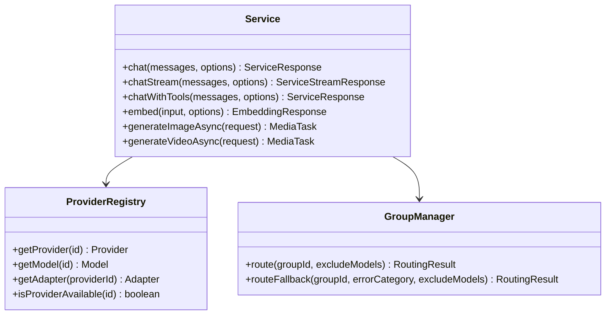
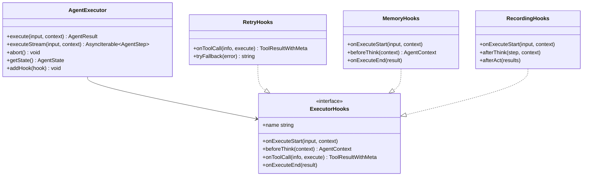

# Neko Suite Platform 架构文档

> 版本: 1.0 | 更新日期: 2026-01-01

## 目录

1. [概述](#概述)
2. [模块结构](#模块结构)
3. [Provider/Adapter 层](#provideradapter-层)
4. [路由策略](#路由策略)
5. [会话/上下文/Memory 系统](#会话上下文memory-系统)
6. [Agent 执行系统](#agent-执行系统)
7. [已知问题与优化建议](#已知问题与优化建议)

---

## 概述

Neko Suite Platform 是一个统一的 AI 服务平台层，提供：

- **多 Provider 支持**: OpenAI, Anthropic, Google, Azure, Ollama 等 LLM 提供商
- **媒体生成服务**: Runway, Luma, MiniMax, Suno 等媒体生成提供商
- **配置管理**: 三层优先级配置 (Builtin < User < Workspace)
- **Model Groups**: 模型分组与路由策略
- **ReAct Agent**: 基于 Hooks 的可扩展 Agent 执行器
- **工具集成**: Tool Registry, MCP

### 技术栈

```
TypeScript 5.x
├── Vitest (测试)
├── esbuild (构建)
└── npm workspaces (Monorepo)
```

### 代码统计

```
模块         文件数    代码行数
─────────────────────────────
adapter/       10      5,434
agent/          4      1,247
config/         5      1,772
provider/       4      1,676
service/       15      5,857
types/         18      3,277
media/         25      6,000+
mcp/            6      2,000+
template/       8      4,000+
─────────────────────────────
Total         114     ~30,000
```

---

## 模块结构

```
packages/platform/src/
├── adapter/           # LLM Provider 适配器
│   ├── base-adapter.ts
│   ├── openai-adapter.ts
│   ├── anthropic-adapter.ts
│   ├── google-adapter.ts
│   ├── azure-adapter.ts
│   ├── ollama-adapter.ts
│   ├── generic-adapter.ts
│   ├── adapter-registry.ts
│   └── stream-aggregator.ts
│
├── agent/             # Agent 执行器
│   ├── agent-executor.ts    # 统一 ReAct 执行器
│   ├── hooks.ts             # 可扩展 Hooks 系统
│   └── execution-monitor.ts
│
├── config/            # 配置管理
│   ├── builtin-presets.ts   # 内置预设
│   ├── user-config.ts       # 用户配置
│   ├── workspace-config.ts  # 工作区配置
│   └── config-manager.ts    # 配置合并
│
├── media/             # 媒体生成
│   ├── adapters/            # 媒体适配器
│   ├── routing/             # 路由策略
│   ├── media-generation-service.ts
│   ├── media-task-executor.ts
│   └── types.ts
│
├── provider/          # Provider 管理
│   ├── provider-registry.ts
│   ├── group-manager.ts
│   ├── platform-error.ts
│   └── retry-executor.ts
│
├── service/           # 核心服务
│   ├── service.ts           # 主服务入口
│   ├── shared-service-adapter.ts  # @neko/shared IService 适配器
│   ├── tool-registry.ts     # 工具注册
│   ├── conversation.ts      # 会话管理
│   ├── context.ts           # 上下文压缩
│   ├── memory.ts            # 会话记忆
│   └── ...tools.ts          # 各类工具
│
├── mcp/               # MCP 协议
├── template/          # 模板系统
└── types/             # 类型定义
```

---

## Provider/Adapter 层

### 架构设计

```
┌─────────────────────────────────────────────────────────────────┐
│                      Shared Layer                                │
│  ┌──────────────┐  ┌──────────────┐  ┌────────────────────────┐  │
│  │ ProviderType │  │ProviderConfig│  │    ProviderRegistry    │  │
│  │ (统一类型)    │  │ (统一配置)    │  │ (统一注册管理)          │  │
│  └──────────────┘  └──────────────┘  └────────────────────────┘  │
└─────────────────────────────────────────────────────────────────┘
                           │
        ┌──────────────────┴──────────────────┐
        ▼                                      ▼
┌─────────────────────────┐    ┌──────────────────────────────────┐
│     LLM Adapter Layer   │    │      Media Adapter Layer          │
├─────────────────────────┤    ├──────────────────────────────────┤
│ Adapter interface:      │    │ MediaAdapter interface:           │
│  - chat()               │    │  - generateImage()                │
│  - chatStream()         │    │  - generateVideo()                │
│  - embed()              │    │  - generateAudio()                │
│  - listModels()         │    │  - getTaskStatus() ← 异步轮询     │
└─────────────────────────┘    └──────────────────────────────────┘
```

### LLM Adapter 接口

```typescript
interface Adapter {
  readonly type: string;

  // 核心方法
  chat(messages, options, model, provider): Promise<ChatResponse>;
  chatStream(messages, options, model, provider): AsyncIterable<ChatChunk>;

  // 可选方法
  embed?(input, model, provider): Promise<number[][]>;
  listModels?(provider): Promise<string[]>;
  listModelsDetailed?(provider): Promise<ModelInfo[]>;

  // 能力检查
  supportsStreaming(): boolean;
  supportsCapability(capability: string): boolean;
}
```

### Media Adapter 接口

```typescript
interface MediaAdapter {
  readonly type: string;

  // 生成方法 (异步任务)
  generateImage(request, model, provider): Promise<MediaAdapterResult>;
  generateVideo(request, model, provider): Promise<MediaAdapterResult>;
  generateAudio(request, model, provider): Promise<MediaAdapterResult>;

  // 任务管理
  getTaskStatus(externalTaskId, provider): Promise<MediaAdapterResult>;
  cancelTask(externalTaskId, provider): Promise<void>;

  // 能力检查
  getSupportedTypes(): MediaGenerationType[];
  supportsType(type): boolean;
}
```

### 关键差异

| 维度 | LLM Adapter | Media Adapter |
|------|-------------|---------------|
| 执行模型 | 同步/流式 | 异步任务 (轮询) |
| 请求类型 | ChatMessage[] | Prompt + 参数 |
| 响应类型 | ChatResponse | MediaTask |
| 状态管理 | 无状态 | 需要 TaskManager |
| 超时处理 | 秒级 | 分钟级 |

### 设计决策

**为什么分离而不统一?**

1. **执行模型本质不同**: LLM 是请求-响应，Media 是提交-轮询
2. **避免接口膨胀**: 统一接口会有大量可选方法
3. **关注点分离**: 符合 SOLID 原则

---

## 路由策略

### LLM 路由 (GroupManager)

```typescript
// 路由策略类型
type RoutingStrategy =
  | { type: 'priority' }           // 优先级 (默认)
  | { type: 'round-robin' }        // 轮询
  | { type: 'weighted'; weights: Record<string, number> }  // 权重
  | { type: 'cost-optimal'; maxCostPer1k?: number };       // 成本优化

// 路由流程
1. 根据 groupId 获取 Group
2. 过滤已排除和不可用的模型
3. 根据策略选择模型
4. 失败时尝试 Fallback
```

### Media 路由 (MediaRoutingManager)

```typescript
// 策略链 (按优先级执行)
const strategies = [
  UserPreferenceStrategy,    // 用户偏好
  HealthFilterStrategy,      // 健康过滤
  CapabilityFilterStrategy,  // 能力过滤
  LoadBalancingStrategy,     // 负载均衡
  CostOptimizationStrategy,  // 成本优化 (可选)
  LatencyOptimizationStrategy // 延迟优化 (可选)
];

// 路由流程
1. 获取候选 (provider + model)
2. 依次执行策略的 filter() 和 score()
3. 选择得分最高的候选
```

### 统一性分析

```typescript
// 可统一的部分: 策略接口
interface UnifiedRoutingStrategy<TCandidate, TContext> {
  readonly name: string;
  readonly priority: number;
  filter(candidates: TCandidate[], context: TContext): TCandidate[];
  score(candidates: TCandidate[], context: TContext): TCandidate[];
}

// 不可统一的部分: Candidate 和 Context 结构不同
```

---

## 会话/上下文/Memory 系统

### 系统架构

```
┌─────────────────────────────────────────────────────────────────────────┐
│                         Service Layer                                    │
│  ┌───────────────────────────────────────────────────────────────────┐  │
│  │                      ConversationManager                           │  │
│  │  • 多会话管理 (create/list/switch/delete)                          │  │
│  │  • 会话持久化 (ConversationStorage)                                │  │
│  │  • 自动生成标题                                                    │  │
│  └───────────────────────────────────────────────────────────────────┘  │
│  ┌─────────────────────────────┐  ┌─────────────────────────────────┐  │
│  │      Context Layer          │  │        Memory Layer              │  │
│  │  ┌─────────────────────┐   │  │  ┌───────────────────────────┐  │  │
│  │  │ConversationCompressor│   │  │  │  InMemorySessionMemory    │  │  │
│  │  │ (turn-aware 压缩)    │   │  │  │  (跨会话事实存储)          │  │  │
│  │  │ • 工具结果截断       │   │  │  └───────────────────────────┘  │  │
│  │  │ • 可插拔 Summarizer │   │  │                                  │  │
│  │  └─────────────────────┘   │  │                                  │  │
│  └─────────────────────────────┘  └─────────────────────────────────┘  │
└─────────────────────────────────────────────────────────────────────────┘
```

### ConversationManager

```typescript
// 职责: UI 层会话管理
interface Conversation {
  id: string;
  title: string;
  messages: ConversationMessage[];
  createdAt: number;
  updatedAt: number;
}

class ConversationManager {
  create(): string;               // 创建新会话
  get(id): Conversation;          // 获取会话
  getActive(): Conversation;      // 获取活动会话
  setActive(id): void;            // 切换活动会话
  updateMessages(id, msgs): void; // 更新消息
  delete(id): void;               // 删除会话
  list(): Conversation[];         // 列出所有会话 (按更新时间排序)
  cleanupEmpty(): number;         // 清理空会话
}
```

### 上下文压缩策略

```typescript
// ConversationCompressor — 统一上下文压缩
// 旧的 SlidingWindowCompressor / SummarizeCompressor / SelectiveCompressor 已移除
class ConversationCompressor {
  // Turn-aware 压缩：按 user/assistant 对话轮次分析
  // 工具结果截断：自动截断过长的 tool result
  // 可插拔 Summarizer：通过 ISummarizer 接口注入 LLM 摘要
  compress(messages: ChatMessage[]): Promise<ConversationCompressionResult>;
  estimateTokens(messages: ChatMessage[]): number;
}
```

### Memory 系统

```typescript
// 会话记忆接口
interface SessionMemory {
  getHistory(): Promise<ChatMessage[]>;
  addMessage(message: ChatMessage): Promise<void>;
  getEntries(limit?): Promise<SessionMemoryEntry[]>;
  saveSession(sessionId, facts, summary?): Promise<void>;
  search(query, limit?): Promise<SessionMemoryEntry[]>;
  clear(): Promise<void>;
}
```

---

## Agent 执行系统

### AgentExecutor

```typescript
// ReAct 执行循环
class AgentExecutor {
  // Think → Act → Observe 循环
  async execute(input: string, context?: AgentContext): Promise<AgentResult>;

  // 流式执行
  async *executeStream(input, context?): AsyncIterable<AgentStep>;

  // 状态管理
  getState(): AgentState;  // 'init' | 'think' | 'act' | 'observe' | 'respond' | 'done' | 'error'
  abort(): void;

  // Hook 管理
  addHook(hook: ExecutorHooks): void;
  removeHook(name: string): boolean;
  getHook<T>(name: string): T | undefined;
}
```

### Hooks 系统

```typescript
// Hook 接口
interface ExecutorHooks {
  name: string;

  // 生命周期钩子
  onExecuteStart?(input, context): Promise<void>;
  onExecuteEnd?(result): Promise<void>;
  beforeThink?(context): Promise<AgentContext>;
  afterThink?(step, context): Promise<void>;
  beforeAct?(toolCalls): Promise<void>;
  onToolCall?(info, execute): Promise<ToolResultWithMeta>;
  afterAct?(results): Promise<void>;
  onError?(error, context): Promise<void>;
  onIterationComplete?(iteration, context): Promise<void>;
}

// 内置 Hooks
┌────────────────────┬──────────────────────────────────────┐
│ RetryHooks         │ 工具重试、模型 Fallback              │
│ RecordingHooks     │ 执行录制 (用于模板生成)              │
│ MemoryHooks        │ 上下文压缩、会话记忆                 │
└────────────────────┴──────────────────────────────────────┘
```

### MemoryHooks 流程

```
onExecuteStart
    │
    ├── 检查是否需要加载历史
    │   └── sessionMemory.getHistory()
    │
    └── 注入历史到 context.messages

beforeThink
    │
    └── contextManager.compress(messages)

onExecuteEnd
    │
    └── sessionMemory.addMessage(...)
```

---

## 已知问题与优化建议

### 问题 1: 消息管理职责重叠

```
ConversationManager.messages  ←→  AgentContext.messages  ←→  SessionMemory
         (UI 层)                      (执行层)                (持久层)
```

**建议**: 引入 SessionManager 作为中间层，统一消息来源。

### 问题 2: Context 命名混淆

```typescript
// types/context.ts - 项目上下文 (Timeline/Media/Selection)
interface ProjectContext

// types/memory.ts - 对话上下文管理
interface ContextManager

// agent-executor.ts - Agent 执行上下文
interface AgentContext
```

**建议**: 重命名以明确职责
- `types/context.ts` → `types/project-context.ts`
- `ContextManager` → removed (use `ConversationCompressor`)
- `AgentContext` → `ExecutionContext`

### 问题 3: SessionMemory 接口 ✅ 已修复

SessionMemory 接口已包含 `getHistory()` 和 `addMessage()` 方法。

### 问题 4: 缺少会话隔离

当用户切换会话时，正在执行的 Agent 可能污染其他会话。

**建议**:
- 为每个会话创建独立的 AgentExecutor 实例
- 使用 LRU 缓存管理实例生命周期
- 切换会话时暂停/恢复执行

---

## 附录: 类图

### Service 层



### Agent 层



---

## 更新日志

| 日期 | 版本 | 变更 |
|------|------|------|
| 2026-01-01 | 1.0 | 初始版本 |
