# platform/src

Neko Suite AI 服务平台源码根目录，提供多提供商 AI 服务、模型自动选择、Agent 执行等核心能力。

## 架构图

```mermaid
graph TB
    subgraph "入口层"
        Index[index.ts<br/>createPlatform]
        Platform[Platform 实例]
    end

    subgraph "核心抽象层 core/"
        Registry[BaseRegistry<br/>通用注册表]
        Router[BaseRoutingManager<br/>路由管理]
        Circuit[CircuitBreaker<br/>熔断器]
        RateLimit[RateLimiter<br/>速率限制]
    end

    subgraph "配置层 config/"
        Builtin[BuiltinPresets<br/>内置预设 en/zh-cn]
        UserCfg[UserConfigManager<br/>用户配置]
        WorkspaceCfg[WorkspaceConfig<br/>工作区配置]
        ConfigMgr[ConfigManager<br/>三层合并]
    end

    subgraph "LLM 层 llm/"
        Adapters[Adapters<br/>OpenAI/Anthropic/Google...]
    end

    subgraph "提供商层 provider/"
        ProviderReg[ProviderRegistry<br/>提供商注册]
        Retry[RetryExecutor<br/>重试执行]
    end

    subgraph "服务层 service/"
        Service[Service<br/>chat/chatStream]
        ModelSel[ModelSelector<br/>三优先级选择]
        ToolReg[ToolRegistry<br/>工具注册]
        PromptMgr[PromptManager<br/>提示词管理]
    end

    subgraph "Agent 层 agent/"
        Executor[AgentExecutor<br/>ReAct 执行器]
        Hooks[Hooks<br/>Retry/Memory/Recording]
        Memory[ContextManager<br/>上下文压缩]
    end

    subgraph "Skill 层 skill/"
        SkillService[SkillService<br/>技能发现与执行]
        SkillRegistry[SkillRegistry<br/>技能/命令注册]
        SkillMatcher[SkillMatcher<br/>语义匹配]
        ToolGuard[ToolGuard<br/>工具限制]
    end

    subgraph "工具层 tools/"
        Generation[generation/<br/>图片/视频/TTS/音乐生成]
        ProjectTools[project-tools.ts<br/>时间线操作]
    end

    subgraph "扩展层"
        MCP[mcp/<br/>MCP 协议]
        Media[media/<br/>媒体生成服务]
        Task[task/<br/>任务调度]
    end

    Index --> Platform
    Platform --> ConfigMgr
    ConfigMgr --> Builtin
    ConfigMgr --> UserCfg
    ConfigMgr --> WorkspaceCfg

    Platform --> ProviderReg
    ProviderReg --> Adapters

    Platform --> Service
    Service --> ModelSel
    Service --> ToolReg
    Service --> PromptMgr

    Platform --> Executor
    Executor --> Hooks
    Executor --> Memory
    Executor --> Generation
    Executor --> ProjectTools

    Platform --> SkillService
    SkillService --> SkillRegistry
    SkillService --> SkillMatcher
    SkillService --> ToolGuard

    Executor --> MCP
    Executor --> Media

    Registry --> Router
    Router --> Circuit
    Router --> RateLimit
```



## 目录结构

```
src/
├── index.ts              # 入口，createPlatform 工厂函数
│
├── core/                 # 核心抽象层
│   ├── base-registry.ts      # 通用注册表基类
│   ├── router.ts             # 路由管理基类
│   ├── circuit-breaker.ts    # 熔断器
│   ├── rate-limiter.ts       # 速率限制器
│   └── http-client.ts        # 共享 HTTP 客户端
│
├── types/                # 类型定义
│   ├── provider.ts           # Provider 类型
│   ├── adapter.ts            # Adapter 类型
│   ├── tool.ts               # 工具定义
│   ├── service.ts            # 服务接口
│   └── ...
│
├── config/               # 三层配置管理
│   ├── builtin-presets.ts    # 内置预设加载
│   ├── user-config.ts        # 用户配置管理
│   ├── workspace-config.ts   # 工作区配置
│   ├── config-manager.ts     # 统一配置管理器
│   └── presets/              # 预设数据 (en/zh-cn)
│
├── llm/                  # LLM 适配器层
│   └── adapter/              # 提供商适配器
│       ├── base-adapter.ts       # 适配器基类
│       ├── openai-adapter.ts     # OpenAI
│       ├── anthropic-adapter.ts  # Claude（支持 Extended Thinking）
│       ├── google-adapter.ts     # Gemini
│       ├── azure-adapter.ts      # Azure OpenAI
│       ├── ollama-adapter.ts     # Ollama
│       └── generic-adapter.ts    # 通用适配器
│
├── provider/             # 提供商管理
│   ├── provider-registry.ts  # 提供商注册表（含熔断器/限流）
│   ├── platform-error.ts     # 统一错误类型
│   └── retry-executor.ts     # 重试执行器
│
├── service/              # 统一服务接口
│   ├── service.ts            # chat/chatStream/embed
│   ├── model-selector.ts     # 三优先级模型选择器
│   ├── tool-registry.ts      # 工具注册表
│   └── prompt-manager.ts     # 提示词管理
│
├── agent/                # ReAct 模式 Agent
│   ├── agent-executor.ts     # Agent 执行器
│   ├── hooks.ts              # 钩子系统
│   └── memory/               # 上下文管理
│       └── context.ts
│
├── skill/                # Skill 系统（Claude Code 兼容）
│   ├── skill-service.ts      # 统一服务（发现+执行）
│   ├── skill-registry.ts     # 技能/命令注册表
│   ├── skill-loader.ts       # 文件加载器（懒加载）
│   ├── skill-injector.ts     # 提示注入器
│   ├── skill-matcher.ts      # 语义匹配器
│   ├── tool-guard.ts         # 工具限制运行时
│   └── builtins/             # 内置技能
│
├── tools/                # AI 工具
│   ├── project-tools.ts      # 时间线/轨道操作
│   ├── project-adapter.ts    # 项目上下文适配器
│   └── generation/           # 媒体生成工具
│       ├── image.ts              # 图片生成
│       ├── video.ts              # 视频生成
│       ├── tts.ts                # TTS 生成
│       └── music.ts              # 音乐生成
│
├── mcp/                  # MCP 协议集成
├── media/                # 媒体生成服务
└── task/                 # 任务调度
```

## 模块依赖

```
依赖方向：上层 → 下层（高层不依赖低层实现）

┌──────────────────────────────────────────────────────────────┐
│  入口层: index.ts (createPlatform)                           │
├──────────────────────────────────────────────────────────────┤
│  配置层: config/ ────────────────────────→ 核心抽象层: core/ │
│  (三层配置合并)                             (注册表/路由/熔断) │
├──────────────────────────────────────────────────────────────┤
│  提供商层: provider/ ──→ LLM层: llm/ ──→ 服务层: service/    │
│  (注册/重试/熔断)        (适配器)          (chat/模型选择)    │
├──────────────────────────────────────────────────────────────┤
│  Agent层: agent/ ──────────────────────→ 工具层: tools/      │
│  (ReAct执行/Hooks/Memory)                 (项目操作/媒体生成) │
├──────────────────────────────────────────────────────────────┤
│  Skill层: skill/                                             │
│  (技能发现/注册/注入/工具限制)                                 │
├──────────────────────────────────────────────────────────────┤
│  扩展层: mcp/ | media/ | task/                              │
│  (外部集成)   (媒体生成)  (任务调度)                          │
└──────────────────────────────────────────────────────────────┘
```

## 关键导出

### 入口层

| 导出 | 类型 | 用途 |
|------|------|------|
| `createPlatform()` | 工厂函数 | 创建完整配置的 Platform 实例 |
| `Platform` | 接口 | 平台实例类型，包含所有管理器 |
| `PlatformOptions` | 类型 | 平台初始化选项 |

### 核心层 (core/)

| 导出 | 类型 | 用途 |
|------|------|------|
| `BaseRegistry<T>` | 类 | 通用注册表基类 |
| `BaseRoutingManager` | 类 | 路由管理基类 |
| `CircuitBreaker` | 类 | 熔断器 |
| `RateLimiter` | 类 | 速率限制器 |
| `ConcurrencyPool` | 类 | 并发控制池（re-export from @neko/shared） |
| `HttpClient` | 类 | 共享 HTTP 客户端 |

### 配置层 (config/)

| 导出 | 类型 | 用途 |
|------|------|------|
| `ConfigManager` | 类 | 三层配置统一管理 |
| `loadBuiltinPresets()` | 函数 | 加载内置预设 |
| `UserConfigManager` | 类 | 用户配置管理（VSCode globalState） |
| `FileUserConfigManager` | 类 | 用户配置管理（文件） |

### LLM 层 (llm/)

| 导出 | 类型 | 用途 |
|------|------|------|
| `BaseAdapter` | 抽象类 | LLM 适配器基类 |
| `OpenAIAdapter` | 类 | OpenAI 适配器 |
| `AnthropicAdapter` | 类 | Claude 适配器（支持 Extended Thinking） |
| `AdapterRegistry` | 类 | 适配器注册表 |
| `createStreamCollector()` | 函数 | 创建流聚合器 |

### 服务层 (service/)

| 导出 | 类型 | 用途 |
|------|------|------|
| `Service` | 类 | 统一服务接口 (chat/chatStream/embed) |
| `ModelSelector` | 类 | 三优先级模型选择器 |
| `ToolRegistry` | 类 | 工具注册表 |
| `PromptManager` | 类 | 提示词管理 |

### Agent 层 (agent/)

| 导出 | 类型 | 用途 |
|------|------|------|
| `AgentExecutor` | 类 | ReAct 模式执行器 |
| `ExecutorHooks` | 接口 | 钩子系统接口 |
| `RetryHooks` | 类 | 重试钩子 |
| `MemoryHooks` | 类 | 记忆钩子 |
| `RecordingHooks` | 类 | 录制钩子 |
| `ContextManager` | 类 | 上下文压缩管理 |

### Skill 层 (skill/)

| 导出 | 类型 | 用途 |
|------|------|------|
| `SkillService` | 类 | 技能发现与执行服务 |
| `SkillRegistry` | 类 | 技能/命令注册表 |
| `SkillLoader` | 类 | 文件加载器（懒加载） |
| `SkillInjector` | 类 | 提示注入器 |
| `KeywordSkillMatcher` | 类 | 关键词匹配器 |
| `ToolGuard` | 类 | 工具限制运行时 |

### 扩展层

| 模块 | 主要导出 | 用途 |
|------|----------|------|
| `mcp/` | `MCPManager`, `MCPTool` | MCP 协议集成 |
| `media/` | `MediaGenerationService` | 媒体生成 |
| `task/` | `TaskManager` | 任务调度 |

## 数据流

### 1. 配置加载流程

```
内置预设 (presets/en.ts)
    ↓ loadBuiltinPresets()
用户配置 (VSCode globalState / ~/.neko/config.json)
    ↓ UserConfigManager / FileUserConfigManager
工作区配置 (.neko/config.json)
    ↓ WorkspaceConfigManager
ConfigManager (三层合并)
    ↓ getConfig()
最终配置
```

### 2. LLM 请求流程

```
用户请求
    ↓
Service.chat() / chatStream()
    ↓
ModelSelector.resolve()
  Priority 1: options.modelId
  Priority 2: config.getTaskDefaults()?.chat?.modelId
  Priority 3: 第一个有 apiKey 且能力匹配的模型
    ↓ 找到 modelId + providerId
ProviderRegistry.executeWithProtection()  (熔断器 + 限流)
    ↓
Adapter.chat() / chatStream()
    ↓ 调用 AI API
返回响应；失败则自动 fallback 到下一个模型
```

### 3. Agent 执行流程

```
AgentExecutor.executeStream(input)
    ↓
┌─→ Think: 推理阶段
│      ↓ Service.chatStream()
│   Act: 工具调用
│      ↓ ToolRegistry.execute()
│   Observe: 观察结果
│      ↓
└─ 循环直到 Respond 或达到 maxIterations
    ↓
最终响应
```

## 设计模式

| 模式 | 应用位置 | 说明 |
|------|----------|------|
| **工厂模式** | `createPlatform()` | 统一创建平台实例 |
| **适配器模式** | `llm/adapter/` | 统一不同 AI 提供商接口 |
| **注册表模式** | `BaseRegistry` | 动态注册和查找组件 |
| **钩子模式** | `agent/hooks.ts` | AOP 扩展执行流程 |
| **熔断器模式** | `CircuitBreaker` | 故障隔离和恢复 |
| **策略模式** | `ModelSelector` | 三优先级模型选择 |
