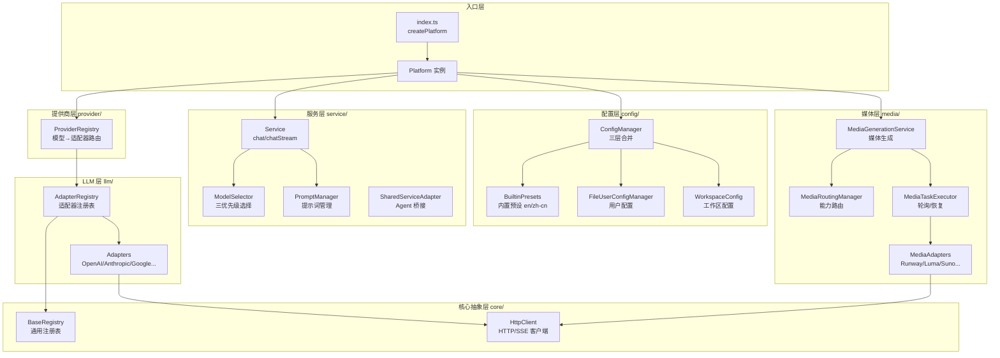

# platform/src

Neko Suite AI 服务平台源码根目录，提供多提供商 AI 服务、模型自动选择、媒体生成等核心能力。

## 架构图



## 目录结构

```
src/
├── index.ts              # 入口，createPlatform 工厂函数
│
├── core/                 # 核心抽象层（内部）
│   ├── base-registry.ts      # 通用注册表基类
│   └── http-client.ts        # 共享 HTTP/SSE 客户端
│
├── types/                # 类型定义
│   ├── provider.ts           # Provider/Model 类型
│   ├── adapter.ts            # Adapter 类型
│   ├── config.ts             # 配置预设类型
│   ├── service.ts            # 服务接口
│   └── ...
│
├── config/               # 三层配置管理
│   ├── config-manager.ts     # 统一配置管理器
│   ├── base-config-section.ts # 配置分区基类（CRUD + 三层合并）
│   ├── config-section-impls.ts # 5 个分区实现
│   ├── chat-model-service.ts  # ChatModelOption 生成
│   ├── config-export-service.ts # 导入/导出服务
│   ├── builtin-presets.ts    # 内置预设加载
│   ├── user-config.ts        # 用户配置（文件后端）
│   ├── workspace-config.ts   # 工作区配置
│   └── presets/              # 预设数据 (en/zh-cn)
│
├── llm/                  # LLM 适配器层（内部）
│   └── adapter/
│       ├── base-adapter.ts       # 适配器基类
│       ├── openai-adapter.ts     # OpenAI
│       ├── anthropic-adapter.ts  # Claude（支持 Extended Thinking）
│       ├── google-adapter.ts     # Gemini
│       ├── azure-adapter.ts      # Azure OpenAI
│       ├── ollama-adapter.ts     # Ollama
│       └── generic-adapter.ts    # 通用适配器
│
├── provider/             # 提供商管理
│   ├── provider-registry.ts  # 提供商注册表（模型→适配器路由）
│   └── platform-error.ts     # 统一错误类型
│
├── service/              # 统一服务接口
│   ├── service.ts            # chat/chatStream/embed
│   ├── model-selector.ts     # 三优先级模型选择器
│   ├── shared-service-adapter.ts # 转 @neko/shared IService
│   └── prompt-manager.ts     # 提示词管理
│
└── media/                # 媒体生成服务
    ├── media-generation-service.ts # 统一媒体生成 API
    ├── media-task-executor.ts     # 轮询执行 + 崩溃恢复
    ├── routing/                   # 能力路由
    ├── adapters/                  # 8 个媒体适配器
    │   ├── base-media-adapter.ts
    │   ├── openai-compat-media-adapter.ts
    │   ├── runway-media-adapter.ts
    │   ├── luma-media-adapter.ts
    │   ├── minimax-media-adapter.ts
    │   ├── liblib-media-adapter.ts
    │   ├── suno-media-adapter.ts
    │   ├── vidu-media-adapter.ts
    │   └── midjourney-media-adapter.ts
    └── types.ts
```

## 模块依赖

```
依赖方向：上层 → 下层（高层不依赖低层实现）

┌──────────────────────────────────────────────────────────────┐
│  入口层: index.ts (createPlatform)                           │
├──────────────────────────────────────────────────────────────┤
│  配置层: config/ ────────────────────────→ 核心层: core/     │
│  (三层配置合并)                             (注册表/HTTP)     │
├──────────────────────────────────────────────────────────────┤
│  提供商层: provider/ ──→ LLM层: llm/ ──→ 服务层: service/    │
│  (模型→适配器路由)       (6 个适配器)      (chat/模型选择)    │
├──────────────────────────────────────────────────────────────┤
│  媒体层: media/                                              │
│  (生成服务/轮询执行/能力路由/8 个适配器)                       │
└──────────────────────────────────────────────────────────────┘
```

## 公共 API

Platform 采用最小化公共 API 设计，内部实���（LLM Adapter、Media Adapter、Registry 等）不暴露。
消费者通过 `createPlatform()` 工厂函数获取 `Platform` 实例，通过实例属性访问各子系统。

### 入口

| 导出               | 类型     | 用途                         |
| ------------------ | -------- | ---------------------------- |
| `createPlatform()` | 工厂函数 | 创建完整配置的 Platform 实例 |
| `Platform`         | 接口     | 平台实例类型，包含所有管理器 |
| `PlatformOptions`  | 类型     | 平台初始化选项               |

### 配置

| 导出                     | 类型 | 用途                                 |
| ------------------------ | ---- | ------------------------------------ |
| `ConfigManager`          | 类   | 两层配置统一管理（User → Workspace） |
| `FileUserConfigManager`  | 类   | 用户配置管理（文件后端）             |
| `watchWorkspaceConfig()` | 函数 | 监听工作区配置变化                   |

### 服务

| 导出                | 类型 | 用途                                     |
| ------------------- | ---- | ---------------------------------------- |
| `Service`           | 类   | 统一服务接口 (chat/chatStream)           |
| `toSharedService()` | 函数 | 转为 @neko/shared IService（Agent 桥接） |
| `PromptManager`     | 类   | 提示词管理                               |

### 提供商 & 媒体

| 导出                     | 类型 | 用途                            |
| ------------------------ | ---- | ------------------------------- |
| `ProviderRegistry`       | 类   | 提供商注册表（模型→适配器路由） |
| `PlatformError`          | 类   | 统一错误类型                    |
| `MediaGenerationService` | 类   | 媒体生成服务（图片/视频/音乐）  |

### 内部模块（不公开导出）

以下模块为内部实现，通过 `createPlatform()` 自动组装，不通过 `@neko/platform` 公共入口暴露：

| 模块              | 组件                                                           | 说明                                   |
| ----------------- | -------------------------------------------------------------- | -------------------------------------- |
| `core/`           | BaseRegistry, HttpClient                                       | 注册表基类、HTTP 客户端                |
| `llm/adapter/`    | OpenAI/Anthropic/Google/Azure/Ollama/Generic Adapter           | LLM 适配器（6 个）                     |
| `media/adapters/` | OpenAI/Runway/Luma/MiniMax/Liblib/Suno/Vidu/Midjourney Adapter | 媒体适配器（8 个）                     |
| `media/routing/`  | MediaRoutingManager                                            | 媒体路由（能力匹配+偏好过滤）          |
| `service/`        | ModelSelector                                                  | 三优先级模型选择器（Service 内部使用） |

## 数据流

### 1. 配置加载流程

```
内置预设 (presets/en.ts)
    ↓ loadBuiltinPresets()
用户配置 (~/.neko/config.json)
    ↓ FileUserConfigManager
工作区配置 (.neko/config.json)
    ↓ WorkspaceConfig
ConfigManager (三层合并)
    ↓ getConfig()
最终配置
```

### 2. LLM 请求流程

```
用户请求
    ↓
Service.chat() / chatStream()
    ↓
ModelSelector.resolve()
  Priority 1: options.modelId
  Priority 2: config.getTaskDefaults()?.chat?.modelId
  Priority 3: 第一个有 apiKey 且能力匹配的模型
    ↓ 找到 modelId + providerId
ProviderRegistry.getAdapter()
    ↓
Adapter.chat() / chatStream()
    ↓ 调用 AI API
返回响应
```

### 3. 媒体生成流程

```
MediaGenerationService.generateImage/Video/Audio()
    ↓
MediaRoutingManager.selectProvider()
  → 按能力匹配 + 偏好过滤
    ↓
TaskManager.submit() → MediaTaskExecutor
    ↓
MediaAdapter.generate() → 提交到外部 API
    ↓
轮询 getTaskStatus() 直到完成
    ↓
返回 MediaOutput（URL/元数据）
```

## 设计模式

| 模式           | 应用位置                 | 说明                                  |
| -------------- | ------------------------ | ------------------------------------- |
| **工厂模式**   | `createPlatform()`       | 统一创建平台实例                      |
| **适配器模式** | `llm/adapter/`           | 统一不同 AI 提供商接口                |
| **注册表模式** | `BaseRegistry`           | 动态注册和查找组件（内置+自定义双层） |
| **分区模式**   | `BaseConfigSection`      | 各配置类型独立 CRUD + 三层合并        |
| **策略模式**   | `ModelSelector`          | 三优先级模型选择                      |
| **门面模式**   | `MediaGenerationService` | 封装路由+执行+轮询复杂性              |
