# platform/src

Neko Suite AI 服务平台源码根目录，提供多提供商 AI 服务、智能路由、Agent 执行等核心能力。

## 架构图

```mermaid
graph TB
    subgraph "入口层"
        Index[index.ts<br/>createPlatform]
        Platform[Platform 实例]
    end

    subgraph "核心抽象层 core/"
        Registry[BaseRegistry<br/>通用注册表]
        Strategy[SelectionStrategy<br/>7种选择策略]
        Router[BaseRoutingManager<br/>路由管理]
        Health[HealthMonitor<br/>健康监控]
        Circuit[CircuitBreaker<br/>熔断器]
        RateLimit[RateLimiter<br/>速率限制]
    end

    subgraph "配置层 config/"
        Builtin[BuiltinPresets<br/>内置预设 en/zh-cn]
        UserCfg[UserConfigManager<br/>用户配置]
        WorkspaceCfg[WorkspaceConfig<br/>工作区配置]
        ConfigMgr[ConfigManager<br/>三层合并]
    end

    subgraph "LLM 层 llm/"
        Adapters[Adapters<br/>OpenAI/Anthropic/Google...]
        LLMRouting[LLMRoutingManager<br/>6种路由策略]
    end

    subgraph "提供商层 provider/"
        ProviderReg[ProviderRegistry<br/>提供商注册]
        GroupMgr[GroupManager<br/>模型分组]
        Retry[RetryExecutor<br/>重试执行]
    end

    subgraph "服务层 service/"
        Service[Service<br/>chat/chatStream]
        ToolReg[ToolRegistry<br/>工具注册]
        PromptMgr[PromptManager<br/>提示词管理]
    end

    subgraph "Agent 层 agent/"
        Executor[AgentExecutor<br/>ReAct 执行器]
        Hooks[Hooks<br/>Retry/Memory/Recording]
        Memory[ContextManager<br/>上下文压缩]
    end

    subgraph "Skill 层 skill/"
        SkillService[SkillService<br/>技能发现与执行]
        SkillRegistry[SkillRegistry<br/>技能/命令注册]
        SkillMatcher[SkillMatcher<br/>语义匹配]
        ToolGuard[ToolGuard<br/>工具限制]
    end

    subgraph "工具层 tools/"
        Generation[generation/<br/>图片/视频/音频生成]
        Analysis[analysis-tools.ts<br/>图片/视频分析]
        Document[document-tools.ts<br/>脚本/字幕生成]
    end

    subgraph "扩展层"
        MCP[mcp/<br/>MCP 协议]
        Workflow[workflow/<br/>N8n/ComfyUI]
        Media[media/<br/>媒体生成服务]
        Task[task/<br/>任务调度]
    end

    Index --> Platform
    Platform --> ConfigMgr
    ConfigMgr --> Builtin
    ConfigMgr --> UserCfg
    ConfigMgr --> WorkspaceCfg

    Platform --> ProviderReg
    ProviderReg --> Adapters
    ProviderReg --> LLMRouting
    ProviderReg --> GroupMgr

    Platform --> Service
    Service --> ToolReg
    Service --> PromptMgr

    Platform --> Executor
    Executor --> Hooks
    Executor --> Memory
    Executor --> Generation
    Executor --> Analysis
    Executor --> Document

    Platform --> SkillService
    SkillService --> SkillRegistry
    SkillService --> SkillMatcher
    SkillService --> ToolGuard

    Executor --> MCP
    Executor --> Workflow
    Executor --> Media

    Registry --> Strategy
    Strategy --> Router
    Router --> Health
    Router --> Circuit
    Router --> RateLimit
```



## 目录结构

```
src/
├── index.ts              # 入口，createPlatform 工厂函数
│
├── core/                 # 核心抽象层
│   ├── base-registry.ts      # 通用注册表基类
│   ├── selection-strategy.ts # 7种选择策略
│   ├── router.ts             # 路由管理基类
│   ├── health-monitor.ts     # 健康状态监控
│   ├── circuit-breaker.ts    # 熔断器
│   ├── rate-limiter.ts       # 速率限制器
│   └── concurrency-pool.ts   # 并发控制
│
├── types/                # 类型定义（18个类型文件）
│   ├── agent.ts              # Agent 相关类型
│   ├── provider.ts           # Provider 类型
│   ├── message.ts            # 消息格式
│   ├── tool.ts               # 工具定义
│   └── ...
│
├── config/               # 三层配置管理
│   ├── builtin-presets.ts    # 内置预设加载
│   ├── user-config.ts        # 用户配置管理
│   ├── workspace-config.ts   # 工作区配置
│   ├── config-manager.ts     # 统一配置管理器
│   └── presets/              # 预设数据 (en/zh-cn)
│
├── llm/                  # LLM 适配器层
│   ├── adapter/              # 提供商适配器
│   │   ├── base-adapter.ts       # 适配器基类
│   │   ├── openai-adapter.ts     # OpenAI
│   │   ├── anthropic-adapter.ts  # Claude
│   │   ├── google-adapter.ts     # Gemini
│   │   ├── azure-adapter.ts      # Azure OpenAI
│   │   ├── ollama-adapter.ts     # Ollama
│   │   └── generic-adapter.ts    # 通用适配器
│   └── routing/              # LLM 路由策略
│       ├── llm-routing-manager.ts
│       └── strategies/       # 6种路由策略
│
├── provider/             # 提供商管理
│   ├── provider-registry.ts  # 提供商注册表
│   ├── group-manager.ts      # 模型分组管理
│   ├── platform-error.ts     # 统一错误类型
│   └── retry-executor.ts     # 重试执行器
│
├── service/              # 统一服务接口
│   ├── service.ts            # chat/chatStream
│   ├── tool-registry.ts      # 工具注册表
│   └── prompt-manager.ts     # 提示词/链式执行
│
├── agent/                # ReAct 模式 Agent
│   ├── agent-executor.ts     # Agent 执行器
│   ├── hooks.ts              # 钩子系统
│   ├── execution-monitor.ts  # 执行监控
│   └── memory/               # 上下文管理
│       ├── context.ts            # 上下文管理器
│       └── compressors/          # 压缩策略
│
├── skill/                # Skill 系统（Claude Code 兼容）
│   ├── skill-service.ts      # 统一服务（发现+执行）
│   ├── skill-registry.ts     # 技能/命令注册表
│   ├── skill-loader.ts       # 文件加载器（懒加载）
│   ├── skill-injector.ts     # 提示注入器
│   ├── skill-matcher.ts      # 语义匹配器
│   ├── tool-guard.ts         # 工具限制运行时
│   └── builtins/             # 内置技能
│
├── tools/                # AI 工具
│   ├── builtin-tools.ts      # 内置工具注册
│   ├── generation/           # 生成类工具
│   ├── analysis-tools.ts     # 分析工具
│   └── document-tools.ts     # 文档工具
│
├── mcp/                  # MCP 协议集成
│   ├── stdio-client.ts       # Stdio 传输
│   ├── http-client.ts        # HTTP 传输
│   ├── mcp-manager.ts        # MCP 管理器
│   └── mcp-tool.ts           # MCP 工具包装
│
├── workflow/             # 工作流引擎
│   ├── workflow-manager.ts   # 工作流管理
│   ├── builtin-executor.ts   # 内置执行器
│   ├── n8n-executor.ts       # N8n 执行器
│   └── comfyui-executor.ts   # ComfyUI 执行器
│
├── media/                # 媒体生成服务
│   ├── adapters/             # 媒体服务适配器
│   │   ├── runway-adapter.ts     # Runway
│   │   ├── luma-adapter.ts       # Luma
│   │   ├── suno-adapter.ts       # Suno
│   │   └── ...
│   ├── routing/              # 媒体路由策略
│   ├── media-task-executor.ts
│   └── media-generation-service.ts
│
└── task/                 # 任务调度
    └── task-manager.ts       # 任务管理器
```

## 模块依赖

```
依赖方向：上层 → 下层（高层不依赖低层实现）

┌──────────────────────────────────────────────────────────────┐
│  入口层: index.ts (createPlatform)                           │
├──────────────────────────────────────────────────────────────┤
│  配置层: config/ ────────────────────────→ 核心抽象层: core/ │
│  (三层配置合并)                             (注册表/策略/路由) │
├──────────────────────────────────────────────────────────────┤
│  提供商层: provider/ ──→ LLM层: llm/ ──→ 服务层: service/    │
│  (注册/分组/重试)        (适配器/路由)     (chat/tools/prompt) │
├──────────────────────────────────────────────────────────────┤
│  Agent层: agent/ ──────────────────────→ 工具层: tools/      │
│  (ReAct执行/Hooks/Memory)                 (生成/分析/文档)    │
├──────────────────────────────────────────────────────────────┤
│  Skill层: skill/                                             │
│  (技能发现/注册/注入/工具限制)                                 │
├──────────────────────────────────────────────────────────────┤
│  扩展层: mcp/ | workflow/ | media/ | task/                    │
│  (外部集成)   (工作流)     (媒体生成)  (任务调度)              │
└──────────────────────────────────────────────────────────────┘
```

## 关键导出

### 入口层

| 导出 | 类型 | 用途 |
|------|------|------|
| `createPlatform()` | 工厂函数 | 创建完整配置的 Platform 实例 |
| `Platform` | 接口 | 平台实例类型，包含所有管理器 |
| `PlatformOptions` | 类型 | 平台初始化选项 |

### 核心层 (core/)

| 导出 | 类型 | 用途 |
|------|------|------|
| `BaseRegistry` | 类 | 通用注册表基类 |
| `SelectionStrategyFactory` | 工厂 | 创建选择策略 |
| `BaseRoutingManager` | 类 | 路由管理基类 |
| `HealthMonitor` | 类 | 健康状态监控 |
| `CircuitBreaker` | 类 | 熔断器 |
| `RateLimiter` | 类 | 速率限制器 |
| `ConcurrencyPool` | 类 | 并发控制池 |

### 配置层 (config/)

| 导出 | 类型 | 用途 |
|------|------|------|
| `ConfigManager` | 类 | 三层配置统一管理 |
| `loadBuiltinPresets()` | 函数 | 加载内置预设 |
| `UserConfigManager` | 类 | 用户配置管理 |
| `loadWorkspaceConfig()` | 函数 | 加载工作区配置 |

### LLM 层 (llm/)

| 导出 | 类型 | 用途 |
|------|------|------|
| `BaseAdapter` | 抽象类 | LLM 适配器基类 |
| `OpenAIAdapter` | 类 | OpenAI 适配器 |
| `AnthropicAdapter` | 类 | Claude 适配器（支持 Extended Thinking） |
| `LLMRoutingManager` | 类 | LLM 智能路由 |
| `AdapterRegistry` | 类 | 适配器注册表 |

### 服务层 (service/)

| 导出 | 类型 | 用途 |
|------|------|------|
| `Service` | 类 | 统一服务接口 (chat/chatStream) |
| `ToolRegistry` | 类 | 工具注册表 |
| `PromptManager` | 类 | 提示词管理 |
| `ChainPromptExecutor` | 类 | 链式提示词执行 |

### Agent 层 (agent/)

| 导出 | 类型 | 用途 |
|------|------|------|
| `AgentExecutor` | 类 | ReAct 模式执行器 |
| `ExecutorHooks` | 接口 | 钩子系统接口 |
| `RetryHooks` | 类 | 重试钩子 |
| `MemoryHooks` | 类 | 记忆钩子 |
| `RecordingHooks` | 类 | 录制钩子 |
| `ContextManager` | 类 | 上下文压缩管理 |

### Skill 层 (skill/)

| 导出 | 类型 | 用途 |
|------|------|------|
| `SkillService` | 类 | 技能发现与执行服务 |
| `SkillRegistry` | 类 | 技能/命令注册表 |
| `SkillLoader` | 类 | 文件加载器（懒加载） |
| `SkillInjector` | 类 | 提示注入器 |
| `KeywordSkillMatcher` | 类 | 关键词匹配器 |
| `ToolGuard` | 类 | 工具限制运行时 |
| `createToolGuard()` | 函数 | 创建工具守卫 |

### 扩展层

| 模块 | 主要导出 | 用途 |
|------|----------|------|
| `mcp/` | `MCPManager`, `MCPTool` | MCP 协议集成 |
| `workflow/` | `WorkflowManager`, `N8nWorkflowExecutor` | 工作流执行 |
| `media/` | `MediaGenerationService`, `MediaRoutingManager` | 媒体生成 |
| `task/` | `TaskManager` | 任务调度 |

## 数据流

### 1. 配置加载流程

```
内置预设 (presets/en.ts)
    ↓ loadBuiltinPresets()
用户配置 (VSCode globalState)
    ↓ UserConfigManager
工作区配置 (.neko/config.json)
    ↓ loadWorkspaceConfig()
ConfigManager (三层合并)
    ↓ getMergedConfig()
最终配置
```

### 2. LLM 请求流程

```
用户请求
    ↓
Service.chat() / chatStream()
    ↓
LLMRoutingManager.route()
    ↓ 选择最优 Provider
ProviderRegistry.get()
    ↓
Adapter.chat() / chatStream()
    ↓ 调用 AI API
返回响应
```

### 3. Agent 执行流程

```
AgentExecutor.executeStream(input)
    ↓
┌─→ Think: 推理阶段
│      ↓ Service.chatStream()
│   Act: 工具调用
│      ↓ ToolRegistry.execute()
│   Observe: 观察结果
│      ↓
└─ 循环直到 Respond 或达到 maxIterations
    ↓
最终响应
```

## 设计模式

| 模式 | 应用位置 | 说明 |
|------|----------|------|
| **工厂模式** | `createPlatform()` | 统一创建平台实例 |
| **适配器模式** | `llm/adapter/` | 统一不同 AI 提供商接口 |
| **策略模式** | `core/selection-strategy.ts` | 可插拔的选择策略 |
| **注册表模式** | `BaseRegistry` | 动态注册和查找组件 |
| **钩子模式** | `agent/hooks.ts` | AOP 扩展执行流程 |
| **责任链模式** | `LLMRoutingManager` | 多策略链式路由 |
| **熔断器模式** | `CircuitBreaker` | 故障隔离和恢复 |

## 扩展点

### 1. 添加新的 LLM 提供商

```typescript
// 1. 创建适配器
class MyProviderAdapter extends BaseAdapter {
  async chat(messages, options) { /* ... */ }
  async *chatStream(messages, options) { /* ... */ }
}

// 2. 注册到 AdapterRegistry
const registry = getAdapterRegistry();
registry.register('my-provider', new MyProviderAdapter());
```

### 2. 添加自定义工具

```typescript
// 1. 定义工具
const myTool: Tool = {
  name: 'my_tool',
  description: 'My custom tool',
  parameters: { /* JSON Schema */ },
  execute: async (args) => { /* ... */ },
};

// 2. 注册到 ToolRegistry
platform.tools.register(myTool);
```

### 3. 添加 Agent 钩子

```typescript
// 1. 实现 ExecutorHooks 接口
const myHooks: ExecutorHooks = {
  onToolCall: async (info) => { /* 工具调用前 */ },
  onToolResult: async (result) => { /* 工具调用后 */ },
  onIteration: async (step) => { /* 每次迭代 */ },
};

// 2. 创建 Agent 时传入
const agent = platform.createAgent(config, [myHooks]);
```

### 4. 添加路由策略

```typescript
// 1. 实现 LLMRoutingStrategy 接口
class MyRoutingStrategy implements LLMRoutingStrategy {
  name = 'my-strategy';
  async score(candidates, context) {
    // 为每个候选者打分
    return candidates.map(c => ({ ...c, score: /* ... */ }));
  }
}

// 2. 注册到 LLMRoutingManager
llmRouter.addStrategy(new MyRoutingStrategy());
```
