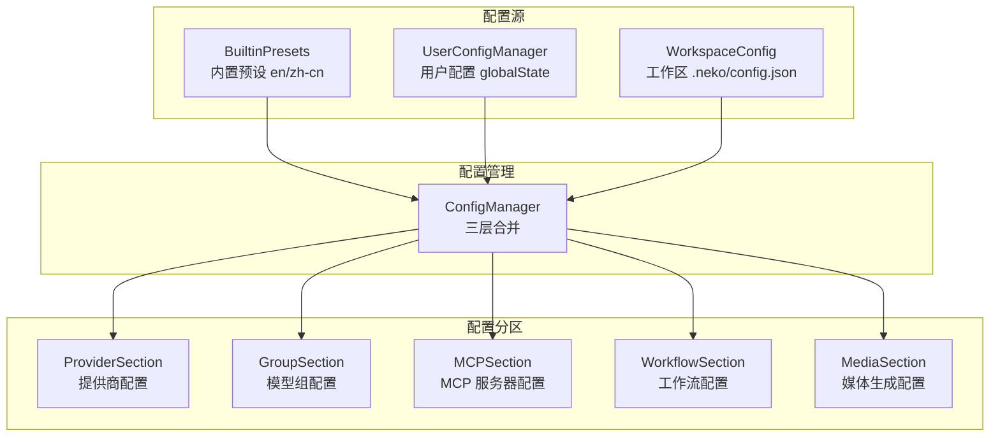

# config/

三层配置管理模块，支持内置预设、用户配置和工作区配置。

## 架构图



## 职责

管理平台配置的加载、合并和热更新，实现配置优先级：工作区 > 用户 > 内置。

## 结构

```
config/
├── index.ts                  # 模块导出
├── config-manager.ts         # 配置管理器（分区架构）
├── base-config-section.ts    # 配置分区基类
├── config-section-impls.ts   # 配置分区实现
├── builtin-presets.ts        # 内置预设加载
├── user-config.ts            # 用户配置管理
├── workspace-config.ts       # 工作区配置管理
└── presets/                  # 预设配置文件
    ├── en/                   # 英文预设
    │   ├── providers.json
    │   ├── groups.json
    │   └── ...
    └── zh-cn/                # 中文预设
        ├── providers.json
        ├── groups.json
        └── ...
```

## 核心接口

### ConfigManager

```typescript
class ConfigManager {
  // 获取配置分区
  getSection<T extends ConfigSection>(name: string): T;

  // 提供商配置
  readonly providers: ProviderSection;
  readonly groups: GroupSection;

  // 扩展配置
  readonly mcp: MCPSection;
  readonly workflows: WorkflowSection;
  readonly media: MediaSection;

  // 合并配置
  getMergedConfig(): PlatformConfig;

  // 热更新
  reload(): Promise<void>;
  onConfigChange(callback: ConfigChangeCallback): Disposable;
}
```

### 配置分区接口

```typescript
interface ConfigSection<T> {
  // 获取配置
  get(id: string): T | undefined;
  getAll(): T[];
  has(id: string): boolean;

  // 修改配置
  set(id: string, config: T): void;
  remove(id: string): boolean;
  clear(): void;

  // 持久化
  save(): Promise<void>;
  load(): Promise<void>;
}
```

## 导出

| 导出 | 类型 | 用途 |
|------|------|------|
| `ConfigManager` | 类 | 统一配置管理 |
| `BaseConfigSection` | 抽象类 | 配置分区基类 |
| `ProviderSection` | 类 | 提供商配置分区 |
| `GroupSection` | 类 | 模型组配置分区 |
| `loadBuiltinPresets()` | 函数 | 加载内置预设 |
| `UserConfigManager` | 类 | 用户配置管理 |
| `loadWorkspaceConfig()` | 函数 | 加载工作区配置 |
| `watchWorkspaceConfig()` | 函数 | 监听配置变化 |

## 依赖

```
→ types/config    # 配置类型定义
← index.ts        # 平台入口
← provider/       # 提供商初始化
← llm/            # LLM 配置
← mcp/            # MCP 配置
← workflow/       # 工作流配置
← media/          # 媒体配置
```

## 配置优先级

```
工作区配置（.neko/config.json）
    ↓ 覆盖
用户配置（VSCode globalState）
    ↓ 覆盖
内置预设（presets/*.json）
```

> **注意**：工作区配置目录 `.neko/` 与 agent-cli 共享，实现统一配置管理。

## 使用示例

### 获取配置

```typescript
import { ConfigManager } from '@uniedit/platform';

const config = new ConfigManager({ locale: 'zh-cn' });

// 获取提供商配置
const provider = config.providers.get('anthropic');

// 获取所有模型组
const groups = config.groups.getAll();

// 获取 MCP 服务器配置
const mcpServers = config.mcp.getAll();
```

### 修改配置

```typescript
// 添加提供商
config.providers.set('my-provider', {
  id: 'my-provider',
  name: 'My Provider',
  type: 'openai-compatible',
  apiUrl: 'https://api.example.com',
  apiKey: 'sk-xxx',
});

// 保存到用户配置
await config.providers.save();
```

### 监听变化

```typescript
const disposable = config.onConfigChange((section, changes) => {
  console.log(`Config section ${section} changed:`, changes);
});

// 清理
disposable.dispose();
```

## 设计模式

- **分区模式**：配置按功能分区管理
- **三层覆盖**：支持多来源配置合并
- **观察者模式**：配置变化通知
