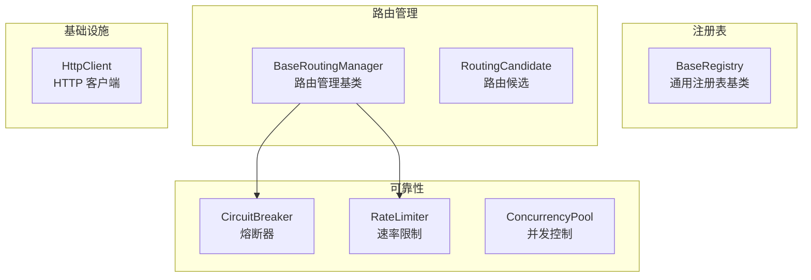

# core/

核心抽象层，提供跨模块共享的基础构建块。

## 职责

提供通用注册表、路由管理、熔断器和速率限制的抽象实现。

## 架构图



## 结构

```
core/
├── index.ts                  # 模块导出
├── base-registry.ts          # 通用注册表基类
├── router.ts                 # 路由管理基类
├── circuit-breaker.ts        # 熔断器
├── rate-limiter.ts           # 速率限制器
└── http-client.ts            # 共享 HTTP 客户端
```

注：`ConcurrencyPool` 从 `@neko/shared` re-export。

## 核心接口

### BaseRegistry

```typescript
class BaseRegistry<T> implements IRegistry<T> {
  register(id: string, item: T): void;
  unregister(id: string): boolean;
  get(id: string): T | undefined;
  getAll(): T[];
  has(id: string): boolean;
  clear(): void;
}
```

### BaseRoutingManager

```typescript
abstract class BaseRoutingManager<TCandidate, TContext, TResult> {
  registerStrategy(strategy: IRoutingStrategy<TCandidate, TContext>): void;
  async route(context: TContext): Promise<TResult>;
  protected abstract getCandidates(context: TContext): RoutingCandidate<TCandidate>[];
  protected abstract buildResult(winner: RoutingCandidate<TCandidate>, context: TContext): TResult;
}
```

### CircuitBreaker

```typescript
class CircuitBreaker {
  async execute<T>(operation: () => Promise<T>): Promise<T>;
  getState(): CircuitState; // 'closed' | 'open' | 'half-open'
  getStats(): CircuitBreakerStats;
}
```

### RateLimiter

```typescript
class RateLimiter {
  async acquire(): Promise<void>;
  tryAcquire(): boolean;
  check(): RateLimitResult;
  getStats(): RateLimiterStats;
}
```

## 导出

| 导出 | 类型 | 用途 |
|------|------|------|
| `BaseRegistry<T>` | 类 | 通用注册表基类 |
| `BaseRoutingManager` | 类 | 路由管理基类 |
| `CircuitBreaker` | 类 | 熔断器 |
| `CircuitOpenError` | 类 | 熔断器打开时的错误 |
| `RateLimiter` | 类 | 速率限制器 |
| `RateLimitError` | 类 | 速率限制错误 |
| `ConcurrencyPool` | 类 | 并发控制池（re-export from @neko/shared） |
| `HttpClient` | 类 | 共享 HTTP 客户端 |

## 依赖

```
→ @neko/shared    # ConcurrencyPool
← provider/       # ProviderRegistry 继承 BaseRegistry
← media/routing/  # MediaRoutingManager 继承 BaseRoutingManager
```

## 使用示例

### 熔断器

```typescript
import { CircuitBreaker, CircuitOpenError } from '@neko/platform';

const breaker = new CircuitBreaker({ failureThreshold: 5, resetTimeout: 30000 });

try {
  const result = await breaker.execute(() => apiCall());
} catch (error) {
  if (error instanceof CircuitOpenError) {
    // 熔断器已打开，使用降级策略
  }
}
```

## 设计模式

- **模板方法**：BaseRoutingManager 定义路由流程骨架
- **注册表模式**：BaseRegistry 管理组件
- **熔断器模式**：CircuitBreaker 实现故障隔离
- **令牌桶模式**：RateLimiter 实现速率限制
