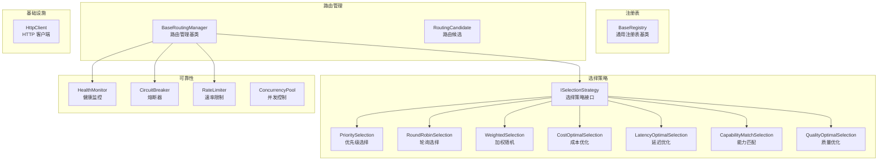

# core/

核心抽象层，提供跨模块共享的基础构建块。

## 职责

提供通用注册表、选择策略、路由管理、健康监控、熔断器和速率限制的抽象实现。

## 架构图



## 结构

```
core/
├── index.ts                  # 模块导出
├── base-registry.ts          # 通用注册表基类
├── selection-strategy.ts     # 7种选择策略实现
├── router.ts                 # 路由管理基类
├── health-monitor.ts         # 健康状态监控
├── circuit-breaker.ts        # 熔断器
├── rate-limiter.ts           # 速率限制器
├── concurrency-pool.ts       # 并发控制池
└── http-client.ts            # 共享 HTTP 客户端
```

## 核心接口

### BaseRegistry

```typescript
class BaseRegistry<T> implements IRegistry<T> {
  register(id: string, item: T): void;
  unregister(id: string): boolean;
  get(id: string): T | undefined;
  getAll(): T[];
  has(id: string): boolean;
  clear(): void;
}
```

### ISelectionStrategy

```typescript
interface ISelectionStrategy<T> {
  name: string;
  select(
    candidates: T[],
    context: SelectionContext
  ): T | undefined;
}

interface SelectionContext {
  required?: string[];      // 必需能力
  preferred?: string[];     // 偏好能力
  excludeIds?: string[];    // 排除 ID
  metadata?: Record<string, unknown>;
}
```

### BaseRoutingManager

```typescript
abstract class BaseRoutingManager<TCandidate, TContext, TResult> {
  // 注册路由策略
  registerStrategy(strategy: IRoutingStrategy<TCandidate, TContext>): void;

  // 执行路由
  async route(context: TContext): Promise<TResult>;

  // 子类实现：获取候选者
  protected abstract getCandidates(context: TContext): RoutingCandidate<TCandidate>[];

  // 子类实现：构建结果
  protected abstract buildResult(
    winner: RoutingCandidate<TCandidate>,
    context: TContext
  ): TResult;
}
```

### CircuitBreaker

```typescript
class CircuitBreaker {
  // 执行带熔断保护的操作
  async execute<T>(operation: () => Promise<T>): Promise<T>;

  // 获取状态
  getState(): CircuitState; // 'closed' | 'open' | 'half-open'

  // 获取统计
  getStats(): CircuitBreakerStats;
}
```

### RateLimiter

```typescript
class RateLimiter {
  // 获取令牌（阻塞）
  async acquire(): Promise<void>;

  // 尝试获取令牌（非阻塞）
  tryAcquire(): boolean;

  // 检查是否可获取
  check(): RateLimitResult;

  // 获取统计
  getStats(): RateLimiterStats;
}
```

## 导出

| 导出 | 类型 | 用途 |
|------|------|------|
| `BaseRegistry<T>` | 类 | 通用注册表基类 |
| `ISelectionStrategy` | 接口 | 选择策略抽象 |
| `PrioritySelectionStrategy` | 类 | 按优先级选择 |
| `RoundRobinSelectionStrategy` | 类 | 轮询负载均衡 |
| `WeightedSelectionStrategy` | 类 | 加权随机选择 |
| `CostOptimalSelectionStrategy` | 类 | 成本优化选择 |
| `LatencyOptimalSelectionStrategy` | 类 | 延迟优化选择 |
| `CapabilityMatchSelectionStrategy` | 类 | 能力匹配选择 |
| `QualityOptimalSelectionStrategy` | 类 | 质量优化选择 |
| `SelectionStrategyFactory` | 工厂 | 创建选择策略 |
| `BaseRoutingManager` | 类 | 路由管理基类 |
| `HealthMonitor` | 类 | 健康状态监控 |
| `CircuitBreaker` | 类 | 熔断器 |
| `RateLimiter` | 类 | 速率限制器 |
| `ConcurrencyPool` | 类 | 并发控制池 |
| `HttpClient` | 类 | 共享 HTTP 客户端 |

## 依赖

```
→ types/          # 类型定义
← provider/       # ProviderRegistry 继承 BaseRegistry
← llm/routing/    # LLMRoutingManager 继承 BaseRoutingManager
← media/routing/  # MediaRoutingManager 继承 BaseRoutingManager
```

## 选择策略

| 策略 | 说明 | 适用场景 |
|------|------|----------|
| `priority` | 按优先级排序选择 | 有明确优先级时 |
| `round-robin` | 轮询选择 | 负载均衡 |
| `weighted` | 加权随机选择 | 按权重分配流量 |
| `cost-optimal` | 按成本评分 | 成本敏感场景 |
| `latency-optimal` | 按延迟评分 | 延迟敏感场景 |
| `capability` | 按能力匹配 | 需要特定能力时 |
| `quality` | 按质量评分 | 质量优先场景 |

## 使用示例

### 创建自定义注册表

```typescript
import { BaseRegistry } from '@uniedit/platform';

interface MyItem {
  id: string;
  name: string;
}

class MyRegistry extends BaseRegistry<MyItem> {}

const registry = new MyRegistry();
registry.register('item1', { id: 'item1', name: 'Item 1' });
```

### 使用选择策略

```typescript
import { SelectionStrategyFactory } from '@uniedit/platform';

const strategy = SelectionStrategyFactory.create('priority');
const selected = strategy.select(candidates, {
  required: ['vision'],
  preferred: ['function_calling'],
});
```

### 使用熔断器

```typescript
import { CircuitBreaker } from '@uniedit/platform';

const breaker = new CircuitBreaker({
  failureThreshold: 5,
  resetTimeout: 30000,
});

try {
  const result = await breaker.execute(() => apiCall());
} catch (error) {
  if (error instanceof CircuitOpenError) {
    // 熔断器已打开，使用降级策略
  }
}
```

## 设计模式

- **策略模式**：选择策略可插拔替换
- **模板方法**：BaseRoutingManager 定义路由流程骨架
- **注册表模式**：BaseRegistry 管理组件
- **熔断器模式**：CircuitBreaker 实现故障隔离
- **令牌桶模式**：RateLimiter 实现速率限制
