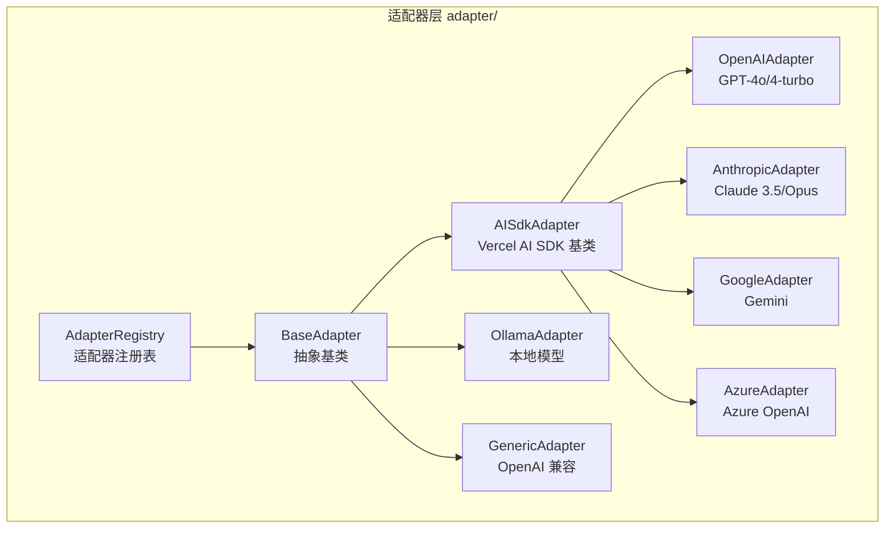

# llm/

LLM 抽象层，提供多提供商适配器。

## 职责

统一不同 AI 提供商（OpenAI、Anthropic、Google 等）的接口。模型选择逻辑由 `service/model-selector.ts` 负责，本层仅关注适配器实现。

## 架构图



## 结构

```
llm/
├── index.ts              # 模块导出（re-export adapter/）
│
└── adapter/              # 提供商适配器
    ├── index.ts
    ├── base-adapter.ts       # 适配器基类
    ├── ai-sdk-adapter.ts     # Vercel AI SDK 基类
    ├── adapter-registry.ts   # 适配器注册表
    ├── stream-aggregator.ts  # 流聚合器
    │
    ├── openai-adapter.ts     # OpenAI API
    ├── anthropic-adapter.ts  # Anthropic API (Extended Thinking)
    ├── google-adapter.ts     # Google Gemini API
    ├── azure-adapter.ts      # Azure OpenAI API
    ├── ollama-adapter.ts     # Ollama 本地 API
    └── generic-adapter.ts    # 通用 OpenAI 兼容 API
```

## 核心接口

### BaseAdapter

```typescript
abstract class BaseAdapter implements Adapter {
  abstract readonly type: string;

  abstract chat(
    messages: ChatMessage[],
    options: ChatOptions,
    model: Model,
    provider: Provider
  ): Promise<ChatResponse>;

  abstract chatStream(
    messages: ChatMessage[],
    options: ChatOptions,
    model: Model,
    provider: Provider
  ): AsyncIterable<ChatChunk>;

  supportsStreaming(): boolean;
  supportsCapability(capability: string): boolean;

  // 可选扩展
  embed?(input: string | string[], model: Model, provider: Provider): Promise<number[][]>;
  listModels?(provider: Provider): Promise<string[]>;
  validateApiKey?(provider: Provider, modelName?: string): Promise<{ valid: boolean; error?: string }>;
}
```

## 导出

| 导出 | 类型 | 用途 |
|------|------|------|
| `BaseAdapter` | 抽象类 | 适配器基类 |
| `OpenAIAdapter` | 类 | OpenAI API 适配 |
| `AnthropicAdapter` | 类 | Claude API 适配（支持 Extended Thinking） |
| `GoogleAdapter` | 类 | Gemini API 适配 |
| `AzureAdapter` | 类 | Azure OpenAI API 适配 |
| `OllamaAdapter` | 类 | Ollama 本地模型适配 |
| `GenericAdapter` | 类 | OpenAI 兼容 API 适配 |
| `AdapterRegistry` | 类 | 适配器注册表 |
| `createStreamCollector()` | 函数 | 创建流聚合器 |

## 依赖

```
→ types/          # 适配器类型定义
← provider/       # ProviderRegistry 使用 AdapterRegistry
← service/        # Service 通过 ProviderRegistry 调用
```

## 适配器能力

| 适配器 | 流式 | 工具调用 | 视觉 | Extended Thinking | 模型列举 | API Key 验证 |
|--------|------|----------|------|-------------------|----------|-------------|
| OpenAI | ✅ | ✅ | ✅ | ❌ | ✅ | ✅ |
| Anthropic | ✅ | ✅ | ✅ | ✅ | ✅ | ✅ |
| Google | ✅ | ✅ | ✅ | ❌ | ✅ | ✅ |
| Azure | ✅ | ✅ | ✅ | ❌ | ❌ | ✅ |
| Ollama | ✅ | ⚠️ | ⚠️ | ❌ | ✅ | ❌ |
| Generic | ✅ | ⚠️ | ⚠️ | ❌ | ✅ | ❌ |

## 使用示例

### 自定义适配器

```typescript
import { BaseAdapter } from '@neko/platform';

class MyProviderAdapter extends BaseAdapter {
  readonly type = 'my-provider';

  async chat(messages, options, model, provider) {
    const response = await this.http.post(
      `${provider.apiUrl}/chat`,
      { messages, model: model.name },
      { headers: { Authorization: `Bearer ${provider.apiKey}` } }
    );
    return this.parseResponse(response);
  }

  async *chatStream(messages, options, model, provider) {
    // 流式实现
  }
}

// 注册适配器
const registry = getAdapterRegistry();
registry.register('my-provider', new MyProviderAdapter());
```

### Extended Thinking (Anthropic)

```typescript
const { stream } = service.chatStream(messages, {
  thinkingBudget: 10000,
});

for await (const chunk of stream) {
  if (chunk.thinking) console.log('Thinking:', chunk.thinking);
  else console.log('Content:', chunk.delta?.content);
}
```

## 设计模式

- **适配器模式**：统一不同提供商接口
- **注册表模式**：动态管理适配器
- **模板方法**：BaseAdapter/AISdkAdapter 定义请求处理框架
