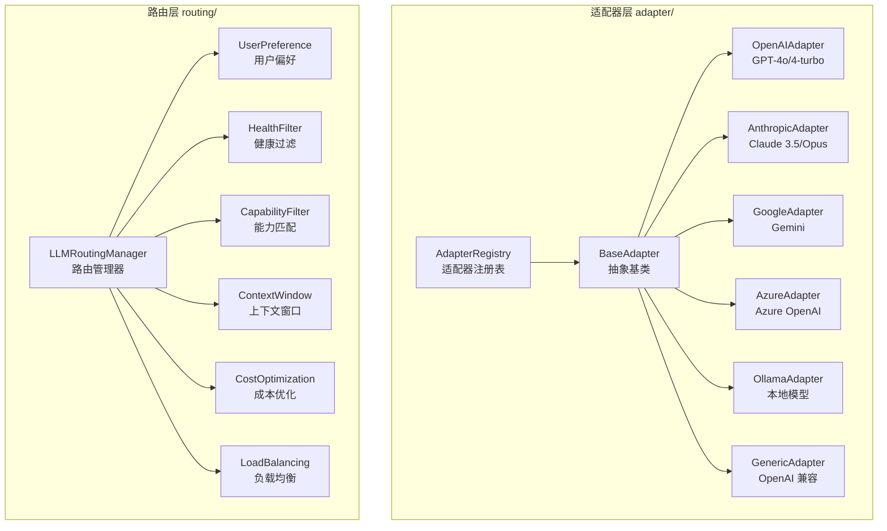

# llm/

LLM 抽象层，提供多提供商适配和智能路由。

## 职责

统一不同 AI 提供商（OpenAI、Anthropic、Google 等）的接口，实现智能路由选择。

## 架构图



## 结构

```
llm/
├── index.ts              # 模块导出（re-export adapter + routing）
│
├── adapter/              # 提供商适配器
│   ├── index.ts
│   ├── base-adapter.ts       # 适配器基类
│   ├── adapter-registry.ts   # 适配器注册表
│   ├── stream-aggregator.ts  # 流聚合器
│   │
│   ├── openai-adapter.ts     # OpenAI API
│   ├── anthropic-adapter.ts  # Anthropic API (Extended Thinking)
│   ├── google-adapter.ts     # Google Gemini API
│   ├── azure-adapter.ts      # Azure OpenAI API
│   ├── ollama-adapter.ts     # Ollama 本地 API
│   └── generic-adapter.ts    # 通用 OpenAI 兼容 API
│
└── routing/              # 路由策略
    ├── index.ts
    ├── types.ts              # 路由类型定义
    ├── llm-routing-manager.ts # 路由管理器
    └── strategies/           # 策略实现
        ├── user-preference.ts   # 用户偏好策略
        ├── health-filter.ts     # 健康过滤策略
        ├── capability-filter.ts # 能力匹配策略
        ├── context-window.ts    # 上下文窗口策略
        ├── cost-optimization.ts # 成本优化策略
        └── load-balancing.ts    # 负载均衡策略
```

## 核心接口

### BaseAdapter

```typescript
abstract class BaseAdapter implements Adapter {
  abstract readonly type: string;

  // 同步对话
  abstract chat(
    messages: ChatMessage[],
    options: ChatOptions,
    model: Model,
    provider: Provider
  ): Promise<ChatResponse>;

  // 流式对话
  abstract chatStream(
    messages: ChatMessage[],
    options: ChatOptions,
    model: Model,
    provider: Provider
  ): AsyncIterable<ChatChunk>;

  // 能力检查
  supportsStreaming(): boolean;
  supportsCapability(capability: string): boolean;
}
```

### LLMRoutingManager

```typescript
class LLMRoutingManager {
  // 路由选择
  route(context: LLMRoutingContext): Promise<LLMRoutingResult>;

  // 策略管理
  registerStrategy(strategy: LLMRoutingStrategy): void;
  removeStrategy(name: string): void;
  listStrategies(): string[];
}

interface LLMRoutingContext {
  messages: ChatMessage[];
  requiredCapabilities?: string[];
  preference?: LLMRoutingPreference;
  estimatedTokens?: number;
}

interface LLMRoutingResult {
  provider: Provider;
  model: Model;
  adapter: Adapter;
  scores: Record<string, number>;
}
```

## 导出

| 导出 | 类型 | 用途 |
|------|------|------|
| `BaseAdapter` | 抽象类 | 适配器基类 |
| `OpenAIAdapter` | 类 | OpenAI API 适配 |
| `AnthropicAdapter` | 类 | Claude API 适配（支持 Extended Thinking） |
| `GoogleAdapter` | 类 | Gemini API 适配 |
| `AzureAdapter` | 类 | Azure OpenAI API 适配 |
| `OllamaAdapter` | 类 | Ollama 本地模型适配 |
| `GenericAdapter` | 类 | OpenAI 兼容 API 适配 |
| `AdapterRegistry` | 类 | 适配器注册表 |
| `LLMRoutingManager` | 类 | 智能路由管理 |
| `createStreamCollector()` | 函数 | 创建流聚合器 |

## 依赖

```
→ core/           # BaseRoutingManager, 选择策略
→ types/          # 适配器类型定义
← provider/       # 提供商注册和管理
← service/        # 服务层调用
```

## 适配器能力

| 适配器 | 流式 | 工具调用 | 视觉 | Extended Thinking |
|--------|------|----------|------|-------------------|
| OpenAI | ✅ | ✅ | ✅ | ❌ |
| Anthropic | ✅ | ✅ | ✅ | ✅ |
| Google | ✅ | ✅ | ✅ | ❌ |
| Azure | ✅ | ✅ | ✅ | ❌ |
| Ollama | ✅ | ⚠️ | ⚠️ | ❌ |
| Generic | ✅ | ⚠️ | ⚠️ | ❌ |

## 路由策略

策略按顺序执行，后续策略基于前序策略的结果进行筛选和评分：

| 策略 | 执行顺序 | 说明 |
|------|----------|------|
| `UserPreference` | 1 | 用户指定的 Provider/Model 优先 |
| `HealthFilter` | 2 | 过滤不健康的 Provider |
| `CapabilityFilter` | 3 | 匹配所需能力（如 vision, tools） |
| `ContextWindow` | 4 | 确保上下文窗口足够 |
| `CostOptimization` | 5 | 按成本评分 |
| `LoadBalancing` | 6 | 负载均衡评分 |

## 使用示例

### 自定义适配器

```typescript
import { BaseAdapter } from '@uniedit/platform';

class MyProviderAdapter extends BaseAdapter {
  readonly type = 'my-provider';

  protected getSupportedCapabilities(): string[] {
    return ['chat', 'streaming', 'function_calling'];
  }

  async chat(messages, options, model, provider) {
    const response = await this.http.post(
      `${provider.apiUrl}/chat`,
      { messages, ...options },
      { headers: { Authorization: `Bearer ${provider.apiKey}` } }
    );
    return this.parseResponse(response);
  }

  async *chatStream(messages, options, model, provider) {
    // 流式实现
  }
}

// 注册适配器
const registry = getAdapterRegistry();
registry.register('my-provider', new MyProviderAdapter());
```

### 自定义路由策略

```typescript
import type { LLMRoutingStrategy, LLMRoutingCandidate } from '@uniedit/platform';

class PriorityModelStrategy implements LLMRoutingStrategy {
  name = 'priority-model';

  async score(
    candidates: LLMRoutingCandidate[],
    context: LLMRoutingContext
  ): Promise<LLMRoutingCandidate[]> {
    const priorityModels = ['claude-3-5-sonnet', 'gpt-4o'];

    return candidates.map(c => ({
      ...c,
      score: c.score + (priorityModels.includes(c.model.id) ? 10 : 0),
    }));
  }
}

// 注册策略
llmRouter.registerStrategy(new PriorityModelStrategy());
```

### Extended Thinking (Anthropic)

```typescript
const response = await service.chatStream(messages, {
  thinkingBudget: 10000, // 启用扩展思考
});

for await (const chunk of response) {
  if (chunk.type === 'thinking') {
    console.log('Thinking:', chunk.thinking);
  } else if (chunk.type === 'content') {
    console.log('Content:', chunk.delta?.content);
  }
}
```

## 设计模式

- **适配器模式**：统一不同提供商接口
- **策略模式**：路由策略可插拔替换
- **责任链模式**：多策略链式评分
- **注册表模式**：动态管理适配器
