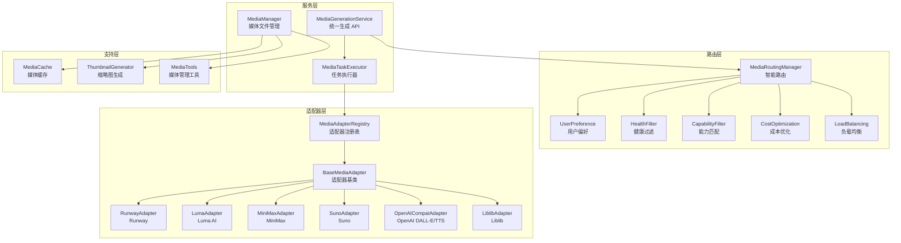

# media/

媒体生成服务模块，提供 AI 媒体生成和管理能力。

## 职责

统一多平台媒体生成（图片、视频、音频），提供智能路由和任务管理。

## 架构图



## 结构

```
media/
├── index.ts                    # 模块导出 + createMediaPlatform
├── types.ts                    # 媒体生成类型定义
│
├── media-generation-service.ts # 统一生成服务 API
├── media-task-executor.ts      # 任务执行器
├── media-manager.ts            # 媒体文件管理
├── media-cache.ts              # 媒体缓存
├── thumbnail.ts                # 缩略图生成
├── media-tool.ts               # 媒体管理工具
│
├── adapters/                   # 平台适配器
│   ├── index.ts
│   ├── base-media-adapter.ts       # 适配器基类
│   ├── adapter-registry.ts         # 适配器注册表
│   ├── openai-compat-media-adapter.ts  # OpenAI DALL-E/TTS
│   ├── runway-media-adapter.ts     # Runway Gen-2/Gen-3
│   ├── luma-media-adapter.ts       # Luma Dream Machine
│   ├── minimax-media-adapter.ts    # MiniMax 海螺
│   ├── liblib-media-adapter.ts     # Liblib
│   └── suno-media-adapter.ts       # Suno 音乐
│
└── routing/                    # 路由策略
    ├── index.ts
    ├── types.ts                    # 路由类型
    ├── media-routing-manager.ts    # 路由管理器
    └── strategies/                 # 策略实现
        ├── user-preference.ts
        ├── health-filter.ts
        ├── capability-filter.ts
        ├── cost-optimization.ts
        ├── latency-optimization.ts
        └── load-balancing.ts
```

## 核心接口

### MediaGenerationService

```typescript
class MediaGenerationService {
  // 图片生成
  generateImage(request: ImageGenerationRequest): Promise<MediaTask>;

  // 视频生成
  generateVideo(request: VideoGenerationRequest): Promise<MediaTask>;

  // 音频生成
  generateAudio(request: AudioGenerationRequest): Promise<MediaTask>;

  // 等待任务完成
  waitForTask(taskId: string, timeoutMs?: number): Promise<MediaTask>;

  // 获取任务状态
  getTask(taskId: string): Promise<MediaTask | undefined>;

  // 取消任务
  cancelTask(taskId: string): Promise<boolean>;

  // 监听任务进度
  onProgress(taskId: string, callback: MediaProgressCallback): void;
}
```

### 请求类型

```typescript
interface ImageGenerationRequest {
  prompt: string;
  negativePrompt?: string;
  referenceImageUrl?: string;  // 用于 image-to-image
  width?: number;
  height?: number;
  count?: number;
  style?: string;
  preference?: RoutingPreference;
}

interface VideoGenerationRequest {
  prompt: string;
  referenceImageUrl?: string;  // 用于 image-to-video
  referenceVideoUrl?: string;  // 用于 video-to-video
  duration?: number;
  aspectRatio?: '16:9' | '9:16' | '1:1';
  preference?: RoutingPreference;
}

interface AudioGenerationRequest {
  prompt: string;
  isMusic?: boolean;
  duration?: number;
  voice?: string;  // TTS 语音
  preference?: RoutingPreference;
}
```

### MediaTask

```typescript
interface MediaTask {
  id: string;
  type: MediaGenerationType;
  status: MediaTaskStatus;
  progress?: number;
  outputs?: MediaOutput[];
  error?: MediaAdapterError;
  createdAt: Date;
  completedAt?: Date;
}

type MediaGenerationType =
  | 'text-to-image'
  | 'image-to-image'
  | 'text-to-video'
  | 'image-to-video'
  | 'video-to-video'
  | 'text-to-audio'
  | 'text-to-music';

type MediaTaskStatus = 'pending' | 'running' | 'completed' | 'failed' | 'cancelled';
```

## 导出

| 导出 | 类型 | 用途 |
|------|------|------|
| `MediaGenerationService` | 类 | 统一媒体生成 API |
| `MediaManager` | 类 | 媒体文件管理 |
| `MediaRoutingManager` | 类 | 智能路由选择 |
| `MediaTaskExecutor` | 类 | 任务执行器 |
| `MediaAdapterRegistry` | 类 | 适配器注册表 |
| `BaseMediaAdapter` | 抽象类 | 适配器基类 |
| `createMediaPlatform()` | 函数 | 创建媒体平台 |
| `createMediaTools()` | 函数 | 创建媒体管理工具 |

## 依赖

```
→ core/           # BaseRoutingManager, 选择策略
→ provider/       # 提供商信息
→ task/           # TaskManager 任务管理
← tools/          # 媒体生成工具
← index.ts        # 平台入口
```

## 支持平台

### 图片生成

| 平台 | 类型 | 能力 |
|------|------|------|
| OpenAI DALL-E | text-to-image | 高质量，多风格 |
| Midjourney | text-to-image | 艺术风格 |
| Liblib | text-to-image, image-to-image | 国产，快速 |

### 视频生成

| 平台 | 类型 | 能力 |
|------|------|------|
| Runway Gen-3 | text-to-video, image-to-video | 高质量，长视频 |
| Luma Dream Machine | text-to-video, image-to-video | 快速，低成本 |
| MiniMax 海螺 | text-to-video | 国产，快速 |
| Kling | text-to-video, image-to-video | 高质量 |
| Vidu | text-to-video | 快速生成 |

### 音频生成

| 平台 | 类型 | 能力 |
|------|------|------|
| Suno | text-to-music | AI 音乐生成 |
| OpenAI TTS | text-to-audio | 语音合成 |

## 使用示例

### 生成图片

```typescript
const task = await platform.media.generateImage({
  prompt: 'A beautiful sunset over mountains',
  width: 1024,
  height: 1024,
  count: 2,
});

// 等待完成
const result = await platform.media.waitForTask(task.id);
console.log('Generated images:', result.outputs);
```

### 生成视频

```typescript
const task = await platform.media.generateVideo({
  prompt: 'A cat playing in the garden',
  referenceImageUrl: 'https://example.com/cat.jpg', // 可选的参考图
  duration: 5,
  aspectRatio: '16:9',
});

// 监听进度
platform.media.onProgress(task.id, (progress) => {
  console.log(`Progress: ${progress}%`);
});

const result = await platform.media.waitForTask(task.id, 60000);
console.log('Generated video:', result.outputs?.[0]?.url);
```

### 生成音乐

```typescript
const task = await platform.media.generateAudio({
  prompt: 'An upbeat electronic dance track',
  isMusic: true,
  duration: 30,
});

const result = await platform.media.waitForTask(task.id);
console.log('Generated music:', result.outputs?.[0]?.url);
```

### 自定义路由偏好

```typescript
const task = await platform.media.generateVideo({
  prompt: 'A cinematic landscape',
  preference: {
    providerId: 'runway',  // 指定使用 Runway
    quality: 'high',       // 优先质量
    costSensitive: false,  // 不考虑成本
  },
});
```

## 路由策略

| 策略 | 说明 |
|------|------|
| `UserPreference` | 用户指定的 Provider 优先 |
| `HealthFilter` | 过滤不健康的服务 |
| `CapabilityFilter` | 匹配生成类型能力 |
| `CostOptimization` | 按成本评分 |
| `LatencyOptimization` | 按延迟评分 |
| `LoadBalancing` | 负载均衡 |

## 设计模式

- **适配器模式**：统一不同平台 API
- **策略模式**：路由策略可替换
- **任务队列模式**：异步任务执行
- **工厂模式**：createMediaPlatform 创建完整服务
