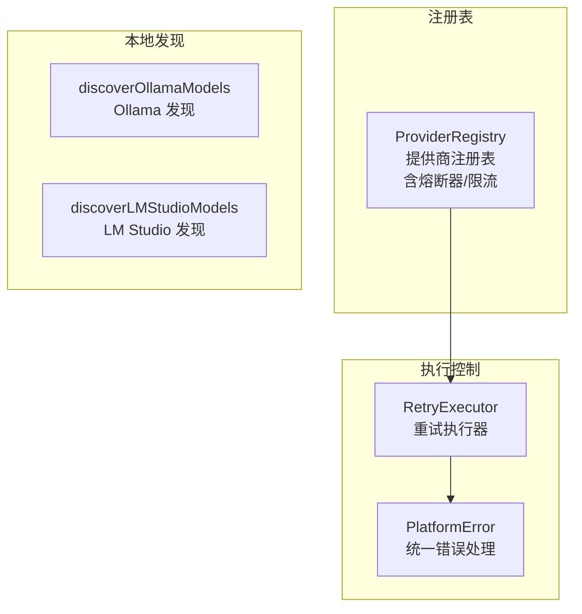

# provider/

提供商管理模块，负责 AI 提供商的注册、错误处理和可靠性保障。

## 架构图



## 职责

管理 AI 提供商注册表、本地模型发现，以及统一错误处理和重试执行。

## 结构

```
provider/
├── index.ts                      # 模块导出
├── provider-registry.ts          # 提供商注册表（含熔断器/限流集成）
├── local-discovery.ts            # 本地模型发现
├── platform-error.ts             # 平台错误类
└── retry-executor.ts             # 重试执行器
```

## 核心接口

### ProviderRegistry

```typescript
class ProviderRegistry {
  // 适配器管理
  getAdapter(providerId: string, model?: Model): Adapter | undefined;

  // 可用性检查（熔断器 + 健康状态）
  isProviderAvailable(providerId: string, sessionId?: string): boolean;

  // 限流
  tryAcquireRateLimit(providerId: string): { allowed: boolean; retryAfterMs?: number };

  // 保护执行（熔断器 + 限流）
  executeWithProtection<T>(
    providerId: string,
    operation: () => Promise<T>,
    sessionId?: string
  ): Promise<T>;

  // 电路记录
  recordSuccess(providerId: string, sessionId?: string): void;
  recordFailure(providerId: string, error: Error, sessionId?: string): void;
}
```

### PlatformError

```typescript
class PlatformError extends Error {
  readonly category: ErrorCategory;
  readonly code: string;
  readonly retryable: boolean;
  readonly retryAfter?: number;

  static fromError(error: Error): PlatformError;
}

type ErrorCategory =
  | 'rate_limit'      // 速率限制（可重试）
  | 'timeout'         // 超时（可重试）
  | 'auth'            // 认证失败（不可重试）
  | 'network'         // 网络错误（可重试）
  | 'server'          // 服务器错误（可重试）
  | 'validation'      // 请求参数无效（不可重试）
  | 'not_found';      // 资源不存在（不可重试）
```

## 导出

| 导出 | 类型 | 用途 |
|------|------|------|
| `ProviderRegistry` | 类 | 提供商注册和管理 |
| `discoverOllamaModels()` | 函数 | 发现 Ollama 模型 |
| `discoverLMStudioModels()` | 函数 | 发现 LM Studio 模型 |
| `PlatformError` | 类 | 平台错误 |
| `executeWithRetry()` | 函数 | 带重试执行 |
| `withStreamTimeout()` | 函数 | 流式超时包装 |

## 依赖

```
→ core/           # BaseRegistry, CircuitBreaker, RateLimiter
→ config/         # 配置读取
→ llm/adapter/    # LLM 适配器
← service/        # 服务调用
← agent/          # Agent 执行
← index.ts        # 平台入口
```

## 错误分类

| 分类 | 说明 | ModelSelector Fallback |
|------|------|------------------------|
| `rate_limit` | 速率限制，返回 429 | ✅ 切换到下一个模型 |
| `timeout` | 请求超时 | ✅ 切换到下一个模型 |
| `server` | 服务器内部错误 | ✅ 切换到下一个模型 |
| `network` | 网络连接错误 | ✅ 切换到下一个模型 |
| `auth` | 认证失败，API Key 无效 | ❌ 直接抛出 |
| `validation` | 请求参数无效 | ❌ 直接抛出 |
| `not_found` | 模型/提供商不存在 | ❌ 直接抛出 |

## 使用示例

```typescript
import { PlatformError } from '@neko/platform';

try {
  await service.chat(messages);
} catch (error) {
  if (error instanceof PlatformError) {
    if (error.retryable && error.retryAfter) {
      await sleep(error.retryAfter);
    } else if (error.category === 'auth') {
      // 提示用户检查 API Key
    }
  }
}
```

## 本地模型发现

```typescript
// 发现 Ollama 模型
const ollamaModels = await discoverOllamaModels('http://localhost:11434');

// 发现 LM Studio 模型
const lmStudioModels = await discoverLMStudioModels('http://localhost:1234');
```

## 设计模式

- **注册表模式**：统一管理提供商
- **熔断器模式**：故障隔离，防止级联失败
- **重试模式**：失败自动重试（含退避策略）
- **错误分类模式**：统一错误处理和 fallback 决策
