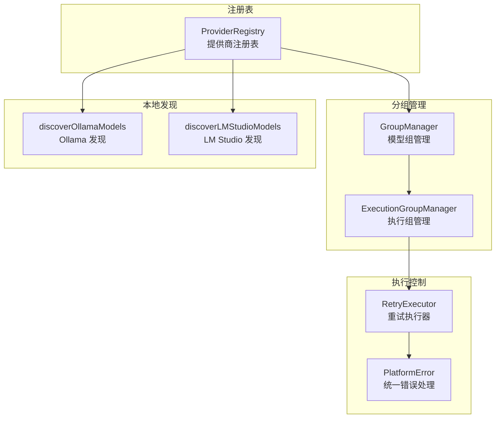

# provider/

提供商管理模块，负责 AI 提供商的注册、发现和管理。

## 架构图



## 职责

管理 AI 提供商的注册表、模型组、本地模型发现和错误处理。

## 结构

```
provider/
├── index.ts                      # 模块导出
├── provider-registry.ts          # 提供商注册表
├── group-manager.ts              # 模型组管理
├── execution-group-manager.ts    # 执行组管理
├── local-discovery.ts            # 本地模型发现
├── platform-error.ts             # 平台错误类
└── retry-executor.ts             # 重试执行器
```

## 核心接口

### ProviderRegistry

```typescript
class ProviderRegistry {
  // 注册/获取提供商
  register(provider: Provider): void;
  get(id: string): Provider | undefined;
  getAll(): Provider[];
  has(id: string): boolean;

  // 按类型获取
  getByType(type: ProviderType): Provider[];

  // 健康检查
  checkHealth(id: string): Promise<HealthStatus>;
  getHealthyProviders(): Provider[];

  // 统计
  getStats(): ProviderStats;
}
```

### GroupManager

```typescript
class GroupManager {
  // 组管理
  createGroup(id: string, config: GroupConfig): void;
  getGroup(id: string): ModelGroup | undefined;
  listGroups(): ModelGroup[];
  deleteGroup(id: string): boolean;

  // 成员管理
  addMember(groupId: string, member: GroupMember): void;
  removeMember(groupId: string, providerId: string, modelId: string): void;

  // 选择模型
  selectModel(groupId: string, context?: SelectionContext): GroupMember | undefined;
}
```

### ExecutionGroupManager

```typescript
class ExecutionGroupManager {
  // 创建执行组
  createExecutionGroup(config: ExecutionGroupConfig): ExecutionGroup;

  // 执行请求
  execute<T>(
    groupId: string,
    operation: (member: GroupMember) => Promise<T>
  ): Promise<T>;

  // 批量执行
  executeAll<T>(
    groupId: string,
    operation: (member: GroupMember) => Promise<T>
  ): Promise<T[]>;
}
```

### PlatformError

```typescript
class PlatformError extends Error {
  readonly category: ErrorCategory;
  readonly retryable: boolean;
  readonly providerType?: string;
  readonly retryAfter?: number;

  static fromAxiosError(error: AxiosError): PlatformError;
  static fromLLMError(error: unknown, provider: string): PlatformError;
}

type ErrorCategory =
  | 'rate_limit'      // 速率限制
  | 'timeout'         // 超时
  | 'auth'            // 认证失败
  | 'network'         // 网络错误
  | 'invalid_request' // 请求无效
  | 'server_error'    // 服务器错误
  | 'unknown';        // 未知错误
```

## 导出

| 导出 | 类型 | 用途 |
|------|------|------|
| `ProviderRegistry` | 类 | 提供商注册和管理 |
| `GroupManager` | 类 | 模型组管理 |
| `ExecutionGroupManager` | 类 | 执行组管理 |
| `discoverOllamaModels()` | 函数 | 发现 Ollama 模型 |
| `discoverLMStudioModels()` | 函数 | 发现 LM Studio 模型 |
| `PlatformError` | 类 | 平台错误 |
| `executeWithRetry()` | 函数 | 带重试执行 |

## 依赖

```
→ core/           # BaseRegistry, 选择策略
→ config/         # 配置读取
→ llm/adapter/    # LLM 适配器
← service/        # 服务调用
← agent/          # Agent 执行
← index.ts        # 平台入口
```

## 错误处理

### 错误分类

| 分类 | 说明 | 可重试 |
|------|------|--------|
| `rate_limit` | 速率限制，返回 429 | ✅ (有 retryAfter) |
| `timeout` | 请求超时 | ✅ |
| `auth` | 认证失败，API Key 无效 | ❌ |
| `network` | 网络连接错误 | ✅ |
| `invalid_request` | 请求参数无效 | ❌ |
| `server_error` | 服务器内部错误 | ✅ |

### 使用示例

```typescript
import { PlatformError } from '@neko/platform';

try {
  await service.chat(messages);
} catch (error) {
  if (error instanceof PlatformError) {
    if (error.retryable && error.retryAfter) {
      await sleep(error.retryAfter);
      // 重试
    } else if (error.category === 'auth') {
      // 提示用户检查 API Key
    }
  }
}
```

## 本地模型发现

```typescript
// 发现 Ollama 模型
const ollamaModels = await discoverOllamaModels('http://localhost:11434');

// 发现 LM Studio 模型
const lmStudioModels = await discoverLMStudioModels('http://localhost:1234');

// 自动注册到 Registry
for (const model of ollamaModels) {
  registry.register({
    id: `ollama-${model.name}`,
    type: 'ollama',
    models: [model],
  });
}
```

## 设计模式

- **注册表模式**：统一管理提供商
- **策略模式**：模型组选择策略
- **重试模式**：失败自动重试
- **错误分类模式**：统一错误处理
