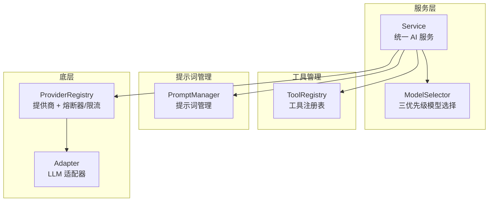

# service/

统一服务接口模块，提供 AI 对话、模型选择和工具管理能力。

## 架构图



## 职责

封装 LLM 调用，通过 `ModelSelector` 自动解析模型，提供同步/流式对话的统一接口。

## 结构

```
service/
├── index.ts              # 模块导出
├── service.ts            # 统一服务接口（chat/chatStream/embed）
├── model-selector.ts     # 三优先级模型选择器
├── tool-registry.ts      # 工具注册表
├── prompt-manager.ts     # 提示词管理
└── shared-service-adapter.ts  # 共享服务适配器
```

## 核心接口

### ModelSelector

三优先级模型解析，无需手动配置路由组：

```typescript
class ModelSelector {
  resolve(
    taskType: 'chat' | 'embedding',
    options: { modelId?: string; excludeModels?: string[] } = {}
  ): { modelId: string; providerId: string; attempt: number };

  // Priority 1: options.modelId（显式指定）
  // Priority 2: config.getTaskDefaults()?.[taskType]?.modelId
  // Priority 3: 第一个有 apiKey 且 enabled 且能力匹配的模型

  // 判断是否应 fallback
  shouldFallback(error: PlatformError): boolean;
  // 对 ['rate_limit', 'timeout', 'server', 'network'] 返回 true
}
```

### Service

```typescript
class Service {
  // 同步对话
  async chat(
    messages: ChatMessage[],
    options?: ServiceOptions
  ): Promise<ServiceResponse>;

  // 流式对话
  chatStream(
    messages: ChatMessage[],
    options?: ServiceOptions
  ): { stream: AsyncIterable<ChatChunk>; response: Promise<ServiceResponse> };

  // 带工具的对话
  async chatWithTools(
    messages: ChatMessage[],
    options: ChatWithToolsOptions
  ): Promise<ServiceResponse>;

  // 生成 Embedding
  async embed(
    input: string | string[],
    options?: EmbeddingOptions
  ): Promise<EmbeddingResponse>;
}

interface ServiceOptions {
  modelId?: string;         // 显式指定模型 (Priority 1)
  sessionId?: string;       // 会话 ID（熔断器作用域）
  temperature?: number;
  maxTokens?: number;
  thinkingBudget?: number;  // Extended Thinking 预算
  systemPrompt?: string;
}
```

### ToolRegistry

```typescript
class ToolRegistry {
  register(tool: Tool): void;
  get(name: string): Tool | undefined;
  getAll(): Tool[];
  async execute(name: string, args: Record<string, unknown>): Promise<ToolResult>;
  toToolDefinitions(): ToolDefinition[];
}
```

## 导出

| 导出 | 类型 | 用途 |
|------|------|------|
| `Service` | 类 | 统一 AI 服务 |
| `ModelSelector` | 类 | 三优先级模型选择器 |
| `ToolRegistry` | 类 | 工具注册和管理 |
| `PromptManager` | 类 | 提示词管理 |

## 依赖

```
→ provider/       # 提供商调用（含熔断器/限流）
→ config/         # taskDefaults 读取
→ types/          # 类型定义
← agent/          # Agent 执行器
← index.ts        # 平台入口
```

## 使用示例

### 基础对话

```typescript
const service = platform.createService();

// 同步对话（使用 taskDefaults 或自动选择模型）
const response = await service.chat([
  { role: 'user', content: 'Hello!' }
]);

// 显式指定模型
const response2 = await service.chat(messages, {
  modelId: 'anthropic-claude-sonnet-4-5'
});

// 流式对话
const { stream, response: responsePr } = service.chatStream(messages);
for await (const chunk of stream) {
  process.stdout.write(chunk.delta?.content || '');
}
const finalResponse = await responsePr;
```

### Extended Thinking

```typescript
const { stream } = service.chatStream(messages, {
  thinkingBudget: 10000  // 仅 Claude 模型支持
});
for await (const chunk of stream) {
  if (chunk.thinking) console.log('Thinking:', chunk.thinking);
  else console.log('Content:', chunk.delta?.content);
}
```

## 设计模式

- **门面模式**：Service 封装复杂的 LLM 调用逻辑
- **策略模式**：ModelSelector 的三优先级选择
- **注册表模式**：ToolRegistry 管理工具
