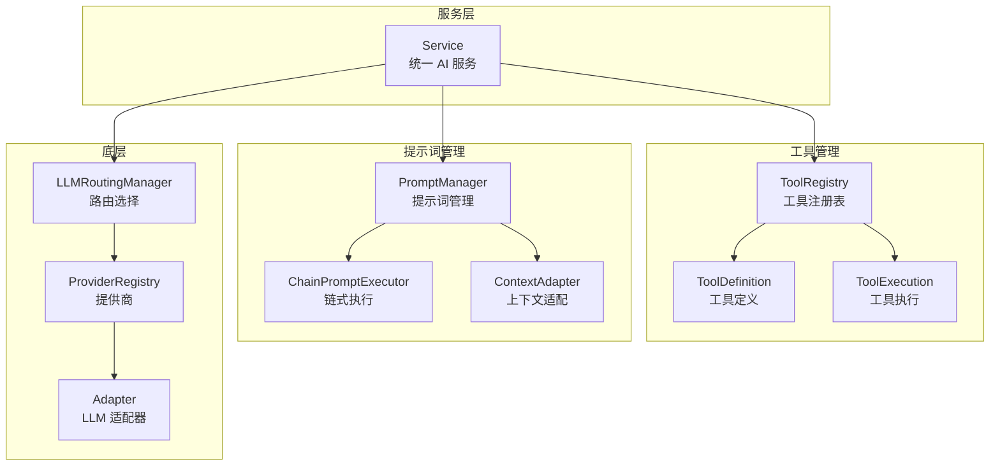

# service/

统一服务接口模块，提供 AI 对话和工具管理能力。

## 架构图



## 职责

封装 LLM 调用，提供同步/流式对话和工具调用的统一接口。

## 结构

```
service/
├── index.ts              # 模块导出
├── service.ts            # 统一服务接口
├── tool-registry.ts      # 工具注册表
├── prompt-manager.ts     # 提示词管理
└── context-adapter.ts    # 上下文适配器
```

## 核心接口

### Service

```typescript
class Service {
  // 同步对话
  async chat(
    messages: ChatMessage[],
    options?: ChatOptions
  ): Promise<ChatResponse>;

  // 流式对话
  async *chatStream(
    messages: ChatMessage[],
    options?: ChatOptions
  ): AsyncIterable<ChatChunk>;

  // 带工具的对话
  async chatWithTools(
    messages: ChatMessage[],
    tools: ToolDefinition[],
    options?: ChatOptions
  ): Promise<ChatResponse>;

  // 带工具的流式对话
  async *chatWithToolsStream(
    messages: ChatMessage[],
    tools: ToolDefinition[],
    options?: ChatOptions
  ): AsyncIterable<ChatChunk>;
}

interface ChatOptions {
  model?: string;           // 模型覆盖
  temperature?: number;     // 温度
  maxTokens?: number;       // 最大输出 token
  thinkingBudget?: number;  // Extended Thinking 预算
  groupId?: string;         // 模型组 ID
  systemPrompt?: string;    // 系统提示词
}
```

### ToolRegistry

```typescript
class ToolRegistry {
  // 注册工具
  register(tool: Tool): void;
  registerMany(tools: Tool[]): void;

  // 获取工具
  get(name: string): Tool | undefined;
  getAll(): Tool[];
  has(name: string): boolean;

  // 执行工具
  async execute(
    name: string,
    args: Record<string, unknown>,
    context?: ToolContext
  ): Promise<ToolResult>;

  // 转换为 LLM 格式
  toToolDefinitions(): ToolDefinition[];
}
```

### PromptManager

```typescript
class PromptManager {
  // 注册提示词模板
  register(name: string, template: PromptTemplate): void;

  // 渲染提示词
  render(name: string, variables: Record<string, unknown>): string;

  // 链式执行
  async executeChain(
    chain: PromptChain,
    context: ChainContext
  ): Promise<ChainResult>;
}
```

## 导出

| 导出 | 类型 | 用途 |
|------|------|------|
| `Service` | 类 | 统一 AI 服务 |
| `ToolRegistry` | 类 | 工具注册和管理 |
| `PromptManager` | 类 | 提示词管理 |
| `ChainPromptExecutor` | 类 | 链式提示词执行 |
| `ContextAdapter` | 类 | 上下文适配器 |

## 依赖

```
→ provider/       # 提供商调用
→ llm/            # LLM 路由
→ types/          # 类型定义
← agent/          # Agent 执行器
← index.ts        # 平台入口
```

## 使用示例

### 基础对话

```typescript
const service = platform.createService();

// 同步对话
const response = await service.chat([
  { role: 'user', content: 'Hello!' }
]);

// 流式对话
for await (const chunk of service.chatStream(messages)) {
  process.stdout.write(chunk.delta?.content || '');
}
```

### 带工具的对话

```typescript
const tools = [
  {
    name: 'get_weather',
    description: 'Get weather for a location',
    parameters: {
      type: 'object',
      properties: {
        location: { type: 'string' }
      },
      required: ['location']
    }
  }
];

const response = await service.chatWithTools(messages, tools);

if (response.toolCalls) {
  for (const call of response.toolCalls) {
    const result = await executeToolCall(call);
    // 继续对话...
  }
}
```

### Extended Thinking

```typescript
// 启用扩展思考（仅 Claude 模型支持）
for await (const chunk of service.chatStream(messages, {
  thinkingBudget: 10000
})) {
  if (chunk.type === 'thinking') {
    console.log('Thinking:', chunk.thinking);
  } else {
    console.log('Content:', chunk.delta?.content);
  }
}
```

### 工具注册

```typescript
const registry = new ToolRegistry();

registry.register({
  name: 'calculate',
  description: 'Perform calculation',
  parameters: { /* ... */ },
  execute: async (args) => {
    return { result: eval(args.expression) };
  }
});

// 执行工具
const result = await registry.execute('calculate', { expression: '2 + 2' });
```

## 设计模式

- **门面模式**：Service 封装复杂的 LLM 调用逻辑
- **注册表模式**：ToolRegistry 管理工具
- **适配器模式**：ContextAdapter 适配不同上下文格式
- **责任链模式**：ChainPromptExecutor 链式执行
