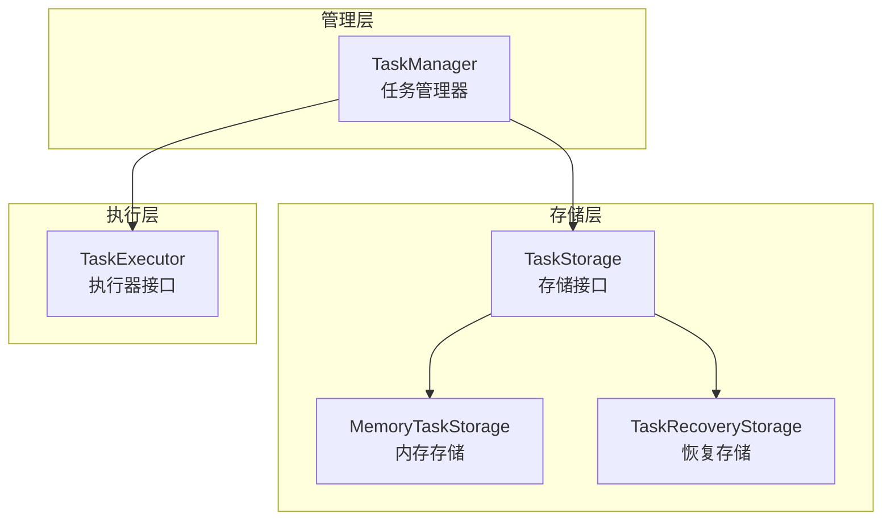

# task/

任务调度模块，管理异步任务的执行、状态追踪和持久化恢复。

## 架构图



## 职责

提供统一的任务管理和执行框架，支持任务排队、执行、状态追踪和持久化恢复。

## 结构

```
task/
├── index.ts                  # 模块导出
├── task-manager.ts           # 任务管理器
├── task-storage.ts           # 任务存储（内存）
├── task-recovery-storage.ts  # 任务恢复存储
└── __test__/
    ├── task-manager.test.ts
    ├── task-storage.test.ts
    ├── task-manager-persistence.test.ts
    └── task-recovery-storage.test.ts
```

## 核心接口

### TaskManager

```typescript
class TaskManager {
  // 任务提交
  submit<T>(task: TaskInput<T>): Promise<Task<T>>;
  submitBatch<T>(tasks: TaskInput<T>[]): Promise<Task<T>[]>;

  // 任务查询
  get(id: string): Task | undefined;
  getStatus(id: string): TaskStatus | undefined;
  list(filter?: TaskFilter): Task[];

  // 任务控制
  cancel(id: string): Promise<boolean>;
  retry(id: string): Promise<Task>;
  pause(id: string): Promise<boolean>;
  resume(id: string): Promise<boolean>;

  // 执行器管理
  registerExecutor(type: string, executor: TaskExecutor): void;
  getExecutor(type: string): TaskExecutor | undefined;

  // 生命周期
  start(): Promise<void>;
  stop(): Promise<void>;

  // 事件
  on(event: TaskEvent, handler: TaskEventHandler): void;
  off(event: TaskEvent, handler: TaskEventHandler): void;
}
```

### TaskExecutor

```typescript
interface TaskExecutor<T = unknown, R = unknown> {
  // 执行器类型
  readonly type: string;

  // 执行任务
  execute(task: Task<T>): Promise<R>;

  // 取消执行
  cancel?(task: Task<T>): Promise<void>;

  // 暂停执行
  pause?(task: Task<T>): Promise<void>;

  // 恢复执行
  resume?(task: Task<T>): Promise<void>;

  // 验证任务
  validate?(task: TaskInput<T>): ValidationResult;
}
```

### TaskStorage

```typescript
interface TaskStorage {
  // 任务存储
  save(task: Task): Promise<void>;
  get(id: string): Promise<Task | undefined>;
  delete(id: string): Promise<boolean>;
  list(filter?: TaskFilter): Promise<Task[]>;

  // 批量操作
  saveBatch(tasks: Task[]): Promise<void>;
  deleteBatch(ids: string[]): Promise<void>;

  // 清理
  clear(): Promise<void>;
}
```

### TaskRecoveryStorage

```typescript
class TaskRecoveryStorage implements TaskStorage {
  // 持久化存储（文件系统）
  constructor(options: {
    storagePath: string;
    autoSave?: boolean;
    saveInterval?: number;
  });

  // 恢复未完成任务
  recover(): Promise<Task[]>;

  // 创建检查点
  checkpoint(): Promise<void>;

  // 清理已完成任务
  cleanup(options?: CleanupOptions): Promise<number>;
}
```

### Task

```typescript
interface Task<T = unknown> {
  id: string;
  type: string;
  status: TaskStatus;
  payload: T;

  // 时间戳
  createdAt: Date;
  startedAt?: Date;
  completedAt?: Date;

  // 执行信息
  progress?: number;
  result?: unknown;
  error?: Error;

  // 重试信息
  retryCount: number;
  maxRetries: number;

  // 优先级
  priority: number;

  // 元数据
  metadata?: Record<string, unknown>;
}

type TaskStatus =
  | 'pending'
  | 'running'
  | 'paused'
  | 'completed'
  | 'failed'
  | 'cancelled';
```

## 导出

| 导出 | 类型 | 用途 |
|------|------|------|
| `TaskManager` | 类 | 任务管理器 |
| `TaskExecutor` | 接口 | 任务执行器 |
| `TaskStorage` | 接口 | 任务存储 |
| `MemoryTaskStorage` | 类 | 内存存储实现 |
| `TaskRecoveryStorage` | 类 | 持久化恢复存储 |

## 依赖

```
→ types/task      # 任务类型
← media/          # 媒体任务执行
← index.ts        # 平台入口
```

## 任务状态流转

```
pending → running → completed
    │         │
    │         ├→ failed → (retry) → pending
    │         │
    │         └→ paused → running
    │
    └→ cancelled
```

## 使用示例

### 基础任务管理

```typescript
import { TaskManager, MemoryTaskStorage } from '@uniedit/platform';

const manager = new TaskManager({
  storage: new MemoryTaskStorage(),
  maxConcurrent: 5,
});

// 注册执行器
manager.registerExecutor('media', {
  type: 'media',
  async execute(task) {
    // 执行媒体处理
    return { url: 'https://...' };
  },
});

// 提交任务
const task = await manager.submit({
  type: 'media',
  payload: {
    action: 'encode',
    input: '/path/to/video.mp4',
  },
  priority: 1,
  maxRetries: 3,
});

console.log('Task ID:', task.id);

// 查询状态
const status = manager.getStatus(task.id);
console.log('Status:', status);
```

### 任务持久化和恢复

```typescript
import { TaskManager, TaskRecoveryStorage } from '@uniedit/platform';

const storage = new TaskRecoveryStorage({
  storagePath: '/path/to/task-storage',
  autoSave: true,
  saveInterval: 5000,  // 5秒自动保存
});

const manager = new TaskManager({ storage });

// 恢复之前未完成的任务
const pendingTasks = await storage.recover();
console.log('Recovered tasks:', pendingTasks.length);

// 启动任务管理器
await manager.start();

// 提交新任务
await manager.submit({ type: 'media', payload: { ... } });

// 创建检查点
await storage.checkpoint();

// 清理已完成任务
const cleaned = await storage.cleanup({
  olderThan: 7 * 24 * 60 * 60 * 1000,  // 7天前
  status: ['completed', 'cancelled'],
});
console.log('Cleaned tasks:', cleaned);
```

### 任务事件监听

```typescript
// 监听任务事件
manager.on('task:started', (task) => {
  console.log(`Task ${task.id} started`);
});

manager.on('task:progress', (task, progress) => {
  console.log(`Task ${task.id}: ${progress}%`);
});

manager.on('task:completed', (task, result) => {
  console.log(`Task ${task.id} completed:`, result);
});

manager.on('task:failed', (task, error) => {
  console.error(`Task ${task.id} failed:`, error);
});
```

### 批量任务处理

```typescript
// 批量提交任务
const tasks = await manager.submitBatch([
  { type: 'media', payload: { input: 'video1.mp4' } },
  { type: 'media', payload: { input: 'video2.mp4' } },
  { type: 'media', payload: { input: 'video3.mp4' } },
]);

// 等待所有任务完成
await Promise.all(
  tasks.map(task => new Promise((resolve, reject) => {
    manager.on('task:completed', (t, result) => {
      if (t.id === task.id) resolve(result);
    });
    manager.on('task:failed', (t, error) => {
      if (t.id === task.id) reject(error);
    });
  }))
);
```

### 任务控制

```typescript
// 暂停任务
await manager.pause(task.id);

// 恢复任务
await manager.resume(task.id);

// 取消任务
await manager.cancel(task.id);

// 重试失败任务
const retryTask = await manager.retry(task.id);
```

## 设计模式

- **命令模式**：任务封装为可执行命令
- **策略模式**：不同类型执行器
- **观察者模式**：任务事件通知
- **状态模式**：任务状态流转
- **仓储模式**：TaskStorage 抽象存储
