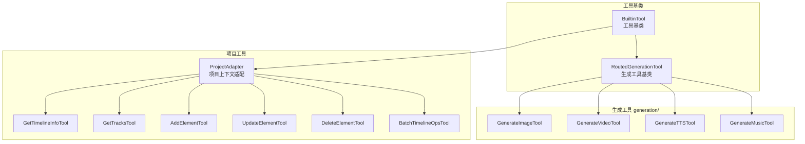

# tools/

AI 工具定义模块，提供项目操作和媒体生成工具。

## 架构图



## 职责

定义 Agent 可调用的工具，包括时间线操作和 AI 媒体生成。

## 结构

```
tools/
├── index.ts                  # 模块导出
│
├── project-tools.ts          # 项目/时间线工具
├── project-adapter.ts        # 项目上下文适配器
│
└── generation/               # 媒体生成工具
    ├── index.ts                  # 注册函数 registerGenerationTools
    ├── base.ts                   # RoutedGenerationTool 基类
    ├── types.ts                  # 生成类型定义
    ├── image.ts                  # 图片生成
    ├── video.ts                  # 视频生成
    ├── tts.ts                    # TTS 生成
    └── music.ts                  # 音乐生成
```

## 核心接口

### BuiltinTool

```typescript
abstract class BuiltinTool implements Tool {
  abstract name: string;
  abstract description: string;
  abstract parameters: JSONSchema;
  abstract execute(args: Record<string, unknown>, context: ToolContext): Promise<ToolResult>;
  toDefinition(): ToolDefinition;
}
```

### AIGenerationService

生成工具依赖此接口（由 `IMediaGenerationService` 提供）：

```typescript
interface AIGenerationService {
  generateImage(options: ImageGenerationOptions): Promise<GeneratedMedia>;
  generateVideo?(options: VideoGenerationOptions): Promise<GeneratedMedia>;
  generateTTS?(options: TTSOptions): Promise<GeneratedMedia>;
  generateMusic?(options: MusicGenerationOptions): Promise<GeneratedMedia>;
}
```

## 导出

| 导出 | 类型 | 用途 |
|------|------|------|
| `BuiltinTool` | 抽象类 | 工具基类 |
| `GetTimelineInfoTool` | 类 | 获取时间线信息 |
| `GetTracksTool` | 类 | 获取轨道列表 |
| `AddElementTool` | 类 | 添加元素 |
| `UpdateElementTool` | 类 | 更新元素属性 |
| `DeleteElementTool` | 类 | 删除元素 |
| `BatchTimelineOpsTool` | 类 | 批量时间线操作（best-effort） |
| `GenerateImageTool` | 类 | 生成图片 |
| `GenerateVideoTool` | 类 | 生成视频 |
| `GenerateTTSTool` | 类 | 生成 TTS |
| `GenerateMusicTool` | 类 | 生成音乐 |
| `registerGenerationTools()` | 函数 | 注册 4 个生成工具 |

## 依赖

```
→ types/tool      # 工具类型定义
→ media/          # IMediaGenerationService
← agent/          # Agent 工具调用
← index.ts        # 平台入口
```

## 工具分类

| 分类 | 工具 | 说明 |
|------|------|------|
| **项目工具** | GetTimelineInfo | 获取时间线信息 |
| | GetTracks | 获取轨道列表 |
| | AddElement | 添加元素到时间线 |
| | UpdateElement | 更新元素属性 |
| | DeleteElement | 删除元素 |
| | BatchTimelineOps | 批量操作（best-effort） |
| **生成工具** | GenerateImage | 文生图 / 图生图 |
| | GenerateVideo | 文生视频 / 图生视频 |
| | GenerateTTS | 文本转语音 |
| | GenerateMusic | AI 音乐生成 |

## 使用示例

### 注册生成工具

```typescript
import { registerGenerationTools } from '@neko/platform';

const registry = new ToolRegistry();
registerGenerationTools(registry, mediaGenerationService);
```

### 自定义工具

```typescript
import { BuiltinTool } from '@neko/platform';

class MyCustomTool extends BuiltinTool {
  name = 'my_tool';
  description = 'My custom tool';
  parameters = {
    type: 'object',
    properties: { input: { type: 'string' } },
    required: ['input']
  };

  async execute(args: { input: string }): Promise<ToolResult> {
    return { success: true, data: { result: args.input.toUpperCase() } };
  }
}

registry.register(new MyCustomTool());
```

## 设计模式

- **模板方法模式**：BuiltinTool 定义工具执行框架
- **注册表模式**：ToolRegistry 管理工具
- **适配器模式**：ProjectAdapter 适配不同项目上下文
