# tools/

AI 工具定义模块，提供项目操作、媒体生成、分析和文档工具。

## 架构图

```mermaid
graph TB
    subgraph "工具基类"
        Base[BuiltinTool<br/>工具基类]
    end

    subgraph "项目工具"
        ProjectAdapter[ProjectAdapter<br/>项目上下文适配]
        Timeline[GetTimelineInfoTool]
        Tracks[GetTracksTool]
        AddElement[AddElementTool]
        UpdateElement[UpdateElementTool]
        DeleteElement[DeleteElementTool]
        BatchTimelineOps[BatchTimelineOpsTool]
    end

    subgraph "生成工具 generation/"
        MediaAdapter[MediaServiceAdapter<br/>媒体服务适配]
        GenImage[GenerateImageTool]
        GenVideo[GenerateVideoTool]
        GenTTS[GenerateTTSTool]
        GenMusic[GenerateMusicTool]
    end

    subgraph "分析工具"
        AnalyzeImage[AnalyzeImageTool]
        AnalyzeVideo[AnalyzeVideoTool]
        ExtractText[ExtractImageTextTool]
    end

    subgraph "文档工具"
        GenScript[GenerateScriptTool]
        GenStoryboard[GenerateStoryboardTool]
        GenSubtitles[GenerateSubtitlesTool]
    end

    Base --> ProjectAdapter
    Base --> MediaAdapter
    ProjectAdapter --> Timeline
    ProjectAdapter --> Tracks
    ProjectAdapter --> AddElement
    ProjectAdapter --> UpdateElement
    ProjectAdapter --> DeleteElement
    ProjectAdapter --> BatchTimelineOps
    MediaAdapter --> GenImage
    MediaAdapter --> GenVideo
    MediaAdapter --> GenTTS
    MediaAdapter --> GenMusic
    Base --> AnalyzeImage
    Base --> AnalyzeVideo
    Base --> ExtractText
    Base --> GenScript
    Base --> GenStoryboard
    Base --> GenSubtitles
```



## 职责

定义和实现 Agent 可调用的各类工具，包括项目操作、AI 生成和分析。

## 结构

```
tools/
├── index.ts                  # 模块导出
├── base.ts                   # 工具基类
│
├── project-tools.ts          # 项目/时间线工具
├── project-adapter.ts        # 项目上下文适配器
│
├── generation/               # 生成类工具
│   ├── index.ts
│   ├── image-generation.ts       # 图片生成
│   ├── video-generation.ts       # 视频生成
│   ├── audio-generation.ts       # 音频生成
│   ├── tts-generation.ts         # TTS 生成
│   ├── music-generation.ts       # 音乐生成
│   └── ...
│
├── generation-tools.ts       # 生成工具汇总
├── media-service-adapter.ts  # 媒体服务适配器
│
├── analysis-tools.ts         # AI 分析工具
└── document-tools.ts         # 文档生成工具
```

## 核心接口

### BuiltinTool

```typescript
abstract class BuiltinTool implements Tool {
  abstract name: string;
  abstract description: string;
  abstract parameters: JSONSchema;

  // 执行工具
  abstract execute(
    args: Record<string, unknown>,
    context: ToolContext
  ): Promise<ToolResult>;

  // 转换为 LLM 格式
  toDefinition(): ToolDefinition;
}
```

### ProjectAdapter

```typescript
interface ProjectAdapter {
  // 获取时间线信息
  getTimelineInfo(): Promise<TimelineInfo>;

  // 获取轨道列表
  getTracks(): Promise<Track[]>;

  // 添加元素
  addElement(element: ElementInput): Promise<Element>;

  // 更新元素
  updateElement(id: string, changes: Partial<Element>): Promise<Element>;

  // 删除元素
  deleteElement(id: string): Promise<boolean>;
}
```

### MediaServiceAdapter

```typescript
interface MediaServiceAdapter {
  // 图片生成
  generateImage(request: ImageGenerationRequest): Promise<MediaResult>;

  // 视频生成
  generateVideo(request: VideoGenerationRequest): Promise<MediaResult>;

  // 音频生成
  generateAudio(request: AudioGenerationRequest): Promise<MediaResult>;

  // TTS 生成
  generateTTS(request: TTSRequest): Promise<MediaResult>;

  // 音乐生成
  generateMusic(request: MusicGenerationRequest): Promise<MediaResult>;
}
```

## 导出

| 导出 | 类型 | 用途 |
|------|------|------|
| `BuiltinTool` | 抽象类 | 工具基类 |
| `ProjectAdapter` | 接口 | 项目上下文适配 |
| `MediaServiceAdapter` | 接口 | 媒体服务适配 |
| `GetTimelineInfoTool` | 类 | 获取时间线信息 |
| `GetTracksTool` | 类 | 获取轨道列表 |
| `AddElementTool` | 类 | 添加元素 |
| `UpdateElementTool` | 类 | 更新元素 |
| `DeleteElementTool` | 类 | 删除元素 |
| `BatchTimelineOpsTool` | 类 | 批量执行时间线操作（best-effort） |
| `GenerateImageTool` | 类 | 生成图片 |
| `GenerateVideoTool` | 类 | 生成视频 |
| `GenerateTTSTool` | 类 | 生成 TTS |
| `GenerateMusicTool` | 类 | 生成音乐 |
| `AnalyzeImageTool` | 类 | 图片分析 |
| `AnalyzeVideoTool` | 类 | 视频分析 |
| `GenerateScriptTool` | 类 | 生成脚本 |
| `GenerateSubtitlesTool` | 类 | 生成字幕 |
| `registerBuiltinTools()` | 函数 | 注册所有工具 |

## 依赖

```
→ types/tool      # 工具类型定义
→ media/          # 媒体生成服务
← service/        # 服务层 re-export
← agent/          # Agent 工具调用
```

## 工具分类

| 分类 | 工具 | 说明 |
|------|------|------|
| **项目工具** | GetTimelineInfo | 获取时间线信息 |
| | GetTracks | 获取轨道列表 |
| | AddElement | 添加元素到时间线 |
| | UpdateElement | 更新元素属性 |
| | DeleteElement | 删除元素 |
| | BatchTimelineOps | 批量操作（AddElement/UpdateElement/DeleteElement/TrimElement/SetAudioProperties/SetColorCorrection），best-effort |
| **生成工具** | GenerateImage | 文生图 / 图生图 |
| | GenerateVideo | 文生视频 / 图生视频 |
| | GenerateTTS | 文本转语音 |
| | GenerateMusic | AI 音乐生成 |
| **分析工具** | AnalyzeImage | 图片内容分析 |
| | AnalyzeVideo | 视频内容分析 |
| | ExtractImageText | 提取图片文字 |
| **文档工具** | GenerateScript | 生成视频脚本 |
| | GenerateStoryboard | 生成分镜脚本 |
| | GenerateSubtitles | 生成字幕 |

## 使用示例

### 注册内置工具

```typescript
import { registerBuiltinTools, ToolRegistry } from '@neko/platform';

const registry = new ToolRegistry();
registerBuiltinTools(registry, {
  projectAdapter: myProjectAdapter,
  mediaAdapter: myMediaAdapter,
});

// 获取所有工具定义
const definitions = registry.toToolDefinitions();
```

### 自定义工具

```typescript
import { BuiltinTool } from '@neko/platform';

class MyCustomTool extends BuiltinTool {
  name = 'my_tool';
  description = 'My custom tool';
  parameters = {
    type: 'object',
    properties: {
      input: { type: 'string' }
    },
    required: ['input']
  };

  async execute(args: { input: string }): Promise<ToolResult> {
    // 工具实现
    return { success: true, data: { result: args.input.toUpperCase() } };
  }
}

registry.register(new MyCustomTool());
```

### 执行工具

```typescript
const result = await registry.execute('generate_image', {
  prompt: 'A beautiful sunset',
  width: 1024,
  height: 1024,
});

if (result.success) {
  console.log('Generated image:', result.data.url);
}
```

## 设计模式

- **适配器模式**：ProjectAdapter、MediaServiceAdapter 适配不同上下文
- **模板方法模式**：BuiltinTool 定义工具执行框架
- **注册表模式**：ToolRegistry 管理工具
- **工厂模式**：registerBuiltinTools 批量创建工具
