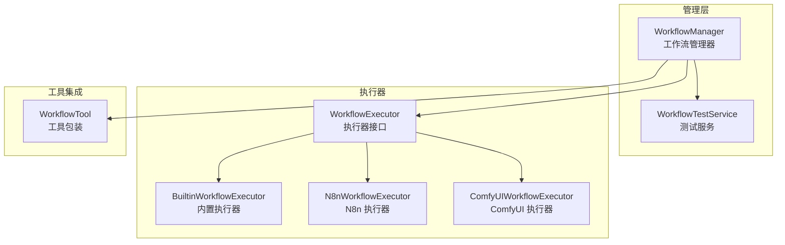

# workflow/

工作流引擎模块，支持 N8n 和 ComfyUI 集成。

## 架构图



## 职责

管理外部工作流的连接、执行和结果处理，支持多种工作流引擎集成。

## 结构

```
workflow/
├── index.ts                  # 模块导出
├── workflow-manager.ts       # 工作流管理器
├── builtin-executor.ts       # 内置执行器
├── n8n-executor.ts           # N8n 执行器
├── comfyui-executor.ts       # ComfyUI 执行器
├── workflow-tool.ts          # 工作流工具
├── workflow-test-service.ts  # 测试服务
└── __tests__/
    └── workflow.test.ts      # 工作流测试
```

## 核心接口

### WorkflowManager

```typescript
class WorkflowManager {
  // 执行器管理
  registerExecutor(type: WorkflowType, executor: WorkflowExecutor): void;
  getExecutor(type: WorkflowType): WorkflowExecutor | undefined;

  // 工作流管理
  registerWorkflow(workflow: WorkflowDefinition): void;
  getWorkflow(id: string): WorkflowDefinition | undefined;
  listWorkflows(): WorkflowDefinition[];

  // 执行工作流
  execute(
    workflowId: string,
    inputs: Record<string, unknown>,
    options?: ExecuteOptions
  ): Promise<WorkflowResult>;

  // 获取工具定义
  getTools(): Tool[];
}
```

### WorkflowExecutor

```typescript
interface WorkflowExecutor {
  // 执行器类型
  readonly type: WorkflowType;

  // 执行工作流
  execute(
    workflow: WorkflowDefinition,
    inputs: Record<string, unknown>,
    options?: ExecuteOptions
  ): Promise<WorkflowResult>;

  // 验证工作流
  validate(workflow: WorkflowDefinition): ValidationResult;

  // 检查连接
  checkConnection(): Promise<boolean>;
}
```

### WorkflowDefinition

```typescript
interface WorkflowDefinition {
  id: string;
  name: string;
  description?: string;
  type: WorkflowType;

  // N8n 配置
  n8n?: {
    webhookUrl: string;
    workflowId?: string;
  };

  // ComfyUI 配置
  comfyui?: {
    serverUrl: string;
    workflow: Record<string, unknown>;
  };

  // 内置配置
  builtin?: {
    steps: WorkflowStep[];
  };

  // 输入输出定义
  inputs: WorkflowInput[];
  outputs: WorkflowOutput[];
}
```

## 导出

| 导出 | 类型 | 用途 |
|------|------|------|
| `WorkflowManager` | 类 | 工作流管理 |
| `BuiltinWorkflowExecutor` | 类 | 内置执行器 |
| `N8nWorkflowExecutor` | 类 | N8n 执行 |
| `ComfyUIWorkflowExecutor` | 类 | ComfyUI 执行 |
| `WorkflowTool` | 类 | 工具包装 |
| `createWorkflowTools()` | 函数 | 创建工具集 |
| `WorkflowTestService` | 类 | 测试服务 |

## 依赖

```
→ types/workflow  # 工作流类型
→ config/         # 工作流配置
← agent/          # Agent 工具调用
← index.ts        # 平台入口
```

## 工作流类型

| 类型 | 说明 | 适用场景 |
|------|------|----------|
| `builtin` | 内置简单流程 | 简单的多步骤任务 |
| `n8n` | N8n 自动化 | 复杂的自动化工作流 |
| `comfyui` | ComfyUI 图像生成 | AI 图像/视频生成 |

## 使用示例

### 注册工作流

```typescript
import { WorkflowManager, N8nWorkflowExecutor } from '@neko/platform';

const manager = new WorkflowManager();

// 注册 N8n 执行器
manager.registerExecutor('n8n', new N8nWorkflowExecutor({
  baseUrl: 'http://localhost:5678',
  apiKey: 'your-api-key',
}));

// 注册工作流定义
manager.registerWorkflow({
  id: 'video-generation',
  name: 'AI 视频生成',
  type: 'n8n',
  n8n: {
    webhookUrl: 'http://localhost:5678/webhook/video-gen',
  },
  inputs: [
    { name: 'prompt', type: 'string', required: true },
    { name: 'duration', type: 'number', default: 5 },
  ],
  outputs: [
    { name: 'videoUrl', type: 'string' },
  ],
});
```

### 执行工作流

```typescript
// 执行工作流
const result = await manager.execute('video-generation', {
  prompt: 'A cat playing piano',
  duration: 10,
});

if (result.success) {
  console.log('Video URL:', result.outputs.videoUrl);
} else {
  console.error('Execution failed:', result.error);
}
```

### ComfyUI 集成

```typescript
import { ComfyUIWorkflowExecutor } from '@neko/platform';

const comfyExecutor = new ComfyUIWorkflowExecutor({
  serverUrl: 'http://localhost:8188',
});

manager.registerExecutor('comfyui', comfyExecutor);

manager.registerWorkflow({
  id: 'image-upscale',
  name: '图像放大',
  type: 'comfyui',
  comfyui: {
    serverUrl: 'http://localhost:8188',
    workflow: { /* ComfyUI workflow JSON */ },
  },
  inputs: [
    { name: 'image', type: 'image', required: true },
    { name: 'scale', type: 'number', default: 2 },
  ],
  outputs: [
    { name: 'upscaledImage', type: 'image' },
  ],
});
```

### 作为 Agent 工具使用

```typescript
// 获取工作流工具
const workflowTools = manager.getTools();

// 注册到 Agent
const agent = platform.createAgent({
  name: 'workflow-agent',
  tools: [...builtinTools, ...workflowTools],
});
```

### 测试工作流连接

```typescript
import { WorkflowTestService } from '@neko/platform';

const testService = new WorkflowTestService(manager);

// 测试 N8n 连接
const result = await testService.testConnection('n8n');
if (result.success) {
  console.log('N8n connected!');
} else {
  console.error('Connection failed:', result.error);
}
```

## 设计模式

- **策略模式**：不同执行器实现相同接口
- **适配器模式**：适配不同工作流引擎 API
- **工厂模式**：createWorkflowTools 创建工具集
- **注册表模式**：WorkflowManager 管理执行器和定义
