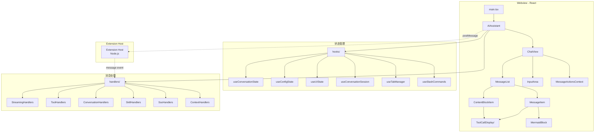

# @neko-agent/webview

> Neko Suite AI 助手独立 Webview UI，运行在 VSCode 侧边栏 Panel

## Context Summary

- 项目：Neko Suite - VSCode 视频编辑器
- 架构：Webview (React) + Extension Host 双进程通信
- 通信：postMessage 协议，消息类型见下方
- 规范：[CLAUDE.md](../../CLAUDE.md)

## Quick Reference

| 项目 | 说明 |
|------|------|
| 入口 | `src/main.tsx` → `AIAssistant` 主组件 |
| 状态 | `hooks/` 分离式状态管理（conversation/config/ui/resource/session/tab/command）|
| 消息 | `handlers/` 注册表模式处理 Extension 消息（含 skill/SSO/context/message-updater） |
| 视图 | ChatView / OnboardingFlow |
| 依赖 | `@neko/shared` 类型定义 |

**目录结构**：
```
src/
├── components/       # UI 组件（ChatView、Header、OnboardingFlow、AccountBar）
├── handlers/         # 消息处理器（streaming、tool、conversation、skill、sso、context）
├── hooks/            # 状态管理 Hooks（含会话隔离、Tab 管理、斜杠命令）
├── config/           # 预设配置（providers、prompts、mcp-servers）
└── i18n/             # 国际化
```

**构建**：
```bash
npm run build:assistant   # 产物 → extension/dist/webview/
npm run dev               # 开发模式
```

## Architecture



### 关键组件

| 组件 | 职责 |
|------|------|
| `ChatView` | 聊天主视图，管理消息列表和输入区域 |
| `MessageItem` | 单条消息渲染，支持 ContentBlock 模式 |
| `ContentBlockItem` | 单个 ContentBlock 渲染（thinking/text/tool_call/diff/plan）|
| `ToolCallDisplay/` | 工具调用卡片（拆分为 5 个子模块：组件、图标、媒体提取、常量）|
| `MessageActionsContext` | React Context 提供 task/diff/plan 回调，消除 prop drilling |
| `MermaidBlock` | Mermaid 图表渲染，自定义高对比度主题，支持复制/导出/错误反馈 |
| `InputArea` | 输入框，支持 @ 引用、斜杠命令、附件 |

### 状态管理

```typescript
// 分离式 Hooks — 状态管理
const ui = useUIState();               // activeTab, inputValue, selectedModel
const conversation = useConversationState(); // messages, isThinking, streamingMessageId
const config = useConfigState();       // settings, modelPresets, projectFiles
const resource = useResourceState();   // backgroundTasks

// 分离式 Hooks — 行为逻辑
const session = useConversationSession(...);  // 会话级 input/attachment 隔离
const tab = useTabManager(...);               // Tab 生命周期管理
const command = useSlashCommands(...);        // 斜杠命令路由
```

### 消息处理

注册表模式处理 Extension Host 消息：

```typescript
const registry = createConfiguredRegistry();
registry.handle(message, context);
```

## 消息协议

### Webview → Extension Host

| 类型 | 说明 |
|------|------|
| `sendMessage` | 发送用户消息 |
| `newConversation` | 创建新会话 |
| `switchConversation` | 切换会话 |
| `getSettings` | 获取配置 |
| `updateProvider` | 更新 Provider |
| `cancelTask` | 取消后台任务 |

### Extension Host → Webview

| 类型 | 说明 |
|------|------|
| `thinking` | AI 开始思考 |
| `streamText` | 流式文本输出 |
| `streamThinking` | 扩展思考内容 |
| `toolCall` | 工具调用 |
| `toolResult` | 工具结果 |
| `streamComplete` | 流式完成 |
| `taskUpdated` | 任务状态更新 |

## 开发注意事项

1. **Webview 沙箱限制**：无法访问 Node.js API，通过 postMessage 与 Extension 通信
2. **资源路径**：使用 `webview.asWebviewUri()` 转换本地文件路径
3. **流式状态同步**：发送新消息前必须清除 `streamingMessageId`，防止工具卡片添加到错误消息
4. **ContentBlock 模式**：消息内容按块渲染，保持思考、文本、工具调用的顺序
5. **toolCalls 派生**：`Message.toolCalls` 已 deprecated，由 `contentBlocks[].toolCall` 自动派生，仅更新 contentBlocks

## 依赖

```
@neko-agent/webview
├── @neko/shared      # 共享类型定义
├── react / react-dom    # UI 框架
├── tailwindcss          # CSS 框架
├── mermaid              # 图表渲染（自定义高对比度主题）
├── highlight.js         # 代码高亮
└── react-markdown       # Markdown 渲染
```
