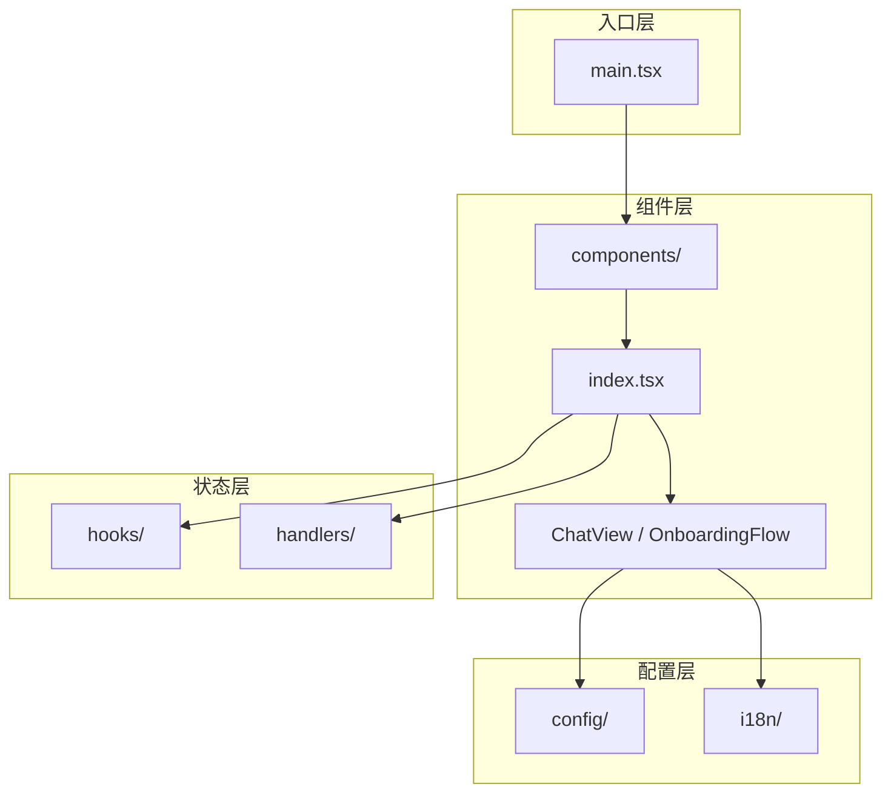

# assistant/src

> AI 助手 Webview UI 源码根目录

## Quick Reference

| 模块 | 职责 | 主要导出 |
|------|------|----------|
| `components/` | UI 渲染 | `AIAssistant`, `ChatView`, `AccountBar`, `OnboardingFlow` |
| `handlers/` | 消息分发 | `createConfiguredRegistry`, `useMessageHandler`, `updateConversation`（含 skill/SSO/context） |
| `utils/` | 工具函数 | `message-helpers`（deriveToolCalls, updateToolCallInBlocks）, `logger` |
| `hooks/` | 状态管理 | `useConversationState`, `useConfigState`, `useConversationSession`, `useTabManager`, `useSlashCommands`, `useChatActions`, `usePlanActions`, `useSkillActions` |
| `config/` | 预设数据 | `PROVIDER_PRESETS`, `PROMPT_PRESETS` |
| `i18n/` | 多语言 | `useI18n`, `t()` |

**目录结构**：
```
src/
├── main.tsx              # React 渲染入口
├── index.css             # Tailwind + 全局样式
├── components/           # UI 组件库
├── handlers/             # 消息处理器（注册表模式 + message-updater）
├── hooks/                # 全局状态 Hooks
├── utils/                # 工具函数（message-helpers, logger）
├── config/               # 预设配置
└── i18n/                 # 国际化
```

## Architecture



### 数据流

```
用户操作 → AIAssistant (handleSend)
    ↓
VSCodeMessages.sendMessage() ─── postMessage ───→ Extension Host
    ↓                                                    ↓
  (等待)                                          AgentRunner.execute()
    ↓                                                    ↓
handlers/ ←── message event ─── webview.postMessage()
    ↓
setMessages() / setIsThinking() / ...
    ↓
React 重新渲染
```

## 关键类型

```typescript
interface Message {
  id: string;
  role: 'user' | 'assistant' | 'system';
  content: string;
  timestamp: number;
  isStreaming?: boolean;
  thinking?: string;              // Claude 扩展思考
  toolCalls?: ToolCall[];         // @deprecated — 由 contentBlocks 自动派生
  contentBlocks?: ContentBlock[]; // 按顺序渲染的内容块（单一数据源）
}

type ContentBlock =
  | { type: 'thinking'; thinking: string }
  | { type: 'text'; content: string }
  | { type: 'tool_call'; toolCall: ToolCall };
```

## 开发指南

| 场景 | 步骤 |
|------|------|
| 添加新消息类型 | 1. `*-handlers.ts` 添加处理函数 → 2. `handlers/index.ts` 注册 → 3. 更新 `types.ts` context |
| 添加新状态 | 1. 选择 Hook（UI/Conversation/Config/Resource/Session/Tab）→ 2. 添加 state → 3. `components/index.tsx` 使用 |
| 调试 | Extension: `console.log('[Extension]', ...)` / Webview: `Cmd+Shift+P → Open Webview Developer Tools` |
