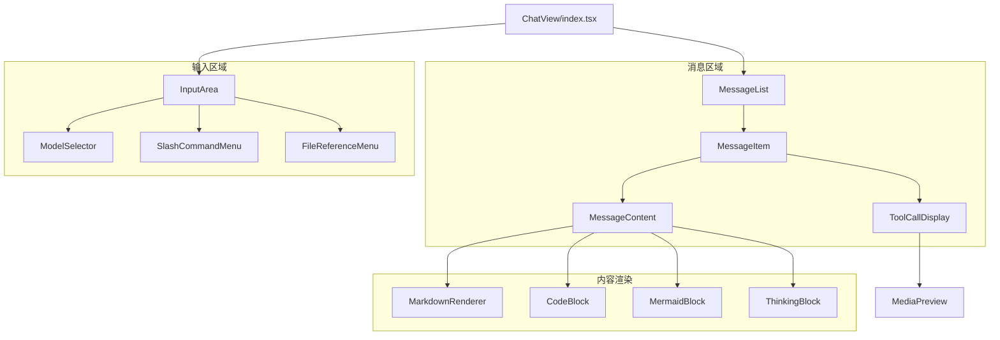

# ChatView/

> 聊天视图组件，提供消息展示和输入功能

## Quick Reference

| 组件              | 职责                                               |
| ----------------- | -------------------------------------------------- |
| `MessageList`     | 消息列表（滚动、自动滚底）                         |
| `MessageItem`     | 单条消息渲染，支持 ContentBlock 模式               |
| `ToolCallDisplay` | 工具调用卡片，支持媒体预览                         |
| `InputArea`       | 输入框（@ 引用、/ 命令、附件）                     |
| `MermaidBlock`    | Mermaid 图表（自定义高对比度主题、全屏/缩放/导出） |

**目录结构**：

```
ChatView/
├── index.tsx              # ChatView 主组件
├── MessageList.tsx        # 消息列表
├── MessageItem.tsx        # 单条消息渲染
├── ToolCallDisplay.tsx    # 工具调用卡片
├── InputArea/             # 输入区域
├── MessageContent/        # 内容渲染（Markdown/Code/Mermaid）
└── MediaPreview/          # 媒体预览（图片/视频/音频）
```

## Architecture



## 核心实现

### ContentBlock 渲染

```typescript
// MessageItem 按顺序渲染内容块
message.contentBlocks?.map(block => {
  switch (block.type) {
    case 'thinking': return <ThinkingBlock />;
    case 'text': return <MarkdownRenderer />;
    case 'tool_call': return <ToolCallDisplay />;
  }
});
```

### MermaidBlock 特性

- **自定义高对比度主题**：浅蓝节点 `#4fc3f7` + 深色文字 `#1a1a1a`
- **交互功能**：全屏模式、缩放（滚轮/按钮）、拖拽平移
- **导出功能**：SVG 下载、源码复制
- **错误处理**：语法提示、一键请求 AI 修复

### InputArea 功能

- 多行输入（Shift+Enter 换行）
- `@` 触发文件引用菜单
- `/` 触发斜杠命令菜单
- 模型/提示词选择
- 文件附件支持

## 关键 Props

```typescript
interface ChatViewProps {
  messages: Message[];
  inputValue: string;
  isThinking: boolean;
  streamingMessageId: string | null;
  selectedModel: string;
  backgroundTasks: BackgroundTask[];
  onSend: (attachments?: MessageAttachment[]) => void;
  onInputChange: (value: string) => void;
  onModelSelect: (modelId: string) => void;
}
```

## 样式约定

- Tailwind CSS + VSCode 主题变量 `var(--vscode-*)`
- 响应式设计适配侧边栏窄宽度
