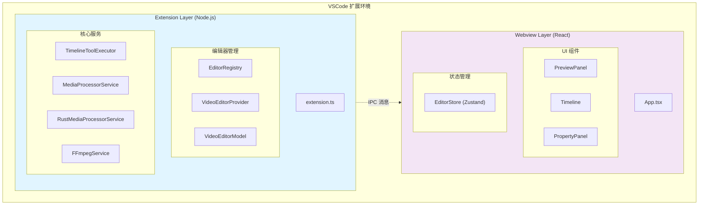
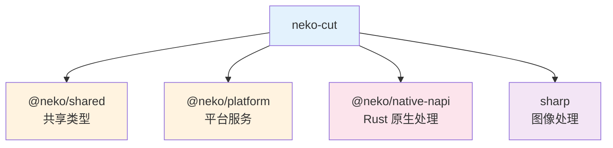
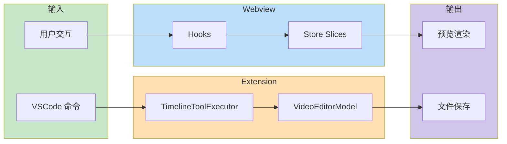

# NekoCut

> 剪辑中枢：管理时间线轨道、关键帧动画与素材同步

## Context Summary

- **项目**：Neko Suite - VS Code 全能内容创作工作站
- **角色**：视频剪辑器，时间线编辑核心
- **规范**：[README.md](../../README.md)

---

## 概述

**NekoCut** 是 Neko Suite 的视频剪辑核心，提供专业级的时间线编辑能力。采用 **分层架构 + 模块化设计**，分为 Extension 层（VSCode 扩展）和 Webview 层（React UI）。支持多轨道合成、关键帧动画、特效转场、色彩校正等完整的视频制作功能。

---

## 核心功能

| 功能 | 说明 |
|------|------|
| **时间线编辑** | 多轨道、拖拽操作、吸附对齐 |
| **关键帧动画** | 位置、缩放、旋转、透明度动画 |
| **特效系统** | 滤镜、模糊、色彩校正 |
| **转场效果** | 淡入淡出、滑动、缩放等 |
| **遮罩编辑** | 形状遮罩、路径遮罩 |
| **音频处理** | 波形显示、音量调节、淡入淡出 |
| **字幕编辑** | SRT/VTT 导入、样式设置 |
| **视频导出** | MP4、WebM 等格式导出 |

---

## 文件格式

| 扩展名 | 说明 |
|--------|------|
| `.jvi` | JSON Video Instructions - 视频项目文件 |

---

## 项目文件结构

```json
{
  "name": "My Video Project",
  "resolution": { "width": 1920, "height": 1080 },
  "fps": 30,
  "tracks": [
    {
      "id": "track-1",
      "name": "Video Track",
      "type": "media",
      "elements": [
        {
          "id": "element-1",
          "type": "media",
          "src": "intro.mp4",
          "startTime": 0,
          "duration": 10
        }
      ]
    }
  ]
}
```

---

## 命令

| 命令 | 说明 |
|------|------|
| `NekoCut: New Project` | 新建项目 |
| `NekoCut: Add to Timeline` | 添加素材到时间线 |
| `NekoCut: Export Video` | 导出视频 |
| `NekoCut: Add Track` | 添加轨道 |
| `NekoCut: Add Effect` | 添加特效 |
| `NekoCut: Add Transition` | 添加转场 |
| `NekoCut: Add Keyframe` | 添加关键帧 |

---

## 快捷键

| 快捷键 | 操作 |
|--------|------|
| `Space` | 播放/暂停 |
| `Cmd/Ctrl + Z` | 撤销 |
| `Cmd/Ctrl + Shift + Z` | 重做 |
| `N` | 切换吸附 |
| `R` | 切换波纹编辑 |
| `F` | 切换帧对齐 |
| `Delete` | 删除选中元素 |

---

## 架构

### 系统整体架构



### 目录结构

```
neko-cut/
├── packages/
│   ├── extension/src/           # VSCode 扩展层
│   │   ├── base/                # 基础设施（DI 容器）
│   │   │   └── serviceCollection.ts
│   │   ├── bootstrap/           # 服务初始化
│   │   ├── commands/            # VSCode 命令
│   │   ├── editor/              # 编辑器管理
│   │   │   ├── common/          # 通用编辑器接口
│   │   │   │   ├── editorModel.ts
│   │   │   │   └── editorRegistry.ts
│   │   │   └── video/           # 视频编辑器实现
│   │   │       ├── videoEditorModel.ts
│   │   │       └── videoEditorProvider.ts
│   │   ├── handlers/            # 消息处理器
│   │   ├── project/             # 项目加载
│   │   ├── propertyPanel/       # 属性面板
│   │   ├── services/            # 核心服务
│   │   │   ├── TimelineToolExecutor.ts
│   │   │   ├── MediaProcessorService.ts
│   │   │   ├── RustMediaProcessorService.ts
│   │   │   ├── FFmpegService.ts
│   │   │   └── ...
│   │   ├── views/               # 视图（大纲、状态栏）
│   │   └── extension.ts         # 入口点
│   │
│   └── webview/src/             # React UI 层
│       ├── components/          # UI 组件
│       │   ├── Timeline/        # 时间线编辑器
│       │   ├── PreviewPanel.tsx # 预览面板
│       │   ├── AssetLibrary/    # 素材库
│       │   ├── ColorCorrection/ # 色彩校正
│       │   ├── Effects/         # 特效面板
│       │   ├── Mask/            # 遮罩编辑
│       │   └── Subtitles/       # 字幕编辑
│       ├── hooks/               # 自定义 Hooks
│       │   ├── useKeyboardShortcuts.ts
│       │   ├── useTimelineActions.ts
│       │   └── useVSCodeMessaging.ts
│       ├── stores/              # Zustand 状态管理
│       │   ├── editor-store.ts  # 主 Store
│       │   └── slices/          # Store Slices
│       │       ├── projectSlice.ts
│       │       ├── selectionSlice.ts
│       │       ├── playbackSlice.ts
│       │       ├── historySlice.ts
│       │       ├── trackOpsSlice.ts
│       │       ├── elementOpsSlice.ts
│       │       └── ...
│       ├── services/            # Webview 服务
│       └── App.tsx              # 主应用
│
├── l10n/                        # 国际化
├── dist/                        # 构建输出
└── package.json
```

---

## 核心模块

### Extension 层服务

| 模块 | 职责 | 设计模式 |
|------|------|--------|
| **ServiceCollection** | 依赖注入容器 | Service Locator |
| **EditorRegistry** | 编辑器注册表 | Registry Pattern |
| **VideoEditorProvider** | 编辑器提供者 | Provider Pattern |
| **VideoEditorModel** | 编辑器数据模型 | Model Pattern |
| **TimelineToolExecutor** | 时间线工具执行器 | Command Pattern |
| **MediaProcessorService** | 媒体处理路由 | Facade + Cache |
| **RustMediaProcessorService** | Rust 原生处理 | Adapter |
| **FFmpegService** | FFmpeg 处理 | Adapter |

### Webview 层 Store Slices

| Slice | 职责 |
|-------|------|
| **ProjectSlice** | 项目数据管理 |
| **SelectionSlice** | 元素选择状态 |
| **PlaybackSlice** | 播放控制状态 |
| **UIStateSlice** | UI 状态 |
| **HistorySlice** | 撤销/重做历史 |
| **KeyframeSlice** | 关键帧管理 |
| **TrackOpsSlice** | 轨道操作 |
| **ElementOpsSlice** | 元素操作 |
| **ShapeOpsSlice** | 形状操作 |

### Webview 层组件

| 组件 | 职责 |
|------|------|
| **PreviewPanel** | 视频预览 |
| **Timeline** | 时间线编辑器 |
| **PropertyPanel** | 属性编辑 |
| **AssetLibrary** | 素材库管理 |
| **AudioWaveform** | 音频波形 |
| **ColorCorrection** | 色彩校正 |
| **Effects** | 效果编辑 |
| **Mask** | 遮罩编辑 |
| **Subtitles** | 字幕编辑 |

---

## 依赖关系



---

## 技术栈

### Extension 层

| 类别 | 技术 |
|------|------|
| **运行时** | Node.js (VSCode Extension Host) |
| **语言** | TypeScript 5.3.2 |
| **框架** | VSCode API 1.85.0 |
| **构建** | esbuild |
| **测试** | Vitest |

### Webview 层

| 类别 | 技术 |
|------|------|
| **运行时** | Browser (VSCode Webview) |
| **语言** | TypeScript 5.3.2 |
| **框架** | React 18.2.0 |
| **状态管理** | Zustand 4.4.7 |
| **样式** | Tailwind CSS 3.3.6 |
| **构建** | Vite 5.0.8 |

---

## 设计模式

| 模式 | 应用场景 |
|------|--------|
| **Service Locator** | ServiceCollection 依赖注入 |
| **Registry Pattern** | EditorRegistry 编辑器管理 |
| **Provider Pattern** | VideoEditorProvider |
| **Command Pattern** | TimelineToolExecutor |
| **Facade Pattern** | MediaProcessorService |
| **Adapter Pattern** | Rust/FFmpeg 多后端支持 |
| **Slices Pattern** | Zustand 状态管理 |

---

## 数据流



---

## License

MIT
