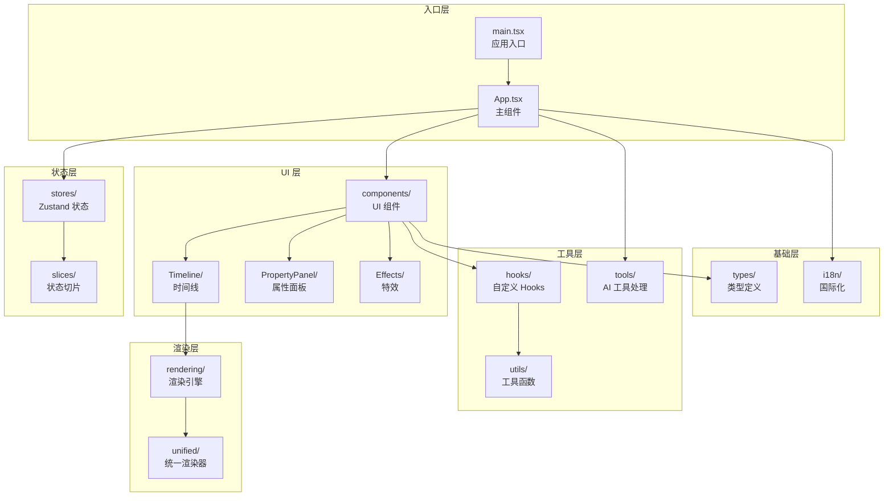

# webview/src

视频编辑器 Webview UI 源码根目录，基于 React + Zustand 构建，运行在 VSCode Webview 沙箱中。

## 架构图



## 目录结构

```
src/
├── main.tsx           # 应用入口
├── App.tsx            # 主应用组件
├── propertyPanel.tsx  # 属性面板入口
│
├── stores/            # Zustand 状态管理
│   └── slices/        # 状态切片
│
├── components/        # UI 组件库
│   ├── Timeline/      # 时间线组件
│   ├── PropertyPanel/ # 属性面板
│   ├── AudioWaveform/ # 音频波形
│   ├── ColorCorrection/ # 色彩校正
│   ├── Effects/       # 特效编辑
│   ├── Mask/          # 遮罩编辑
│   ├── Subtitles/     # 字幕编辑
│   ├── SpeedControl/  # 速度控制
│   ├── TransitionPicker/ # 转场选择
│   ├── Toast/         # 消息提示
│   └── ErrorBoundary/ # 错误边界
│
├── hooks/             # 自定义 Hooks（14个）
├── utils/             # 工具函数（15个）
│   └── export/        # 导出相关
│
├── rendering/         # 渲染引擎
│   ├── canvas2d/      # Canvas 2D 渲染
│   └── unified/       # 帧数据提供
│
├── tools/             # AI 工具处理
│   └── handlers/      # 工具处理器
│
├── types/             # 类型定义（13个）
│
├── i18n/              # 国际化
│   └── locales/       # 语言包
│
└── __tests__/         # 测试文件
```

## 模块依赖

```
依赖方向：上层 → 下层

入口层（main.tsx → App.tsx）
  ↓
状态层（stores/）
  ↓
UI 层（components/）
  ↓
渲染层（rendering/）+ 工具层（hooks/、utils/）
  ↓
基础层（types/、i18n/）
```

## 关键接口

| 模块 | 主要导出 | 用途 |
|------|----------|------|
| `stores/` | `useStore` | 全局状态 |
| `hooks/` | `useTimeline`, `usePlayback` | 业务逻辑 |
| `rendering/unified/` | `UnifiedRenderer` | 渲染引擎 |
| `components/Timeline/` | `Timeline` | 时间线组件 |

## 技术限制

- 无 Node.js API（运行在 Webview 沙箱）
- 通过 postMessage 与 Extension Host 通信
- 资源需通过 asWebviewUri() 转换
