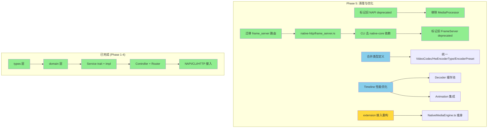
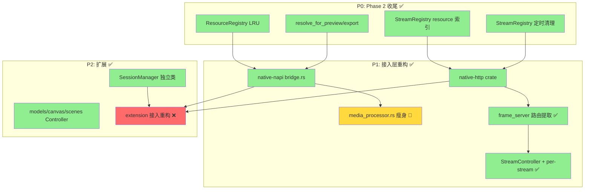

# neko-engine MVC 分层架构重构方案

> 使用 MVC 分层架构重构 native-core 和 native-api，同时避免 native-napi、native-cli、native-http 直接调用 native-core，而是由 native-api 中转。优先实现 timeline、video、audio、task、nodes 等相关功能，scenes、canvas 等作为未来开发计划。
>
> 本文档与 [refactor.md](./refactor.md)（统一接口层方案）互补：refactor.md 定义了统一路由规范和接口分组，本文档聚焦 **native-core 和 native-api 内部的 MVC 分层设计**。

---

## 1. 现状诊断

### 1.1 当前架构问题

```
native-napi (114KB media_processor.rs) ──直接调用──→ native-core (扁平导出 60+ 符号)
native-cli  (runner.rs)                ──直接调用──→ native-core
frame_server (内嵌 HTTP 路由)          ──混合在──→ native-core 内部
```

**核心问题：native-core 是一个"大泥球"，缺乏内部分层。**

| 问题 | 现象 | 根因 |
|------|------|------|
| **数据模型重复** | `JviTypes`（jvi/types.rs）和 `ExportTypes`（export/types.rs）定义了两套几乎相同的时间线数据结构 | 缺少统一的领域模型层 |
| **业务逻辑散落** | ExportService 同时管理 Job 状态机、GPU 管线编排、音频混流、系统监控、进度广播 | 缺少 Service 层拆分，单一职责违反 |
| **路由与核心耦合** | frame_server/server.rs 内嵌 export/probe/extract/cache 的 HTTP 路由 | 表现层（路由）混入核心库 |
| **扁平化导出** | lib.rs 通过 `pub use` 导出 60+ 符号，模块边界被抹平 | 外部消费者看到的是无层次的 API 表面 |
| **状态管理分散** | DecoderPool、TexturePool、KeyframeLruCache 各自管理生命周期，全部使用文件路径作为 HashMap key | 缺少统一的资源/会话管理；路径过长导致请求失败、刷新页面素材丢失 |
| **无流隔离** | frame_server 使用全局 `broadcast::Sender<FrameData>`，所有 WS 客户端共享同一广播通道 | 多窗口预览画面"打架"，无法精确控制单个回放流 |

### 1.2 ExportService 职责过载分析

当前 `ExportService`（export/service.rs, 695 行）承担了过多职责：

```
ExportService
├── Job 状态机管理（Pending → Initializing → Encoding → Muxing → Finalizing → Completed）
├── GPU 管线初始化（GpuExportPipeline + GpuContext）
├── 音频混流编排（AudioMixer）
├── 异步编码管线（AsyncExportPipeline）
├── 进度计算与广播（broadcast channel）
├── 系统资源监控（SystemMonitor）
├── 性能统计收集（FrameStatsCollector）
├── 平台特定逻辑（macOS zero-copy IOSurface vs CPU fallback）
└── 外部进程调用（ffmpeg 音频 mux）
```

**这是典型的 God Object 反模式**，需要通过 MVC 分层拆解。

### 1.3 双重数据模型问题

```
JVI 数据模型 (jvi/types.rs)          Export 数据模型 (export/types.rs)
─────────────────────────            ─────────────────────────────────
ProjectData                          TimelineData
├── Vec<JviTrack>                    ├── duration: f64
│   ├── JviElement::Media            ├── Vec<TrackData>
│   ├── JviElement::Audio            │   ├── TrackType (Video/Audio/Text/Effect)
│   ├── JviElement::Text             │   └── Vec<ElementData>
│   ├── JviElement::Shape            │       ├── ElementData::Media
│   └── JviElement::Subtitle         │       ├── ElementData::Text
├── Resolution                       │       └── ElementData::Audio
└── ProjectDefaults                  └── (无 Shape/Subtitle)

问题：JviLoader 通过 JviConverter 将 JVI → Export 类型，两套模型字��高度重叠但不完全一致。
```

---

## 2. MVC 分层设计

### 2.1 整体架构

```
┌─────────────────────────────────────────────────────────┐
│                    View Layer (接入层)                     │
│  native-napi │ native-cli │ native-http │ extension      │
│  (JS 桥接)    │ (命令行)    │ (REST/WS)   │ (VSCode)      │
└──────────────┬──────────────────────────────────────────┘
               │ ActionRequest / ActionResponse
               ▼
┌─────────────────────────────────────────────────────────┐
│                 Controller Layer (native-api)             │
│  ActionRouter → GroupController → 编排 Service 调用       │
│  SessionManager │ StreamRegistry │ ResourceRegistry       │
│  (确定性 ID + 自愈)  (per-stream broadcast)  ProgressReporter │
└──────────────┬──────────────────────────────────────────┘
               │ 调用 Service trait 接口
               ▼
┌─────────────────────────────────────────────────────────┐
│                  Model Layer (native-core)                │
│                                                          │
│  ┌─ Domain Models ──────────────────────────────────┐    │
│  │ Timeline │ Track │ Element │ Transform │ Audio    │    │
│  │ MediaInfo │ KeyframeIndex │ ExportJob │ ...       │    │
│  └──────────────────────────────────────────────────┘    │
│                                                          │
│  ┌─ Service Traits ─────────────────────────────────┐    │
│  │ IVideoService │ IAudioService │ ITimelineService  │    │
│  │ IExportService │ INodeService │ ITaskService      │    │
│  └──────────────────────────────────────────────────┘    │
│                                                          │
│  ┌─ Service Impls ──────────────────────────────────┐    │
│  │ VideoService │ AudioService │ TimelineService     │    │
│  │ ExportService │ NodeService │ TaskService         │    │
│  └──────────────┬───────────────────────────────────┘    │
│                 │ 调用 Infrastructure                     │
│  ┌─ Infrastructure ─────────────────────────────────┐    │
│  │ gpu/ │ decoder/ │ encoder/ │ audio/ │ monitor/    │    │
│  │ keyframe_cache/ │ preview/ │ telemetry/ │ hal/    │    │
│  └──────────────────────────────────────────────────┘    │
└─────────────────────────────────────────────────────────┘

┌─────────────────────────────────────────────────────────┐
│              Shared Types (packages/types/)               │
│  纯 DTO：MediaInfo │ ExportSettings │ TaskProgress │ ... │
│  协议：ActionRequest │ ActionResponse │ ErrorCode        │
│  枚举：VideoCodec │ BlendMode │ TrackType │ ...          │
│  （无行为，仅 Serialize/Deserialize，所有 crate 共享）      │
└─────────────────────────────────────────────────────────┘
```

### 2.2 各层职责

| 层 | 包 | 职责 | 不做什么 |
|----|-----|------|----------|
| **View** | native-napi, native-cli, native-http | 协议适配（JS/CLI/HTTP → ActionRequest）、序列化/反序列化 | 不含业务逻辑、不直接调用 native-core |
| **Controller** | native-api | 请求路由、Service 编排、会话管理、流管理（StreamRegistry）、资源注册（确定性 ID + 自愈）、进度聚合 | 不含 GPU/编解码等底层操作 |
| **Model** | native-core | 领域模型定义（domain/）、业务逻辑实现（services/）、基础设施封装（infra/） | 不含路由/协议/序列化 |
| **Shared Types** | packages/types | 纯 DTO 类型、请求/响应协议、枚举常量 | 不含行为方法、不依赖任何其他 crate |

### 2.3 依赖方向（严格单向）

```
View → Controller → Model → types（共享 DTO）

完整依赖链：
  types/              ← 纯 DTO，无依赖
    ↑
  native-core/domain/ ← 依赖 types（复用枚举/DTO），添加行为方法
    ↑
  native-core/services/ ← 依赖 domain + types
    ↑
  native-api/         ← 依赖 types + native-core（services）
    ↑
  native-napi/cli/http ← 依赖 types + native-api

禁止：View → Model（必须经过 Controller）
禁止：Model → Controller（通过 trait 回调/事件解耦）
禁止：Controller → Infrastructure（通过 Service trait 间接访问）
禁止：types → 任何其他 crate（types 是依赖树的叶子节点）
```

---

## 3. Model 层设计（native-core 重构）

### 3.1 目录结构

```
native-core/src/
├── lib.rs                  # 仅导出 domain + services 公开接口
│
├── domain/                 # 领域模型（纯数据，无副作用）
│   ├── mod.rs
│   ├── timeline.rs         # Timeline, Track, Element, TrackType, ElementType
│   ├── media.rs            # MediaInfo, VideoStream, AudioStream, SubtitleStream
│   ├── frame.rs            # FrameData, PixelFormat, ColorSpace
│   ├── transform.rs        # Transform, Position, Scale, Rotation, Anchor, PixelTransform
│   ├── audio.rs            # AudioProperties, AudioCodecInfo, AudioInfo, AudioData
│   ├── waveform.rs         # WaveformData, WaveformOptions
│   ├── effects.rs          # EffectParams, BlendMode, TransitionType
│   ├── animation.rs        # Keyframe, KeyframeTrack, Easing, AnimatableValue
│   ├── keyframe_index.rs   # KeyframeInfo, VideoCodecType, IdrIndex
│   ├── export.rs           # ExportSettings, ExportJob, ExportState, ExportProgress, ExportMetadata
│   ├── task.rs             # TaskProgress, TaskSummary, TaskType, TaskConfig, TaskHandle
│   ├── proxy.rs            # ProxyResult, ProxyOptions
│   ├── stream.rs           # StreamSession, StreamOptions, LoopRegion, KeyframeSeekResult
│   ├── image.rs            # ImageInfo, ImageCaptureOptions
│   ├── resource.rs         # ResourceId, ResourceHandle, ResourceType
│   ├── health.rs           # HealthStatus, HwAccelInfo, CodecSupport
│   └── error.rs            # 统一错误类型
│
├── services/               # 业务逻辑（trait 定义 + 实现）
│   ├── mod.rs
│   ├── traits/             # Service trait 接口定义
│   │   ├── mod.rs
│   │   ├── video.rs        # IVideoService (probe/capture/extract/stream/transcode/waveform/proxy/keyframes)
│   │   ├── audio.rs        # IAudioService (probe/extract/stream/waveform)
│   │   ├── image.rs        # IImageService (probe/capture)
│   │   ├── timeline.rs     # ITimelineService (composite/stream/export + 信令控制)
│   │   ├── export.rs       # IExportService (start/subscribe)
│   │   ├── node.rs         # INodeService (health/metric)
│   │   └── task.rs         # ITaskService (probe/pause/resume/cancel/list/register/subscribe)
│   ├── video.rs            # VideoService impl
│   ├── audio.rs            # AudioService impl
│   ├── image.rs            # ImageService impl
│   ├── timeline.rs         # TimelineService impl
│   ├── export.rs           # ExportService impl（瘦身后）
│   ├── node.rs             # NodeService impl
│   └── task.rs             # TaskService impl
│
├── infra/                  # 基础设施（GPU、编解码、IO）
│   ├── mod.rs
│   ├── gpu/                # 现有 gpu/ 模块（保持不变）
│   ├── decoder/            # 现有 decoder/ 模块
│   ├── encoder/            # 现有 encoder/ 模块
│   ├── audio/              # 现有 audio/ 模块
│   ├── keyframe_cache/     # 现有 keyframe_cache/ 模块
│   ├── preview/            # 现有 preview/ 模块
│   ├── monitor/            # 现有 monitor/ 模块
│   ├── telemetry/          # 现有 telemetry/ 模块
│   ├── media_service/      # 现有 media_service/ 模块（probe/subtitle/jpeg）
│   └── jvi/                # JVI 加载器（转换为 domain 模型）
│
└── (删除 frame_server/)    # HTTP 路由迁移到 native-http
```

### 3.2 统一领域模型

合并 JVI 和 Export 的双重数据模型为单一领域模型：

```rust
// domain/timeline.rs — 统一时间线模型

/// Track type classification
#[derive(Debug, Clone, Copy, PartialEq, Eq, Serialize, Deserialize)]
pub enum TrackType {
    Video,
    Audio,
    Text,
    Effect,
    Subtitle,  // 从 JVI 模型补全
    Shape,     // 从 JVI 模型补全
}

/// A timeline represents a complete editing project
#[derive(Debug, Clone, Serialize, Deserialize)]
pub struct Timeline {
    pub duration: f64,
    pub resolution: Resolution,
    pub fps: f64,
    pub tracks: Vec<Track>,
    pub defaults: Option<ProjectDefaults>,
}

impl Timeline {
    pub fn total_frames(&self, fps: f64) -> u64 {
        (self.duration * fps).ceil() as u64
    }
}

/// A track contains ordered elements of the same type
#[derive(Debug, Clone, Serialize, Deserialize)]
pub struct Track {
    pub id: String,
    pub track_type: TrackType,
    pub elements: Vec<Element>,
    pub muted: bool,
    pub locked: bool,
}

/// An element is a clip on the timeline
#[derive(Debug, Clone, Serialize, Deserialize)]
pub struct Element {
    pub id: String,
    pub element_type: ElementType,
    pub start_time: f64,
    pub duration: f64,
    pub trim_start: f64,
    pub trim_end: f64,
    pub transform: Transform,
    pub opacity: f64,
    pub blend_mode: BlendMode,
    pub effects: Vec<EffectParams>,
    pub animations: Vec<KeyframeTrack>,
}

/// Element-specific data
#[derive(Debug, Clone, Serialize, Deserialize)]
pub enum ElementType {
    Media(MediaElementData),
    Audio(AudioElementData),
    Text(TextElementData),
    Shape(ShapeElementData),
    Subtitle(SubtitleElementData),
}

/// Media element (video/image)
#[derive(Debug, Clone, Serialize, Deserialize)]
pub struct MediaElementData {
    pub source_path: String,
    pub resource_id: Option<ResourceId>,
    pub audio: Option<AudioProperties>,
}

#[derive(Debug, Clone, Serialize, Deserialize)]
pub struct Resolution {
    pub width: u32,
    pub height: u32,
}
```

```rust
// domain/media.rs — 媒体信息模型（对应 videos:probe / audios:probe 响应）

#[derive(Debug, Clone, Serialize, Deserialize)]
pub struct MediaInfo {
    pub duration: f64,
    pub format: String,
    pub file_size: u64,
    pub video_streams: Vec<VideoStream>,
    pub audio_streams: Vec<AudioStream>,
    pub subtitle_streams: Vec<SubtitleStream>,
}

#[derive(Debug, Clone, Serialize, Deserialize)]
pub struct VideoStream {
    pub index: usize,
    pub codec: String,
    pub width: u32,
    pub height: u32,
    pub fps: f64,
    pub bitrate: Option<u64>,
    pub pixel_format: String,
    pub hw_accel: Option<String>,
}

#[derive(Debug, Clone, Serialize, Deserialize)]
pub struct AudioStream {
    pub index: usize,
    pub codec: String,
    pub sample_rate: u32,
    pub channels: u16,
    pub bitrate: Option<u64>,
}

#[derive(Debug, Clone, Serialize, Deserialize)]
pub struct SubtitleStream {
    pub index: usize,
    pub codec: String,
    pub language: Option<String>,
}
```

```rust
// domain/frame.rs — 帧数据模型（对应 videos:capture / videos:extract 响应）

/// Decoded frame data — output of capture/extract/composite operations
#[derive(Debug, Clone)]
pub struct FrameData {
    pub data: Vec<u8>,
    pub width: u32,
    pub height: u32,
    pub format: FrameFormat,
    pub timestamp: f64,
}

#[derive(Debug, Clone, Copy, PartialEq, Eq)]
pub enum FrameFormat {
    Rgba,
    Nv12,
    Jpeg,
    Png,
}

/// Options for single frame capture (videos:capture / images:capture)
#[derive(Debug, Clone, Default)]
pub struct CaptureOptions {
    pub quality: u32,           // JPEG quality 1-100
    pub format: FrameFormat,    // output format
    pub width: Option<u32>,     // resize width
    pub height: Option<u32>,    // resize height
    pub effects: Vec<EffectParams>,  // apply effects before capture
}

/// Options for frame range extraction (videos:extract)
#[derive(Debug, Clone)]
pub struct ExtractOptions {
    pub extract_type: ExtractType,
    pub time_range: Option<(f64, f64)>,
}

#[derive(Debug, Clone)]
pub enum ExtractType {
    Frame { time: f64 },
    FrameRange { start: f64, end: f64, fps: f64 },
    Subtitles,
}

/// Result of extract operation
#[derive(Debug, Clone)]
pub enum ExtractResult {
    Frames(Vec<FrameData>),
    Subtitles(Vec<ExtractedSubtitleTrack>),
}

#[derive(Debug, Clone, Serialize, Deserialize)]
pub struct ExtractedSubtitleTrack {
    pub index: usize,
    pub language: Option<String>,
    pub cues: Vec<SubtitleCue>,
}

#[derive(Debug, Clone, Serialize, Deserialize)]
pub struct SubtitleCue {
    pub start_time: f64,
    pub end_time: f64,
    pub text: String,
}
```

```rust
// domain/transform.rs — 统一变换模型

#[derive(Debug, Clone, Serialize, Deserialize)]
pub struct Transform {
    pub position: Position,
    pub scale: Scale,
    pub rotation: f64,
    pub anchor: Anchor,
}

#[derive(Debug, Clone, Serialize, Deserialize)]
pub struct Position {
    pub x: f64,  // normalized 0.0..1.0
    pub y: f64,
}

#[derive(Debug, Clone, Serialize, Deserialize)]
pub struct Scale {
    pub x: f64,  // 1.0 = 100%
    pub y: f64,
}

#[derive(Debug, Clone, Serialize, Deserialize)]
pub struct Anchor {
    pub x: f64,
    pub y: f64,
}

/// Pixel-space transform for GPU pipeline
#[derive(Debug, Clone)]
pub struct PixelTransform {
    pub x: i32,
    pub y: i32,
    pub width: u32,
    pub height: u32,
    pub rotation: f64,
}

impl Transform {
    /// Convert normalized coordinates to pixel coordinates for GPU pipeline
    pub fn to_pixel_coords(&self, canvas_width: u32, canvas_height: u32) -> PixelTransform {
        PixelTransform {
            x: (self.position.x * canvas_width as f64) as i32,
            y: (self.position.y * canvas_height as f64) as i32,
            width: (self.scale.x * canvas_width as f64) as u32,
            height: (self.scale.y * canvas_height as f64) as u32,
            rotation: self.rotation,
        }
    }
}
```

```rust
// domain/audio.rs — 音频模型

/// Audio file metadata (audios:probe response)
#[derive(Debug, Clone, Serialize, Deserialize)]
pub struct AudioInfo {
    pub duration: f64,
    pub codec: String,
    pub sample_rate: u32,
    pub channels: u16,
    pub bitrate: Option<u64>,
    pub format: String,
}

/// Audio element properties within timeline
#[derive(Debug, Clone, Serialize, Deserialize)]
pub struct AudioProperties {
    pub volume: f64,
    pub muted: bool,
    pub fade_in: f64,
    pub fade_out: f64,
}

/// Decoded audio data (audios:extract response)
#[derive(Debug, Clone)]
pub struct AudioData {
    pub samples: Vec<f32>,
    pub sample_rate: u32,
    pub channels: u16,
    pub duration: f64,
}

/// Audio extraction options
#[derive(Debug, Clone, Default)]
pub struct AudioExtractOptions {
    pub time_range: Option<(f64, f64)>,
    pub sample_rate: Option<u32>,
    pub channels: Option<u16>,
    pub format: Option<AudioOutputFormat>,
}

#[derive(Debug, Clone, Copy)]
pub enum AudioOutputFormat {
    Pcm,
    Aac,
    Mp3,
    Opus,
    Flac,
}
```

```rust
// domain/waveform.rs — 波形数据模型（对应 videos:waveform / audios:waveform 响应）

/// Waveform peak data for timeline visualization
#[derive(Debug, Clone, Serialize, Deserialize)]
pub struct WaveformData {
    pub sample_rate: u32,
    pub channels: u16,
    pub peaks_per_second: u32,
    pub duration: f64,
    /// Per-channel peak arrays: peaks[channel][sample_index]
    pub peaks: Vec<Vec<f32>>,
}

/// Waveform generation options
#[derive(Debug, Clone, Default)]
pub struct WaveformOptions {
    pub peaks_per_second: u32,  // default: 100
    pub channel: Option<u16>,   // None = all channels
    pub time_range: Option<(f64, f64)>,
    pub format: WaveformFormat,
}

#[derive(Debug, Clone, Copy, Default)]
pub enum WaveformFormat {
    #[default]
    Json,
    Binary,
}
```

```rust
// domain/proxy.rs — 代理文件模型（对应 videos:proxy 响应）

/// Proxy file generation result
#[derive(Debug, Clone, Serialize, Deserialize)]
pub struct ProxyResult {
    pub proxy_id: ResourceId,
    pub original_id: ResourceId,
    pub proxy_path: String,
    pub resolution: String,
    pub codec: String,
}

/// Proxy generation options
#[derive(Debug, Clone, Default)]
pub struct ProxyOptions {
    pub resolution: String,     // "720p", "480p"
    pub codec: String,          // "h264"
    pub bitrate: Option<String>, // "2M"
}
```

```rust
// domain/stream.rs — 流式回放模型（对应 timelines:stream / videos:stream / 信令控制）

use std::sync::atomic::{AtomicU64, Ordering};
use tokio::sync::broadcast;

// ─── Stream ID ───────────────────────────────────────────

/// Process-unique stream identifier
/// Format: strm_{session_short}_{counter}, e.g., "strm_w01_0042"
///
/// Unlike ResourceId (deterministic from path), StreamId is ephemeral:
/// - Generated at stream creation, not persisted
/// - Unique within a process lifetime (atomic counter)
/// - Human-readable for logging and debugging
#[derive(Debug, Clone, Hash, Eq, PartialEq, Serialize, Deserialize)]
pub struct StreamId(String);

static STREAM_COUNTER: AtomicU64 = AtomicU64::new(0);

impl StreamId {
    /// Create a new stream ID within a session
    pub fn new(session_id: &str) -> Self {
        let counter = STREAM_COUNTER.fetch_add(1, Ordering::Relaxed);
        let short = &session_id[..session_id.len().min(8)];
        Self(format!("strm_{}_{:04}", short, counter))
    }

    pub fn as_str(&self) -> &str { &self.0 }
}

impl std::fmt::Display for StreamId {
    fn fmt(&self, f: &mut std::fmt::Formatter<'_>) -> std::fmt::Result {
        write!(f, "{}", self.0)
    }
}

// ─── Stream Lifecycle ────────────────────────────────────

/// Stream lifecycle state machine
/// Created → Active → Paused → Active (resume)
///                  → Destroyed (stop/error/timeout)
#[derive(Debug, Clone, Copy, PartialEq, Eq, Serialize, Deserialize)]
pub enum StreamState {
    Created,     // stream allocated, not yet pushing frames
    Active,      // actively pushing frames
    Paused,      // frozen on current frame (timelines:pause)
    Destroyed,   // terminal state, resources released
}

impl StreamState {
    /// Validate state transition
    pub fn can_transition_to(&self, target: StreamState) -> bool {
        matches!(
            (*self, target),
            (StreamState::Created, StreamState::Active) |
            (StreamState::Active, StreamState::Paused) |
            (StreamState::Paused, StreamState::Active) |
            (_, StreamState::Destroyed)  // any state can be destroyed
        )
    }
}

// ─── Stream Entry (per-stream state in StreamRegistry) ───

/// Per-stream entry — each stream has its own broadcast channel
/// This replaces the global broadcast::Sender<FrameData> in frame_server
pub struct StreamEntry {
    pub id: StreamId,
    pub session_id: String,
    pub resource_id: ResourceId,
    pub state: StreamState,
    /// Per-stream broadcast channel — frames are delivered ONLY to this stream's subscribers
    pub tx: broadcast::Sender<FrameData>,
    pub created_at: Instant,
    pub config: StreamConfig,
}

/// Stream configuration
#[derive(Debug, Clone)]
pub struct StreamConfig {
    pub resolution: Resolution,
    pub fps: f64,
    pub start_time: f64,
    pub codec: StreamCodec,
}

#[derive(Debug, Clone, Copy)]
pub enum StreamCodec {
    H264,       // default: H.264 for WebCodecs compatibility
    Raw,        // raw RGBA frames (for GPU-local consumers)
}

// ─── Stream Session (returned to frontend) ───────────────

/// Active stream session handle (returned by timelines:stream / videos:stream)
#[derive(Debug, Clone, Serialize, Deserialize)]
pub struct StreamSession {
    pub stream_id: StreamId,        // unique stream identifier (for signal targeting)
    pub session_id: String,         // parent session
    pub ws_port: u16,               // WebSocket port for frame streaming
    pub ws_endpoint: String,        // e.g., "/stream/{stream_id}"
    pub resolution: Resolution,
    pub fps: f64,
}

/// Stream creation options
#[derive(Debug, Clone, Default)]
pub struct StreamOptions {
    pub resolution: Option<Resolution>,
    pub fps: Option<f64>,
    pub start_time: f64,
}

/// Loop region for timelines:loop signal
#[derive(Debug, Clone, Serialize, Deserialize)]
pub struct LoopRegion {
    pub in_point: f64,
    pub out_point: f64,
    pub count: LoopCount,
}

#[derive(Debug, Clone, Serialize, Deserialize)]
pub enum LoopCount {
    Finite(u32),
    Infinite,
}

/// Keyframe seek result (timelines:keyframe response)
#[derive(Debug, Clone, Serialize, Deserialize)]
pub struct KeyframeSeekResult {
    pub cache_hit: bool,
    pub keyframe_timestamp: f64,
    pub keyframe_pts: i64,
    pub keyframe_frame_index: u64,
    pub frames_to_decode: u64,
    pub prefetch_status: PrefetchStatus,
}

#[derive(Debug, Clone, Copy, Serialize, Deserialize)]
pub enum PrefetchStatus {
    Ready,
    WarmingUp,
    NotStarted,
}

/// Composite options for timelines:composite
#[derive(Debug, Clone, Default)]
pub struct CompositeOptions {
    pub background_color: [f64; 4],
    pub output_format: FrameFormat,
}
```

```rust
// domain/image.rs — 图片模型（对应 images:probe / images:capture）

/// Image file metadata
#[derive(Debug, Clone, Serialize, Deserialize)]
pub struct ImageInfo {
    pub width: u32,
    pub height: u32,
    pub format: String,         // "jpeg", "png", "webp", "psd"
    pub color_space: Option<String>,
    pub has_alpha: bool,
}

/// Image capture options
#[derive(Debug, Clone, Default)]
pub struct ImageCaptureOptions {
    pub format: FrameFormat,    // output format (jpeg/png/webp)
    pub quality: u32,           // compression quality
    pub scale: Option<f64>,     // resize scale factor
    pub width: Option<u32>,
    pub height: Option<u32>,
}
```

```rust
// domain/export.rs — 导出任务模型

/// Export job state machine
#[derive(Debug, Clone, Copy, PartialEq, Eq, Serialize, Deserialize)]
pub enum ExportState {
    Pending,
    Initializing,
    Encoding,
    Muxing,
    Finalizing,
    Completed,
    Paused,      // 新增：支持暂停
    Cancelled,
    Error,
}

/// Export job — pure data, no behavior
#[derive(Debug, Clone)]
pub struct ExportJob {
    pub job_id: String,
    pub state: ExportState,
    pub timeline: Timeline,
    pub settings: ExportSettings,
    pub output_path: String,
    pub progress: ExportProgress,
    pub metadata: Option<ExportMetadata>,
}

/// Export settings
#[derive(Debug, Clone, Serialize, Deserialize)]
pub struct ExportSettings {
    pub width: u32,
    pub height: u32,
    pub fps: f64,
    pub video_codec: VideoCodec,
    pub video_bitrate: Option<u64>,
    pub audio_codec: AudioCodec,
    pub audio_bitrate: Option<u64>,
    pub hw_encoder: HwEncoderType,
    pub preset: EncoderPreset,
    pub time_range: Option<(f64, f64)>,
    pub use_zero_copy_gpu: bool,
}

#[derive(Debug, Clone, Copy, Serialize, Deserialize)]
pub enum VideoCodec { H264, H265, Vp9, ProRes }

#[derive(Debug, Clone, Copy, Serialize, Deserialize)]
pub enum AudioCodec { Aac, Mp3, Opus, Flac, Pcm }

#[derive(Debug, Clone, Copy, Serialize, Deserialize)]
pub enum EncoderPreset { Ultrafast, Fast, Medium, Slow, Veryslow }

#[derive(Debug, Clone, Copy, Serialize, Deserialize)]
pub enum HwEncoderType { None, VideoToolbox, Nvenc, Vaapi, Qsv, Auto }

/// Export progress — pure data
#[derive(Debug, Clone, Default, Serialize, Deserialize)]
pub struct ExportProgress {
    pub current_frame: u64,
    pub total_frames: u64,
    pub elapsed_ms: u64,
    pub estimated_remaining_ms: u64,
    pub stats: Option<ExportStats>,
}

impl ExportProgress {
    pub fn ratio(&self) -> f64 {
        if self.total_frames > 0 {
            self.current_frame as f64 / self.total_frames as f64
        } else {
            0.0
        }
    }
}

/// Export metadata
#[derive(Debug, Clone, Serialize, Deserialize)]
pub struct ExportMetadata {
    pub width: u32,
    pub height: u32,
    pub fps: f64,
    pub video_bitrate: u64,
    pub audio_bitrate: u64,
    pub video_codec: String,
    pub audio_codec: String,
    pub render_mode: String,
    pub hw_encoder: Option<String>,
}

/// Export performance stats
#[derive(Debug, Clone, Default, Serialize, Deserialize)]
pub struct ExportStats {
    pub avg_fps: f64,
    pub hw_decode_ms: f64,
    pub composite_ms: f64,
    pub encode_submit_ms: f64,
    pub peak_memory_bytes: u64,
    pub cpu_usage_percent: f64,
    pub gpu_usage_percent: f64,
}
```

```rust
// domain/task.rs — 统一任务模型（对应 tasks:probe / tasks:pause / tasks:resume / tasks:cancel）

/// Task type classification
#[derive(Debug, Clone, Copy, PartialEq, Eq, Serialize, Deserialize)]
pub enum TaskType {
    Export,
    Transcode,
    Waveform,
    Proxy,
    KeyframeScan,
}

/// Task configuration for registration
#[derive(Debug, Clone)]
pub struct TaskConfig {
    pub id: String,
    pub task_type: TaskType,
    pub total_units: u64,       // total frames / samples / bytes
}

/// Task handle for progress reporting (used by Service impls)
pub struct TaskHandle {
    pub id: String,
    progress_tx: broadcast::Sender<TaskProgress>,
    cancel_flag: Arc<AtomicBool>,
}

impl TaskHandle {
    pub fn report_progress(&self, current: u64, total: u64) { /* ... */ }
    pub fn is_cancelled(&self) -> bool { self.cancel_flag.load(Ordering::Relaxed) }
}

/// Task progress (tasks:probe response)
#[derive(Debug, Clone, Serialize, Deserialize)]
pub struct TaskProgress {
    pub task_id: String,
    pub task_type: TaskType,
    pub state: TaskState,
    pub ratio: f64,
    pub current_unit: u64,
    pub total_units: u64,
    pub elapsed_ms: u64,
    pub estimated_remaining_ms: u64,
    pub error: Option<String>,
}

#[derive(Debug, Clone, Copy, PartialEq, Eq, Serialize, Deserialize)]
pub enum TaskState {
    Pending,
    Running,
    Paused,
    Completed,
    Cancelled,
    Error,
}

/// Task summary for listing
#[derive(Debug, Clone, Serialize, Deserialize)]
pub struct TaskSummary {
    pub task_id: String,
    pub task_type: TaskType,
    pub state: TaskState,
    pub ratio: f64,
}
```

```rust
// domain/health.rs — 节点健康模型（对应 nodes:health / nodes:metric）

/// Health check result (nodes:health response)
#[derive(Debug, Clone, Serialize, Deserialize)]
pub struct HealthStatus {
    pub gpu_available: bool,
    pub gpu_backend: String,        // "Metal", "Vulkan", "DX12"
    pub gpu_name: String,
    pub hw_decoders: Vec<HwAccelInfo>,
    pub hw_encoders: Vec<HwAccelInfo>,
    pub supported_codecs: Vec<CodecSupport>,
    pub zero_copy_supported: bool,
}

#[derive(Debug, Clone, Serialize, Deserialize)]
pub struct HwAccelInfo {
    pub name: String,               // "VideoToolbox", "NVENC", "VAAPI"
    pub available: bool,
}

#[derive(Debug, Clone, Serialize, Deserialize)]
pub struct CodecSupport {
    pub codec: String,
    pub decode: bool,
    pub encode: bool,
    pub hw_accel: bool,
}

/// Resource metrics snapshot (nodes:metric response)
#[derive(Debug, Clone, Serialize, Deserialize)]
pub struct ResourceSnapshot {
    pub cpu_usage_percent: f64,
    pub gpu_usage_percent: Option<f64>,
    pub memory_bytes: u64,
    pub vram_bytes: Option<u64>,
    pub active_tasks: u32,
    pub active_streams: u32,
}
```

```rust
// domain/keyframe_index.rs — 关键帧索引模型

/// Single keyframe info (videos:keyframes response item)
#[derive(Debug, Clone, Serialize, Deserialize)]
pub struct KeyframeInfo {
    pub frame_index: u64,
    pub timestamp: f64,
    pub pts: i64,
    pub nal_type: Option<u8>,
    pub width: u32,
    pub height: u32,
}

/// Video codec type for keyframe scanning
#[derive(Debug, Clone, Copy, Serialize, Deserialize)]
pub enum VideoCodecType {
    H264,
    H265,
    Vp9,
    Av1,
}

/// Keyframe index for a video file
#[derive(Debug, Clone, Serialize, Deserialize)]
pub struct KeyframeIndex {
    pub codec_type: VideoCodecType,
    pub total_count: usize,
    pub keyframes: Vec<KeyframeInfo>,
}
```

```rust
// domain/resource.rs — 资源标识与句柄模型

use xxhash_rust::xxh64::xxh64;

/// Deterministic resource identifier — generated from canonical file path via xxHash64
/// Format: {prefix}_{hex16}, e.g., "vid_a1b2c3d4e5f6a7b8"
///
/// Key properties:
/// - Deterministic: same path always produces same ID (across restarts)
/// - Short: 20 chars max (vs 260+ char paths)
/// - Self-healing: frontend caches ID, backend re-derives from source path on miss
#[derive(Debug, Clone, Hash, Eq, PartialEq, Serialize, Deserialize)]
pub struct ResourceId(String);

impl ResourceId {
    /// Generate deterministic ID from file path
    pub fn from_path(path: &Path, resource_type: ResourceType) -> Self {
        let canonical = Self::canonicalize(path);
        let hash = xxh64(canonical.as_bytes(), 0);
        let prefix = resource_type.prefix();
        Self(format!("{}_{:016x}", prefix, hash))
    }

    /// Parse from string (e.g., from frontend request)
    pub fn from_str(s: &str) -> Self {
        Self(s.to_string())
    }

    /// Path canonicalization — ensures consistent hashing across platforms
    /// - Resolves symlinks to real path
    /// - Normalizes path separators to '/'
    /// - Lowercases on case-insensitive filesystems (macOS/Windows)
    fn canonicalize(path: &Path) -> String {
        let abs = std::fs::canonicalize(path)
            .unwrap_or_else(|_| path.to_path_buf());
        let normalized = abs.to_string_lossy().replace('\\', "/");
        #[cfg(any(target_os = "macos", target_os = "windows"))]
        { normalized.to_lowercase() }
        #[cfg(target_os = "linux")]
        { normalized.to_string() }
    }

    pub fn prefix(&self) -> &str { self.0.split('_').next().unwrap_or("") }
    pub fn as_str(&self) -> &str { &self.0 }
}

impl std::fmt::Display for ResourceId {
    fn fmt(&self, f: &mut std::fmt::Formatter<'_>) -> std::fmt::Result {
        write!(f, "{}", self.0)
    }
}

/// Resource type — determines ID prefix
#[derive(Debug, Clone, Copy, PartialEq, Eq)]
pub enum ResourceType {
    Video,      // vid_
    Audio,      // aud_
    Image,      // img_
    Timeline,   // tl_
    Proxy,      // prx_
}

impl ResourceType {
    pub fn prefix(&self) -> &str {
        match self {
            Self::Video => "vid",
            Self::Audio => "aud",
            Self::Image => "img",
            Self::Timeline => "tl",
            Self::Proxy => "prx",
        }
    }
}

/// Resource handle with metadata — stored in ResourceRegistry
#[derive(Debug, Clone)]
pub struct ResourceHandle {
    pub id: ResourceId,
    pub resource_type: ResourceType,
    pub source_path: PathBuf,
    pub created_at: Instant,
}

impl ResourceHandle {
    pub fn source_path(&self) -> &Path { &self.source_path }
}
```

```rust
// domain/effects.rs — 特效参数模型

#[derive(Debug, Clone, Serialize, Deserialize)]
pub struct EffectParams {
    pub effect_type: EffectType,
    pub intensity: f64,
    pub params: serde_json::Value,  // effect-specific parameters
}

#[derive(Debug, Clone, Copy, PartialEq, Eq, Serialize, Deserialize)]
pub enum EffectType {
    Blur,
    Sharpen,
    ColorCorrection,
    Brightness,
    Contrast,
    Saturation,
    Custom,
}

#[derive(Debug, Clone, Copy, PartialEq, Eq, Serialize, Deserialize)]
pub enum BlendMode {
    Normal,
    Multiply,
    Screen,
    Overlay,
    Darken,
    Lighten,
    SoftLight,
    HardLight,
}

#[derive(Debug, Clone, Serialize, Deserialize)]
pub enum TransitionType {
    Fade,
    Dissolve,
    Wipe,
    Slide,
    Zoom,
    Custom(String),
}
```

### 3.3 Service Trait 定义

每个 Service trait 对应 refactor.md 中的一个 Group，定义纯业务接口。

**与 refactor.md 接口的完整映射：**

| refactor.md Group:Action | Service Trait 方法 | 优先级 |
|--------------------------|-------------------|--------|
| `videos:probe` | `IVideoService::probe()` | P0 |
| `videos:capture` | `IVideoService::capture()` | P0 |
| `videos:extract` | `IVideoService::extract()` | P0 |
| `videos:stream` | `IVideoService::stream()` | P0 |
| `videos:transcode` | `IVideoService::transcode()` | P0 |
| `videos:waveform` | `IVideoService::waveform()` | P1 |
| `videos:proxy` | `IVideoService::proxy()` | P1 |
| `videos:keyframes` | `IVideoService::keyframes()` | P0 |
| `audios:probe` | `IAudioService::probe()` | P1 |
| `audios:extract` | `IAudioService::extract()` | P1 |
| `audios:stream` | `IAudioService::stream()` | P2 |
| `audios:waveform` | `IAudioService::waveform()` | P1 |
| `images:probe` | `IImageService::probe()` | P1 |
| `images:capture` | `IImageService::capture()` | P1 |
| `timelines:composite` | `ITimelineService::composite()` | P0 |
| `timelines:stream` | `ITimelineService::start_stream()` | P0 |
| `timelines:export` | `IExportService::start()` | P0 |
| `timelines:pause` | `ITimelineService::pause()` | P0 |
| `timelines:resume` | `ITimelineService::resume()` | P0 |
| `timelines:speed` | `ITimelineService::set_speed()` | P0 |
| `timelines:loop` | `ITimelineService::set_loop()` | P0 |
| `timelines:keyframe` | `ITimelineService::seek_keyframe()` | P0 |
| `tasks:probe` | `ITaskService::probe()` | P0 |
| `tasks:pause` | `ITaskService::pause()` | P0 |
| `tasks:resume` | `ITaskService::resume()` | P0 |
| `tasks:cancel` | `ITaskService::cancel()` | P0 |
| `nodes:health` | `INodeService::health()` | P1 |
| `nodes:metric` | `INodeService::metric()` | P1 |
| `canvas:*` | `ICanvasService` (预留) | P2 |
| `scenes:*` | `ISceneService` (预留) | P2 |
| `models:*` | `IModelService` (预留) | P2 |

#### IVideoService — 视频资产服务

```rust
// services/traits/video.rs
// 对应 refactor.md §3.2 Group A: videos

#[async_trait]
pub trait IVideoService: Send + Sync {
    /// Probe media file metadata
    /// 映射: videos:probe → native-core/media_service/probe.rs
    async fn probe(&self, source: &Path) -> Result<MediaInfo>;

    /// Capture a single frame at given time (with optional effects)
    /// 映射: videos:capture → frame_server/extract.rs + gpu/compositor.rs
    async fn capture(&self, source: &Path, time: f64, opts: CaptureOptions) -> Result<FrameData>;

    /// Extract frame range or subtitles
    /// 映射: videos:extract → media_processor.rs (extract_frame, decode_frame)
    async fn extract(&self, source: &Path, opts: ExtractOptions) -> Result<ExtractResult>;

    /// Start a video stream session (single-source H.264 streaming)
    /// 映射: videos:stream → frame_server/server.rs (WS H.264 推流)
    /// 返回 StreamSession 包含 stream_id + ws_port 供 Webview 直连
    async fn stream(&self, source: &Path, session_id: &str, opts: StreamOptions) -> Result<StreamSession>;

    /// Transcode video to different codec/resolution/bitrate
    /// 映射: videos:transcode → encoder/pipeline.rs (AsyncExportPipeline)
    /// 返回 task_id，通过 ITaskService 查询进度
    async fn transcode(&self, source: &Path, output: &Path, opts: TranscodeOptions) -> Result<String>;

    /// Get IDR keyframe index list
    /// 映射: videos:keyframes → keyframe_cache/scanner.rs (IdrScanner)
    async fn keyframes(&self, source: &Path) -> Result<KeyframeIndex>;

    /// Generate audio waveform data from video's audio track
    /// 映射: videos:waveform → audio/decoder.rs (peak extraction)
    /// 返回 task_id（长音频异步生成），通过 ITaskService 查询进度
    async fn waveform(&self, source: &Path, opts: WaveformOptions) -> Result<WaveformTaskResult>;

    /// Generate proxy file for preview editing
    /// 映射: videos:proxy → encoder/pipeline.rs (低分辨率转码 + registry 绑定)
    /// 返回 task_id，完成后通过 ResourceRegistry 绑定原片↔代理
    async fn proxy(&self, source: &Path, opts: ProxyOptions) -> Result<String>;
}

/// Transcode options (videos:transcode)
#[derive(Debug, Clone)]
pub struct TranscodeOptions {
    pub video_codec: VideoCodec,
    pub resolution: Option<Resolution>,
    pub bitrate: Option<u64>,
    pub hw_encoder: HwEncoderType,
    pub preset: EncoderPreset,
}

/// Waveform task result — may be immediate (short audio) or async (long audio)
#[derive(Debug, Clone)]
pub enum WaveformTaskResult {
    /// Short audio: waveform computed immediately
    Immediate(WaveformData),
    /// Long audio: returns task_id, query via ITaskService
    Async { task_id: String },
}
```

#### IAudioService — 音频资产服务

```rust
// services/traits/audio.rs
// 对应 refactor.md §3.2 Group A: audios

#[async_trait]
pub trait IAudioService: Send + Sync {
    /// Probe audio file metadata
    /// 映射: audios:probe → audio/decoder.rs (AudioDecoder::get_info)
    async fn probe(&self, source: &Path) -> Result<AudioInfo>;

    /// Extract audio data (decode to PCM or transcode)
    /// 映射: audios:extract → audio/decoder.rs (decode_audio_frame)
    async fn extract(&self, source: &Path, opts: AudioExtractOptions) -> Result<AudioData>;

    /// Start audio stream session
    /// 映射: audios:stream → audio/decoder.rs (streaming decode)
    async fn stream(&self, source: &Path, opts: StreamOptions) -> Result<StreamSession>;

    /// Generate waveform peaks
    /// 映射: audios:waveform → audio/decoder.rs (peak extraction)
    async fn waveform(&self, source: &Path, opts: WaveformOptions) -> Result<WaveformTaskResult>;
}
```

#### IImageService — 图片资产服务（新增）

```rust
// services/traits/image.rs
// 对应 refactor.md §3.2 Group A: images
// 现有代码映射: media_service/probe.rs + media_service/jpeg_encoder.rs

#[async_trait]
pub trait IImageService: Send + Sync {
    /// Probe image file metadata
    /// 映射: images:probe → media_service/probe.rs (复用)
    async fn probe(&self, source: &Path) -> Result<ImageInfo>;

    /// Capture/convert image (resize, format conversion, effects)
    /// 映射: images:capture → media_service/jpeg_encoder.rs + gpu effects
    async fn capture(&self, source: &Path, opts: ImageCaptureOptions) -> Result<FrameData>;
}
```

#### ITimelineService — 时间线合成服务

```rust
// services/traits/timeline.rs
// 对应 refactor.md §3.2 Group B: timelines

#[async_trait]
pub trait ITimelineService: Send + Sync {
    /// Composite a single frame from timeline at given time
    /// 映射: timelines:composite → gpu/compositor.rs (TextureCompositor)
    async fn composite(&self, timeline: &Timeline, time: f64, opts: CompositeOptions)
        -> Result<FrameData>;

    /// Start a real-time preview stream, returns session handle with stream_id
    /// 映射: timelines:stream → frame_server/server.rs + preview/pipeline.rs
    /// StreamSession.stream_id 用于后续信令定位
    async fn start_stream(&self, timeline: &Timeline, session_id: &str, opts: StreamOptions)
        -> Result<StreamSession>;

    /// Stop a preview stream by stream_id
    async fn stop_stream(&self, stream_id: &StreamId) -> Result<()>;

    /// Playback control signals (operate on existing stream via stream_id)
    /// 映射: timelines:pause/resume/speed/loop → preview/pipeline.rs
    async fn pause(&self, stream_id: &StreamId) -> Result<()>;
    async fn resume(&self, stream_id: &StreamId) -> Result<()>;
    async fn set_speed(&self, stream_id: &StreamId, rate: f64) -> Result<()>;
    async fn set_loop(&self, stream_id: &StreamId, region: LoopRegion) -> Result<()>;

    /// Keyframe-cached seek within a stream
    /// 映射: timelines:keyframe → keyframe_cache/service.rs
    async fn seek_keyframe(&self, stream_id: &StreamId, target_time: f64)
        -> Result<KeyframeSeekResult>;
}
```

#### IExportService — 导出服务

```rust
// services/traits/export.rs
// 对应 refactor.md §3.2 Group B: timelines:export
// 独立为 Service 因为导出涉及 Job 生命周期管理，与 ITimelineService 的实时操作职责不同

/// Export service — manages export job lifecycle
/// GPU pipeline orchestration delegated to ExportPipelineOrchestrator
#[async_trait]
pub trait IExportService: Send + Sync {
    /// Start an export job, returns job_id
    /// 映射: timelines:export → export/gpu_export_pipeline.rs
    /// Job 通过 ITaskService 管理生命周期
    async fn start(&self, timeline: Timeline, settings: ExportSettings, output: &str)
        -> Result<String>;

    /// Subscribe to progress updates for a job
    fn subscribe(&self, job_id: &str) -> Result<ProgressReceiver>;
}

/// Progress receiver type alias
pub type ProgressReceiver = broadcast::Receiver<TaskProgress>;
```

#### ITaskService — 统一任务管理服务

```rust
// services/traits/task.rs
// 对应 refactor.md §3.2 Group C: tasks

/// Task service — unified lifecycle management for all async jobs
/// 管理 export/transcode/waveform/proxy/keyframe_scan 等异步任务
#[async_trait]
pub trait ITaskService: Send + Sync {
    // === 外部接口（Controller 调用）===

    /// Query task progress
    /// 映射: tasks:probe
    async fn probe(&self, task_id: &str) -> Result<TaskProgress>;

    /// Pause a running task (release GPU resources)
    /// 映射: tasks:pause
    async fn pause(&self, task_id: &str) -> Result<()>;

    /// Resume a paused task (from GOP boundary checkpoint)
    /// 映射: tasks:resume
    async fn resume(&self, task_id: &str) -> Result<()>;

    /// Cancel and cleanup a task
    /// 映射: tasks:cancel
    async fn cancel(&self, task_id: &str, cleanup: bool) -> Result<()>;

    /// List all active tasks
    async fn list(&self) -> Result<Vec<TaskSummary>>;

    // === 内部接口（其他 Service 调用）===

    /// Register a new task, returns TaskHandle for progress reporting
    /// 由 IExportService、IVideoService::transcode/waveform/proxy 等内部调用
    async fn register(&self, config: TaskConfig) -> Result<TaskHandle>;

    /// Subscribe to progress updates for a specific task
    fn subscribe(&self, task_id: &str) -> Result<ProgressReceiver>;
}
```

#### INodeService — 节点监控服务

```rust
// services/traits/node.rs
// 对应 refactor.md §3.2 Group C: nodes

pub trait INodeService: Send + Sync {
    /// Health check — GPU availability, codec support, HW accel detection
    /// 映射: nodes:health → monitor/system_monitor.rs + decoder/hwaccel.rs + encoder/hwaccel.rs
    /// 合并了现有 MediaProcessor.getGpuInfo() 和 MediaProcessor.detectHwAccel()
    fn health(&self) -> HealthStatus;

    /// Resource metrics — CPU/GPU/RAM/VRAM usage + active task/stream counts
    /// 映射: nodes:metric → monitor/system_monitor.rs (ResourceSnapshot)
    fn metric(&self) -> ResourceSnapshot;
}
```

#### 预留接口（P2）

```rust
// services/traits/canvas.rs — 预留
#[async_trait]
pub trait ICanvasService: Send + Sync {
    async fn composite(&self, layers: &[Layer], opts: CompositeOptions) -> Result<FrameData>;
    async fn capture(&self, layers: &[Layer], opts: CaptureOptions) -> Result<FrameData>;
    async fn export(&self, layers: &[Layer], settings: ExportSettings, output: &str) -> Result<String>;
}

// services/traits/scene.rs — 预留
#[async_trait]
pub trait ISceneService: Send + Sync {
    async fn composite(&self, scene: &Scene, camera: &Camera, opts: CompositeOptions) -> Result<FrameData>;
    async fn capture(&self, scene: &Scene, camera: &Camera, opts: CaptureOptions) -> Result<FrameData>;
    async fn stream(&self, scene: &Scene, camera: &Camera, opts: StreamOptions) -> Result<StreamSession>;
}
```

### 3.4 ExportService 拆分

将当前的 God Object ExportService 拆分为职责单一的组件：

```
当前 ExportService (695 行, 9 个职责)
    │
    ▼ 拆分为
┌─────────────────────────────────────────────────┐
│ ExportService (services/export.rs)               │
│ 职责：Job 生命周期管理 + 状态机                    │
│ 依赖：ExportPipelineOrchestrator, ITaskService   │
└──────────────┬──────────────────────────────────┘
               │ 委托
┌──────────────▼──────────────────────────────────┐
│ ExportPipelineOrchestrator (infra 内部)           │
│ 职责：GPU 管线 + 编码 + 音频混流的编排             │
│ 依赖：GpuExportPipeline, AsyncExportPipeline,    │
│       AudioMixer, FrameStatsCollector            │
└──────────────┬──────────────────────────────────┘
               │ 使用
┌──────────────▼──────────────────────────────────┐
│ 现有 Infrastructure 模块（不变）                   │
│ GpuContext, HwAccelDecoder, HwAccelEncoder,      │
│ AudioMixer, SystemMonitor, ...                   │
└─────────────────────────────────────────────────┘
```

```rust
// services/export.rs — 瘦身后的 ExportService

pub struct ExportService {
    orchestrator: Arc<ExportPipelineOrchestrator>,
    task_manager: Arc<dyn ITaskService>,
}

#[async_trait]
impl IExportService for ExportService {
    async fn start(
        &self,
        timeline: Timeline,
        settings: ExportSettings,
        output: &str,
    ) -> Result<String> {
        let job_id = generate_job_id();
        let total_frames = timeline.total_frames(settings.fps);

        // Register as a managed task
        let task = self.task_manager.register(TaskConfig {
            id: job_id.clone(),
            task_type: TaskType::Export,
            total_units: total_frames,
        }).await?;

        // Delegate pipeline execution to orchestrator
        let orchestrator = Arc::clone(&self.orchestrator);
        let task_handle = task.handle();

        tokio::task::spawn_blocking(move || {
            orchestrator.execute(timeline, settings, output, task_handle)
        });

        Ok(job_id)
    }

    fn subscribe(&self, job_id: &str) -> Result<ProgressReceiver> {
        self.task_manager.subscribe(job_id)
    }
}
```

### 3.5 JVI 加载器适配

JviLoader 改为输出统一领域模型，消除双重数据模型：

```
当前：JVI File → JviLoader → JviTypes → JviConverter → ExportTypes
重构：JVI File → JviLoader → domain::Timeline（统一模型）
```

```rust
// infra/jvi/loader.rs（重构后）

impl JviLoader {
    /// Load .jvi file and convert to unified domain model
    pub fn load(path: &Path) -> Result<Timeline> {
        let raw: JviRawProject = serde_json::from_reader(File::open(path)?)?;
        Self::convert_to_domain(raw)
    }

    fn convert_to_domain(raw: JviRawProject) -> Result<Timeline> {
        Ok(Timeline {
            duration: raw.duration,
            resolution: Resolution {
                width: raw.resolution.width,
                height: raw.resolution.height,
            },
            fps: raw.fps.unwrap_or(30.0),
            tracks: raw.tracks.into_iter()
                .map(Self::convert_track)
                .collect::<Result<Vec<_>>>()?,
            defaults: raw.defaults.map(Self::convert_defaults),
        })
    }
}
```

### 3.6 lib.rs 导出重构

从扁平化 60+ 符号改为分层导出：

```rust
// native-core/src/lib.rs（重构后）

// Public API: domain models + service traits
pub mod domain;
pub mod services;

// Internal: infrastructure (not directly accessible by Controller)
pub(crate) mod infra;

// Re-export commonly used types for convenience
pub use domain::{Timeline, Track, Element, MediaInfo, ExportSettings, ExportJob};
pub use services::traits::*;

// Service factory — Controller 通过此函数获取 Service 实例
pub fn create_services(config: EngineConfig) -> Result<ServiceContainer> {
    ServiceContainer::new(config)
}

/// Dependency injection container
pub struct ServiceContainer {
    pub video: Arc<dyn IVideoService>,
    pub audio: Arc<dyn IAudioService>,
    pub image: Arc<dyn IImageService>,
    pub timeline: Arc<dyn ITimelineService>,
    pub export: Arc<dyn IExportService>,
    pub task: Arc<dyn ITaskService>,
    pub node: Arc<dyn INodeService>,
}
```

### 3.7 packages/types/ 与 domain/ 的职责划分

#### 问题：两个文档对同一类型的归属冲突

refactor.md Phase 1 提出创建 `packages/types/` 独立 crate，包含 `media.rs`、`effects.rs`、`error.rs`。
本文档 §3.1 在 `native-core/domain/` 中定义了 `media.rs`、`effects.rs`、`error.rs`。

**同名文件，两个位置** — 如果不明确划分，实施时必然产生冲突。

#### 划分原则：按是否包含行为

| 判定标准 | 归属 | 说明 |
|----------|------|------|
| 纯数据结构（仅 `Serialize`/`Deserialize`，无方法） | `packages/types/` | 跨 crate 共享的 DTO |
| 包含业务方法（`impl` 块有计算逻辑） | `native-core/domain/` | 领域模型，仅 native-core 内部使用 |
| 请求/响应协议类型 | `packages/types/` | Controller 和 View 层都需要 |
| 仅 Service 层消费的内部类型 | `native-core/domain/` | 不暴露给外部 crate |

#### 具体类型归属

**`packages/types/`** — 纯 DTO，无行为，所有 crate 共享：

```rust
// packages/types/src/

// request.rs — 统一请求/响应协议
pub struct ActionRequest { group, id, action, source, session_id, options }
pub struct ActionResponse { id, status, data, progress, error }

// error.rs — 统一错误码
pub enum ErrorCode { DecodeError, EncodeError, ResourceNotFound, ... }
pub struct ApiError { code: ErrorCode, message: String }

// media.rs — 媒体元信息 DTO（probe 响应）
pub struct MediaInfo { duration, format, file_size, video_streams, audio_streams, subtitle_streams }
pub struct VideoStream { index, codec, width, height, fps, bitrate, pixel_format, hw_accel }
pub struct AudioStream { index, codec, sample_rate, channels, bitrate }
pub struct SubtitleStream { index, codec, language }
pub struct AudioInfo { duration, codec, sample_rate, channels, bitrate, format }
pub struct ImageInfo { width, height, format, color_space, has_alpha }

// effects.rs — 特效/混合枚举（无行为）
pub enum BlendMode { Normal, Multiply, Screen, Overlay, ... }
pub enum EffectType { Blur, Sharpen, ColorCorrection, ... }
pub enum TransitionType { Fade, Dissolve, Wipe, ... }
pub struct EffectParams { effect_type, intensity, params }

// codec.rs — 编解码枚举
pub enum VideoCodec { H264, H265, Vp9, ProRes }
pub enum AudioCodec { Aac, Mp3, Opus, Flac, Pcm }
pub enum EncoderPreset { Ultrafast, Fast, Medium, Slow, Veryslow }
pub enum HwEncoderType { None, VideoToolbox, Nvenc, Vaapi, Qsv, Auto }
pub enum PixelFormat { Nv12, Rgba, Yuv420p }

// task.rs — 任务状态 DTO（tasks:probe 响应）
pub struct TaskProgress { task_id, task_type, state, ratio, current_unit, total_units, ... }
pub struct TaskSummary { task_id, task_type, state, ratio }
pub enum TaskType { Export, Transcode, Waveform, Proxy, KeyframeScan }
pub enum TaskState { Pending, Running, Paused, Completed, Cancelled, Error }

// health.rs — 节点健康 DTO（nodes:health 响应）
pub struct HealthStatus { gpu_available, gpu_backend, gpu_name, hw_decoders, hw_encoders, ... }
pub struct HwAccelInfo { name, available }
pub struct CodecSupport { codec, decode, encode, hw_accel }
pub struct ResourceSnapshot { cpu_usage_percent, gpu_usage_percent, memory_bytes, ... }

// export.rs — 导出配置 DTO
pub struct ExportSettings { width, height, fps, video_codec, audio_codec, hw_encoder, preset, ... }
pub struct ExportProgress { current_frame, total_frames, elapsed_ms, estimated_remaining_ms, ... }
pub struct ExportStats { avg_fps, hw_decode_ms, composite_ms, encode_submit_ms, ... }
pub struct ExportMetadata { width, height, fps, video_bitrate, audio_codec, render_mode, ... }
pub enum ExportState { Pending, Initializing, Encoding, Muxing, Finalizing, Completed, ... }

// waveform.rs — 波形 DTO
pub struct WaveformData { sample_rate, channels, peaks_per_second, duration, peaks }
pub enum WaveformFormat { Json, Binary }

// keyframe.rs — 关键帧 DTO
pub struct KeyframeInfo { frame_index, timestamp, pts, nal_type, width, height }
pub struct KeyframeIndex { codec_type, total_count, keyframes }
pub enum VideoCodecType { H264, H265, Vp9, Av1 }

// stream.rs — 流会话 DTO
pub struct StreamSession { stream_id: StreamId, session_id, ws_port, ws_endpoint, resolution, fps }
pub struct LoopRegion { in_point, out_point, count }
pub enum LoopCount { Finite(u32), Infinite }
pub struct KeyframeSeekResult { cache_hit, keyframe_timestamp, ... }
pub enum PrefetchStatus { Ready, WarmingUp, NotStarted }

// id.rs — 确定性 ID 类型（新增）
pub struct ResourceId(String)       // 确定性哈希 ID，格式 {prefix}_{hex16}，含 from_path() 生成方法
pub struct StreamId(String)         // 进程内唯一流 ID，格式 strm_{session_short}_{counter}
pub enum ResourceType { Video, Audio, Image, Timeline, Proxy }  // 决定 ResourceId 前缀
pub enum StreamState { Created, Active, Paused, Destroyed }     // 流生命周期状态机

// common.rs — 通用 DTO
pub struct Resolution { width, height }
pub struct ProxyResult { proxy_id: ResourceId, original_id: ResourceId, proxy_path, resolution, codec }
pub enum FrameFormat { Rgba, Nv12, Jpeg, Png }
pub enum TrackType { Video, Audio, Text, Effect, Subtitle, Shape }
```

**`native-core/domain/`** — 领域模型，包含行为方法：

```rust
// native-core/src/domain/

// timeline.rs — 时间线模型（有行为）
pub struct Timeline { duration, resolution, fps, tracks, defaults }
impl Timeline {
    pub fn total_frames(&self, fps: f64) -> u64 { ... }
    // 未来可能增加: validate(), merge_tracks(), split_at() 等
}

pub struct Track { id, track_type, elements, muted, locked }
pub struct Element { id, element_type, start_time, duration, trim_start, trim_end, transform, ... }
pub enum ElementType { Media(MediaElementData), Audio(...), Text(...), Shape(...), Subtitle(...) }

// transform.rs — 变换模型（有行为：坐标转换）
pub struct Transform { position, scale, rotation, anchor }
impl Transform {
    pub fn to_pixel_coords(&self, canvas_width: u32, canvas_height: u32) -> PixelTransform { ... }
}
pub struct PixelTransform { x, y, width, height, rotation }

// export_job.rs — 导出任务模型（有状态机行为）
pub struct ExportJob { job_id, state, timeline, settings, output_path, progress, metadata }
impl ExportJob {
    pub fn can_transition_to(&self, target: ExportState) -> bool { ... }
    pub fn transition(&mut self, target: ExportState) -> Result<()> { ... }
}

// task_handle.rs — 任务句柄（有行为：进度上报、取消检测）
pub struct TaskHandle { id, progress_tx, cancel_flag }
impl TaskHandle {
    pub fn report_progress(&self, current: u64, total: u64) { ... }
    pub fn is_cancelled(&self) -> bool { ... }
}
pub struct TaskConfig { id, task_type, total_units }

// resource.rs — 资源句柄（有行为：路径访问、确定性 ID 生成）
pub struct ResourceId(String)  // 确定性哈希，含 from_path() + canonicalize() 行为方法
impl ResourceId {
    pub fn from_path(path: &Path, resource_type: ResourceType) -> Self { ... }
    fn canonicalize(path: &Path) -> String { ... }  // 跨平台路径规范化
}
pub struct ResourceHandle { id: ResourceId, resource_type, source_path, created_at }
impl ResourceHandle {
    pub fn source_path(&self) -> &Path { ... }
}

// stream.rs — 流模型（有行为：ID 生成、状态转换验证）
pub struct StreamId(String)  // 含 new(session_id) 工厂方法（原子计数器）
pub struct StreamEntry { id, session_id, resource_id, state, tx, created_at, config }
pub enum StreamState { Created, Active, Paused, Destroyed }
impl StreamState {
    pub fn can_transition_to(&self, target: StreamState) -> bool { ... }
}

// frame.rs — 帧数据（大对象，不跨 crate 传输）
pub struct FrameData { data: Vec<u8>, width, height, format, timestamp }

// options.rs — Service 方法的参数类型（仅 Service 层消费）
pub struct CaptureOptions { quality, format, width, height, effects }
pub struct ExtractOptions { extract_type, time_range }
pub struct TranscodeOptions { video_codec, resolution, bitrate, hw_encoder, preset }
pub struct StreamOptions { resolution, fps, start_time }
pub struct WaveformOptions { peaks_per_second, channel, time_range, format }
pub struct ProxyOptions { resolution, codec, bitrate }
pub struct CompositeOptions { background_color, output_format }
pub struct AudioExtractOptions { time_range, sample_rate, channels, format }
pub struct ImageCaptureOptions { format, quality, scale, width, height }
```

#### 依赖方向

```
packages/types/          ← 纯 DTO，无依赖，仅 serde
    ↑
native-core/domain/      ← 依赖 types（复用 DTO 枚举），添加行为
    ↑
native-core/services/    ← 依赖 domain + types
    ↑
native-api/              ← 依赖 types + native-core（services）
    ↑
native-napi/cli/http     ← 依赖 types + native-api
```

**关键规则**：
- `domain/` 中的结构体字段可以使用 `types/` 中的枚举（如 `Timeline.tracks[].track_type: TrackType`）
- `domain/` 不重复定义 `types/` 已有的纯枚举，直接 `use types::*` 复用
- `types/` 不依赖 `domain/`，不依赖 `native-core` 的任何模块
- Service trait 的参数和返回值混合使用两者：参数中的 Options 来自 `domain/`，响应 DTO 来自 `types/`

#### 与 refactor.md Phase 1 的对齐

refactor.md Phase 1 "提取 types 包" 的任务在本文档中对应：

| refactor.md Phase 1 任务 | 本文档对应 |
|--------------------------|-----------|
| 创建 `packages/types/` crate | 同步执行，与 mvc-refactor Phase 1 合并 |
| 提取 `error.rs` → `types/src/error.rs` | ✅ `ErrorCode` + `ApiError` 放 types，domain 内部错误用 `thiserror` 独立定义 |
| 定义 `ActionRequest`/`ActionResponse` → `types/src/request.rs` | ✅ 放 types，Controller 和 View 层共享 |
| 提取 `media.rs` → `types/src/media.rs` | ✅ 纯 DTO（`MediaInfo`, `VideoStream` 等）放 types |
| 提取 `effects.rs` → `types/src/effects.rs` | ✅ 纯枚举（`BlendMode`, `EffectType`）放 types |

**合并后的 Phase 1 执行顺序**：
1. 先创建 `packages/types/` crate，定义所有纯 DTO 类型
2. 再创建 `native-core/domain/`，定义行为模型，`use types::*` 复用 DTO 枚举
3. 最后创建 `native-core/services/traits/`，定义 Service trait

#### §3.2 域模型调整说明

§3.2 中定义的类型需按上述规则拆分。具体地：
- `TrackType`、`BlendMode`、`EffectType`、`TransitionType`、`VideoCodec`、`AudioCodec` 等纯枚举 → 移至 `types/`
- `ResourceId`（确定性哈希结构体）、`StreamId`（流 ID 结构体）、`ResourceType`、`StreamState` → 移至 `types/id.rs`（虽然含 `from_path()`/`new()` 工厂方法，但这些是纯计算无副作用，且所有 crate 都需要构造 ID）
- `MediaInfo`、`AudioInfo`、`ImageInfo`、`WaveformData`、`KeyframeIndex`、`TaskProgress`、`HealthStatus`、`ResourceSnapshot`、`ExportSettings`、`ExportProgress`、`StreamSession`、`Resolution`、`ProxyResult` 等纯 DTO → 移至 `types/`
- `Timeline`（含 `total_frames()`）、`Transform`（含 `to_pixel_coords()`）、`ExportJob`（含状态机）、`TaskHandle`（含进度上报）、`ResourceHandle`（含路径访问）、`StreamEntry`（含 per-stream broadcast channel）、`FrameData`（大对象）、所有 `*Options` 结构 → 保留在 `domain/`

§3.2 的代码示例保持不变（展示完整类型定义），但实施时按此规则分配到对应 crate。

---

## 4. Controller 层设计（native-api）

### 4.1 目录结构

```
native-api/src/
├── lib.rs                  # 公开 EngineApi 入口
├── engine.rs               # EngineApi — 顶层门面，持有 ServiceContainer
├── router.rs               # ActionRouter — {group}:{action} 分发
├── registry.rs             # ResourceRegistry — 确定性 ID 生成 + 自愈 resolve + 代理绑定
├── stream_registry.rs      # StreamRegistry — per-stream broadcast + 生命周期状态机
├── session.rs              # SessionManager — 多窗口会话隔离，持有 StreamRegistry
├── progress.rs             # ProgressReporter — 统一进度聚合与广播
├── controllers/
│   ├── mod.rs
│   ├── video.rs            # VideoController — 编排 IVideoService
│   ├── audio.rs            # AudioController — 编排 IAudioService
│   ├── image.rs            # ImageController — 编排 IImageService
│   ├── timeline.rs         # TimelineController — 编排 ITimelineService（信令通过 stream_id 定位）
│   ├── export.rs           # ExportController — 编排 IExportService + ITaskService
│   ├── task.rs             # TaskController — 编排 ITaskService
│   └── node.rs             # NodeController — 编排 INodeService
└── types.rs                # ActionRequest, ActionResponse（复用 refactor.md 定义）
```

### 4.2 EngineApi — 顶层门面

```rust
// native-api/src/engine.rs

use native_core::{create_services, EngineConfig, ServiceContainer};

/// Top-level API facade — single entry point for all View layers
pub struct EngineApi {
    services: ServiceContainer,
    router: ActionRouter,
    registry: ResourceRegistry,
    sessions: SessionManager,
}

impl EngineApi {
    pub async fn new(config: EngineConfig) -> Result<Self> {
        let services = create_services(config)?;
        let registry = ResourceRegistry::new();
        let stream_registry = Arc::new(StreamRegistry::new());
        let sessions = SessionManager::new(stream_registry);
        let router = ActionRouter::new(&services, &registry, &sessions);

        Ok(Self { services, router, registry, sessions })
    }

    /// Unified dispatch — all View layers call this single method
    pub async fn dispatch(&self, request: ActionRequest) -> ActionResponse {
        self.router.route(request).await
    }

    /// Direct service access — for View layers that need typed APIs
    /// (e.g., native-napi streaming sessions)
    pub fn video(&self) -> &dyn IVideoService { self.services.video.as_ref() }
    pub fn audio(&self) -> &dyn IAudioService { self.services.audio.as_ref() }
    pub fn image(&self) -> &dyn IImageService { self.services.image.as_ref() }
    pub fn timeline(&self) -> &dyn ITimelineService { self.services.timeline.as_ref() }
    pub fn export(&self) -> &dyn IExportService { self.services.export.as_ref() }
    pub fn task(&self) -> &dyn ITaskService { self.services.task.as_ref() }
    pub fn node(&self) -> &dyn INodeService { self.services.node.as_ref() }

    /// Access registries for advanced use cases
    pub fn registry(&self) -> &ResourceRegistry { &self.registry }
    pub fn sessions(&self) -> &SessionManager { &self.sessions }
}
```

### 4.3 ActionRouter — 请求分发

```rust
// native-api/src/router.rs

/// Route {group}:{action} to the appropriate controller method
pub struct ActionRouter {
    video: VideoController,
    audio: AudioController,
    image: ImageController,
    timeline: TimelineController,
    export: ExportController,
    task: TaskController,
    node: NodeController,
}

impl ActionRouter {
    pub async fn route(&self, req: ActionRequest) -> ActionResponse {
        match req.group.as_str() {
            "videos"    => self.video.handle(req).await,
            "audios"    => self.audio.handle(req).await,
            "images"    => self.image.handle(req).await,
            "timelines" => self.timeline.handle(req).await,
            "tasks"     => self.task.handle(req).await,
            "nodes"     => self.node.handle(req).await,
            // Future: canvas, scenes, models
            _ => ActionResponse::error(req.id, "UNKNOWN_GROUP", "Unknown resource group"),
        }
    }
}
```

### 4.4 Controller 示例 — VideoController

Controller 的职责是：解析请求参数 → 调用 Service → 包装响应。不含业务逻辑。

```rust
// native-api/src/controllers/video.rs

pub struct VideoController {
    service: Arc<dyn IVideoService>,
    registry: Arc<ResourceRegistry>,
}

impl VideoController {
    pub async fn handle(&self, req: ActionRequest) -> ActionResponse {
        match req.action.as_str() {
            "probe"     => self.handle_probe(req).await,
            "capture"   => self.handle_capture(req).await,
            "extract"   => self.handle_extract(req).await,
            "stream"    => self.handle_stream(req).await,
            "transcode" => self.handle_transcode(req).await,
            "keyframes" => self.handle_keyframes(req).await,
            "waveform"  => self.handle_waveform(req).await,
            "proxy"     => self.handle_proxy(req).await,
            _ => ActionResponse::error(req.id, "UNKNOWN_ACTION", "Unknown video action"),
        }
    }

    async fn handle_probe(&self, req: ActionRequest) -> ActionResponse {
        // 1. Resolve resource (ID-first, path-fallback)
        let source = self.registry.resolve_source(&req)?;

        // 2. Delegate to service (pure business logic)
        match self.service.probe(&source).await {
            Ok(info) => ActionResponse::ok(req.id, serde_json::to_value(info).unwrap()),
            Err(e) => ActionResponse::from_error(req.id, e),
        }
    }

    async fn handle_capture(&self, req: ActionRequest) -> ActionResponse {
        let source = self.registry.resolve_source(&req)?;
        let time = req.option_f64("time").unwrap_or(0.0);
        let opts = CaptureOptions::from_request(&req);

        match self.service.capture(&source, time, opts).await {
            Ok(frame) => ActionResponse::ok(req.id, serde_json::to_value(frame).unwrap()),
            Err(e) => ActionResponse::from_error(req.id, e),
        }
    }

    // ... other handlers follow the same pattern
}
```

### 4.5 Controller 示例 — TimelineController（含信令编排）

```rust
// native-api/src/controllers/timeline.rs

pub struct TimelineController {
    service: Arc<dyn ITimelineService>,
    export_service: Arc<dyn IExportService>,
    sessions: Arc<SessionManager>,
}

impl TimelineController {
    pub async fn handle(&self, req: ActionRequest) -> ActionResponse {
        match req.action.as_str() {
            "composite" => self.handle_composite(req).await,
            "stream"    => self.handle_stream(req).await,
            "export"    => self.handle_export(req).await,
            // Playback control signals — require stream_id to target specific stream
            "pause"     => self.handle_signal(req, |s, sid| s.pause(sid)).await,
            "resume"    => self.handle_signal(req, |s, sid| s.resume(sid)).await,
            "speed"     => self.handle_speed(req).await,
            "loop"      => self.handle_loop(req).await,
            "keyframe"  => self.handle_keyframe_seek(req).await,
            _ => ActionResponse::error(req.id, "UNKNOWN_ACTION", "Unknown timeline action"),
        }
    }

    /// Generic signal handler — validates stream_id then delegates to service
    async fn handle_signal<F, Fut>(&self, req: ActionRequest, f: F) -> ActionResponse
    where
        F: FnOnce(Arc<dyn ITimelineService>, &StreamId) -> Fut,
        Fut: std::future::Future<Output = Result<()>>,
    {
        // Extract stream_id from request (required for all signal actions)
        let stream_id = match &req.stream_id {
            Some(id) => id.clone(),
            None => return ActionResponse::error(req.id, "MISSING_STREAM_ID", "stream_id required for signal actions"),
        };

        // Validate stream exists and is in a valid state
        if !self.sessions.streams().is_active(&stream_id) {
            return ActionResponse::error(req.id, "STREAM_NOT_FOUND", "Stream not found or already destroyed");
        }

        match f(Arc::clone(&self.service), &stream_id).await {
            Ok(()) => ActionResponse::ok(req.id, serde_json::json!({
                "state": "ok",
                "stream_id": stream_id.as_str()
            })),
            Err(e) => ActionResponse::from_error(req.id, e),
        }
    }

    async fn handle_stream(&self, req: ActionRequest) -> ActionResponse {
        let timeline = req.parse_body::<Timeline>()?;
        let session_id = req.session_id.as_deref().unwrap_or("default");
        let opts = StreamOptions::from_request(&req);

        match self.service.start_stream(&timeline, session_id, opts).await {
            Ok(session) => ActionResponse::ok(req.id, serde_json::json!({
                "stream_id": session.stream_id.as_str(),
                "ws_port": session.ws_port,
                "ws_endpoint": session.ws_endpoint,
                "resolution": { "width": session.resolution.width, "height": session.resolution.height },
                "fps": session.fps
            })),
            Err(e) => ActionResponse::from_error(req.id, e),
        }
    }

    async fn handle_export(&self, req: ActionRequest) -> ActionResponse {
        let timeline = req.parse_body::<Timeline>()?;
        let settings = ExportSettings::from_request(&req);
        let output = req.option_str("output").unwrap_or_default();

        match self.export_service.start(timeline, settings, &output).await {
            Ok(job_id) => ActionResponse::ok(req.id, serde_json::json!({
                "job_id": job_id,
                "status": "started"
            })),
            Err(e) => ActionResponse::from_error(req.id, e),
        }
    }
}
```

### 4.6 ResourceRegistry — 确定性 ID + 自愈资源管理

设计详见 [refactor.md §3.4](./refactor.md#34-资源管理确定性-id--自愈机制)，此处补充 Controller 层的实现：

```rust
// native-api/src/registry.rs
use dashmap::DashMap;

pub struct ResourceRegistry {
    /// ID → handle (primary index, DashMap for concurrent access)
    handles: DashMap<ResourceId, ResourceHandle>,
    /// canonical path → ID (reverse lookup for dedup)
    path_index: DashMap<PathBuf, ResourceId>,
    /// original → proxy (preview uses proxy, export uses original)
    proxy_map: DashMap<ResourceId, ResourceId>,
}

impl ResourceRegistry {
    /// Resolve source path from ActionRequest — 3-step self-healing flow
    ///
    /// Step 1: ID hit → return cached handle (<1μs)
    /// Step 2: ID miss + source present → re-derive ID, rebuild mapping
    /// Step 3: ID miss + no source → RESOURCE_NOT_FOUND error
    pub fn resolve_source(&self, req: &ActionRequest) -> Result<PathBuf> {
        // Step 1: ID hit
        if let Some(handle) = self.handles.get(&req.id) {
            return Ok(handle.source_path().to_path_buf());
        }
        // Step 2: Self-healing via source path
        if let Some(source) = &req.source {
            let path = PathBuf::from(source);
            let canonical = std::fs::canonicalize(&path).unwrap_or(path.clone());
            // Check if path already registered under different ID
            if let Some(existing_id) = self.path_index.get(&canonical) {
                if let Some(handle) = self.handles.get(existing_id.value()) {
                    return Ok(handle.source_path().to_path_buf());
                }
            }
            // Mount new resource with deterministic ID
            let resource_type = ResourceType::from_path(&canonical);
            let derived_id = ResourceId::from_path(&canonical, resource_type);
            let handle = ResourceHandle {
                id: derived_id.clone(),
                resource_type,
                source_path: canonical.clone(),
                created_at: Instant::now(),
            };
            self.handles.insert(derived_id.clone(), handle);
            self.path_index.insert(canonical.clone(), derived_id);
            // Also register under request ID if different (frontend may use stale ID)
            if req.id != derived_id {
                self.handles.insert(req.id.clone(), ResourceHandle {
                    id: req.id.clone(),
                    resource_type,
                    source_path: canonical,
                    created_at: Instant::now(),
                });
            }
            return Ok(path);
        }
        // Step 3: No source → error
        Err(Error::ResourceNotFound(req.id.clone()))
    }

    /// Register a resource explicitly (e.g., on import)
    pub fn register(&self, path: &Path, resource_type: ResourceType) -> ResourceId {
        let canonical = std::fs::canonicalize(path).unwrap_or(path.to_path_buf());
        // Check dedup
        if let Some(existing_id) = self.path_index.get(&canonical) {
            return existing_id.value().clone();
        }
        let id = ResourceId::from_path(&canonical, resource_type);
        let handle = ResourceHandle {
            id: id.clone(),
            resource_type,
            source_path: canonical.clone(),
            created_at: Instant::now(),
        };
        self.handles.insert(id.clone(), handle);
        self.path_index.insert(canonical, id.clone());
        id
    }

    /// Bind proxy to original (called after videos:proxy completes)
    pub fn bind_proxy(&self, original_id: &ResourceId, proxy_id: ResourceId) {
        self.proxy_map.insert(original_id.clone(), proxy_id);
    }

    /// Resolve with proxy preference for preview
    pub fn resolve_for_preview(&self, id: &ResourceId) -> Result<ResourceHandle> {
        if let Some(proxy_id) = self.proxy_map.get(id) {
            if let Some(handle) = self.handles.get(proxy_id.value()) {
                return Ok(handle.clone());
            }
        }
        self.handles.get(id).map(|h| h.clone())
            .ok_or(Error::ResourceNotFound(id.clone()))
    }

    /// Resolve original for export (bypass proxy)
    pub fn resolve_for_export(&self, id: &ResourceId) -> Result<ResourceHandle> {
        self.handles.get(id).map(|h| h.clone())
            .ok_or(Error::ResourceNotFound(id.clone()))
    }
}
```

### 4.7 SessionManager + StreamRegistry — 会话与流管理

Session 管理窗口级别的资源作用域，Stream 管理具体的回放/推流实例。设计详见 [refactor.md §3.6](./refactor.md#36-流-id-与会话管理)。

```rust
// native-api/src/session.rs

/// Manages isolated sessions for concurrent multi-window usage
/// Each session owns 0..N streams via StreamRegistry
pub struct SessionManager {
    sessions: DashMap<String, Session>,
    stream_registry: Arc<StreamRegistry>,
}

pub struct Session {
    pub id: String,
    pub created_at: Instant,
    pub resources: Vec<ResourceId>,  // session-scoped resources
}

impl SessionManager {
    pub fn new(stream_registry: Arc<StreamRegistry>) -> Self {
        Self {
            sessions: DashMap::new(),
            stream_registry,
        }
    }

    pub fn create(&self, session_id: &str) -> Result<()> {
        self.sessions.insert(session_id.to_string(), Session {
            id: session_id.to_string(),
            created_at: Instant::now(),
            resources: Vec::new(),
        });
        Ok(())
    }

    pub fn exists(&self, session_id: &str) -> bool {
        self.sessions.contains_key(session_id)
    }

    /// Destroy session and all its streams
    pub fn destroy(&self, session_id: &str) {
        self.stream_registry.destroy_session(session_id);
        self.sessions.remove(session_id);
    }

    /// Access the stream registry (for stream creation/signal routing)
    pub fn streams(&self) -> &StreamRegistry {
        &self.stream_registry
    }
}
```

```rust
// native-api/src/stream_registry.rs

use dashmap::DashMap;
use tokio::sync::broadcast;

/// Manages all active streams with per-stream broadcast channels
/// Replaces the global broadcast::Sender<FrameData> in frame_server
pub struct StreamRegistry {
    /// stream_id → entry (primary index)
    streams: DashMap<StreamId, StreamEntry>,
    /// session_id → [stream_id] (for batch cleanup on session close)
    session_index: DashMap<String, Vec<StreamId>>,
    /// resource_id → [stream_id] (for resource-level operations)
    resource_index: DashMap<ResourceId, Vec<StreamId>>,
}

impl StreamRegistry {
    /// Create a new stream within a session, returns stream_id + frame receiver
    pub fn create_stream(
        &self,
        session_id: &str,
        resource_id: &ResourceId,
        config: StreamConfig,
    ) -> Result<(StreamId, broadcast::Receiver<FrameData>)> {
        let id = StreamId::new(session_id);
        let (tx, rx) = broadcast::channel(64);  // per-stream channel
        let entry = StreamEntry {
            id: id.clone(),
            session_id: session_id.to_string(),
            resource_id: resource_id.clone(),
            state: StreamState::Created,
            tx,
            created_at: Instant::now(),
            config,
        };
        self.streams.insert(id.clone(), entry);
        self.session_index.entry(session_id.to_string())
            .or_default().push(id.clone());
        self.resource_index.entry(resource_id.clone())
            .or_default().push(id.clone());
        Ok((id, rx))
    }

    /// Transition stream state (validates state machine rules)
    pub fn transition(&self, stream_id: &StreamId, target: StreamState) -> Result<()> {
        let mut entry = self.streams.get_mut(stream_id)
            .ok_or(Error::StreamNotFound(stream_id.clone()))?;
        if !entry.state.can_transition_to(target) {
            return Err(Error::InvalidStateTransition(entry.state, target));
        }
        entry.state = target;
        if target == StreamState::Destroyed {
            drop(entry);
            self.remove_stream(stream_id);
        }
        Ok(())
    }

    /// Get broadcast sender for pushing frames to a specific stream
    pub fn get_sender(&self, stream_id: &StreamId) -> Result<broadcast::Sender<FrameData>> {
        let entry = self.streams.get(stream_id)
            .ok_or(Error::StreamNotFound(stream_id.clone()))?;
        Ok(entry.tx.clone())
    }

    /// Check if stream exists and is in a valid state for signals
    pub fn is_active(&self, stream_id: &StreamId) -> bool {
        self.streams.get(stream_id)
            .map(|e| matches!(e.state, StreamState::Active | StreamState::Paused))
            .unwrap_or(false)
    }

    /// Destroy all streams in a session (called on session close)
    pub fn destroy_session(&self, session_id: &str) {
        if let Some((_, stream_ids)) = self.session_index.remove(session_id) {
            for sid in &stream_ids {
                if let Some((_, entry)) = self.streams.remove(sid) {
                    // Drop broadcast sender → all receivers get RecvError::Closed
                    drop(entry.tx);
                }
                // Clean up resource_index
                self.remove_from_resource_index(sid);
            }
        }
    }

    /// Periodic cleanup: destroy stale streams (Paused > 5min, Created > 30s)
    pub fn cleanup_stale(&self) {
        let now = Instant::now();
        let stale: Vec<StreamId> = self.streams.iter()
            .filter(|e| match e.state {
                StreamState::Paused => now.duration_since(e.created_at).as_secs() > 300,
                StreamState::Created => now.duration_since(e.created_at).as_secs() > 30,
                _ => false,
            })
            .map(|e| e.id.clone())
            .collect();
        for sid in stale {
            let _ = self.transition(&sid, StreamState::Destroyed);
        }
    }

    fn remove_stream(&self, stream_id: &StreamId) {
        self.streams.remove(stream_id);
        self.remove_from_resource_index(stream_id);
        // session_index cleanup is handled by destroy_session
    }

    fn remove_from_resource_index(&self, stream_id: &StreamId) {
        self.resource_index.iter_mut().for_each(|mut entry| {
            entry.value_mut().retain(|id| id != stream_id);
        });
    }
}
```

### 4.8 ProgressReporter — 统一进度

```rust
// native-api/src/progress.rs

/// Aggregates progress from multiple sources into unified stream
pub struct ProgressReporter {
    subscribers: DashMap<String, Vec<broadcast::Sender<ActionResponse>>>,
}

impl ProgressReporter {
    /// Subscribe to progress updates for a specific task
    pub fn subscribe(&self, task_id: &str) -> broadcast::Receiver<ActionResponse> { /* ... */ }

    /// Report progress (called by TaskService)
    pub fn report(&self, task_id: &str, progress: TaskProgress) { /* ... */ }
}
```

---

## 5. View 层设计（接入层适配）

### 5.1 核心原则

所有 View 层遵循同一模式：**协议适配 → EngineApi.dispatch() → 响应序列化**。

```
View 层代码量目标：
├── native-napi: 114KB → ~25KB（纯类型转换 + bridge）
├── native-cli:  保持精简（参数解析 + dispatch）
└── native-http: 纯路由映射（axum handler → dispatch）
```

### 5.2 native-napi 重构

```rust
// native-napi/src/bridge.rs

use napi::*;
use napi_derive::napi;
use native_api::EngineApi;

/// Thin bridge: JS types → ActionRequest → EngineApi → ActionResponse → JS types
#[napi]
pub struct NativeEngine {
    api: Arc<EngineApi>,
}

#[napi]
impl NativeEngine {
    #[napi(factory)]
    pub async fn create(config: JsEngineConfig) -> Result<Self> {
        let config = EngineConfig::from(config);
        let api = EngineApi::new(config).await
            .map_err(|e| napi::Error::from_reason(e.to_string()))?;
        Ok(Self { api: Arc::new(api) })
    }

    /// Generic dispatch — for dynamic action routing
    #[napi]
    pub async fn dispatch(&self, request: JsActionRequest) -> Result<JsActionResponse> {
        let req = ActionRequest::from(request);
        let resp = self.api.dispatch(req).await;
        Ok(JsActionResponse::from(resp))
    }

    /// Typed convenience methods — for frequently used operations
    #[napi]
    pub async fn probe_media(&self, path: String) -> Result<JsMediaInfo> {
        let info = self.api.video().probe(Path::new(&path)).await
            .map_err(|e| napi::Error::from_reason(e.to_string()))?;
        Ok(JsMediaInfo::from(info))
    }

    #[napi]
    pub async fn extract_frame(
        &self, source: String, time: f64, quality: Option<u32>,
    ) -> Result<Buffer> {
        let opts = CaptureOptions { quality: quality.unwrap_or(85), ..Default::default() };
        let frame = self.api.video().capture(Path::new(&source), time, opts).await
            .map_err(|e| napi::Error::from_reason(e.to_string()))?;
        Ok(Buffer::from(frame.data))
    }

    // ... other typed convenience methods
}
```

**兼容策略**：保留现有 NAPI 函数签名作为 `#[deprecated]` 包装，内部转发到 `NativeEngine`：

```rust
// native-napi/src/compat.rs — transitional compatibility layer

#[napi]
#[deprecated(note = "Use NativeEngine.probe_media() instead")]
pub async fn probe_media(path: String) -> Result<JsMediaInfo> {
    let engine = get_global_engine().await?;
    engine.probe_media(path).await
}
```

### 5.3 native-cli 重构

```rust
// native-cli/src/runner.rs（重构后）

use native_api::EngineApi;

pub struct Runner {
    api: EngineApi,
}

impl Runner {
    pub async fn new() -> Result<Self> {
        let api = EngineApi::new(EngineConfig::default()).await?;
        Ok(Self { api })
    }

    pub async fn run(&self, cmd: Command) -> Result<()> {
        match cmd {
            Command::Probe(args) => {
                let info = self.api.video().probe(&args.input).await?;
                match args.format {
                    OutputFormat::Json => println!("{}", serde_json::to_string_pretty(&info)?),
                    OutputFormat::Text => print_media_info(&info),
                }
            }
            Command::Extract(args) => {
                let opts = CaptureOptions {
                    quality: args.quality,
                    width: args.width,
                    height: args.height,
                    ..Default::default()
                };
                let frame = self.api.video().capture(&args.input, args.time, opts).await?;
                std::fs::write(&args.output, &frame.data)?;
            }
            Command::Export(args) => {
                let timeline = JviLoader::load(&args.jvi_file)?;
                let settings = ExportSettings::from_cli_args(&args);
                let job_id = self.api.export().start(timeline, settings, &args.output).await?;

                // Poll progress until done
                self.poll_progress(&job_id).await?;
            }
            Command::Serve(args) => {
                // Start HTTP server (native-http)
                native_http::start_server(self.api.clone(), args.port).await?;
            }
        }
        Ok(())
    }
}
```

### 5.4 native-http 重构

```rust
// native-http/src/routes/mod.rs

use axum::{Router, Json, extract::State};
use native_api::EngineApi;

pub fn build_router(api: Arc<EngineApi>) -> Router {
    Router::new()
        // Assets
        .route("/v1/videos/:id::action", post(handle_video))
        .route("/v1/audios/:id::action", post(handle_audio))
        .route("/v1/images/:id::action", post(handle_image))
        // Compositions
        .route("/v1/timelines/:id::action", post(handle_timeline))
        // Infrastructure
        .route("/v1/nodes/:id::action", post(handle_node))
        .route("/v1/tasks/:id::action", post(handle_task))
        // WebSocket streaming
        .route("/v1/stream", get(handle_ws_stream))
        .with_state(api)
}

/// Generic handler — all REST routes follow the same pattern
async fn handle_video(
    State(api): State<Arc<EngineApi>>,
    Path((id, action)): Path<(String, String)>,
    Json(body): Json<serde_json::Value>,
) -> Json<ActionResponse> {
    let req = ActionRequest {
        group: "videos".to_string(),
        id,
        action,
        source: body.get("source").and_then(|v| v.as_str()).map(String::from),
        session_id: body.get("session_id").and_then(|v| v.as_str()).map(String::from),
        options: body.get("options").cloned().unwrap_or_default(),
    };
    Json(api.dispatch(req).await)
}
```

### 5.5 View 层对比

| View | 输入协议 | 调用方式 | 输出协议 |
|------|---------|---------|---------|
| **native-napi** | JS 对象 (napi) | `EngineApi.dispatch()` 或 typed methods | JS 对象 (napi) |
| **native-cli** | CLI args (clap) | `EngineApi.video().probe()` 等 typed calls | stdout (text/json) |
| **native-http** | HTTP JSON (axum) | `EngineApi.dispatch()` | HTTP JSON |
| **extension** | postMessage | 通过 native-napi 间接调用 | postMessage |

---

## 6. 实施计划

### 6.1 分阶段迁移策略

采用**绞杀者模式（Strangler Fig）**：新代码在 MVC 结构中编写，旧代码逐步迁移，两者共存直到迁移完成。

### Phase 1: 建立 types 包 + domain 层 + Service traits

**目标**：创建共享类型 crate，定义统一领域模型和 Service 接口，不改动现有实现。

**任务：**
1. 创建 `packages/types/` crate（`Cargo.toml` 依赖 `serde` + `xxhash-rust`），定义所有纯 DTO 类型
   - **确定性 ID 类型**（新增 `id.rs`）：`ResourceId`（xxHash64 确定性哈希，含 `from_path()` 生成方法）、`StreamId`（原子计数器，含 `new(session_id)` 工厂方法）、`ResourceType`（决定 ID 前缀）、`StreamState`（流生命周期状态机）
   - 统一请求/响应协议：`ActionRequest`（含 `id: ResourceId`, `stream_id: Option<StreamId>`）, `ActionResponse`（对应 refactor.md Phase 1）
   - 统一错误码：`ErrorCode`, `ApiError`
   - 媒体元信息 DTO：`MediaInfo`, `VideoStream`, `AudioStream`, `SubtitleStream`, `AudioInfo`, `ImageInfo`
   - 编解码枚举：`VideoCodec`, `AudioCodec`, `EncoderPreset`, `HwEncoderType`, `PixelFormat`
   - 特效枚举：`BlendMode`, `EffectType`, `TransitionType`, `EffectParams`
   - 任务 DTO：`TaskProgress`, `TaskSummary`, `TaskType`, `TaskState`
   - 导出 DTO：`ExportSettings`, `ExportProgress`, `ExportStats`, `ExportMetadata`, `ExportState`
   - 其他 DTO：`WaveformData`, `KeyframeInfo`, `KeyframeIndex`, `StreamSession`, `LoopRegion`, `HealthStatus`, `ResourceSnapshot`, `Resolution`, `ProxyResult`, `FrameFormat`, `TrackType`
   - 详见 §3.7 类型归属表
2. 在 native-core 中创建 `domain/` 目录，定义行为模型（`use types::*` 复用 DTO 枚举）
   - 合并 JVI + Export 双重模型为 `domain::Timeline`（含 `total_frames()` 方法）
   - 定义行为模型：`Transform`（含 `to_pixel_coords()`）、`ExportJob`（含状态机）、`TaskHandle`（含进度上报）、`ResourceHandle`（含路径访问）
   - 定义流模型：`StreamEntry`（含 per-stream broadcast channel）、`StreamConfig`、`StreamCodec`
   - 定义大对象：`FrameData`（不跨 crate 传输）
   - 定义 Service 参数类型：`CaptureOptions`, `ExtractOptions`, `TranscodeOptions`, `StreamOptions`, `WaveformOptions`, `ProxyOptions`, `CompositeOptions`, `AudioExtractOptions`, `ImageCaptureOptions`
3. 在 native-core 中创建 `services/traits/` 目录，定义 7 个 Service trait
   - P0: `IVideoService`（含 stream/transcode）, `ITimelineService`, `IExportService`, `ITaskService`（含 register/subscribe）
   - P1: `IAudioService`（含 stream）, `IImageService`, `INodeService`
4. 现有代码不变，types、domain 和 traits 作为新增模块

**验证**：`cargo build --workspace` 通过，无功能变更。

### Phase 2: 实现 Service 层（P0 优先）

**目标**：在 `services/` 中实现 P0 Service，内部调用现有 infra 模块。

**任务：**
1. 实现 `VideoService`（封装 decoder/probe/extract/keyframe_cache/frame_server/encoder）
   - `probe()` → `media_service::probe_media_info()`
   - `capture()` → `frame_server::extract` + `gpu::compositor`
   - `extract()` → `decoder::HwAccelDecoder` + `media_service::extract_subtitles()`
   - `stream()` → `frame_server::server` (WS H.264 推流)
   - `transcode()` → `encoder::AsyncExportPipeline` (注册为 Task)
   - `keyframes()` → `keyframe_cache::IdrScanner`
   - `waveform()` → `audio::FfmpegAudioDecoder` (peak extraction, 注册为 Task)
   - `proxy()` → `encoder::AsyncExportPipeline` (低分辨率, 注册为 Task)
2. 实现 `TimelineService`（封装 gpu/compositor + preview/pipeline）
3. 拆分 ExportService → `ExportService`（Job 管理）+ `ExportPipelineOrchestrator`（管线编排）
4. 实现 `TaskService`（统一任务生命周期管理，含 register/subscribe 内部接口）
5. 实现 P1: `AudioService`, `ImageService`, `NodeService`
   - `ImageService` 封装 `media_service::probe` + `media_service::jpeg_encoder` + GPU effects
6. 实现 `ServiceContainer` 工厂

**验证**：为每个 Service 编写单元测试，Mock infra 依赖。

### Phase 3: 构建 Controller 层（native-api）

**目标**：创建 native-api 包，实现 EngineApi + ActionRouter + Controllers。

**任务：**
1. 创建 `packages/native-api/` crate
2. 实现 `EngineApi`（门面）、`ActionRouter`（分发）、`ResourceRegistry`（确定性 ID + 自愈 resolve + 代理绑定）
3. 实现 `StreamRegistry`（per-stream broadcast channel + 生命周期状态机 + 定期清理）
4. 实现 7 个 Controller（video/audio/image/timeline/export/task/node）
   - VideoController 覆盖全部 8 个 action（probe/capture/extract/stream/transcode/keyframes/waveform/proxy）
   - TimelineController 覆盖 composite/stream + 5 个信令（pause/resume/speed/loop/keyframe），信令通过 `stream_id` 定位目标流
   - TaskController 覆盖 probe/pause/resume/cancel
5. 实现 `SessionManager`（持有 StreamRegistry，管理 session → stream 关系）和 `ProgressReporter`

**验证**：集成测试直接调用 `EngineApi.dispatch()`，覆盖所有 group:action 组合。

### Phase 4: 迁移 View 层

**目标**：将 native-napi/cli/http 改为通过 native-api 中转。

**任务：**
1. native-napi：新增 `NativeEngine` 类，内部调用 `EngineApi`
   - 保留旧函数签名标记 `#[deprecated]`，内部转发
   - 目标：`media_processor.rs` 从 114KB 降至 ~25KB
2. native-cli：`Runner` 改为调用 `EngineApi`
3. 从 native-core 提取 frame_server HTTP 路由到 native-http
4. extension 层通过新 native-napi 接口接入

**兼容策略**：旧 NAPI 函数签名保留一个版本周期，标记 deprecated。

### Phase 5: 清理与优化

**目标**：删除旧代码路径，优化 lib.rs 导出。

**任务：**
1. 删除 native-core 中的 `frame_server/` HTTP 路由代码（已迁移到 native-http）
2. 重构 `lib.rs` 导出：从扁平 60+ 符号改为 `domain` + `services` 分层导出
3. 删除 `export/types.rs` 中与 `domain/` 重复的类型定义
4. 删除 `jvi/types.rs` 中与 `domain/` 重复的类型定义（JviLoader 直接输出 domain 模型）
5. 删除 native-napi 中的 deprecated 兼容函数

**验证**：全量测试通过，`cargo build --workspace` 无 warning。

### 6.2 优先级矩阵

| 模块 | Phase 1 | Phase 2 | Phase 3 | Phase 4 | Phase 5 |
|------|---------|---------|---------|---------|---------|
| **packages/types** (共享 DTO + ID 类型) | ✅ 全量定义（含 ResourceId, StreamId, StreamState） | — | — | — | — |
| **domain models** (行为模型) | ✅ 全量定义（含 ResourceHandle, StreamEntry） | — | — | — | 清理旧类型 |
| **ResourceRegistry** (确定性 ID + 自愈) | — | — | ✅ 实现 | — | — |
| **StreamRegistry** (per-stream broadcast) | — | — | ✅ 实现 | — | — |
| **IVideoService** (8 actions) | ✅ trait | ✅ impl (含 stream/transcode) | ✅ controller | ✅ napi bridge | — |
| **ITimelineService** (8 actions) | ✅ trait（信令用 StreamId） | ✅ impl | ✅ controller | ✅ napi bridge | — |
| **IExportService** | ✅ trait | ✅ impl + 拆分 | ✅ controller | ✅ napi bridge | — |
| **ITaskService** (含 register/subscribe) | ✅ trait | ✅ impl | ✅ controller | ✅ napi bridge | — |
| **IAudioService** (4 actions) | ✅ trait | ✅ impl | ✅ controller | P1 bridge | — |
| **IImageService** (2 actions) | ✅ trait | ✅ impl | ✅ controller | P1 bridge | — |
| **INodeService** (2 actions) | ✅ trait | ✅ impl | ✅ controller | P1 bridge | — |
| **canvas/scenes/models** | — | — | 预留接口 | — | 未来实现 |

### 6.3 风险与缓解

| 风险 | 缓解措施 |
|------|----------|
| domain 模型与现有 infra 类型不兼容 | Phase 1 仅新增，不改现有类型；Phase 2 通过 `From` trait 桥接 |
| types/ 与 domain/ 边界模糊 | 严格按 §3.7 规则判定：有 `impl` 行为方法 → domain，纯 `Serialize`/`Deserialize` → types |
| Service 层引入额外性能开销 | Service 是薄封装，热路径（GPU 管线）仍直接调用 infra，无额外拷贝 |
| native-napi 兼容性断裂 | 保留旧函数签名一个版本周期，标记 deprecated，内部转发到新接口 |
| ExportService 拆分导致状态一致性问题 | TaskService 作为唯一状态源，ExportService 通过 TaskHandle 更新进度 |
| 多 Service 间循环依赖 | ServiceContainer 统一注入，Service 间通过 trait 引用，无直接依赖 |
| frame_server 迁移期间功能中断 | Phase 4 先在 native-http 中实现新路由，验证通过后再删除 native-core 中的旧路由 |
| IVideoService 职责过宽（8 个 action） | stream/transcode/waveform/proxy 返回 task_id 委托给 TaskService，VideoService 本身只做启动编排 |
| 异步任务（waveform/proxy/transcode）结果获取 | TaskService 提供 subscribe() 方法，Controller 层统一通过 tasks:probe 查询进度 |
| **xxHash64 碰撞导致资源覆盖** | 碰撞概率 ~2.7×10⁻¹⁰（10⁵ 资源），Registry 注册时检测同 ID 不同路径，碰撞时追加 `_2` 后缀。生产环境可升级为 xxHash128 |
| **路径规范化跨平台不一致** | macOS/Windows 做 lowercase（case-insensitive FS），Linux 保留原始大小写。单元测试覆盖：空格路径、Unicode 路径、symlink、超长路径 |
| **Stream 泄漏（WS 断开但 stream 未销毁）** | StreamRegistry 定期扫描（每 60s），销毁 Paused > 5min 或 Created > 30s 的 stream。Session 销毁时批量清理所属 stream |
| **确定性 ID 与进程重启的映射丢失** | 确定性 ID 保证同路径同 ID，进程重启后前端携带 source 路径即可自愈重建映射，无需持久化 Registry |
| **Per-stream broadcast 内存开销** | 每个 stream 一个 broadcast channel（64 帧缓冲 × ~3MB/帧 = ~192MB），通过 StreamRegistry.cleanup_stale() 及时回收 |

---

## 7. 与 refactor.md 的关系

| 维度 | refactor.md | mvc-refactor.md（本文档） |
|------|-------------|--------------------------|
| **关注点** | 统一路由规范、接口分组、请求/响应契约 | native-core 和 native-api 内部的 MVC 分层 |
| **定义了什么** | `v1/{group}/{id}:{action}` 路由、各 group 的 action 列表、传输架构、`packages/types/` 共享类型 | domain 模型、Service trait、Controller 编排、View 适配 |
| **互补关系** | 本文档的 Controller 层实现 refactor.md 定义的路由规范 | refactor.md 的接口分组对应本文档的 Service trait |
| **types/ 共享** | Phase 1 定义 `packages/types/` crate（纯 DTO） | Phase 1 同步创建，domain/ 依赖 types/ 复用枚举（详见 §3.7） |

**映射关系：**

```
refactor.md 的 Group     →  mvc-refactor.md 的 Service trait + Controller
─────────────────────        ──────────────────────────────────────────────
videos                   →  IVideoService (8 actions) + VideoController
audios                   →  IAudioService (4 actions) + AudioController
images                   →  IImageService (2 actions) + ImageController
timelines (实时)          →  ITimelineService (8 actions) + TimelineController
timelines (导出)          →  IExportService (2 actions) + ExportController
tasks                    →  ITaskService (6 actions) + TaskController
nodes                    →  INodeService (2 actions) + NodeController
canvas (预留)            →  ICanvasService (未来)
scenes (预留)            →  ISceneService (未来)
models (预留)            →  IModelService (未来)

refactor.md 的基础设施    →  mvc-refactor.md 的 Controller 层组件
─────────────────────        ──────────────────────────────────────────────
§3.4 ResourceRegistry    →  native-api/registry.rs（确定性 ID + 自愈 resolve + 代理绑定）
§3.6 StreamRegistry      →  native-api/stream_registry.rs（per-stream broadcast + 生命周期状态机）
§3.6 SessionManager      →  native-api/session.rs（持有 StreamRegistry，session → stream 关系）
types/ (id.rs)           →  packages/types/（ResourceId, StreamId, ResourceType, StreamState）
```

---

## 8. 硬件抽象层（HAL）设计

### 8.1 现状分析

当前 GPU 跨平台能力参差不齐：

| 组件 | macOS | Linux | Windows | 抽象质量 |
|------|-------|-------|---------|---------|
| GPU 上下文 | Metal | Vulkan | DX12 | ✅ 优秀（wgpu 已抽象） |
| 纹理导入 | IOSurface | DMA-BUF | D3D11 | ✅ 良好（Nv12TextureImporter 门面） |
| NV12 渲染 | ✅ | ✅ | ✅ | ✅ 优秀（纯 wgpu） |
| RGBA↔NV12 | ✅ | ✅ | ✅ | ✅ 优秀（wgpu compute shader） |
| 硬件解码 | VideoToolbox | VAAPI | D3D11VA | ✅ 良好（Decoder trait） |
| 硬件编码 | VideoToolbox | ❌ CPU 回退 | ❌ CPU 回退 | ❌ 差（仅 macOS GPU 路径） |
| GPU 管线模式 | ZeroCopy | Hybrid | Hybrid | ⚠️ 一般（编译期硬编码） |
| 纹理导出 | IOSurface | ❌ 缺失 | ❌ 缺失 | ❌ 差（无跨平台 trait） |
| 合成器 | ✅ | ✅ | ✅ | ✅ 优秀（纯 wgpu） |

**核心差距**：解码侧已有良好抽象，编码侧（GPU→编码器的零拷贝传输）仅 macOS 实现，Linux/Windows 被迫 CPU 回退。

### 8.2 五大抽象缺口

| # | 缺口 | 现象 | 影响 |
|---|------|------|------|
| 1 | **无跨平台 GPU 编码路径** | `encode_frame_gpu()` 仅 macOS 实现，Linux/Windows 返回 Error | Linux/Windows 导出性能损失 30-50%（CPU 回退） |
| 2 | **GpuTextureHandle 是 cfg 枚举** | 每个消费者都需 `#[cfg]` 匹配变体 | 新增平台需修改所有 match 点 |
| 3 | **无 GPU 导出 trait** | macOS IOSurface 导出硬编码在 `macos_export.rs` | 无法扩展到 Linux DMA-BUF / Windows D3D11 导出 |
| 4 | **管线模式编译期决定** | `detect_pipeline_mode()` 用 `#[cfg]` 而非运行时检测 | 无法利用 Linux VAAPI 编码等运行时能力 |
| 5 | **硬件编码器检测脆弱** | Linux 检查 `/dev/nvidia0` 文件，Windows 检查 DLL 名 | 误判率高，无法检测实际编码能力 |

### 8.3 HAL 架构设计

在 `infra/` 层引入硬件抽象层，将平台特定代码隔离在 trait 实现之后：

```
infra/
├── hal/                        # 【新增】硬件抽象层
│   ├── mod.rs                  # HAL trait 定义 + 平台工厂
│   ├── traits.rs               # 核心 trait：GpuTextureHandle, GpuImporter, GpuExporter, HwEncoder
│   ├── capabilities.rs         # 运行时能力检测
│   ├── platform/
│   │   ├── mod.rs              # 平台分发
│   │   ├── macos.rs            # macOS: IOSurface import/export, VideoToolbox encode
│   │   ├── linux.rs            # Linux: DMA-BUF import/export, VAAPI encode
│   │   └── windows.rs          # Windows: D3D11 import/export, D3D11VA/NVENC encode
│   └── testing.rs              # Mock 实现，用于单元测试
│
├── gpu/                        # 现有 GPU 模块（消费 HAL trait）
├── decoder/                    # 现有解码器（消费 HAL trait）
├── encoder/                    # 现有编码器（消费 HAL trait）
└── ...
```

### 8.4 核心 Trait 定义

#### 8.4.1 GpuTextureHandle — 替代 cfg 枚举

```rust
// infra/hal/traits.rs

/// Platform-agnostic GPU texture handle
/// Replaces the current cfg-gated GpuTextureHandle enum
pub trait GpuTextureHandle: Send + Sync + std::fmt::Debug {
    /// Handle type identifier for downcasting
    fn handle_type(&self) -> HandleType;

    /// Raw pointer to platform-specific handle (for FFI)
    fn as_raw(&self) -> usize;

    /// Texture dimensions
    fn dimensions(&self) -> (u32, u32);

    /// Pixel format
    fn pixel_format(&self) -> PixelFormat;
}

#[derive(Debug, Clone, Copy, PartialEq, Eq)]
pub enum HandleType {
    VideoToolbox,   // macOS: IOSurface-backed CVPixelBuffer
    Vaapi,          // Linux: VASurface
    DmaBuf,         // Linux: DMA-BUF fd
    D3d11,          // Windows: ID3D11Texture2D
    Cuda,           // Linux/Windows: CUdeviceptr
    Cpu,            // Fallback: CPU buffer
}

/// Type-safe downcast to platform-specific handle
pub trait AsHandle<T> {
    fn as_handle(&self) -> Option<&T>;
}
```

平台实现示例：

```rust
// infra/hal/platform/macos.rs

#[cfg(target_os = "macos")]
pub struct VideoToolboxHandle {
    pub pixel_buffer: usize,   // CVPixelBufferRef
    pub io_surface: usize,     // IOSurfaceRef
    pub width: u32,
    pub height: u32,
}

#[cfg(target_os = "macos")]
impl GpuTextureHandle for VideoToolboxHandle {
    fn handle_type(&self) -> HandleType { HandleType::VideoToolbox }
    fn as_raw(&self) -> usize { self.io_surface }
    fn dimensions(&self) -> (u32, u32) { (self.width, self.height) }
    fn pixel_format(&self) -> PixelFormat { PixelFormat::Nv12 }
}
```

```rust
// infra/hal/platform/linux.rs

#[cfg(target_os = "linux")]
pub struct VaapiHandle {
    pub surface_id: u32,
    pub display: usize,       // VADisplay
    pub width: u32,
    pub height: u32,
}

#[cfg(target_os = "linux")]
pub struct DmaBufHandle {
    pub fd: i32,              // DMA-BUF file descriptor
    pub stride: u32,
    pub offset: u32,
    pub width: u32,
    pub height: u32,
}
```

#### 8.4.2 GpuImporter — 统一纹理导入

```rust
// infra/hal/traits.rs

/// Import platform GPU texture into wgpu texture
/// Replaces scattered macos_import/linux_import/windows_import
pub trait GpuImporter: Send + Sync {
    /// Import NV12 texture handle into wgpu textures (Y + UV planes)
    fn import_nv12(
        &self,
        ctx: &GpuContext,
        handle: &dyn GpuTextureHandle,
    ) -> Result<ImportedNv12Texture>;

    /// Supported handle types for this importer
    fn supported_types(&self) -> &[HandleType];
}

/// Imported NV12 texture pair (platform-agnostic output)
pub struct ImportedNv12Texture {
    pub y_texture: wgpu::Texture,
    pub uv_texture: wgpu::Texture,
    pub width: u32,
    pub height: u32,
    pub color_space: ColorSpace,
}
```

#### 8.4.3 GpuExporter — 统一纹理导出（填补最大缺口）

```rust
// infra/hal/traits.rs

/// Export wgpu texture to platform GPU handle for encoder consumption
/// This is the BIGGEST missing abstraction — currently only macOS has this
pub trait GpuExporter: Send + Sync {
    /// Export RGBA texture to platform-specific handle for encoder
    fn export_for_encode(
        &self,
        ctx: &GpuContext,
        texture: &wgpu::Texture,
        width: u32,
        height: u32,
    ) -> Result<Box<dyn GpuTextureHandle>>;

    /// Whether this exporter supports zero-copy to encoder
    fn supports_zero_copy(&self) -> bool;

    /// Export NV12 data to platform handle (for encoders that accept NV12)
    fn export_nv12(
        &self,
        ctx: &GpuContext,
        nv12_data: &Nv12FrameData,
    ) -> Result<Box<dyn GpuTextureHandle>>;
}
```

平台实现：

```rust
// infra/hal/platform/macos.rs

#[cfg(target_os = "macos")]
pub struct MacOsGpuExporter;

#[cfg(target_os = "macos")]
impl GpuExporter for MacOsGpuExporter {
    fn export_for_encode(&self, ctx: &GpuContext, texture: &wgpu::Texture, w: u32, h: u32)
        -> Result<Box<dyn GpuTextureHandle>>
    {
        // Extract Metal texture → create IOSurface → wrap in VideoToolboxHandle
        // (existing logic from macos_export.rs)
        let io_surface = extract_iosurface_from_metal(ctx, texture)?;
        Ok(Box::new(VideoToolboxHandle {
            pixel_buffer: create_cv_pixel_buffer(io_surface)?,
            io_surface,
            width: w,
            height: h,
        }))
    }

    fn supports_zero_copy(&self) -> bool { true }

    fn export_nv12(&self, ctx: &GpuContext, nv12: &Nv12FrameData)
        -> Result<Box<dyn GpuTextureHandle>>
    {
        // IOSurface lock → direct memory write → VideoToolboxHandle
        // (existing partial zero-copy logic)
        todo!()
    }
}
```

```rust
// infra/hal/platform/linux.rs

#[cfg(target_os = "linux")]
pub struct LinuxGpuExporter;

#[cfg(target_os = "linux")]
impl GpuExporter for LinuxGpuExporter {
    fn export_for_encode(&self, ctx: &GpuContext, texture: &wgpu::Texture, w: u32, h: u32)
        -> Result<Box<dyn GpuTextureHandle>>
    {
        // Extract Vulkan image → export as DMA-BUF fd → wrap in DmaBufHandle
        // TODO(P1): implement Vulkan → DMA-BUF export
        let fd = export_vulkan_to_dmabuf(ctx, texture)?;
        Ok(Box::new(DmaBufHandle { fd, stride: w * 4, offset: 0, width: w, height: h }))
    }

    fn supports_zero_copy(&self) -> bool {
        // Runtime check: does the Vulkan driver support VK_EXT_external_memory_dma_buf?
        check_vulkan_dmabuf_support()
    }

    fn export_nv12(&self, _ctx: &GpuContext, _nv12: &Nv12FrameData)
        -> Result<Box<dyn GpuTextureHandle>>
    {
        // TODO(P2): VAAPI surface from DMA-BUF
        Err(Error::NotSupported("Linux NV12 export not yet implemented"))
    }
}
```

#### 8.4.4 HwEncoderAdapter — 统一硬件编码

```rust
// infra/hal/traits.rs

/// Hardware encoder that accepts GPU texture handles
/// Replaces the current macOS-only encode_frame_gpu()
pub trait HwEncoderAdapter: Send + Sync {
    /// Encode a frame from GPU texture handle (zero-copy path)
    fn encode_gpu_frame(
        &self,
        handle: &dyn GpuTextureHandle,
        pts: i64,
    ) -> Result<EncodedPacket>;

    /// Whether this encoder can accept the given handle type
    fn accepts_handle_type(&self, handle_type: HandleType) -> bool;

    /// Encoder capabilities
    fn capabilities(&self) -> EncoderCapabilities;
}

#[derive(Debug, Clone)]
pub struct EncoderCapabilities {
    pub hw_type: HwEncoderType,
    pub supported_codecs: Vec<VideoCodec>,
    pub supports_zero_copy: bool,
    pub max_resolution: (u32, u32),
    pub accepted_handle_types: Vec<HandleType>,
}
```

### 8.5 运行时能力检测

替代当前的编译期 `#[cfg]` 硬编码和脆弱的文件检测：

```rust
// infra/hal/capabilities.rs

/// Runtime platform capability detection
/// Replaces compile-time #[cfg] pipeline mode selection
pub struct PlatformCapabilities {
    pub gpu_import: Vec<HandleType>,
    pub gpu_export: Vec<HandleType>,
    pub hw_decoders: Vec<HwAccelType>,
    pub hw_encoders: Vec<EncoderCapabilities>,
    pub zero_copy_encode: bool,
    pub pipeline_mode: PipelineMode,
}

impl PlatformCapabilities {
    /// Detect capabilities at runtime
    pub fn detect(ctx: &GpuContext) -> Self {
        let mut caps = Self::default();

        // Detect GPU import capabilities (already working on all platforms)
        caps.gpu_import = Self::detect_import_capabilities(ctx);

        // Detect GPU export capabilities (the key gap to fill)
        caps.gpu_export = Self::detect_export_capabilities(ctx);

        // Detect hardware encoders using proper API queries
        caps.hw_encoders = Self::detect_hw_encoders();

        // Determine pipeline mode based on actual capabilities
        caps.pipeline_mode = if caps.zero_copy_encode {
            PipelineMode::ZeroCopy
        } else if !caps.gpu_export.is_empty() {
            PipelineMode::Hybrid  // GPU export but CPU encode
        } else {
            PipelineMode::CpuReadback
        };

        caps
    }

    fn detect_hw_encoders() -> Vec<EncoderCapabilities> {
        let mut encoders = Vec::new();

        #[cfg(target_os = "macos")]
        {
            // VideoToolbox is always available on macOS
            encoders.push(EncoderCapabilities {
                hw_type: HwEncoderType::VideoToolbox,
                supported_codecs: vec![VideoCodec::H264, VideoCodec::H265, VideoCodec::ProRes],
                supports_zero_copy: true,
                max_resolution: (8192, 8192),
                accepted_handle_types: vec![HandleType::VideoToolbox],
            });
        }

        #[cfg(target_os = "linux")]
        {
            // Query VAAPI capabilities via libva API
            if let Some(caps) = query_vaapi_capabilities() {
                encoders.push(caps);
            }
            // Query NVENC via NVIDIA API
            if let Some(caps) = query_nvenc_capabilities() {
                encoders.push(caps);
            }
        }

        #[cfg(target_os = "windows")]
        {
            // Query D3D11VA capabilities
            if let Some(caps) = query_d3d11va_capabilities() {
                encoders.push(caps);
            }
            // Query NVENC via NVIDIA API
            if let Some(caps) = query_nvenc_capabilities() {
                encoders.push(caps);
            }
        }

        encoders
    }
}
```

### 8.6 HAL 工厂 — 平台分发

```rust
// infra/hal/mod.rs

/// Create platform-specific HAL implementations
pub struct HalFactory;

impl HalFactory {
    /// Create the best available GPU importer for this platform
    pub fn create_importer() -> Box<dyn GpuImporter> {
        #[cfg(target_os = "macos")]
        { Box::new(platform::macos::MacOsGpuImporter) }
        #[cfg(target_os = "linux")]
        { Box::new(platform::linux::LinuxGpuImporter) }
        #[cfg(target_os = "windows")]
        { Box::new(platform::windows::WindowsGpuImporter) }
    }

    /// Create the best available GPU exporter for this platform
    pub fn create_exporter(ctx: &GpuContext) -> Box<dyn GpuExporter> {
        #[cfg(target_os = "macos")]
        { Box::new(platform::macos::MacOsGpuExporter) }
        #[cfg(target_os = "linux")]
        {
            if platform::linux::LinuxGpuExporter::is_available(ctx) {
                Box::new(platform::linux::LinuxGpuExporter)
            } else {
                Box::new(CpuFallbackExporter)
            }
        }
        #[cfg(target_os = "windows")]
        {
            if platform::windows::WindowsGpuExporter::is_available(ctx) {
                Box::new(platform::windows::WindowsGpuExporter)
            } else {
                Box::new(CpuFallbackExporter)
            }
        }
    }

    /// Create hardware encoder adapter
    pub fn create_hw_encoder(
        caps: &PlatformCapabilities,
        codec: VideoCodec,
    ) -> Box<dyn HwEncoderAdapter> {
        // Select best encoder based on runtime capabilities
        for encoder_caps in &caps.hw_encoders {
            if encoder_caps.supported_codecs.contains(&codec) {
                return Self::instantiate_encoder(encoder_caps);
            }
        }
        Box::new(CpuFallbackEncoder::new(codec))
    }
}

/// CPU fallback exporter — always available, no zero-copy
struct CpuFallbackExporter;

impl GpuExporter for CpuFallbackExporter {
    fn export_for_encode(&self, ctx: &GpuContext, texture: &wgpu::Texture, w: u32, h: u32)
        -> Result<Box<dyn GpuTextureHandle>>
    {
        // GPU readback to CPU buffer
        let data = ctx.read_texture_to_cpu(texture, w, h)?;
        Ok(Box::new(CpuHandle { data, width: w, height: h }))
    }

    fn supports_zero_copy(&self) -> bool { false }

    fn export_nv12(&self, _ctx: &GpuContext, nv12: &Nv12FrameData)
        -> Result<Box<dyn GpuTextureHandle>>
    {
        Ok(Box::new(CpuHandle {
            data: nv12.to_bytes(),
            width: nv12.width,
            height: nv12.height,
        }))
    }
}
```

### 8.7 消费者改造 — GPU 管线使用 HAL

改造前（散落的 `#[cfg]`）：

```rust
// 当前 export/gpu_export_pipeline.rs — 平台逻辑散落在业务代码中
#[cfg(target_os = "macos")]
let (nv12_data, gpu_handle, timing) = {
    match gpu_pipeline.process_frame_to_iosurface_timed(time, bg) {
        Ok(result) => (result.data, result.gpu_handle, result.timing),
        Err(e) => {
            let result = gpu_pipeline.process_frame_to_nv12_timed(time, bg)?;
            (result.data, result.gpu_handle, result.timing)
        }
    }
};
#[cfg(not(target_os = "macos"))]
let (nv12_data, gpu_handle, timing) = {
    let result = gpu_pipeline.process_frame_to_nv12_timed(time, bg)?;
    (result.data, result.gpu_handle, result.timing)
};
```

改造后（通过 HAL trait 统一）：

```rust
// 重构后 — 业务代码无平台分支
fn process_frame(&self, time: f64, bg: [f64; 4]) -> Result<ProcessedFrame> {
    // 1. GPU composite (platform-agnostic, pure wgpu)
    let rgba_texture = self.compositor.composite(time, bg)?;

    // 2. RGBA → NV12 conversion (platform-agnostic, wgpu compute shader)
    let nv12_data = self.nv12_converter.convert(&rgba_texture)?;

    // 3. Export for encoder (HAL dispatches to platform-specific path)
    let gpu_handle = self.exporter.export_nv12(&self.ctx, &nv12_data)?;

    // 4. Encode (HAL dispatches to platform-specific encoder)
    if self.hw_encoder.accepts_handle_type(gpu_handle.handle_type()) {
        // Zero-copy path: GPU handle → HW encoder directly
        self.hw_encoder.encode_gpu_frame(gpu_handle.as_ref(), pts)?
    } else {
        // Fallback: CPU readback → SW/HW encode
        let cpu_data = nv12_data.to_bytes();
        self.sw_encoder.encode_frame(&cpu_data, pts)?
    }
}
```

### 8.8 跨平台数据流对比

```
改造后统一管线：

Decode:
  FFmpeg HW Decode → dyn GpuTextureHandle → dyn GpuImporter → wgpu::Texture (NV12)
                     (平台无关接口)          (平台分发)         (统一输出)

Process (纯 wgpu，所有平台一致):
  wgpu::Texture (NV12) → Nv12Renderer → wgpu::Texture (RGBA) → Compositor → wgpu::Texture (RGBA)

Encode:
  wgpu::Texture (RGBA) → RgbaToNv12 → dyn GpuExporter → dyn GpuTextureHandle → dyn HwEncoderAdapter
                          (纯 wgpu)    (平台分发)         (平台无关接口)          (平台分发)

  macOS:  MacOsGpuExporter → IOSurface → VideoToolboxEncoder (零拷贝)
  Linux:  LinuxGpuExporter → DMA-BUF   → VaapiEncoder (零拷贝, P1 实现)
  Windows: WindowsGpuExporter → D3D11  → D3d11Encoder (零拷贝, P2 实现)
  Fallback: CpuFallbackExporter → CPU  → FFmpeg SW Encode
```

### 8.9 HAL 实施计划

| Phase | 任务 | 优先级 |
|-------|------|--------|
| **HAL-1** | 定义 4 个核心 trait（GpuTextureHandle, GpuImporter, GpuExporter, HwEncoderAdapter） | P0 |
| **HAL-2** | 实现 PlatformCapabilities 运行时检测，替代编译期 `#[cfg]` 管线模式 | P0 |
| **HAL-3** | 迁移 macOS 现有代码到 HAL trait 实现（macos_import/export → MacOsGpuImporter/Exporter） | P0 |
| **HAL-4** | 实现 CpuFallbackExporter + CpuFallbackEncoder（保证所有平台可用） | P0 |
| **HAL-5** | 改造 ExportPipelineOrchestrator 消费 HAL trait，消除业务代码中的 `#[cfg]` | P0 |
| **HAL-6** | 实现 Linux DMA-BUF 导出（LinuxGpuExporter） | P1 |
| **HAL-7** | 实现 Linux VAAPI 编码适配（VaapiEncoderAdapter） | P1 |
| **HAL-8** | 实现 Windows D3D11 导出（WindowsGpuExporter） | P2 |
| **HAL-9** | 实现 Windows D3D11VA/NVENC 编码适配 | P2 |
| **HAL-10** | 编写 MockGpuExporter/MockHwEncoder 用于单元测试 | P0 |

### 8.10 HAL 与 MVC 的关系

```
Controller (native-api)
    │
    ▼ 调用 Service trait
Model - Service Layer
    │
    ▼ 调用 Infrastructure
Model - Infrastructure
    │
    ▼ 通过 HAL trait 访问硬件
Model - HAL (infra/hal/)
    │
    ├── GpuImporter    → 平台纹理导入
    ├── GpuExporter    → 平台纹理导出
    ├── HwEncoderAdapter → 平台硬件编码
    └── PlatformCapabilities → 运行时能力检测
```

HAL 位于 MVC 的 Model 层最底部，是 Infrastructure 的子层。Service 层不直接使用 HAL trait，而是通过 Infrastructure 模块（gpu/encoder/decoder）间接消费。这保证了：

- **Service 层**：纯业务逻辑，不感知平台差异
- **Infrastructure 层**：通过 HAL trait 访问硬件，消除 `#[cfg]` 散落
- **HAL 层**：集中管理所有平台特定代码，新增平台只需实现 trait

---

## 9. 实现进度记录

### Phase 1: 完成 ✅ (2024-01)

**packages/types crate**
- `src/id.rs` - ResourceId (xxHash64), StreamId, StreamState
- `src/common.rs` - Resolution, FrameFormat, TrackType
- `src/request.rs` - ActionRequest, ActionResponse
- `src/media.rs` - MediaInfo, VideoStreamInfo, AudioStreamInfo
- `src/task.rs` - TaskProgress, TaskState, TaskType
- `src/stream.rs` - StreamSession, LoopRegion
- `src/export.rs` - ExportSettings, ExportProgress
- `src/keyframe.rs` - KeyframeInfo, KeyframeIndex
- `src/health.rs` - HealthStatus, ResourceSnapshot
- `src/waveform.rs` - WaveformData, WaveformFormat
- `src/effects.rs` - BlendMode, EffectType
- `src/codec.rs` - VideoCodec, AudioCodec
- `src/error.rs` - ErrorCode, ApiError

**native-core/domain 层**
- `domain/timeline.rs` - Timeline, Track, Element (带行为方法)
- `domain/transform.rs` - Transform, PixelTransform
- `domain/task_handle.rs` - TaskHandle (进度报告、取消、暂停)
- `domain/stream.rs` - StreamEntry (per-stream broadcast channel)
- `domain/resource.rs` - ResourceHandle
- `domain/frame.rs` - FrameData, ExtractResult
- `domain/options.rs` - CaptureOptions, ExtractOptions, TranscodeOptions

**Service traits**
- `services/video.rs` - IVideoService (8 actions)
- `services/audio.rs` - IAudioService (4 actions)
- `services/image.rs` - IImageService (2 actions)
- `services/timeline.rs` - ITimelineService (8 actions)
- `services/export.rs` - IExportService (start/progress/cancel，基于 job_id)
- `services/task.rs` - ITaskService
- `services/node.rs` - INodeService

### Phase 2: 核心完成 ✅ (2024-01)

**Service 实现**
- `services/impls/node.rs` - NodeService ✅ 完整实现
  - health() - 系统健康状态
  - metrics() - 资源指标 (CPU/GPU/内存)
  - gpu_info() - GPU 信息

- `services/impls/task.rs` - TaskService ✅ 完整实现
  - register() - 注册任务
  - probe() - 查询进度
  - pause/resume/cancel() - 任务控制
  - list() - 列出所有任务
  - subscribe/subscribe_all() - 进度订阅

- `services/impls/video.rs` - VideoService ⚠️ 部分实现
  - probe() ✅ 完成 - 封装 media_service::probe_media_info
  - capture() ✅ 完成 - GPU NV12→RGBA 管线 + JPEG 编码
  - extract() ✅ 完成 - 字幕提取 (extract_subtitles) + 单帧提取 (复用 capture)，FrameRange 保留 TODO
  - get_keyframes() ✅ 完成 - IdrScanner 扫描 IDR 帧
  - generate_waveform() ✅ 完成 - FfmpegAudioDecoder 解码 + 100 peaks/sec 波形计算
  - start_stream/stop_stream() ❌ 待实现（需要 FrameServer + 状态管理）
  - transcode() ❌ 待实现（需要 AsyncExportPipeline 完整集成）
  - generate_proxy() ❌ 待实现（需要 AsyncExportPipeline 低分辨率模式）

- `services/impls/container.rs` - ServiceContainer ✅ 完成
  - 服务工厂，管理依赖注入
  - 支持 GPU/无 GPU 模式

- `services/impls/export.rs` - ExportService ✅ 完成 (Phase 4 新增)
  - start() - 启动导出任务（包装 export::ExportService）
  - progress() - 查询导出进度
  - cancel() - 取消导出任务
  - 需要 GPU 上下文，无 GPU 时不可用

**待实现 (P1)** ✅ 已完成
- AudioService ✅ 完成
  - probe() ✅ 完成 - 封装 media_service::probe_media_info
  - extract() ✅ 完成 - FfmpegAudioDecoder + FfmpegAudioEncoder 转码提取（支持 AAC/MP3/FLAC/Opus/PCM）
  - generate_waveform() ✅ 完成 - FfmpegAudioDecoder 解码 + 100 peaks/sec 波形计算
  - start_stream/stop_stream() ❌ 待实现（需要 FrameServer + 状态管理）

- ImageService ✅ 完成
  - probe() ✅ 完成 - 封装 media_service::probe_media_info
  - capture() ✅ 完成 - GPU NV12→RGBA 管线 + JPEG 编码

- TimelineService ⚠️ 部分实现
  - composite() ✅ 完成 - 多源 HwAccelDecoder 解码 + NV12→RGBA GPU 转换 + GpuCompositor 合成（含 transform/opacity/blend_mode 映射）
  - start_stream/stop_stream() ❌ 待实现（需要 FrameServer + 状态管理）
  - pause/resume/set_speed/set_loop/seek/seek_keyframe() ❌ 待实现（依赖 stream 状态）

### Phase 3: 完成 ✅ (2025-02)

**目标**: 创建 native-api 包，实现 Controller 层

**已完成**:
- `packages/native-api/` crate ✅
- EngineApi (门面) ✅
- ActionRouter (请求分发) ✅
- ResourceRegistry (确定性 ID + 自愈) ✅
- StreamRegistry (per-stream broadcast) ✅
- Controllers (video/task/node/export/audio/image/timeline) ✅

**创建的文件**:
```
packages/native-api/
├── Cargo.toml
└── src/
    ├── lib.rs
    ├── engine.rs          # EngineApi 门面
    ├── router.rs          # ActionRouter 请求分发
    ├── error.rs           # ApiError 类型
    ├── controllers/
    │   ├── mod.rs         # Controller trait
    │   ├── node.rs        # NodeController
    │   ├── task.rs        # TaskController
    │   ├── video.rs       # VideoController
    │   ├── audio.rs       # AudioController
    │   ├── image.rs       # ImageController
    │   ├── timeline.rs    # TimelineController
    │   └── export.rs      # ExportController
    └── registry/
        ├── mod.rs
        ├── resource.rs    # ResourceRegistry (xxHash64 确定性 ID)
        └── stream.rs      # StreamRegistry (per-stream broadcast)
```

**架构特点**:
- 使用具体类型而非 dyn trait（因 async fn in trait 不是 dyn-compatible）
- ActionResponse 使用 `ok(id, data)` / `from_error(id, error)` 签名
- ResourceId 使用 xxHash64 生成确定性 ID
- StreamRegistry 支持 per-stream broadcast channel
- 36 个单元测试通过

### Phase 4: 进行中 🚧 (2025-02)

**目标**: 迁移 View 层，让 native-napi/cli/http 通过 native-api 中转

**已完成**:
- ✅ native-napi: 新增 `NativeEngine` 类，内部调用 `EngineApi`
  - `dispatch()` - 通用 JSON 请求分发
  - `dispatch_action()` - 类型化参数请求
  - `health()`, `metrics()`, `gpu_info()` - 节点信息
  - `probe_video()` - 视频探测
  - `capture_frame()` - 帧捕获 (新增)
  - `list_tasks()`, `get_task_progress()`, `cancel_task()` - 任务管理
- ✅ native-cli: `Runner::run_probe()` 改为调用 `EngineApi`
- ✅ native-cli: `Runner::run_extract()` 改为调用 `EngineApi`
- ✅ native-cli: `Runner::run_export()` 改为调用 `EngineApi`（通过 `exports:start` / `exports:progress`）
- ✅ VideoService: 实现 `capture()` 方法 (GPU 加速帧捕获)
- ✅ VideoController: 实现 `videos:capture` action
- ✅ ExportService (services/impls): 实现 `IExportService` trait，包装基础设施层 `export::ExportService`
- ✅ ExportController: 实现 `exports:start`, `exports:progress`, `exports:cancel` actions
- ✅ ServiceContainer: 加入 ExportService（GPU 可用时自动创建）
- ✅ ActionRouter: 注册 `exports` group（GPU 不可用时优雅降级）
- ✅ export/types.rs: 为 `ExportJobConfig`、`ExportSettings`、`TimelineData` 等类型添加 `Serialize` 支持
- ✅ VideoService: 实现 `get_keyframes()` (IdrScanner)、`generate_waveform()` (FfmpegAudioDecoder)、`extract()` (字幕+单帧)
- ✅ AudioService: 实现 `generate_waveform()` (FfmpegAudioDecoder)、`extract()` (FfmpegAudioEncoder 转码)
- ✅ TimelineService: 实现 `composite()` (多源解码 + GPU 合成)
- ✅ VideoController: 实现 `videos:keyframes`、`videos:waveform`、`videos:extract` actions
- ✅ AudioController: 实现 `audios:waveform`、`audios:extract` actions（含 resolve_resource 自愈）
- ✅ TimelineController: 实现 `timelines:composite` action（从 body 反序列化 Timeline）

**待完成**:
- native-cli: 迁移 `run_server()`（FrameServer 是独立 HTTP 服务器，暂不通过 ActionRequest 管理）
- native-http: 从 native-core 提取 frame_server HTTP 路由
- 标记旧 NAPI 函数为 `#[deprecated]`

**创建/修改的文件**:
```
packages/native-napi/
├── Cargo.toml              # 添加 neko-native-api, neko-types 依赖
└── src/
    ├── lib.rs              # 导出 NativeEngine
    └── engine.rs           # 新增 NativeEngine 类 (NAPI 桥接)

packages/native-cli/
├── Cargo.toml              # 添加 neko-native-api, neko-types 依赖
└── src/
    └── runner.rs           # run_probe/extract/export 改用 EngineApi

packages/native-core/src/
├── services/
│   ├── export.rs           # 重新设计 IExportService trait (start/progress/cancel)
│   └── impls/
│       ├── mod.rs          # 注册 ExportService
│       ├── export.rs       # 新增 ExportService 实现
│       └── container.rs    # ServiceContainer 加入 ExportService
└── export/
    └── types.rs            # 添加 Serialize 到 ExportJobConfig/Settings/TimelineData 等

packages/native-api/src/
├── engine.rs               # EngineApi 创建并传递 ExportService
├── router.rs               # ActionRouter 注册 exports group
└── controllers/
    ├── mod.rs              # 注册 ExportController
    └── export.rs           # 新增 ExportController
```

**架构变化**:
```
迁移前: CLI run_export() ──直接调用──→ export::ExportService (基础设施层)
迁移后: CLI run_export() ──→ EngineApi ──→ ExportController ──→ ExportService impl ──→ export::ExportService

数据流:
  CLI: 加载 JVI → 构建 ExportJobConfig → serialize to JSON
    → ActionRequest { group: "exports", action: "start", body: config_json }
    → EngineApi::dispatch()
    → ActionRouter::route() → ExportController::handle("start")
    → ExportService::start(config) → export::ExportService::start_export()
    → ExportStartResponse { job_id, total_frames }

  CLI: 轮询进度
    → ActionRequest { group: "exports", action: "progress", id: job_id }
    → ExportController::handle("progress")
    → ExportService::progress(job_id) → export::ExportService::get_progress()
    → ExportProgress { current_frame, state, stats, ... }
```

### Phase 5: 待开始 📋

**目标**: 清理与优化

---

## 10. 实现进度追踪

> 截至 2025-02-07，Service/Controller 实现率 **100%**。Phase 4 全部完成。

### 10.1 实现率总览

```
Service 方法实现率:
  VideoService:    9/9  (100%) ✅ probe, capture, extract, get_keyframes, generate_waveform, start_stream, stop_stream, transcode, generate_proxy
  AudioService:    5/5  (100%) ✅ probe, extract, generate_waveform, start_stream, stop_stream
  ImageService:    2/2  (100%) ✅ probe, capture
  TimelineService: 9/9  (100%) ✅ composite, start_stream, stop_stream, pause, resume, set_speed, set_loop, seek, seek_keyframe
  ExportService:   3/3  (100%) ✅ start, progress, cancel
  NodeService:     3/3  (100%) ✅ health, metrics, gpu_info
  TaskService:     6/6  (100%) ✅ register, probe, pause, resume, cancel, list

  总计: 37/37 (100%) ✅

Controller action 实现率:
  videos:    8/8  (100%) ✅ probe, capture, keyframes, waveform, extract, stream, transcode, proxy
  audios:    4/4  (100%) ✅ probe, waveform, extract, stream
  images:    2/2  (100%) ✅ probe, capture
  timelines: 9/9  (100%) ✅ composite, stream, stop, pause, resume, speed, loop, seek, keyframe
  exports:   3/3  (100%) ✅ start, progress, cancel
  nodes:     3/3  (100%) ✅ health, metrics, gpu_info
  tasks:     5/5  (100%) ✅ list, probe, pause, resume, cancel

  总计: 34/34 (100%) ✅
```

### 10.2 Phase 4 实现历程

```
Phase 4a: ✅ 已完成
  Service 层: get_keyframes, generate_waveform, extract (video/audio), composite
  Controller 层: keyframes, waveform, extract, composite actions
  技术债务修复: ExtractType 去重、waveform 共享函数、base64 共享工具

Phase 4b/4c/4d: ✅ 已完成（合并为一次实现）
  核心抽象: StreamLoop (stream_loop.rs)
    - PlaybackState: watch channel 控制 pause/resume/speed/loop/seek
    - StreamLoopHandle: CancellationToken + JoinHandle
    - ActiveStreams: RwLock<HashMap> 管理活跃流
    - FramePacer: tokio::time::interval + MissedTickBehavior::Skip
    - pack_h264_frame: EncodedPacket → FrameData 打包（H.264 wire format）
    - create_stream_channels: 创建 broadcast + watch + cancel 通道

  Service 层 (14 个方法):
    VideoService: start_stream, stop_stream, transcode, generate_proxy, extract(FrameRange)
    AudioService: start_stream, stop_stream
    TimelineService: start_stream, stop_stream, pause, resume, set_speed, set_loop, seek, seek_keyframe

  Controller 层 (12 个 action):
    videos: stream, transcode, proxy
    audios: stream
    timelines: stream, stop, pause, resume, speed, loop, seek, keyframe

  类型扩展:
    - FrameFormat::H264 变体 (neko-types)
    - tokio-util 依赖 (CancellationToken)
```

### 10.3 核心架构：StreamLoop 抽象

流管理的核心是 `StreamLoop`——在独立 tokio task 中运行的解码/合成循环。

```
StreamLoop = FramePacer + CancellationToken + watch::channel<PlaybackState>

生产端：
  Video:    HwAccelDecoder → NV12 GPU → HwAccelEncoder(H.264) → broadcast
  Audio:    FfmpegAudioDecoder → PCM → broadcast
  Timeline: composite() → RGBA → NV12 → HwAccelEncoder(H.264) → broadcast

控制端：
  watch::Sender<PlaybackState> → pause/resume/speed/loop/seek

停止：
  CancellationToken::cancel() → 解码循环退出 → 清理资源
```

**H.264 FrameData 打包格式**：
```
Wire format: [pts:i64 LE][dts:i64 LE][is_keyframe:u8][duration:i64 LE][H.264 NAL data...]
Header size: 25 bytes
```

**关键设计决策**：
1. **FramePacer** 使用 `MissedTickBehavior::Skip`，不做背压补偿
2. **broadcast channel (64 frames)** 自动丢弃旧帧（Lagged），消费者跳过
3. **watch channel** 用于播放状态控制，总是保留最新值
4. **Service 持有 ActiveStreams**，Controller 通过 stream_id 间接控制
5. **GPU 零拷贝编码**：macOS 上通过 IOSurface 直接传递给 HwAccelEncoder

### 10.4 实施阶段总结

| Phase | 内容 | 状态 |
|-------|------|------|
| Phase 1 | 类型层 (neko-types) + 领域模型 (domain/) | ✅ 完成 |
| Phase 2 | Service trait 定义 + ServiceContainer | ✅ 完成 |
| Phase 3 | Controller 层 + ActionRouter + Registry | ✅ 完成 |
| Phase 4a | 基础 Service 实现 (probe/capture/extract/composite/keyframes/waveform) | ✅ 完成 |
| Phase 4b/c/d | 流管理 + 播放控制 + 转码代理 | ✅ 完成 |
| Phase 5 | 清理与优化（见 Section 11） | 🔜 待实施 |

### 10.5 技术债务

| 项目 | 位置 | 状态 |
|------|------|------|
| ~~ExtractType 重复定义~~ | ~~`domain/frame.rs` + `domain/options.rs`~~ | ✅ 已修复：删除 `frame.rs` 中的重复定义 |
| ~~waveform 逻辑重复~~ | ~~`services/impls/video.rs` + `audio.rs`~~ | ✅ 已修复：提取到 `common.rs::generate_waveform_blocking()` |
| ~~base64 编码重复~~ | ~~`controllers/video.rs` + `image.rs` + `timeline.rs`~~ | ✅ 已修复：提取到 `controllers/utils.rs::base64_encode()` |
| ~~FrameRange extraction~~ | ~~`services/impls/video.rs`~~ | ✅ 已修复：实现批量 capture 循环 |
| 预存测试失败 | `task.rs` + `node.rs` + `system_monitor.rs` | ⚠️ 3 个预存测试失败（Tokio runtime / memory assertion），非本次引入 |
| neko_types 与 encoder 类型重复 | `VideoCodec`, `HwEncoderType`, `EncoderPreset` | ⚠️ 两套枚举需要转换函数（video.rs 中的 `to_encoder_*` helpers） |
| Timeline stream 每帧重新打开 decoder | `timeline.rs::start_stream` | ⚠️ 性能问题：每帧为每个 element 创建新 decoder，应缓存 |

### 10.6 新增文件清单（Phase 4）

| 文件 | 说明 |
|------|------|
| `native-core/src/services/impls/stream_loop.rs` | StreamLoop 核心抽象（PlaybackState, ActiveStreams, FramePacer, pack_h264_frame） |
| `native-core/src/services/impls/common.rs` | 共享工具函数（generate_waveform_blocking） |
| `native-api/src/controllers/utils.rs` | Controller 共享工具（base64_encode） |

### 10.7 修改文件清单（Phase 4b/c/d）

| 文件 | 修改内容 |
|------|----------|
| `types/src/common.rs` | 添加 `FrameFormat::H264` 变体 |
| `native-core/Cargo.toml` | 添加 `tokio-util` 依赖 |
| `native-core/src/domain/frame.rs` | 修复 `expected_size()` match exhaustiveness |
| `native-core/src/services/impls/mod.rs` | 注册 `stream_loop` 模块 |
| `native-core/src/services/impls/video.rs` | 实现 start_stream, stop_stream, transcode, generate_proxy, FrameRange extract |
| `native-core/src/services/impls/audio.rs` | 实现 start_stream, stop_stream + ActiveStreams |
| `native-core/src/services/impls/timeline.rs` | 实现 start_stream, stop_stream + 6 个播放控制方法 |
| `native-api/src/controllers/video.rs` | 实现 stream, transcode, proxy actions |
| `native-api/src/controllers/audio.rs` | 实现 stream action |
| `native-api/src/controllers/timeline.rs` | 实现 stream, stop, pause, resume, speed, loop, seek, keyframe actions |

---

## 11. 未完成功能与后续工作

> Phase 4 完成后，MVC 分层架构的 Service/Controller 层已 100% 实现。
> 以下分析仍需完善的功能、优化项和未来扩展方向。

### 11.1 GPU 基础设施层 TODO（平台特定优化）

这些 TODO 位于 GPU 零拷贝导入/导出层，是**可选的性能优化**，不影响功能正确性（当前使用 CPU fallback）。

#### Linux 平台

| 文件 | TODO | 说明 |
|------|------|------|
| `gpu/nv12_import.rs:227` | VAAPI DMA-BUF 零拷贝导入 | 当前使用 CPU readback fallback |
| `gpu/nv12_import.rs:248` | CUDA-Vulkan interop | 当前使用 CPU readback fallback |
| `gpu/linux_import.rs:156` | VAAPI DMA-BUF 导出 | 当前使用 CPU readback fallback |
| `gpu/linux_import.rs:196` | Vulkan DMA-BUF 导入 | 当前使用 CPU readback fallback |
| `gpu/encoder_bridge.rs:168` | Linux 零拷贝导出 (DMA-BUF) | 当前使用 CPU readback |

#### Windows 平台

| 文件 | TODO | 说明 |
|------|------|------|
| `gpu/nv12_import.rs:269` | D3D11 → D3D12 纹理共享 | 当前使用 CPU readback fallback |
| `gpu/windows_import.rs:107` | D3D12 shared handle 导入 | 当前使用 CPU readback fallback |
| `gpu/encoder_bridge.rs:182` | Windows 零拷贝导出 (D3D11) | 当前使用 CPU readback |

#### macOS 平台

| 文件 | TODO | 说明 |
|------|------|------|
| `gpu/encoder_bridge.rs:154` | wgpu buffer → IOSurface 导出 | 当前使用 CPU readback |

#### 跨平台

| 文件 | TODO | 说明 |
|------|------|------|
| `encoder/hwaccel.rs:811` | 非 macOS 平台的 GPU frame encoding | 当前仅 macOS 支持 `encode_frame_gpu` |
| `gpu/rgba_to_nv12_texture.rs:314` | 迁移到 render pipeline 优化性能 | 当前使用 compute shader |
| `export/gpu_export_pipeline.rs:355` | CPU readback 替代零拷贝 | 功能正常，性能可优化 |
| `export/gpu_export_pipeline.rs:534` | 文本渲染到 GPU 纹理 | 当前不支持文本元素渲染 |

### 11.2 系统监控 TODO

| 文件 | TODO | 说明 |
|------|------|------|
| `monitor/system_monitor.rs:183` | macOS GPU 利用率监控 (IOKit/Metal) | 当前返回 0 |
| `monitor/system_monitor.rs:191` | Linux NVML 集成 (NVIDIA GPU) | 当前返回 0 |
| `monitor/system_monitor.rs:200` | Windows DXGI GPU 内存信息 | 当前返回 0 |

### 11.3 Phase 5: 清理与优化

| 任务 | 优先级 | 说明 |
|------|--------|------|
| 标记旧 NAPI 函数为 deprecated | P1 ✅ | `native-napi/src/lib.rs` 中的 `MediaProcessor` 旧 API（Phase 3 已完成） |
| 迁移 frame_server 到 native-http | P1 ✅ | `native-http/src/frame_server.rs` 组装路由，CLI 通过 `start_server_with_frame_server()` 启动 |
| native-cli 去 native-core 依赖 | P1 ✅ | CLI 完全通过 native-api re-export 类型 + native-http 启动服务器，不再直接依赖 native-core |
| 标记旧 FrameServer deprecated | P1 ✅ | `native-core/src/frame_server/server.rs` 中 `FrameServer` 和 `start_with_export` 已标记 deprecated |
| FrameServer 改造为 per-stream | P1 ✅ | StreamController (6 actions) + StreamRegistry.try_send_frame() 同步推送 + NativeEngine.pushStreamFrame() |
| 合并 neko_types 与 encoder 类型 | P2 | `VideoCodec`, `HwEncoderType`, `EncoderPreset` 存在两套定义 |
| Timeline stream decoder 缓存 | P2 | 当前每帧为每个 element 创建新 decoder，应缓存复用 |
| Animation 模块集成 | P2 | `domain/animation.rs` 已定义但未在 composite/export 中应用 |
| 修复预存测试失败 | P2 | `test_task_registration` (Tokio runtime) + `test_node_service_metrics` (memory assertion) |
| extension 接入重构 | P3 | NativeMediaEngine.ts 瘦身 + 帧流双通道架构（Task C，后续处理） |

### 11.4 Phase 5 架构图



### 11.5 架构评分

```
┌─────────────────────────────────────────┐
│         MVC 架构评分卡                    │
├─────────────────────────────────────────┤
│ 分层清晰度        ✅ 9/10               │
│ 依赖管理          ✅ 9/10               │
│ 接口设计          ✅ 10/10              │
│ Service 实现      ✅ 10/10              │
│ Controller 实现   ✅ 10/10              │
│ GPU 零拷贝优化    ⚠️ 4/10 (仅 macOS)    │
│ 跨平台支持        ⚠️ 5/10               │
│ 测试覆盖          ⚠️ 7/10               │
│ 文档完整度        ✅ 9/10               │
├─────────────────────────────────────────┤
│ 总体评分          ✅ 8.1/10             │
└─────────────────────────────────────────┘
```

---

## 12. refactor.md 设计规范 vs 实际实现差距分析

> 本节对比 [refactor.md](./refactor.md) 中定义的统一接口层设计规范与当前实际实现，
> 识别已完成、部分完成和未开始的任务，为后续开发提供优先级指引。

### 12.1 总览

```
refactor.md 定义的 5 个 Phase:
  Phase 1: 提取 types 包                    ✅ 已完成
  Phase 2: 构建 native-api 统一接口层        ✅ 已完成 (100%)
  Phase 3: 重构 native-napi 为薄桥接         ✅ 已完成（bridge.rs 9 个函数 + media_processor 拆分 + 全量 deprecated）
  Phase 4: 抽取 native-http                 ✅ 已完成（crate 创建 + 路由 + WS streaming + frame_server 路由迁移）
  Phase 5: extension 接入重构               ❌ 未开始

整体进度: ~93%（核心架构 + Registry + 接入层 + 桥接层 + media_processor 瘦身 + CLI 去 core 依赖 + frame_server 路由迁移 + StreamController + per-stream 帧推送 + startFrameServer/stopFrameServer NAPI 完成，extension 重构待做）
```

### 12.2 逐项差距分析

#### Phase 1: 提取 types 包 ✅ 已完成

| 设计项 | 状态 | 说明 |
|--------|------|------|
| 创建 `types/` crate | ✅ | `packages/types/` 已创建，含 `id.rs`, `common.rs`, `error.rs` 等 |
| 确定性 ResourceId (xxHash64) | ✅ | `types/src/id.rs` 实现 `ResourceId::from_path()` + xxHash64 + 路径规范化 |
| StreamId (进程内唯一) | ✅ | `types/src/id.rs` 实现 `StreamId::new()` + AtomicU64 计数器 |
| ResourceType 枚举 | ✅ | Video, Audio, Image, Timeline, Proxy, Model |
| StreamState 枚举 | ✅ | Created, Active, Paused, Destroyed |
| 统一请求/响应类型 | ✅ | `ActionRequest`, `ActionResponse` 已定义 |
| 统一错误类型 | ✅ | `types/src/error.rs` |

#### Phase 2: 构建 native-api 统一接口层 ✅ 完成 (100%)

| 设计项 | 状态 | 说明 |
|--------|------|------|
| ResourceRegistry (确定性 ID + 自愈) | ✅ | `registry/resource.rs` 实现 register/resolve + path_to_id 反向索引 |
| ResourceRegistry proxy 绑定 | ✅ | 双向映射 `bind_proxy()` + `resolve_for_preview()` + `resolve_for_export()` |
| ResourceRegistry LRU 淘汰 | ✅ | `ResourceRegistryConfig(max_entries)` + `evict_if_needed()` + proxy 保护 |
| StreamRegistry (per-stream broadcast) | ✅ | `registry/stream.rs` 实现 per-stream channel + 状态机 |
| StreamRegistry session 索引 | ✅ | `session_streams` HashMap + `destroy_session()` |
| StreamRegistry resource 索引 | ✅ | `resource_streams` HashMap + `get_resource_streams()` + `destroy_resource_streams()` |
| StreamRegistry 自动清理 | ✅ | `cleanup_stale()` + `start_cleanup_task()` 定时扫描 |
| SessionManager | ✅ | `session.rs` 独立类，管理 session 生命周期 + 资源作用域 + 级联销毁 stream |
| ActionRouter | ✅ | `router.rs` 实现 `{group}:{action}` 分发 |
| **Controller 实现** | | |
| videos (9 actions) | ✅ | probe, capture, extract, stream, transcode, waveform, proxy, keyframes, composite |
| audios (4 actions) | ✅ | probe, extract, stream, waveform |
| images (3 actions) | ✅ | probe, capture, encode |
| timelines (9 actions) | ✅ | composite, stream, stop, pause, resume, speed, loop, seek, keyframe |
| exports (3 actions) | ✅ | start, progress, cancel |
| nodes (3 actions) | ✅ | health, metrics, gpu_info |
| tasks (5 actions) | ✅ | list, probe, pause, resume, cancel |
| models controller | ✅ | 预留 Controller，actions: probe, capture, stream（返回 not yet implemented） |
| canvas controller | ✅ | 预留 Controller，actions: composite, capture, export（返回 not yet implemented） |
| scenes controller | ✅ | 预留 Controller，actions: composite, capture, stream（返回 not yet implemented） |
| streams controller | ✅ | StreamController (6 actions): create, activate, pause, resume, destroy, list — 管理 stream 生命周期 |

#### Phase 3: 重构 native-napi 为薄桥接 ✅ 已完成

| 设计项 | 状态 | 说明 |
|--------|------|------|
| 创建 `bridge.rs` | ✅ | 9 个桥接函数（probe, subtitles, frame, gpu, audio, waveform, keyframes, encode_jpeg, composite_frame） |
| `media_processor.rs` 瘦身 | ✅ | 从 3422 行拆分为 8 个文件：media_processor.rs (~1388 行) + sessions/ (7 个文件) + standalone.rs (~620 行) |
| 旧 API 标记 deprecated | ✅ | MediaProcessor 26 个方法 + 10 个 Session 类 + 7 个独立函数全部标记 `#[deprecated]` |
| NAPI 函数改为转发 native-api | ✅ | bridge.rs 函数通过 EngineApi.dispatch() 转发，旧函数保留但标记 deprecated |
| 保留现有函数签名 | ✅ | 旧函数签名不变，新增 bridge_* 函数作为迁移路径 |
| VideoController composite action | ✅ | 多层合成，接收 layers JSON + 尺寸参数，返回 base64 JPEG |
| ImageController encode action | ✅ | RGBA→JPEG 编码，接收 base64 RGBA 数据，返回 base64 JPEG |

#### Phase 4: 抽取 native-http ✅ 已完成

| 设计项 | 状态 | 说明 |
|--------|------|------|
| 创建 `native-http/` crate | ✅ | `packages/native-http/` 已创建，含 routes + middleware |
| POST /v1/dispatch | ✅ | 通用 ActionRequest 分发 |
| POST /v1/:group | ✅ | Group 级别分发（action 在 body 中） |
| POST /v1/:group/:id/:action | ✅ | RESTful 资源级操作 |
| GET /v1/streams/:stream_id | ✅ | WebSocket 帧推送（订阅 StreamRegistry broadcast） |
| GET /health | ✅ | 健康检查 |
| 中间件 (CORS) | ✅ | tower-http CorsLayer (allow_origin/methods/headers: Any) |
| start_server / start_server_with_shutdown | ✅ | 支持指定端口 + 优雅关闭 |
| 从 frame_server 提取 HTTP 路由 | ✅ | `native-http/src/frame_server.rs` 组装 export/keyframe_cache/extract/probe 路由，`start_server_with_frame_server()` 合并 EngineApi + frame_server 路由 |

#### Phase 5: extension 接入重构 ❌ 未开始

| 设计项 | 状态 | 说明 |
|--------|------|------|
| NativeMediaEngine.ts 重构 | ❌ | 仍为 28KB 直接调用 NAPI |
| 帧流双通道架构 | ❌ | — |
| Webview CSP 配置 | ❌ | — |
| startFrameServer/stopFrameServer | ✅ | NativeEngine.startFrameServer()/stopFrameServer()/getFrameServerPort() + createStream() + pushStreamFrame() |

### 12.3 优先级排序

根据影响范围和依赖关系，建议以下实施顺序：

```
┌─────────────────────────────────────────────────────────────────┐
│ P0 - 核心补全（Phase 2 收尾）✅ 已完成                            │
│                                                                 │
│ 1. ✅ ResourceRegistry LRU 淘汰                                 │
│    → ResourceRegistryConfig(max_entries=10000) + evict_if_needed │
│    → proxy 绑定资源受保护不被淘汰                                 │
│                                                                 │
│ 2. ✅ ResourceRegistry resolve_for_preview / resolve_for_export  │
│    → 双向 proxy 映射 (proxy_to_original + original_to_proxy)     │
│    → preview 优先代理，export 始终原片                            │
│                                                                 │
│ 3. ✅ StreamRegistry resource_id 索引                            │
│    → resource_streams HashMap + get/destroy_resource_streams     │
│    → 资源删除时可批量清理关联流                                    │
│                                                                 │
│ 4. ✅ StreamRegistry 定时清理                                    │
│    → start_cleanup_task() 已实现，可由外部启动                    │
├─────────────────────────────────────────────────────────────────┤
│ P1 - 接入层重构（Phase 3 + 4）✅ 已完成                           │
│                                                                 │
│ 5. ✅ native-napi bridge.rs 桥接层                               │
│    → 9 个桥接函数通过 EngineApi.dispatch() 转发                    │
│    → media_processor.rs 从 3422 行拆分为 8 个文件                  │
│    → 全部旧 API 标记 #[deprecated]，保持向后兼容                   │
│                                                                 │
│ 6. ✅ native-http crate                                          │
│    → axum 路由层 (dispatch/group/resource 三级端点)               │
│    → WebSocket 帧推送 (StreamRegistry per-stream broadcast)      │
│    → CORS 中间件 + 优雅关闭                                      │
├─────────────────────────────────────────────────────────────────┤
│ P2 - 扩展与优化 ✅ 已完成                                         │
│                                                                 │
│ 7. ✅ models/canvas/scenes Controller（预留接口）                 │
│    → 返回 NotImplemented，为未来功能预留                          │
│                                                                 │
│ 8. ✅ SessionManager 独立类                                      │
│    → 管理 session 生命周期 + 资源作用域                           │
│    → 级联销毁关联 stream + idle 超时清理                          │
│                                                                 │
│ 9. extension 接入重构（Phase 5）❌ 未开始                         │
│    → NativeMediaEngine.ts 瘦身                                   │
│    → 帧流双通道架构                                               │
├─────────────────────────────────────────────────────────────────┤
│ P1.5 - CLI 去 core 依赖 + frame_server 路由迁移 ✅ 已完成          │
│                                                                 │
│ 10. ✅ native-api re-export core 类型                             │
│     → ExportJobConfig, ExportSettings, ExportHwEncoder 等        │
│     → JviLoader re-export                                        │
│                                                                 │
│ 11. ✅ native-http frame_server 模块                              │
│     → frame_server.rs 组装 export/cache/extract/probe 路由        │
│     → start_server_with_frame_server() 合并 EngineApi + 路由      │
│                                                                 │
│ 12. ✅ native-cli 去 native-core 直接依赖                          │
│     → imports 改为 neko_native_api re-export                      │
│     → run_server() 改用 neko_native_http                          │
│     → Cargo.toml 移除 neko-native-core                            │
│                                                                 │
│ 13. ✅ 标记旧 FrameServer deprecated                              │
│     → FrameServer struct + start_with_export 方法                 │
│     → FrameServerSession + FrameServerWithExportSession           │
│       deprecated note 更新为指向新 API                             │
│                                                                 │
│ 14. ✅ StreamController + per-stream 帧推送                        │
│     → native-api/controllers/stream.rs (6 actions)               │
│     → StreamRegistry.try_send_frame() 同步推送                    │
│     → NativeEngine.startFrameServer/stopFrameServer/             │
│       createStream/pushStreamFrame                                │
└─────────────────────────────────────────────────────────────────┘
```

### 12.4 依赖关系图



### 12.5 工作量估算

| 任务 | 预估工作量 | 复杂度 |
|------|-----------|--------|
| ResourceRegistry LRU | 0.5 天 | 低 |
| resolve_for_preview/export | 0.5 天 | 低 |
| StreamRegistry resource 索引 | 0.5 天 | 低 |
| StreamRegistry 定时清理启动 | 0.5 天 | 低 |
| native-napi bridge.rs | 2-3 天 | 中 |
| media_processor.rs 瘦身 | 3-5 天 | 高（需逐函数迁移 + 回归测试） |
| native-http crate | 2-3 天 | 中 |
| frame_server 路由提取 | 1-2 天 | 中 |
| models/canvas/scenes Controller | 0.5 天 | 低（预留接口） |
| SessionManager 独立类 | 1 天 | 中 |
| extension 接入重构 | 3-5 天 | 高（涉及 TS + Rust + Webview） |
| **总计** | **~15-22 天** | |

### 12.6 已完成 vs 设计规范的架构对比

```
refactor.md 设计的依赖关系:
  extension ──→ native-napi ──→ native-api ──→ native-core
                                    ↑
  native-cli ───────────────────────┤
                                    ↑
  native-http ──────────────────────┘
                                    ↑
  types ←───────────────────────────┘

当前实际依赖关系:
  extension ──→ native-napi ──→ native-core  ← 直接调用，未经 native-api
                                    ↑
  native-cli ───────────────────────┘        ← 直接调用，未经 native-api

  native-api ──→ native-core                 ← 已建立，但未被上层使用
  types ←── native-api, native-core          ← 已建立

差距:
  ❌ native-napi 仍直接调用 native-core（应改为经 native-api 中转）
  ❌ native-cli 仍直接调用 native-core（应改为经 native-api 中转）
  ❌ native-http 不存在（应作为独立 HTTP 服务包）
  ✅ native-api → native-core 链路已完整建立
  ✅ types 共享层已建立
```
