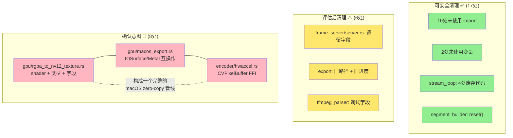

# native-core 未使用代码分析报告

## 概述

通过 `cargo check -p neko-native-core` 编译器警告分析，共发现 **31 处**未使用代码，涉及 **13 个文件**。按性质分为四类。

---

## 一、可安全清理（零风险）

### 1.1 未使用 import（10 处）

| 文件 | 行号 | 未使用 import |
|------|------|-------------|
| `encoder/fmp4_muxer.rs` | 14 | `super::codec_ext::ContainerFormatExt` |
| `export/audio_mixer.rs` | 9 | `Element` |
| `frame_server/server.rs` | 16 | `Response`, `StatusCode`, `body::Body`, `header` |
| `gpu/gpu_pipeline.rs` | 14 | `Error` |
| `services/impls/audio.rs` | 15 | `pack_pcm_frame` |
| `services/impls/common.rs` | 4 | `Error` |
| `services/impls/export.rs` | 8 | `Error` |
| `services/impls/stream_loop.rs` | 11 | `std::sync::Arc` |
| `services/impls/timeline.rs` | 14 | `Nv12OutputBuffers` |
| `services/impls/timeline.rs` | 17 | `crate::keyframe_cache::IdrScanner` |

### 1.2 未使用变量/赋值（2 处）

| 文件 | 行号 | 说明 |
|------|------|------|
| `services/impls/audio.rs` | 223 | 变量 `audio_info` 赋值后未使用 |
| `encoder/fmp4_muxer.rs` | 641 | 变量 `i` 赋值后未读取 |

### 1.3 stream_loop 废弃代码（4 处）

| 文件 | 行号 | 未使用项 | 原因 |
|------|------|---------|------|
| `services/impls/stream_loop.rs` | 66 | `ActiveStreams::contains()` | 辅助方法，无调用者 |
| `services/impls/stream_loop.rs` | 66 | `ActiveStreams::stop_all()` | 辅助方法，无调用者 |
| `services/impls/stream_loop.rs` | 66 | `ActiveStreams::count()` | 辅助方法，无调用者 |
| `services/impls/stream_loop.rs` | 246 | `pack_pcm_frame()` | 音频流改用 Opus 编码后废弃 |

### 1.4 其他零风险项（1 处）

| 文件 | 行号 | 未使用项 |
|------|------|---------|
| `services/impls/segment_builder.rs` | 113 | `SegmentBuilder::reset()` |

---

## 二、需评估后清理（中风险）

### 2.1 frame_server 遗留代码

| 文件 | 行号 | 未使用项 | 说明 |
|------|------|---------|------|
| `frame_server/server.rs` | 68 | 字段 `jpeg_data`, `timestamp_us`, `width`, `height` | 疑似旧 frame server 实现的残留结构体字段 |
| `frame_server/server.rs` | 16 | `Response`, `StatusCode` 等 4 个 import | 配套的未使用 import |

**判断依据**：当前帧分发已迁移到 `native-http` + `StreamRegistry`，`frame_server/` 模块可能整体废弃。

### 2.2 export 模块旧路径

| 文件 | 行号 | 未使用项 | 说明 |
|------|------|---------|------|
| `export/gpu_export_pipeline.rs` | 659 | `decode_to_gpu_layer()` | 旧的 GPU 解码路径，可能被新管线替代 |
| `export/service.rs` | 581 | `ExportService::update_job_progress()` | 旧的进度更新机制，可能被 TaskService 替代 |

### 2.3 media_service 调试字段

| 文件 | 行号 | 未使用项 | 说明 |
|------|------|---------|------|
| `media_service/ffmpeg_parser.rs` | 26 | 字段 `y`, `u`, `v` | YUV 平面数据，可能用于调试/分析 |
| `media_service/ffmpeg_parser.rs` | 39 | 字段 `frame`, `mse_avg` | 帧和均方误差，可能用于质量分析 |

---

## 三、需确认意图（高风险）

### 3.1 macOS zero-copy 导出管线（疑似未完成功能）

以下三个文件的未使用代码构成一个完整的功能单元——macOS IOSurface → Metal → wgpu 的 zero-copy GPU 导出管线：

#### gpu/rgba_to_nv12_texture.rs

| 行号 | 未使用项 | 说明 |
|------|---------|------|
| 315 | `RGBA_TO_NV12_TEXTURE_SHADER` | GPU shader：RGBA → NV12 纹理转换 |
| 416 | `BLIT_SHADER` | GPU shader：纹理 blit 操作 |
| 466 | `RgbaToNv12TextureUniforms` | shader uniform 类型定义 |
| 502 | 字段 `iosurface_y_wgpu`, `iosurface_uv_wgpu` | IOSurface 到 wgpu 纹理的映射 |

#### gpu/macos_export.rs

| 行号 | 未使用项 | 说明 |
|------|---------|------|
| 123 | `io_surface_ref()`, `synchronize()` | IOSurface 引用和同步 |
| 340 | `create_views()` | NV12 纹理视图创建 |
| 370 | 字段 `ctx` | GPU 上下文引用 |
| 426 | `import_frame_textures()`, `create_nv12_texture()`, `metal_device()`, `import_metal_textures_to_wgpu()` | Metal ↔ wgpu 纹理互操作 |

#### encoder/hwaccel.rs

| 行号 | 未使用项 | 说明 |
|------|---------|------|
| 868 | `create_cv_pixel_buffer_from_iosurface()`, `release_cv_pixel_buffer()` | CVPixelBuffer 创建和释放 |
| 882 | `CVPixelBufferCreateWithIOSurface()` | macOS FFI |
| 918 | `CFRelease()` | macOS FFI |

**分析**：这组代码是一个未完成（或实验性）的 macOS zero-copy 导出管线。当前导出走的是 `gpu_export_pipeline.rs` 中的标准路径（GPU texture → readback → encode）。如果确认不再需要 IOSurface zero-copy 优化，可以整体移除这三个文件中的相关代码。

---

## 四、架构图：未使用代码分布

---

## 五、建议清理优先级

| 优先级 | 范围 | 风险 | 涉及项数 |
|--------|------|------|---------|
| P0 | 未使用 import + 变量 | 零 | 12 |
| P1 | stream_loop 废弃代码 + segment_builder | 零 | 5 |
| P2 | frame_server 遗留 + export 旧路径 | 低 | 6 |
| P3 | macOS zero-copy 管线 | 需确认 | 8 |
