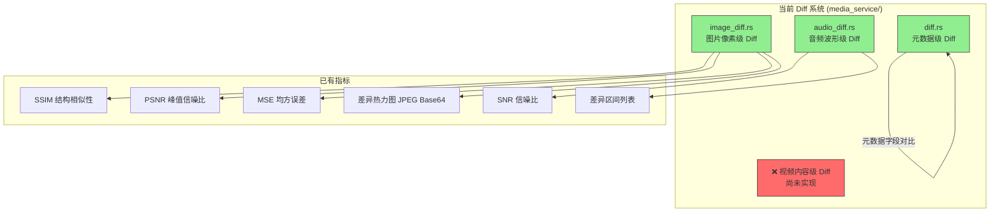
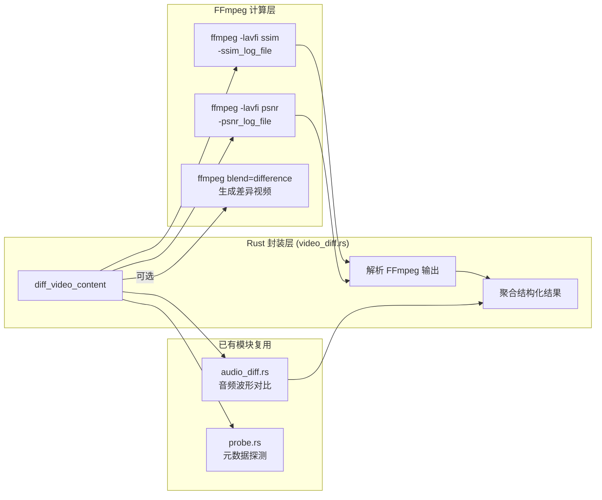
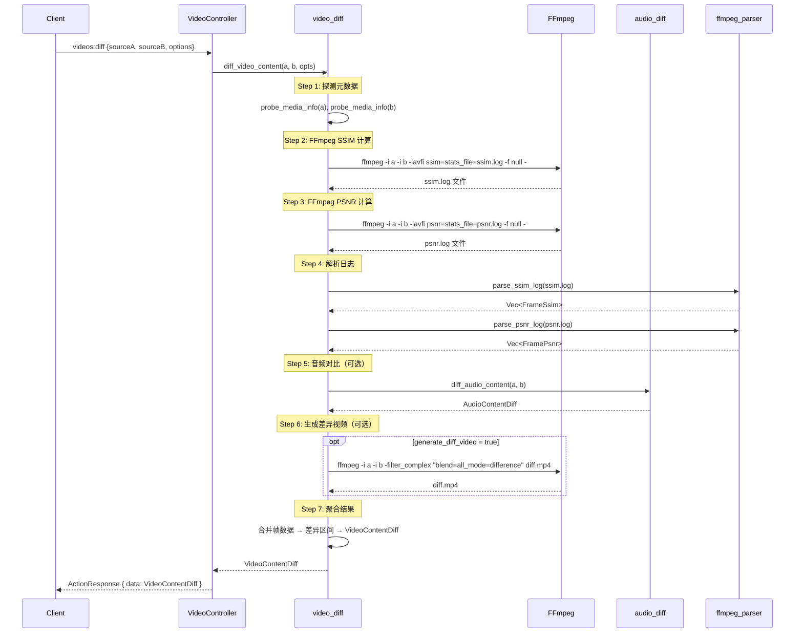
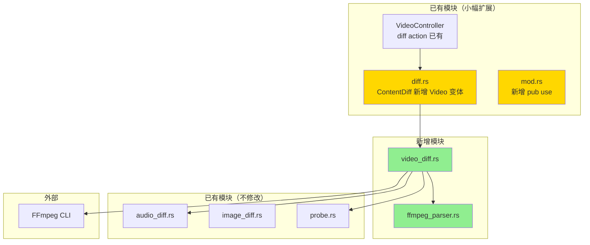

# 视频内容 Diff 分析报告

## 1. 现状分析

### 1.1 已实现的 Diff 能力



| 媒体类型 | 元数据 Diff | 内容级 Diff | 状态 |
|----------|------------|------------|------|
| **图片** | ✅ 分辨率/编码/格式 | ✅ SSIM/PSNR/MSE/热力图 | 完整 |
| **音频** | ✅ 编码/采样率/声道/码率 | ✅ SNR/RMS/差异区间 | 完整 |
| **视频** | ✅ 分辨率/帧率/编码/码率 | ❌ 未实现 | **缺失** |

### 1.2 架构三问

```
Q1: 这是否符合现有架构？
    → 是。现有 media_service/ 模块已有 diff.rs + image_diff.rs + audio_diff.rs 的模式，
      新增 video_diff.rs 完全符合现有模块组织。

Q2: 如何最小化耦合？
    → 视频 Diff 本质是 "逐帧图片 Diff + 音频 Diff" 的组合。
      可以复用已有的 image_diff 和 audio_diff 模块，不引入新依赖。

Q3: 是否易于扩展和测试？
    → 是。采用与 image_diff/audio_diff 相同的纯函数模式，
      输入两个路径，输出结构化结果，易于单元测试。
```

---

## 2. 视频内容 Diff 的核心挑战

视频 ≠ 图片 + 音频的简单叠加。视频 Diff 面临以下独特挑战：

### 2.1 时间轴对齐问题

```
视频 A:  [帧0] [帧1] [帧2] [帧3] [帧4] ...
视频 B:  [帧0] [帧1] [帧2] [帧3] [帧4] ...
                  ↑
          帧率不同时如何对齐？
          A=30fps, B=29.97fps → 10分钟后偏移 ~6帧
```

**方案**：统一按时间戳（秒）对齐，而非帧序号。以较低帧率为基准采样。

### 2.2 性能问题

```
1080p 30fps 10分钟视频 = 18,000 帧
每帧 SSIM 计算 ≈ 5ms
总计 ≈ 90 秒（仅单线程）

4K 60fps 10分钟视频 = 36,000 帧
每帧 SSIM 计算 ≈ 20ms
总计 ≈ 720 秒 = 12 分钟
```

**方案**：采样策略 + 并行计算 + GPU 加速（已有 wgpu 基础设施）。

### 2.3 输出形式

图片 Diff 输出一张热力图，音频 Diff 输出差异区间列表。
视频 Diff 应该输出什么？

---

## 3. 两种实现路径对比

### 路径 A：FFmpeg 外部命令（CLI 工具链）

你提到的方案，直接调用 FFmpeg 的 `ssim`/`psnr`/`blend=difference` 滤镜：

```bash
# SSIM 指数（每帧 + 平均值）
ffmpeg -i original.mp4 -i compressed.mp4 -lavfi ssim -f null -

# PSNR 指数
ffmpeg -i original.mp4 -i compressed.mp4 -lavfi psnr -f null -

# 生成视觉差异视频
ffmpeg -i v1.mp4 -i v2.mp4 -filter_complex "blend=all_mode=difference" diff_video.mp4

# 音频相位抵消
ffmpeg -i a1.wav -i a2.wav \
  -filter_complex "[1:a]ainvert[inv];[0:a][inv]amix=inputs=2:dropout_transition=0" \
  diff_audio.wav
```

**优点**：
- 🟢 零开发成本，FFmpeg 已是项目依赖
- 🟢 SSIM/PSNR 计算经过高度优化（SIMD/多线程）
- 🟢 自动处理帧率对齐、像素格式转换
- 🟢 可直接生成差异视频文件
- 🟢 支持硬件加速解码

**缺点**：
- 🔴 输出是文本日志，需要解析 FFmpeg stdout
- 🔴 无法获取逐帧结构化数据（需要额外解析 ssim log）
- 🔴 进程间通信开销
- 🔴 错误处理不够精细
- 🔴 无法与现有 GPU 管线集成

### 路径 B：原生 Rust 实现（复用现有基础设施）

利用已有的 `HwAccelDecoder` + `image_diff` + `audio_diff`：

```rust
// 伪代码
pub fn diff_video_content(path_a, path_b, opts) -> VideoContentDiff {
    // 1. 解码视频帧（复用 HwAccelDecoder）
    // 2. 按时间戳对齐采样
    // 3. 逐帧调用 image_diff 的 SSIM/PSNR
    // 4. 提取音轨调用 audio_diff
    // 5. 聚合结果
}
```

**优点**：
- 🟢 完全结构化输出，与现有 API 协议一致
- 🟢 复用已有 GPU 解码管线（零拷贝）
- 🟢 可集成到 ActionRequest/ActionResponse 协议
- 🟢 精细的进度报告（TaskHandle）
- 🟢 可取消/暂停

**缺点**：
- 🔴 开发工作量大
- 🔴 需要自己处理帧率对齐逻辑
- 🔴 SSIM 实现不如 FFmpeg 优化（当前是简化版 8x8 块）

### 路径 C：混合方案（推荐 ✅）

**核心思路**：用 FFmpeg 做重计算，用 Rust 做结构化封装。



---

## 4. 推荐方案：混合架构详细设计

### 4.1 数据模型

```rust
/// 视频内容 Diff 结果
#[derive(Debug, Clone, Serialize)]
#[serde(rename_all = "camelCase")]
pub struct VideoContentDiff {
    // ── 全局指标 ──
    /// 平均 SSIM (0.0-1.0)
    pub avg_ssim: f64,
    /// 最小 SSIM（最差帧）
    pub min_ssim: f64,
    /// 平均 PSNR (dB)
    pub avg_psnr: f64,
    /// 最小 PSNR（最差帧）
    pub min_psnr: f64,

    // ── 视频元信息 ──
    pub duration_a: f64,
    pub duration_b: f64,
    pub fps_a: f64,
    pub fps_b: f64,
    pub resolution_a: (u32, u32),
    pub resolution_b: (u32, u32),

    // ── 帧级分析 ──
    /// 总对比帧数
    pub total_frames_compared: u64,
    /// 差异帧数（SSIM < 阈值）
    pub diff_frame_count: u64,
    /// 差异帧占比 (0.0-100.0)
    pub diff_frame_percent: f64,
    /// 逐帧 SSIM 数据（采样）
    pub frame_ssim: Vec<FrameSsim>,

    // ── 差异区间 ──
    /// 视觉差异区间（连续差异帧合并）
    pub diff_regions: Vec<VideoDiffRegion>,

    // ── 音频对比（可选）──
    pub audio_diff: Option<AudioContentDiff>,

    // ── 差异视频（可选）──
    /// 差异视频文件路径（blend=difference 输出）
    pub diff_video_path: Option<String>,
}

/// 单帧 SSIM 数据
#[derive(Debug, Clone, Serialize)]
#[serde(rename_all = "camelCase")]
pub struct FrameSsim {
    /// 帧序号
    pub frame: u64,
    /// 时间戳（秒）
    pub timestamp: f64,
    /// SSIM 值
    pub ssim: f64,
    /// PSNR 值 (dB)
    pub psnr: f64,
}

/// 视频差异区间
#[derive(Debug, Clone, Serialize)]
#[serde(rename_all = "camelCase")]
pub struct VideoDiffRegion {
    /// 起始时间（秒）
    pub start: f64,
    /// 结束时间（秒）
    pub end: f64,
    /// 区间内平均 SSIM
    pub avg_ssim: f64,
    /// 区间内最小 SSIM
    pub min_ssim: f64,
    /// 差异帧数
    pub frame_count: u64,
}
```

### 4.2 FFmpeg SSIM/PSNR 日志解析

FFmpeg `ssim` 滤镜输出格式：
```
n:1 Y:0.9876 U:0.9912 V:0.9934 All:0.9901 (20.04)
n:2 Y:0.9854 U:0.9901 V:0.9923 All:0.9889 (19.55)
...
```

FFmpeg `psnr` 滤镜输出格式：
```
n:1 mse_avg:1.23 mse_y:1.45 mse_u:0.89 mse_v:0.67 psnr_avg:47.23 psnr_y:46.52 psnr_u:48.64 psnr_v:49.87
n:2 mse_avg:1.56 ...
...
```

解析这些日志是确定性的、无歧义的，非常适合 Rust 处理。

### 4.3 Diff 选项设计

```rust
/// 视频 Diff 选项
#[derive(Debug, Clone, Deserialize)]
#[serde(rename_all = "camelCase")]
pub struct VideoDiffOptions {
    /// SSIM 阈值，低于此值视为"差异帧"（默认 0.95）
    #[serde(default = "default_ssim_threshold")]
    pub ssim_threshold: f64,

    /// 是否生成差异视频文件
    #[serde(default)]
    pub generate_diff_video: bool,

    /// 差异视频输出路径（generate_diff_video=true 时必填）
    pub diff_video_output: Option<String>,

    /// 是否包含音频对比
    #[serde(default = "default_true")]
    pub include_audio: bool,

    /// 最大对比帧数（0=全部，用于限制大文件）
    #[serde(default)]
    pub max_frames: u64,

    /// 采样间隔（秒，0=逐帧，用于快速预览）
    #[serde(default)]
    pub sample_interval: f64,
}
```

### 4.4 模块组织

```
media_service/
├── mod.rs              # + pub use video_diff::*
├── diff.rs             # 元数据 Diff（已有）
├── image_diff.rs       # 图片像素 Diff（已有）
├── audio_diff.rs       # 音频波形 Diff（已有）
├── video_diff.rs       # 🆕 视频内容 Diff
├── ffmpeg_parser.rs    # 🆕 FFmpeg SSIM/PSNR 日志解析器
├── probe.rs            # 媒体探测（已有）
├── subtitle.rs         # 字幕提取（已有）
└── jpeg_encoder.rs     # JPEG 编码（已有）
```

### 4.5 实现流程



### 4.6 CLI 集成

在现有 CLI 架构中，`VideoAction` 已有 `Diff` 缺失，需要补充：

```rust
// args.rs - VideoAction 新增
define_actions!(VideoAction {
    // ... 现有 actions ...
    /// Compare two video files (metadata + content)
    Diff => "diff",
});
```

CLI 使用示例：
```bash
# 基础对比（元数据 + SSIM/PSNR）
neko-engine videos diff --options '{
  "sourceA": "/path/to/original.mp4",
  "sourceB": "/path/to/compressed.mp4"
}'

# 生成差异视频
neko-engine videos diff --options '{
  "sourceA": "original.mp4",
  "sourceB": "compressed.mp4",
  "generateDiffVideo": true,
  "diffVideoOutput": "diff_output.mp4"
}'

# 快速预览（每秒采样一帧）
neko-engine videos diff --options '{
  "sourceA": "original.mp4",
  "sourceB": "compressed.mp4",
  "sampleInterval": 1.0
}'
```

---

## 5. ContentDiff 枚举扩展

```rust
// diff.rs 中的 ContentDiff 扩展
#[derive(Debug, Clone, Serialize)]
#[serde(rename_all = "camelCase", tag = "type")]
pub enum ContentDiff {
    /// Image pixel-level comparison（已有）
    Image(ImageContentDiff),
    /// Audio waveform comparison（已有）
    Audio(AudioContentDiff),
    /// 🆕 Video frame-level comparison
    Video(VideoContentDiff),
}
```

`diff_media()` 函数扩展：
```rust
// diff.rs 中 diff_media() 的 content 匹配扩展
let content = match category {
    DiffCategory::Image => { /* 已有 */ },
    DiffCategory::Audio => { /* 已有 */ },
    DiffCategory::Video => {
        match diff_video_content(path_a, path_b, VideoDiffOptions::default()) {
            Ok(video_diff) => Some(ContentDiff::Video(video_diff)),
            Err(e) => {
                tracing::warn!("Video content diff failed: {}", e);
                None
            }
        }
    },
    _ => None,
};
```

---

## 6. 架构合规性检查

```
✅ 单一职责：video_diff.rs 只负责视频内容对比
✅ 开闭原则：ContentDiff 枚举扩展，不修改 image_diff/audio_diff
✅ 依赖倒置：通过 FFmpeg CLI 调用，不引入新的库依赖
✅ 接口隔离：VideoDiffOptions 独立于其他 Diff 选项
✅ 模块解耦：video_diff 复用 audio_diff 但不修改它
✅ 可测试性：ffmpeg_parser 是纯函数，可独立单元测试
```

### 依赖关系图



---

## 7. 实现优先级

| 阶段 | 内容 | 工作量 | 价值 |
|------|------|--------|------|
| **P0** | `ffmpeg_parser.rs` — SSIM/PSNR 日志解析器 | 小 | 高（基础设施） |
| **P0** | `video_diff.rs` — 核心 Diff 逻辑 | 中 | 高（核心功能） |
| **P1** | `diff.rs` 扩展 — ContentDiff::Video | 小 | 高（API 集成） |
| **P1** | `VideoController` — 自动触发内容级 Diff | 小 | 高（用户体验） |
| **P2** | CLI `Diff` action 补充 | 小 | 中（开发者工具） |
| **P2** | 差异视频生成（blend=difference） | 小 | 中（可视化） |
| **P3** | GPU 加速 SSIM（替代 FFmpeg） | 大 | 低（性能优化） |
| **P3** | 逐帧热力图视频生成 | 大 | 低（高级可视化） |

---

## 8. 与 CLI 工具的关系

你提到的 CLI 工具方案（ImageMagick `compare`、FFmpeg `ssim`/`blend`）是**计算引擎**，
而 neko-engine 的角色是**结构化封装层**。两者不是替代关系，而是互补关系：

```
┌─────────────────────────────────────────────────────┐
│  neko-engine (结构化 API)                            │
│                                                     │
│  输入: { sourceA, sourceB, options }                │
│  输出: { avgSsim, diffRegions, audioDiff, ... }     │
│                                                     │
│  ┌─────────────────────────────────────────────┐    │
│  │  FFmpeg (计算引擎)                           │    │
│  │  ffmpeg -lavfi ssim → ssim.log              │    │
│  │  ffmpeg -lavfi psnr → psnr.log              │    │
│  │  ffmpeg blend=difference → diff.mp4         │    │
│  └─────────────────────────────────────────────┘    │
│                                                     │
│  ┌─────────────────────────────────────────────┐    │
│  │  已有 Rust 模块 (复用)                       │    │
│  │  audio_diff → SNR/差异区间                   │    │
│  │  probe → 元数据                              │    │
│  └─────────────────────────────────────────────┘    │
└─────────────────────────────────────────────────────┘
```

**关键决策**：
- 图片 Diff → 继续用 Rust 原生（`image` crate，已实现）
- 音频 Diff → 继续用 Rust 原生（`FfmpegAudioDecoder`，已实现）
- **视频 Diff → 用 FFmpeg CLI 做 SSIM/PSNR 计算，Rust 做解析和封装**

原因：视频逐帧 SSIM 计算量巨大，FFmpeg 的实现经过 SIMD 优化且自动处理帧率对齐、
像素格式转换等复杂逻辑，重新实现没有意义。

---

## 9. 总结

```
╔══════════════════════════════════════════════════════════════╗
║  【核心判断】 ✅ 架构合理                                     ║
║                                                              ║
║  【关键洞察】                                                 ║
║  • 视频 Diff = FFmpeg SSIM/PSNR 计算 + Rust 结构化封装       ║
║  • 复用已有 audio_diff 处理音轨对比                           ║
║  • 复用已有 probe 获取元数据                                  ║
║  • 新增 ffmpeg_parser 解析 SSIM/PSNR 日志（纯函数，易测试）  ║
║  • ContentDiff 枚举扩展，不破坏现有 API                      ║
║                                                              ║
║  【新增文件】                                                 ║
║  • media_service/video_diff.rs  — 视频内容 Diff 核心逻辑     ║
║  • media_service/ffmpeg_parser.rs — FFmpeg 日志解析器         ║
║                                                              ║
║  【修改文件】                                                 ║
║  • media_service/mod.rs — 新增 pub use                       ║
║  • media_service/diff.rs — ContentDiff 新增 Video 变体       ║
║  • args.rs — VideoAction 新增 Diff                           ║
╚══════════════════════════════════════════════════════════════╝
```
