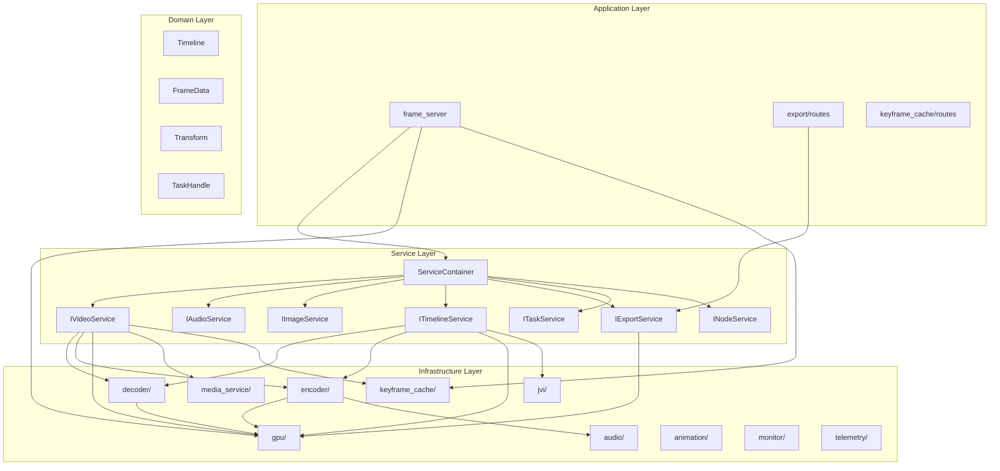
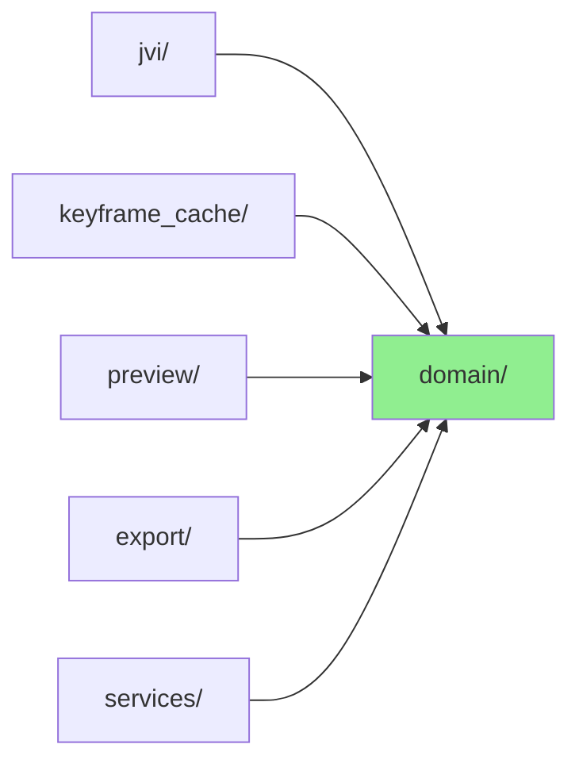
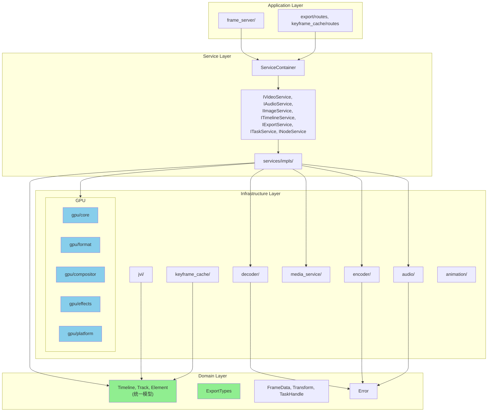

# Native Core 架构审查报告

## 架构评级

### 🟡 一般架构 — 整体设计优秀，但存在若干结构性问题需要调整

---

## 一、现有架构概览

### 1.1 模块规模统计

| 模块 | 行数 | 文件数 | 职责 |
|------|------|--------|------|
| `gpu/` | 13,496 | 24 | GPU 处理（合成、特效、纹理、格式转换） |
| `services/` | 3,771 | 17 | 服务层（trait + 实现） |
| `encoder/` | 3,242 | 7 | 视频编码 |
| `media_service/` | 2,799 | 8 | 媒体探测、diff、字幕、JPEG |
| `export/` | 2,782 | 6 | 导出管线 |
| `keyframe_cache/` | 2,015 | 6 | 关键帧缓存 |
| `domain/` | 1,842 | 9 | 领域模型 |
| `decoder/` | 1,521 | 5 | 视频解码 |
| `animation/` | 1,508 | 5 | 关键帧动画 |
| `frame_server/` | 1,324 | 4 | HTTP/WebSocket 服务器 |
| `audio/` | 904 | 4 | 音频编解码 |
| `jvi/` | 871 | 4 | 项目文件格式 |
| `telemetry/` | 728 | 3 | 性能追踪 |
| `monitor/` | 278 | 2 | 系统监控 |
| `preview/` | 271 | 2 | 实时预览 |
| `error.rs` | 118 | 1 | 错误类型 |
| **总计** | **~37,500** | **107** | |

### 1.2 当前分层架构



---

## 二、发现的架构问题

### ❌ 问题 1：`export/types.rs` 承担了过多职责 — 数据模型错位

**严重程度：高**

`export/types.rs`（622 行）定义了 `TimelineData`、`TrackData`、`ElementData`、`TrackType` 等**核心领域类型**，但它们被放在了 `export/` 模块中。这导致：

- `jvi/` 依赖 `export/` 来获取 `TimelineData`、`ExportSettings`
- `keyframe_cache/` 依赖 `export/` 来获取 `TimelineData`、`ElementData`、`TrackType`
- `preview/` 依赖 `export/` 来获取 `TimelineData`、`ExportSettings`
- `services/impls/timeline.rs` 依赖 `export/` 来获取 `ElementData`

**违反原则**：
- ❌ **单一职责**：`export/` 既是导出管线，又是核心数据模型的定义处
- ❌ **依赖倒置**：低层模块（`jvi/`、`keyframe_cache/`）依赖高层模块（`export/`）

**依赖方向错误**：
```
jvi/ ──────────► export/types.rs ◄──────── keyframe_cache/
preview/ ──────► export/types.rs ◄──────── services/timeline
                      ↑
              这些类型应该在 domain/ 中
```

---

### ❌ 问题 2：`domain/timeline.rs` 与 `export/types.rs` 存在重复的 Timeline 模型

**严重程度：高**

系统中存在**两套并行的 Timeline 数据模型**：

| 类型 | 位置 | 使用者 |
|------|------|--------|
| `Timeline` + `Track` + `Element` + `ElementType` | `domain/timeline.rs` | `services/impls/timeline.rs`、`services/impls/video.rs` |
| `TimelineData` + `TrackData` + `ElementData` + `TrackType` | `export/types.rs` | `export/`、`jvi/`、`keyframe_cache/`、`preview/` |

两套模型几乎完全相同（都有 tracks、elements、start_time、duration、transform 等），但字段命名和结构略有差异。这导致：

- ❌ **DRY 违反**：相同概念的重复定义
- ❌ **转换开销**：`jvi/converter.rs` 将 JVI → `export::TimelineData`，而 `services/timeline.rs` 又需要 `domain::Timeline`
- ❌ **认知负担**：开发者需要区分两套几乎相同的类型

---

### ⚠️ 问题 3：`gpu/` 模块过于庞大（13,496 行，24 文件）

**严重程度：中**

`gpu/` 模块包含了太多不同层次的职责：

```
gpu/
├── 核心设施：context.rs, texture.rs, buffer_pool.rs
├── 格式转换：nv12_import.rs, nv12_renderer.rs, rgba_to_nv12.rs, rgba_to_nv12_texture.rs
├── 合成引擎：compositor.rs, texture_compositor.rs, gpu_layer.rs
├── 特效处理：processor.rs, blur_processor.rs, style_processor.rs, transition_processor.rs
├── 文本渲染：text_renderer.rs
├── 编码桥接：encoder_bridge.rs, gpu_pipeline.rs
├── 平台适配：hal_import.rs, macos_import.rs, macos_export.rs, linux_import.rs, windows_import.rs
└── 着色器：shaders/mod.rs
```

**违反原则**：
- ⚠️ **单一职责**：一个模块承担了 6+ 种不同职责
- ⚠️ **接口隔离**：所有 GPU 功能通过一个 `mod.rs` 暴露 80+ 个公开类型

---

### ⚠️ 问题 4：`read_texture_to_buffer` 代码重复

**严重程度：中**

`VideoService::read_texture_to_buffer` 和 `TimelineService::read_texture_to_buffer` 是**完全相同的代码**（约 40 行），各自在 `video.rs` 和 `timeline.rs` 中独立实现。

同时 `GpuContext` 已经有 `read_texture_sync` 方法做了同样的事情。

**违反原则**：
- ❌ **DRY**：相同逻辑重复 3 次
- ⚠️ **单一职责**：Service 层不应包含 GPU 底层操作

---

### ⚠️ 问题 5：`ServiceContainer` 返回具体类型而非 trait 对象

**严重程度：中**

```rust
pub struct ServiceContainer {
    video_service: Arc<VideoService>,      // 具体类型
    audio_service: Arc<AudioService>,      // 具体类型
    // ...
}

pub fn video_service(&self) -> &Arc<VideoService> {  // 返回具体类型
    &self.video_service
}
```

虽然定义了 `IVideoService`、`IAudioService` 等 trait，但 `ServiceContainer` 直接持有和返回具体实现类型，削弱了依赖注入的价值。

**违反原则**：
- ⚠️ **依赖倒置**：消费者依赖具体实现而非抽象
- ⚠️ **开闭原则**：替换实现需要修改 Container

---

### ⚠️ 问题 6：`audio/traits.rs` 反向依赖 `encoder/codec_ext.rs`

**严重程度：中**

```rust
// audio/traits.rs
use crate::encoder::codec_ext::AudioCodecExt;
```

`audio/` 模块（音频编解码基础设施）依赖了 `encoder/` 模块的扩展 trait。依赖方向应该反过来：`encoder/` 依赖 `audio/` 的类型。

---

### ⚠️ 问题 7：`frame_server/server.rs` 直接依赖 `export::ExportService`

**严重程度：低**

```rust
// frame_server/server.rs
use crate::export::{export_routes, ExportService};
```

HTTP 服务器层直接引用了 `export` 模块的具体实现，而不是通过 Service trait。

---

## 三、架构调整建议

### 建议 1：统一 Timeline 模型，将共享类型下沉到 `domain/`

**优先级：高**

将 `export/types.rs` 中的核心数据类型迁移到 `domain/` 层：

```
domain/
├── timeline.rs          ← 统一的 Timeline/Track/Element 模型
├── export_types.rs      ← ExportSettings, ExportProgress 等导出专用类型
├── frame.rs
├── transform.rs
└── ...
```

**迁移清单**：
- `TimelineData` → 与 `domain::Timeline` 合并为统一模型
- `TrackData` / `TrackType` → 合并到 `domain::timeline.rs`
- `ElementData` → 合并到 `domain::timeline.rs`
- `ExportSettings`、`ExportProgress` 等 → 保留在 `export/` 或移到 `domain/export_types.rs`

**效果**：


---

### 建议 2：拆分 `gpu/` 为子模块

**优先级：中**

```
gpu/
├── core/               ← context.rs, texture.rs, buffer_pool.rs, shaders/
├── format/             ← nv12_import.rs, nv12_renderer.rs, rgba_to_nv12.rs, rgba_to_nv12_texture.rs
├── compositor/         ← compositor.rs, texture_compositor.rs, gpu_layer.rs
├── effects/            ← processor.rs, blur_processor.rs, style_processor.rs, transition_processor.rs
├── text/               ← text_renderer.rs
├── bridge/             ← encoder_bridge.rs, gpu_pipeline.rs
└── platform/           ← hal_import.rs, macos_*.rs, linux_*.rs, windows_*.rs
```

---

### 建议 3：消除 `read_texture_to_buffer` 重复

**优先级：高（简单修复）**

Service 层应直接使用 `GpuContext::read_texture_sync`，删除 `VideoService` 和 `TimelineService` 中的重复实现。

---

### 建议 4：`ServiceContainer` 返回 trait 对象

**优先级：中**

```rust
pub struct ServiceContainer {
    video_service: Arc<dyn IVideoService>,
    audio_service: Arc<dyn IAudioService>,
    // ...
}

pub fn video_service(&self) -> &Arc<dyn IVideoService> {
    &self.video_service
}
```

---

### 建议 5：修正 `audio/` → `encoder/` 的反向依赖

**优先级：中**

将 `AudioCodecExt` 中 `AudioCodec` 的扩展方法（如 `default_bitrate()`）移到 `audio/traits.rs` 或 `neko-types` 中，消除 `audio/` 对 `encoder/` 的依赖。

---

## 四、架构优势（值得保留）

### ✅ 优秀的 Service Trait 抽象

7 个 Service trait 定义清晰、职责单一：
- `IVideoService` — 视频操作
- `IAudioService` — 音频操作
- `IImageService` — 图像操作
- `ITimelineService` — 时间线合成
- `IExportService` — 导出管线
- `ITaskService` — 任务管理
- `INodeService` — 系统监控

### ✅ 优秀的 Codec Trait 设计

`Decoder`、`Encoder`、`AudioDecoder`、`AudioEncoder` trait 定义了清晰的编解码契约，支持硬件加速和软件回退。

### ✅ 零拷贝 GPU 管线

从硬件解码到 GPU 合成到硬件编码的全链路零拷贝设计，跨平台支持（macOS/Linux/Windows）。

### ✅ 流控制抽象 `stream_loop.rs`

`ActiveStreams`、`FramePacer`、`PlaybackState` 提供了优秀的流播放控制抽象，被 Video/Audio/Timeline 三个 Service 复用。

### ✅ 完善的测试覆盖

每个模块都有单元测试，Service 层有 trait 对象编译检查测试。

### ✅ 错误处理统一

`thiserror` 驱动的 `Error` 枚举覆盖了所有错误场景，`From` 实现支持 `?` 操作符。

---

## 五、调整优先级总结

| 优先级 | 问题 | 建议 | 工作量 |
|--------|------|------|--------|
| 🔴 高 | Timeline 模型重复 | 统一到 `domain/` | 大（需要重构多个模块的 import） |
| 🔴 高 | `export/types.rs` 职责错位 | 核心类型下沉到 `domain/` | 大（同上） |
| 🟡 中 | `read_texture_to_buffer` 重复 | 使用 `GpuContext::read_texture_sync` | 小 |
| 🟡 中 | `ServiceContainer` 返回具体类型 | 改为返回 trait 对象 | 中 |
| 🟡 中 | `audio/` 反向依赖 `encoder/` | 移动扩展方法 | 小 |
| 🟡 中 | `gpu/` 模块过大 | 拆分为子模块 | 中（纯重组，不改逻辑） |
| 🟢 低 | `frame_server` 直接依赖具体实现 | 通过 Service trait 间接引用 | 小 |

---

## 六、调整后的目标架构



**核心改变**：
- 🟢 绿色：统一的 Domain 模型，所有模块依赖它
- 🔵 蓝色：拆分后的 GPU 子模块，职责清晰

---

*报告生成时间：2025-01*
*代码库规模：~37,500 行 Rust 代码，107 个文件，16 个模块*
