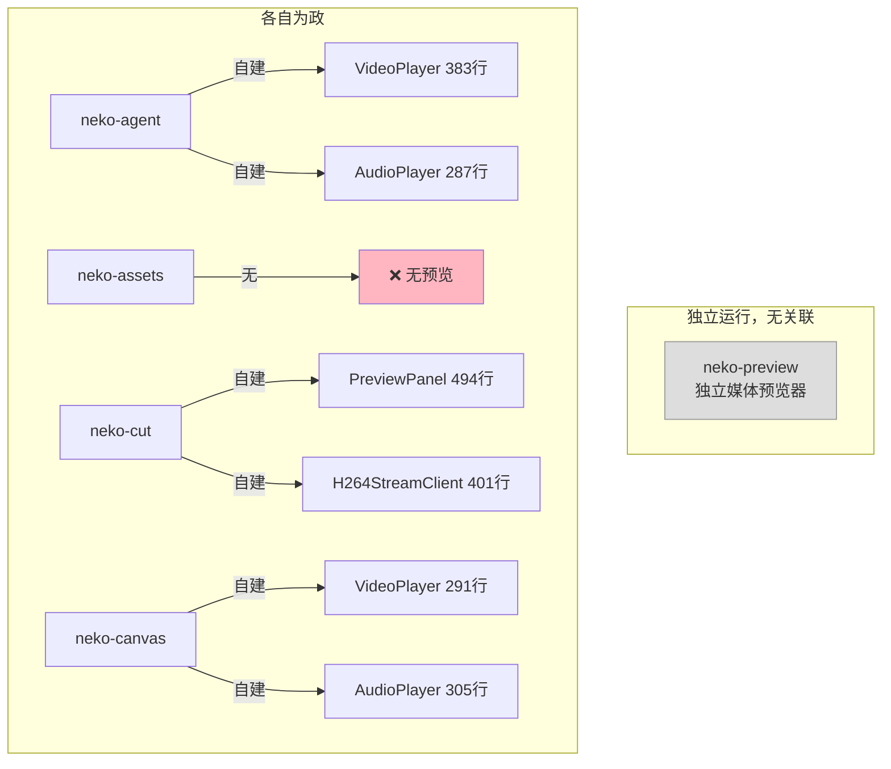
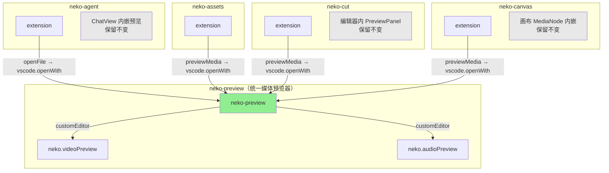

# neko-preview 集成方案 — 替换原生音视频预览

## 📊 现状分析

### 四个插件的媒体预览现状

| 插件 | 当前预览方式 | 预览场景 | 代码量 | 技术方案 |
|------|-------------|---------|--------|---------|
| **neko-agent** | 自建 VideoPlayer + AudioPlayer | Chat 对话中展示 AI 生成结果 | ~670 行 | HTML5 `<video>`/`<audio>` 原生标签 |
| **neko-assets** | ❌ 无任何预览 | — | 0 | — |
| **neko-cut** | 自建 PreviewPanel + H264StreamClient | 编辑器内实时预览 | ~895 行 | H.264 流 + WebCodecs（专业级） |
| **neko-canvas** | 自建 VideoPlayer + AudioPlayer | 画布 MediaNode 内嵌播放 | ~848 行 | HTML5 `<video>`/`<audio>` 原生标签 |

### 关键发现

1. **四个插件都没有依赖 neko-preview**
2. **三个插件各自实现了独立的媒体播放组件**，存在大量代码重复
3. 所有插件都缺少"点击媒体文件 → 打开独立预览"的能力
4. neko-agent 的 Open 按钮通过 `postMessage({ type: 'openFile' })` 打开文件 — 这是集成入口
5. neko-cut 的 H264StreamClient 与 neko-preview 的实现高度相似（同源）

### 需要区分的两种"预览"

```
场景 A: 独立文件预览（neko-preview 的核心能力）
  → 用户在资源管理器中点击 .mp4/.mp3 文件
  → VSCode 打开 neko-preview 的 customEditor
  → 硬件加速的专业预览体验

场景 B: 内嵌预览（各插件自身需要的能力）
  → neko-agent: Chat 消息中展示 AI 生成的媒体结果
  → neko-canvas: 画布节点中内嵌播放媒体
  → neko-cut: 编辑器中实时预览时间线
  → 这些场景需要在 Webview 内部嵌入播放器，不能用 customEditor
```

---

## 🎯 集成目标

### 目标 1: 依赖声明（所有 4 个插件）
让四个插件声明对 neko-preview 的扩展依赖，确保安装时自动安装 neko-preview。

### 目标 2: 独立文件预览委托（neko-agent + neko-assets）
当用户在这些插件的上下文中需要打开媒体文件时，委托给 neko-preview 的 customEditor。

### 目标 3: 右键菜单集成（neko-cut + neko-canvas）
在已有的右键菜单中添加"Preview with Neko"选项，用 neko-preview 打开媒体文件。

### 目标 4: 内嵌预览保留但优化（不删除现有组件）
各插件的内嵌预览组件（Chat 卡片、画布节点、编辑器面板）保留不动，
因为它们服务于不同的 UI 场景，不能被 customEditor 替代。

---

## 📋 实施方案

### Phase 1: 依赖声明（4 个插件）

修改每个插件的 `package.json`，在 `extensionDependencies` 中添加 `neko.neko-preview`。

#### neko-agent/package.json
```json
"extensionDependencies": [
  "neko.neko-engine",
  "neko.neko-tools",
  "neko.neko-preview"    // ← 新增
]
```

#### neko-assets/package.json
```json
"extensionDependencies": [
  "neko.neko-engine",
  "neko.neko-tools",
  "neko.neko-preview"    // ← 新增
]
```

#### neko-cut/package.json
```json
"extensionDependencies": [
  "neko.neko-engine",
  "neko.neko-tools",
  "neko.neko-preview"    // ← 新增
]
```

#### neko-canvas/package.json
```json
"extensionDependencies": [
  "neko.neko-engine",
  "neko.neko-tools",
  "neko.neko-preview"    // ← 新增
]
```

---

### Phase 2: neko-agent — "Open" 按钮集成

**现状**: neko-agent 的 VideoPlayer/AudioPlayer 有 Open 按钮，
通过 `postMessage({ type: 'openFile', path })` 请求 extension 打开文件。

**改造点**: extension 端收到 `openFile` 消息时，
使用 `vscode.openWith` 指定 neko-preview 的 viewType 打开。

**修改文件**: `neko-agent/packages/extension/src/chat/messageHandler.ts`
（或处理 webview 消息的对应文件）

```typescript
// 收到 openFile 消息时
case 'openFile': {
  const filePath = msg.path;
  const uri = vscode.Uri.file(filePath);
  const ext = path.extname(filePath).toLowerCase().slice(1);

  const videoExts = ['mp4', 'mov', 'avi', 'mkv', 'webm', 'm4v', 'ts', 'flv', 'wmv'];
  const audioExts = ['mp3', 'wav', 'ogg', 'flac', 'aac', 'm4a', 'wma', 'opus'];

  if (videoExts.includes(ext)) {
    await vscode.commands.executeCommand('vscode.openWith', uri, 'neko.videoPreview');
  } else if (audioExts.includes(ext)) {
    await vscode.commands.executeCommand('vscode.openWith', uri, 'neko.audioPreview');
  } else {
    // 其他文件类型用默认方式打开
    await vscode.commands.executeCommand('vscode.open', uri);
  }
  break;
}
```

**不修改**: Webview 端的 VideoPlayer/AudioPlayer 组件保持不变（Chat 内嵌预览仍需要）。

---

### Phase 3: neko-assets — 资产预览命令

**现状**: neko-assets 是骨架实现，无任何媒体预览。

**改造点**: 添加一个 "Preview Asset" 命令 + 右键菜单，
让用户在资产管理器中右键点击媒体文件时可以用 neko-preview 打开。

#### 3.1 package.json 新增命令和菜单

```json
"commands": [
  // ... 现有命令 ...
  {
    "command": "neko.assets.previewMedia",
    "title": "%neko.assets.previewMedia%",
    "category": "Neko Assets"
  }
],
"menus": {
  "explorer/context": [
    {
      "command": "neko.assets.previewMedia",
      "when": "resourceExtname =~ /\\.(mp4|mov|avi|mkv|webm|m4v|ts|flv|wmv|mp3|wav|ogg|flac|aac|m4a|wma|opus)$/i",
      "group": "neko@1"
    }
  ]
}
```

#### 3.2 extension.ts 新增命令实现

```typescript
context.subscriptions.push(
  vscode.commands.registerCommand('neko.assets.previewMedia', async (uri?: vscode.Uri) => {
    if (!uri) {
      // 如果没有 URI（从命令面板调用），弹出文件选择器
      const fileUri = await vscode.window.showOpenDialog({
        canSelectFiles: true,
        canSelectMany: false,
        filters: {
          'Media Files': [
            'mp4', 'mov', 'avi', 'mkv', 'webm', 'm4v', 'ts', 'flv', 'wmv',
            'mp3', 'wav', 'ogg', 'flac', 'aac', 'm4a', 'wma', 'opus'
          ],
        },
      });
      if (!fileUri?.[0]) return;
      uri = fileUri[0];
    }

    const ext = uri.fsPath.split('.').pop()?.toLowerCase() ?? '';
    const videoExts = ['mp4', 'mov', 'avi', 'mkv', 'webm', 'm4v', 'ts', 'flv', 'wmv'];
    const audioExts = ['mp3', 'wav', 'ogg', 'flac', 'aac', 'm4a', 'wma', 'opus'];

    if (videoExts.includes(ext)) {
      await vscode.commands.executeCommand('vscode.openWith', uri, 'neko.videoPreview');
    } else if (audioExts.includes(ext)) {
      await vscode.commands.executeCommand('vscode.openWith', uri, 'neko.audioPreview');
    }
  })
);
```

---

### Phase 4: neko-cut — 右键菜单 + 时间线预览

**现状**: neko-cut 有 `neko.addToTimeline` 右键菜单（媒体文件上），
但没有"预览"选项。编辑器内的 PreviewPanel 是专业级实时预览，保留不动。

**改造点**: 添加右键菜单 "Preview Media"，
让用户在添加到时间线之前可以先预览媒体文件。

#### 4.1 package.json 新增命令和菜单

```json
"commands": [
  // ... 现有命令 ...
  {
    "command": "neko.cut.previewMedia",
    "title": "%neko.cut.previewMedia%",
    "category": "Neko Cut"
  }
],
"menus": {
  "explorer/context": [
    // ... 现有菜单项 ...
    {
      "command": "neko.cut.previewMedia",
      "when": "resourceExtname =~ /\\.(mp4|mov|avi|mkv|webm|m4v|mp3|wav|ogg|m4a|aac|flac)$/i",
      "group": "neko@2"
    }
  ]
}
```

#### 4.2 extension.ts 新增命令

```typescript
context.subscriptions.push(
  vscode.commands.registerCommand('neko.cut.previewMedia', async (uri?: vscode.Uri) => {
    if (!uri) return;
    const ext = uri.fsPath.split('.').pop()?.toLowerCase() ?? '';
    const videoExts = ['mp4', 'mov', 'avi', 'mkv', 'webm', 'm4v'];
    const audioExts = ['mp3', 'wav', 'ogg', 'm4a', 'aac', 'flac'];

    if (videoExts.includes(ext)) {
      await vscode.commands.executeCommand('vscode.openWith', uri, 'neko.videoPreview');
    } else if (audioExts.includes(ext)) {
      await vscode.commands.executeCommand('vscode.openWith', uri, 'neko.audioPreview');
    }
  })
);
```

**不修改**: PreviewPanel + H264StreamClient 保留（编辑器内实时预览是不同场景）。

---

### Phase 5: neko-canvas — 右键菜单 + MediaNode 双击

**现状**: neko-canvas 有 `neko.addToAssetLibrary` 右键菜单，
MediaNode 内嵌了 VideoPlayer/AudioPlayer。

**改造点**:
1. 添加右键菜单 "Preview Media"
2. MediaNode 添加"在独立窗口预览"的入口（双击或按钮）

#### 5.1 package.json 新增命令和菜单

```json
"commands": [
  // ... 现有命令 ...
  {
    "command": "neko.canvas.previewMedia",
    "title": "%neko.canvas.previewMedia%",
    "category": "Neko Canvas"
  }
],
"menus": {
  "explorer/context": [
    // ... 现有菜单项 ...
    {
      "command": "neko.canvas.previewMedia",
      "when": "resourceExtname =~ /\\.(mp4|mov|avi|mkv|webm|m4v|mp3|wav|ogg|m4a|aac|flac)$/i",
      "group": "neko@2"
    }
  ]
}
```

#### 5.2 extension.ts 新增命令

```typescript
context.subscriptions.push(
  vscode.commands.registerCommand('neko.canvas.previewMedia', async (uri?: vscode.Uri) => {
    if (!uri) return;
    const ext = uri.fsPath.split('.').pop()?.toLowerCase() ?? '';
    const videoExts = ['mp4', 'mov', 'avi', 'mkv', 'webm', 'm4v'];
    const audioExts = ['mp3', 'wav', 'ogg', 'm4a', 'aac', 'flac'];

    if (videoExts.includes(ext)) {
      await vscode.commands.executeCommand('vscode.openWith', uri, 'neko.videoPreview');
    } else if (audioExts.includes(ext)) {
      await vscode.commands.executeCommand('vscode.openWith', uri, 'neko.audioPreview');
    }
  })
);
```

#### 5.3 MediaNode 添加"独立预览"按钮

在 MediaNode 的 header 区域添加一个"外部预览"图标按钮，
点击时通过 `postMessage` 通知 extension 用 neko-preview 打开。

**不修改**: 内嵌的 VideoPlayer/AudioPlayer/ImageViewer 保留（画布节点内嵌播放是不同场景）。

---

## 🏗️ 架构变化图

### 集成前



### 集成后



---

## 📝 修改文件清单

| 插件 | 文件 | 修改类型 | 说明 |
|------|------|---------|------|
| neko-agent | `package.json` | 修改 | 添加 extensionDependencies |
| neko-agent | `packages/extension/src/chat/messageHandler.ts` | 修改 | openFile 消息路由到 neko-preview |
| neko-assets | `package.json` | 修改 | 添加 extensionDependencies + 命令 + 菜单 |
| neko-assets | `src/extension.ts` | 修改 | 添加 previewMedia 命令实现 |
| neko-cut | `package.json` | 修改 | 添加 extensionDependencies + 命令 + 菜单 |
| neko-cut | `packages/extension/src/extension.ts` | 修改 | 添加 previewMedia 命令实现 |
| neko-canvas | `package.json` | 修改 | 添加 extensionDependencies + 命令 + 菜单 |
| neko-canvas | `packages/extension/src/extension.ts` | 修改 | 添加 previewMedia 命令实现 |
| neko-canvas | `packages/webview/src/components/nodes/MediaNode.tsx` | 修改 | 添加"独立预览"按钮 |

**总计**: 9 个文件修改，0 个新文件

---

## ⚠️ 不修改的部分（重要）

以下组件**保留不动**，因为它们服务于不同的 UI 场景：

| 组件 | 原因 |
|------|------|
| neko-agent `MediaPreview/VideoPlayer.tsx` | Chat 对话中的紧凑卡片式预��，不能用 customEditor 替代 |
| neko-agent `MediaPreview/AudioPlayer.tsx` | 同上 |
| neko-cut `PreviewPanel.tsx` | 编辑器内实时预览，需要与时间线同步，不能替代 |
| neko-cut `H264StreamClient.ts` | PreviewPanel 的依赖 |
| neko-canvas `media/VideoPlayer.tsx` | 画布节点内嵌播放，需要在 Canvas 坐标系中渲染 |
| neko-canvas `media/AudioPlayer.tsx` | 同上 |
| neko-canvas `MediaNode.tsx` | 仅添加按钮，不替换内嵌播放器 |

---

## 🔄 实施顺序

```
Phase 1: 依赖声明（4 个 package.json）     → 10 分钟
Phase 2: neko-agent openFile 集成          → 15 分钟
Phase 3: neko-assets previewMedia 命令     → 15 分钟
Phase 4: neko-cut previewMedia 命令        → 10 分钟
Phase 5: neko-canvas previewMedia + 按钮   → 20 分钟
```

**预计总工时**: ~70 分钟
