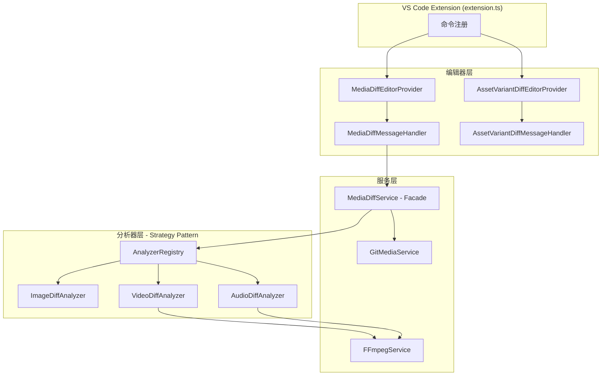
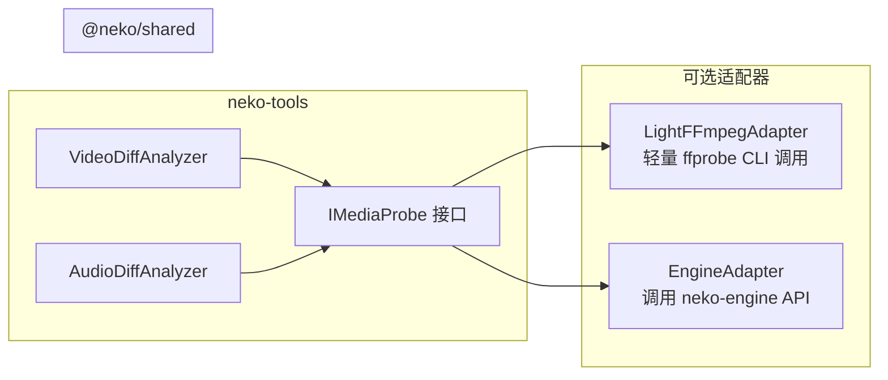

# Neko Tools 架构分析报告

> 生成日期：2026-02-09

---

## 1. 项目定位

**Neko Tools** 是一个 VS Code 扩展，核心功能是**媒体文件差异比较和分析**，支持图片、视频、音频三种媒体类型的版本对比。

---

## 2. 架构概览



---

## 3. 核心功能模块

| 模块 | 职责 | 支持格式 |
|------|------|----------|
| **图片差异分析** | 像素差异、SSIM、颜色直方图、热力图 | PNG, JPG, GIF, WebP, BMP, SVG |
| **视频差异分析** | 关键帧采样对比、元数据比较、音轨变化检测 | MP4, MOV, AVI, MKV, WebM, M4V |
| **音频差异分析** | 波形对比、频谱差异、静音区域检测 | MP3, WAV, OGG, FLAC, AAC, M4A |
| **资产变体对比** | 同一资产不同变体的属性差异 | 自定义资产类型 |

### 对比模式

- `side-by-side` — 左右并排
- `slider` — 滑动对比
- `overlay` — 叠加对比
- `onion-skin` — 洋葱皮对比（仅图片）

---

## 4. 设计模式应用

| 模式 | 实现 | 作用 |
|------|------|------|
| **Facade** | `MediaDiffService` | 统一差异分析入口 |
| **Strategy** | `IMediaDiffAnalyzer` + 具体分析器 | 不同媒体类型可替换分析策略 |
| **Registry** | `AnalyzerRegistry` | 动态注册/查找分析器 |
| **DI** | 构造函数注入 | 解耦服务依赖 |
| **Observer** | `DiffProgressCallback` | 进度报告 |

---

## 5. 架构评级

🟢 **优秀架构** — 符合 SOLID 原则，模块职责清晰，扩展性强。

**优点**：
- 职责分离明确（编辑器层 / 服务层 / 分析器层）
- 通过接口抽象充分解耦
- 注册表 + 策略模式使新增媒体类型分析器零侵入
- 完善的错误处理（超时控制、取消机制、异常处理）

**可改进方向**：
- 缺少分析结果缓存机制，重复分析同一文件会浪费资源
- 并发控制较简单，当前仅支持单个分析任务
- 大文件场景下的内存管理可进一步优化

---

## 6. 功能完成度

### 总体完成度：65%

| 模块 | 完成度 | 状态 |
|------|--------|------|
| 主入口 `extension.ts` | 10% | ❌ 所有命令均为 stub |
| MediaDiffService (Facade) | 95% | ✅ 基本完整 |
| GitMediaService | 95% | ✅ 基本完整 |
| ImageDiffAnalyzer | 100% | ✅ 完整（SSIM/直方图/热力图） |
| VideoDiffAnalyzer | 85% | 🟡 逻辑完整，缺 FFmpeg 依赖 |
| AudioDiffAnalyzer | 85% | 🟡 逻辑完整，缺 FFmpeg 依赖 |
| MediaDiff 编辑器 + Webview | 90% | 🟡 缺视频帧 seek/getFrame |
| AssetVariantDiff 编辑器 | 80% | 🟡 部分完整 |
| 单元测试 | 70% | 🟡 仅覆盖图像分析器和服务层 |

### 🔴 阻塞性问题（P0）

**1. FFmpegService 完全缺失**

视频/音频分析器均导入了 `FFmpegService`，但该文件不存在。需要实现的方法：

```typescript
class FFmpegService {
  initialize(): Promise<void>
  probeMediaInfo(filePath: string): Promise<MediaInfo>
  extractVideoFrame(filePath: string, time: number): Promise<Buffer>
  decodeAudioSegment(filePath: string, start: number, duration: number): Promise<ArrayBuffer>
}
```

**2. 主入口未连接模块初始化**

`extension.ts` 中 6 个命令全部是 `"Coming soon"` 的 stub，没有调用 `initializeMediaDiff()` 和 `initializeAssetDiff()`。

### 🟡 功能性问题（P1）

**3. 视频帧处理 TODO**（`MediaDiffMessageHandler.ts`）
- `handleSeek()` — 仅有 `console.log`
- `handleGetFrame()` — 仅有 `console.log`

**4. Asset Diff 消息处理不完整**

### 可运行 vs 不可运行

| 功能 | 状态 | 原因 |
|------|------|------|
| 图像 Diff（Git/本地） | ⚠️ 逻辑完整但入口未连接 | 主入口 stub |
| 视频 Diff | ❌ 无法运行 | 缺 FFmpegService |
| 音频 Diff | ❌ 无法运行 | 缺 FFmpegService |
| 视频帧导航 | ❌ 无法运行 | TODO 未实现 |
| Asset 变体比较 | ⚠️ 部分可用 | 消息处理不完整 |

### 修复优先级

```
P0 — 阻塞性
  1. 实现 FFmpegService（轻量 CLI 适配器）
  2. 连接 extension.ts 主入口 → 调用模块初始化函数

P1 — 功能性
  3. 实现 handleSeek() / handleGetFrame()
  4. 补全 AssetVariantDiffMessageHandler

P2 — 质量
  5. 补充视频/音频分析器单元测试
  6. 添加集成测试
  7. 编译验证通过
```

---

## 7. 依赖决策：neko-tools 与 neko-engine 的关系

### 结论：❌ 不应该直接依赖 neko-engine

### 原因

#### 1. 职责边界不同

```
neko-engine → 重量级媒体处理引擎（Rust + GPU + 硬件编解码）
neko-tools  → 轻量级开发辅助工具（Diff 比较 + 资产管理）
```

让一个轻量工具依赖一个需要编译 Rust、链接 FFmpeg、初始化 GPU 的重量级引擎，**违反接口隔离原则**。用户只想做个图片 Diff，却要拉起整个 GPU 管线。

#### 2. 部署复杂度剧增

neko-engine 需要：
- Rust 编译工具链
- FFmpeg 系统库
- GPU 驱动（Metal/Vulkan/DX12）
- N-API 原生模块编译

这会让 neko-tools 的安装门槛从 `npm install` 变成一个复杂的原生编译流程。

#### 3. neko-engine 正在重构中

neko-engine 正在进行 MVC 重构，API 不稳定。直接依赖会导致 neko-tools 被迫跟随变更。

### 建议方案：通过 `@neko/shared` 定义接口，适配器模式桥接



#### 具体做法

1. **在 `@neko/shared` 中定义轻量接口**：

```typescript
interface IMediaProbe {
  probeMediaInfo(filePath: string): Promise<MediaInfo>;
  extractVideoFrame(filePath: string, timeMs: number): Promise<Buffer>;
  decodeAudioSegment(filePath: string, startMs: number, durationMs: number): Promise<Float32Array>;
}
```

2. **neko-tools 默认实现**：用 `ffprobe` CLI + `ffmpeg` CLI 的轻量适配器（无需编译原生模块）

3. **可选增强**：当 neko-engine 可用时，通过 `EngineAdapter` 调用其 API，获得硬件加速能力

#### 优势

- **neko-tools 独立可用**：仅需系统安装 ffmpeg 即可工作
- **可选增强**：检测到 neko-engine 运行时自动升级为 GPU 加速
- **符合依赖倒置**：高层模块依赖抽象接口，不依赖具体实现
- **不受 neko-engine 重构影响**：接口稳定，适配器隔离变化
