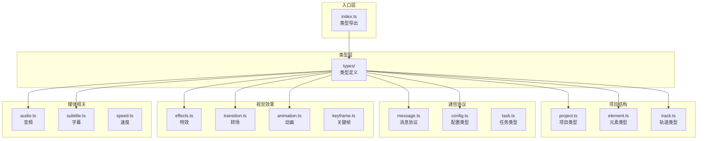

# shared/src

共享类型定义源码根目录，提供跨包使用的 TypeScript 类型定义。

## 架构图



## 目录结构

```
src/
├── index.ts           # 入口，导出所有类型
│
├── types/             # 类型定义（23个文件）
│   ├── index.ts       # 类型汇总导出
│   │
│   ├── project.ts     # 项目结构
│   ├── element.ts     # 元素类型
│   ├── track.ts       # 轨道类型
│   ├── timelineTrack.ts # 时间线轨道
│   │
│   ├── message.ts     # 消息协议
│   ├── config.ts      # 配置类型
│   ├── task.ts        # 任务类型
│   │
│   ├── animation.ts   # 动画类型
│   ├── keyframe.ts    # 关键帧
│   ├── easing.ts      # 缓动函数
│   │
│   ├── effects.ts     # 特效类型
│   ├── transition.ts  # 转场类型
│   ├── mask.ts        # 遮罩类型
│   ├── shape.ts       # 形状类型
│   │
│   ├── colorCorrection.ts # 色彩校正
│   ├── blendMode.ts   # 混合模式
│   │
│   ├── audio.ts       # 音频类型
│   ├── subtitle.ts    # 字幕类型
│   ├── speed.ts       # 速度控制
│   │
│   ├── transform.ts   # 变换类型
│   ├── geometry.ts    # 几何类型
│   │
│   └── aiAction.ts    # AI 动作
│
└── __tests__/         # 测试文件
```

## 类型分类

| 分类 | 文件 | 用途 |
|------|------|------|
| **项目结构** | project, element, track | 定义项目数据模型 |
| **通信协议** | message, config, task | Extension ↔ Webview 通信 |
| **视觉效果** | effects, transition, animation, keyframe | 特效和动画 |
| **媒体相关** | audio, subtitle, speed | 音频和字幕 |
| **几何变换** | transform, geometry, mask, shape | 空间变换 |

## 使用方式

```typescript
// 导入类型
import type {
  VideoProject,
  TimelineElement,
  ExtensionToWebviewMessage
} from '@uniedit/shared';
```

## 设计原则

1. **纯类型**：不包含运行时代码
2. **单一来源**：所有共享类型集中定义
3. **向后兼容**：使用可选属性保持兼容
4. **文档化**：每个类型都有 JSDoc 注释
